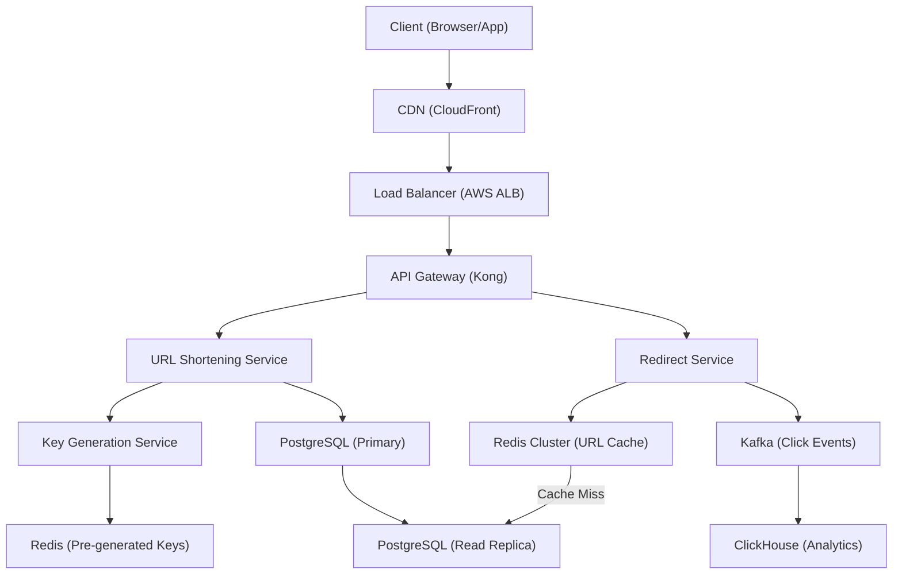
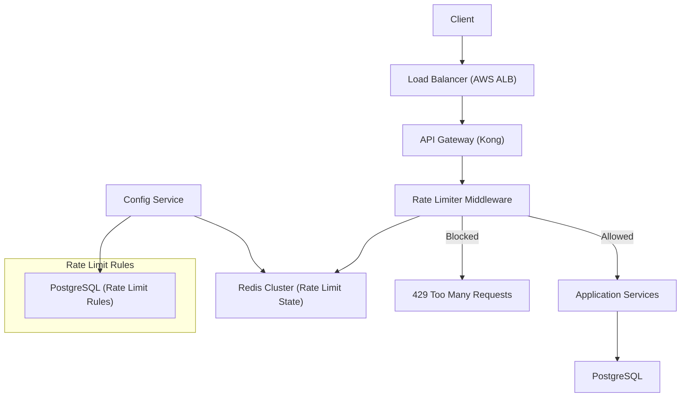
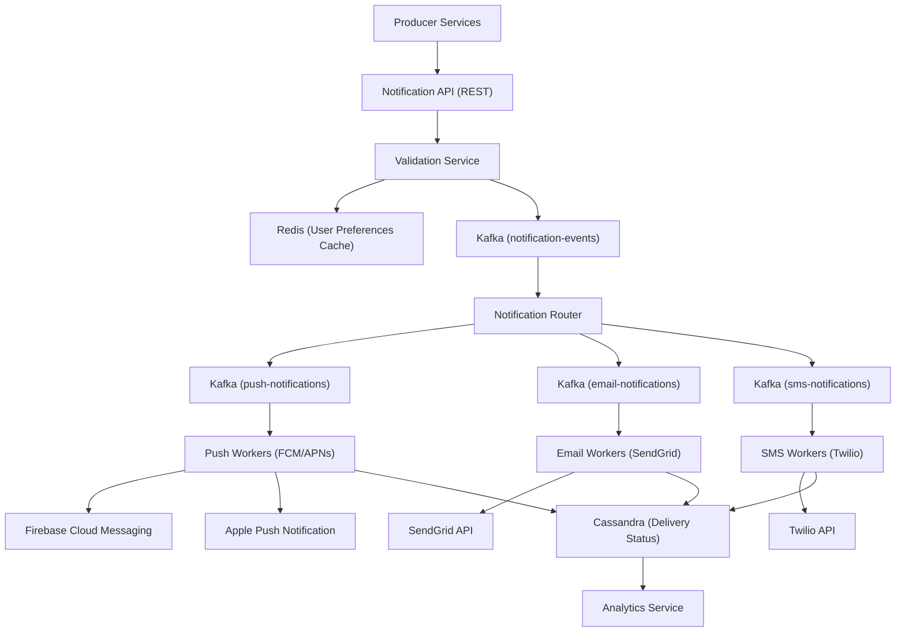

# Interview-Ready System Design Examples

> Production-grade examples following the 45-minute interview format

---

## 📋 The 5-Section Interview Framework

| Section | Time | Focus |
|---------|------|-------|
| Requirements & Estimation | 5 min | Scope, QPS, storage |
| High-Level Architecture | 10 min | Mermaid diagram, tech choices |
| API & Data Model | 10 min | Endpoints, schema, DB choice |
| Component Deep Dive | 15 min | Core algorithm, pseudocode |
| Bottlenecks & Trade-offs | 5 min | SPOF, CAP trade-offs |

---

# Example 1: Design a URL Shortener (TinyURL)

## 1. Requirements & Estimation (5 min)

### Functional Requirements
1. **Shorten URL**: Given a long URL, generate a unique short URL
2. **Redirect**: Given a short URL, redirect to the original URL
3. **Analytics**: Track click count per short URL

### Non-Functional Requirements
- **Consistency Model**: Strong consistency for writes (no duplicate short URLs), Eventual consistency for analytics
- **Latency Target**: < 50ms for redirects (P99)
- **Availability**: 99.9% uptime

### Back-of-Envelope Calculation

```
Assumptions:
- 100M total users
- 10% DAU = 10M daily active users
- Each user creates 0.5 short URLs/day
- Read:Write ratio = 100:1

Write QPS:
10M users * 100% active * 0.5 URLs/day / 86,400 = ~58 QPS
Peak (3x): ~175 QPS

Read QPS:
58 * 100 = 5,800 QPS
Peak (3x): ~17,400 QPS

Storage (5 years):
- URLs/day: 5M
- 5 years: 5M * 365 * 5 = 9.1B URLs
- Per record: 250 bytes (short URL + long URL + metadata)
- Total: 9.1B * 250 bytes = 2.3 TB
```

---

## 2. High-Level Architecture (10 min)



### Technology Justifications
- **PostgreSQL**: ACID compliance for unique short URL constraint
- **Redis (Keys)**: Pre-generate keys to avoid collision under high load
- **Redis (Cache)**: 80/20 rule—cache hot URLs for sub-10ms redirects
- **Kafka + ClickHouse**: Async analytics pipeline, don't block redirects

---

## 3. API & Data Model (10 min)

### Critical API Endpoints

**POST /api/v1/urls** — Create Short URL
```json
// Request
{
  "long_url": "https://example.com/very/long/path?query=params",
  "custom_alias": "my-link",  // optional
  "expires_at": "2026-12-31T23:59:59Z"  // optional
}

// Response (201 Created)
{
  "short_url": "https://tinyurl.com/abc123",
  "short_code": "abc123",
  "long_url": "https://example.com/very/long/path?query=params",
  "created_at": "2026-01-28T10:00:00Z",
  "expires_at": "2026-12-31T23:59:59Z"
}
```

**GET /{short_code}** — Redirect
```json
// Response: 301 Moved Permanently
// Header: Location: https://example.com/very/long/path?query=params
```

### Database Schema

```sql
-- PostgreSQL
CREATE TABLE urls (
    short_code    VARCHAR(7) PRIMARY KEY,  -- Partition Key
    long_url      VARCHAR(2048) NOT NULL,
    user_id       BIGINT,
    created_at    TIMESTAMP DEFAULT NOW(),
    expires_at    TIMESTAMP,
    click_count   BIGINT DEFAULT 0
);

CREATE INDEX idx_urls_user ON urls(user_id);
CREATE INDEX idx_urls_expires ON urls(expires_at) WHERE expires_at IS NOT NULL;
```

**DB Choice Justification**: Chose PostgreSQL over NoSQL because short_code must be globally unique (requires ACID), read pattern is simple key lookup (efficient with B-tree index), and 2.3TB fits in a single sharded cluster.

---

## 4. Component Deep Dive: Key Generation Service (15 min)

### Why This Component is Critical
The Key Generation Service prevents collisions under high concurrent write load. Naive approaches (hash + check) fail at scale due to race conditions.

### Algorithm: Pre-generated Key Pool

```
┌─────────────────────────────────────────────────────────────┐
│              Key Generation Architecture                     │
│                                                              │
│   Background Worker (Async):                                │
│   ┌─────────────────────────────────────────────────────┐   │
│   │  Generate keys in batches of 10,000                 │   │
│   │  Store in Redis LIST: "available_keys"              │   │
│   │  Maintain minimum threshold: 100,000 keys           │   │
│   └─────────────────────────────────────────────────────┘   │
│                                                              │
│   On URL Creation:                                           │
│   ┌─────────────────────────────────────────────────────┐   │
│   │  LPOP from Redis → Get pre-generated key            │   │
│   │  If custom_alias requested → Check availability     │   │
│   │  Insert to PostgreSQL with key                      │   │
│   └─────────────────────────────────────────────────────┘   │
│                                                              │
└─────────────────────────────────────────────────────────────┘
```

### Core Logic (Python Pseudocode)

```python
class KeyGenerationService:
    def __init__(self, redis_client, postgres_client):
        self.redis = redis_client
        self.db = postgres_client
        self.KEY_POOL = "available_keys"
        self.MIN_KEYS = 100_000
        self.BATCH_SIZE = 10_000
        self.BASE62 = "0123456789ABCDEFGHIJKLMNOPQRSTUVWXYZabcdefghijklmnopqrstuvwxyz"
    
    def get_short_code(self, custom_alias: str = None) -> str:
        if custom_alias:
            # Check if custom alias is available
            if self.db.exists("urls", short_code=custom_alias):
                raise ConflictError("Alias already taken")
            return custom_alias
        
        # Pop pre-generated key from Redis (O(1), atomic)
        key = self.redis.lpop(self.KEY_POOL)
        if not key:
            # Fallback: generate synchronously (rare)
            key = self._generate_unique_key()
        return key
    
    def _generate_unique_key(self) -> str:
        """Generate 7-char base62 key using counter + encoding"""
        counter = self.redis.incr("key_counter")
        return self._base62_encode(counter).zfill(7)
    
    def _base62_encode(self, num: int) -> str:
        if num == 0:
            return self.BASE62[0]
        result = []
        while num:
            result.append(self.BASE62[num % 62])
            num //= 62
        return ''.join(reversed(result))
    
    # Background job (runs every 30 seconds)
    async def replenish_key_pool(self):
        current_count = self.redis.llen(self.KEY_POOL)
        if current_count < self.MIN_KEYS:
            keys_needed = self.MIN_KEYS - current_count + self.BATCH_SIZE
            new_keys = [self._generate_unique_key() for _ in range(keys_needed)]
            self.redis.rpush(self.KEY_POOL, *new_keys)
```

### Scaling Considerations
1. **Partitioning**: Shard key pool across Redis nodes by key prefix
2. **Caching**: Hot URLs cached in Redis with 24-hour TTL
3. **Async Replenishment**: Background worker maintains pool, never blocks writes

---

## 5. Bottlenecks & Trade-offs (5 min)

### Single Point of Failure

**SPOF Identified**: Key Generation Service (Redis key pool)

**Mitigation**:
- Deploy Redis in cluster mode with 3 replicas across AZs
- Fallback to synchronous key generation if Redis unavailable
- Monitor key pool size; alert if below 50,000

### Major Trade-off

**Trade-off**: Chose **Eventual Consistency for Analytics** over Strong Consistency

**Rationale**: 
- Click counts are written to Kafka asynchronously, not updated in PostgreSQL directly
- This achieves sub-50ms redirect latency (don't wait for analytics write)
- Accepted trade-off: Analytics dashboard may be 30-60 seconds behind real-time
- CAP Theorem: Prioritized Availability and Partition Tolerance over immediate Consistency for non-critical data

---

# Example 2: Design a Rate Limiter

## 1. Requirements & Estimation (5 min)

### Functional Requirements
1. **Limit requests per user/IP**: Enforce N requests per time window
2. **Multiple limit tiers**: Different limits for free vs. paid users
3. **Distributed enforcement**: Consistent limits across all API servers

### Non-Functional Requirements
- **Consistency Model**: Strong consistency (must not exceed limits even during network partitions)
- **Latency Target**: < 5ms overhead per request (P99)
- **Availability**: Rate limiter failure should fail-open (allow requests)

### Back-of-Envelope Calculation

```
Assumptions:
- 50M total API users
- 10% DAU = 5M daily active
- Average 100 requests/user/day
- Rate limit: 100 requests/minute/user

Request QPS:
5M users * 100% active * 100 requests/day / 86,400 = ~5,800 QPS
Peak (3x): ~17,400 QPS

Rate Limiter Checks:
- Every request requires rate limit check
- 17,400 checks/second at peak

Storage per user:
- Key: user_id (8 bytes)
- Counter + timestamp: 16 bytes
- Total: 24 bytes per active user
- 5M users * 24 bytes = 120 MB (fits in memory)
```

---

## 2. High-Level Architecture (10 min)



### Technology Justifications
- **Redis Cluster**: Sub-millisecond latency for counter operations, atomic INCR
- **Kong API Gateway**: Built-in rate limiting plugin, but we need distributed state
- **Fail-open design**: If Redis unavailable, allow requests (availability > strict limiting)

---

## 3. API & Data Model (10 min)

### Critical API Endpoints

**Internal Middleware Call** — Check Rate Limit
```json
// Request (internal)
{
  "user_id": "user_12345",
  "endpoint": "/api/v1/messages",
  "tier": "premium"
}

// Response
{
  "allowed": true,
  "remaining": 87,
  "limit": 100,
  "reset_at": 1706436000,
  "retry_after": null
}
```

**GET /api/v1/rate-limit/status** — User Rate Limit Status
```json
// Response
{
  "user_id": "user_12345",
  "limits": [
    {
      "window": "1m",
      "limit": 100,
      "remaining": 87,
      "reset_at": "2026-01-28T10:01:00Z"
    },
    {
      "window": "1d",
      "limit": 10000,
      "remaining": 8542,
      "reset_at": "2026-01-29T00:00:00Z"
    }
  ]
}
```

### Data Model (Redis)

```
# Sliding Window Counter in Redis
Key Pattern: rate_limit:{user_id}:{window_start}

# Example for user_12345, 1-minute window starting at 10:00
Key: "rate_limit:user_12345:1706435400"
Value: 13  (request count)
TTL: 120 seconds (2x window for cleanup)

# Rate Limit Rules (PostgreSQL)
CREATE TABLE rate_limit_rules (
    id              SERIAL PRIMARY KEY,
    tier            VARCHAR(20) NOT NULL,    -- 'free', 'premium', 'enterprise'
    endpoint_pattern VARCHAR(255),           -- '/api/v1/*' or specific endpoint
    window_seconds  INT NOT NULL,            -- 60 for 1-minute window
    max_requests    INT NOT NULL,            -- Partition Key: (tier, endpoint_pattern)
    created_at      TIMESTAMP DEFAULT NOW()
);
```

**DB Choice Justification**: Chose Redis for rate limit state because counters require atomic increment with sub-5ms latency; PostgreSQL for rules because they change rarely and need ACID for admin updates.

---

## 4. Component Deep Dive: Sliding Window Rate Limiter (15 min)

### Why This Component is Critical
The rate limiting algorithm determines user experience and system protection. Fixed windows have boundary issues; sliding windows provide smooth limiting.

### Algorithm: Sliding Window Log with Optimization

```
┌─────────────────────────────────────────────────────────────┐
│              Sliding Window Counter Algorithm                │
│                                                              │
│   Problem with Fixed Window:                                │
│   ├── Window 1 (10:00-10:01): 100 requests at 10:00:59     │
│   ├── Window 2 (10:01-10:02): 100 requests at 10:01:01     │
│   └── User sent 200 requests in 2 seconds! ❌              │
│                                                              │
│   Sliding Window Solution:                                   │
│   ├── Track requests in current + previous window          │
│   ├── Weight previous window by overlap percentage          │
│   └── Smooths out boundary spikes                          │
│                                                              │
└─────────────────────────────────────────────────────────────┘
```

### Core Logic (Python Pseudocode)

```python
class SlidingWindowRateLimiter:
    def __init__(self, redis_client, window_seconds: int = 60):
        self.redis = redis_client
        self.window_seconds = window_seconds
    
    def is_allowed(self, user_id: str, limit: int) -> tuple[bool, dict]:
        """
        Returns (allowed, metadata) using sliding window counter.
        Uses 2 Redis keys: current window + previous window.
        """
        now = time.time()
        current_window = int(now // self.window_seconds) * self.window_seconds
        previous_window = current_window - self.window_seconds
        
        # Calculate weight for previous window (how much it overlaps)
        elapsed_in_current = now - current_window
        previous_weight = 1 - (elapsed_in_current / self.window_seconds)
        
        # Get counts from both windows (pipeline for efficiency)
        current_key = f"rate_limit:{user_id}:{current_window}"
        previous_key = f"rate_limit:{user_id}:{previous_window}"
        
        pipe = self.redis.pipeline()
        pipe.get(previous_key)
        pipe.incr(current_key)  # Atomically increment current window
        pipe.expire(current_key, self.window_seconds * 2)
        results = pipe.execute()
        
        previous_count = int(results[0] or 0)
        current_count = int(results[1])
        
        # Sliding window calculation
        weighted_count = (previous_count * previous_weight) + current_count
        
        allowed = weighted_count <= limit
        remaining = max(0, limit - int(weighted_count))
        reset_at = current_window + self.window_seconds
        
        if not allowed:
            # Rollback the increment (we shouldn't count rejected requests)
            self.redis.decr(current_key)
        
        return allowed, {
            "remaining": remaining,
            "limit": limit,
            "reset_at": reset_at,
            "retry_after": None if allowed else int(reset_at - now)
        }
    
    def get_limit_for_user(self, user_id: str, endpoint: str) -> int:
        """Fetch limit based on user tier and endpoint from cached rules."""
        user_tier = self.cache.get(f"user_tier:{user_id}") or "free"
        rule = self.rules_cache.get(f"{user_tier}:{endpoint}")
        return rule.max_requests if rule else 100  # Default limit
```

### Scaling Considerations
1. **Redis Cluster**: Partition by user_id hash across 6+ nodes
2. **Local Caching**: Cache rate limit rules in-memory (refresh every 60s)
3. **Fail-Open**: If Redis times out (>10ms), allow request + log for monitoring
4. **Lua Script**: Combine GET+INCR+EXPIRE in single Lua script for atomicity

```lua
-- Redis Lua script for atomic sliding window check
local current_key = KEYS[1]
local previous_key = KEYS[2]
local limit = tonumber(ARGV[1])
local window_seconds = tonumber(ARGV[2])
local previous_weight = tonumber(ARGV[3])

local previous_count = tonumber(redis.call('GET', previous_key) or 0)
local current_count = tonumber(redis.call('INCR', current_key))
redis.call('EXPIRE', current_key, window_seconds * 2)

local weighted_count = (previous_count * previous_weight) + current_count

if weighted_count > limit then
    redis.call('DECR', current_key)
    return {0, limit - math.floor(weighted_count) + 1, 0}
end

return {1, limit - math.floor(weighted_count), current_count}
```

---

## 5. Bottlenecks & Trade-offs (5 min)

### Single Point of Failure

**SPOF Identified**: Redis Cluster for rate limit state

**Mitigation**:
- Redis Cluster with 3 masters + 3 replicas across AZs
- Fail-open policy: If Redis unavailable for >10ms, allow request
- Circuit breaker: After 5 Redis failures, bypass rate limiting for 30 seconds
- Monitor Redis latency P99; alert if >5ms

### Major Trade-off

**Trade-off**: Chose **Availability over Strict Consistency** (Fail-Open Design)

**Rationale**:
- During Redis partition/failure, we allow all requests instead of blocking
- Risk: Users might slightly exceed rate limits during outages
- Benefit: System remains available; no 503 errors due to rate limiter failure
- CAP Theorem: In rate limiting, Availability matters more than perfect Consistency
- Mitigation: Log all bypass events for post-incident analysis; short circuit breaker timeout (30s)

---

# Example 3: Design a Notification System

## 1. Requirements & Estimation (5 min)

### Functional Requirements
1. **Send notifications**: Push, Email, SMS across multiple channels
2. **User preferences**: Respect opt-outs and channel preferences
3. **Delivery tracking**: Track sent, delivered, opened, failed status

### Non-Functional Requirements
- **Consistency Model**: Eventual consistency (notifications can be delayed, not lost)
- **Latency Target**: < 30 seconds for push notifications, < 5 minutes for email
- **Availability**: 99.9% (notifications are not business-critical for most cases)

### Back-of-Envelope Calculation

```
Assumptions:
- 50M total users, 20M DAU
- 5 notifications/user/day average
- Channel split: 60% push, 30% email, 10% SMS

Notification QPS:
20M users * 100% active * 5 notifications/day / 86,400 = ~1,157 QPS
Peak (3x): ~3,500 QPS

Channel breakdown:
- Push: 3,500 * 0.6 = 2,100 QPS
- Email: 3,500 * 0.3 = 1,050 QPS  
- SMS: 3,500 * 0.1 = 350 QPS

Storage (30-day retention):
- 100M notifications/day * 30 days = 3B notifications
- Per notification: 500 bytes
- Total: 3B * 500 = 1.5 TB
```

---

## 2. High-Level Architecture (10 min)



### Technology Justifications
- **Kafka**: Durable message queue with replay capability; handles backpressure from slow providers
- **Cassandra**: Write-heavy delivery status tracking, horizontal scaling, time-series data pattern
- **Redis (Preferences)**: Low-latency preference lookups (sub-1ms)
- **Separate queues per channel**: Different SLAs and retry strategies per channel

---

## 3. API & Data Model (10 min)

### Critical API Endpoints

**POST /api/v1/notifications** — Send Notification
```json
// Request
{
  "user_ids": ["user_123", "user_456"],
  "template_id": "order_shipped",
  "channels": ["push", "email"],
  "data": {
    "order_id": "ORD-789",
    "tracking_url": "https://track.example.com/789"
  },
  "priority": "high",
  "scheduled_at": null  // null = send immediately
}

// Response (202 Accepted)
{
  "notification_id": "notif_abc123",
  "status": "queued",
  "recipient_count": 2,
  "created_at": "2026-01-28T10:00:00Z"
}
```

**GET /api/v1/notifications/{id}/status** — Get Delivery Status
```json
// Response
{
  "notification_id": "notif_abc123",
  "summary": {
    "total": 2,
    "sent": 2,
    "delivered": 1,
    "failed": 0,
    "pending": 1
  },
  "recipients": [
    {"user_id": "user_123", "channel": "push", "status": "delivered", "delivered_at": "..."},
    {"user_id": "user_456", "channel": "email", "status": "sent", "sent_at": "..."}
  ]
}
```

### Database Schema

```sql
-- Cassandra (Delivery Status - Write Heavy)
CREATE TABLE notification_status (
    notification_id UUID,
    user_id         TEXT,
    channel         TEXT,      -- 'push', 'email', 'sms'
    status          TEXT,      -- 'queued', 'sent', 'delivered', 'failed'
    created_at      TIMESTAMP,
    sent_at         TIMESTAMP,
    delivered_at    TIMESTAMP,
    error_message   TEXT,
    PRIMARY KEY ((notification_id), user_id, channel)
    -- Partition Key: notification_id (group all recipients together)
);

-- Secondary table for user's notification history
CREATE TABLE user_notifications (
    user_id         TEXT,
    created_at      TIMESTAMP,
    notification_id UUID,
    channel         TEXT,
    status          TEXT,
    PRIMARY KEY ((user_id), created_at, notification_id)
    -- Partition Key: user_id, Clustering: created_at DESC
) WITH CLUSTERING ORDER BY (created_at DESC);
```

**DB Choice Justification**: Chose Cassandra because notification status is write-heavy (millions of status updates), needs horizontal scaling, and query patterns are simple (by notification_id or user_id with time range).

---

## 4. Component Deep Dive: Notification Router (15 min)

### Why This Component is Critical
The Router determines which channel(s) to use based on user preferences, priority, and channel availability. It's the decision hub that affects delivery success.

### Algorithm: Priority-Based Channel Selection

```
┌─────────────────────────────────────────────────────────────┐
│              Routing Decision Flow                           │
│                                                              │
│   1. Fetch user preferences from Redis                      │
│   2. Filter requested channels by user opt-ins              │
│   3. Apply priority rules:                                  │
│      - High priority → All opted-in channels               │
│      - Normal priority → Primary channel only              │
│      - Low priority → Batch and send in digest             │
│   4. Check channel health (circuit breaker status)         │
│   5. Route to appropriate Kafka topic                       │
│                                                              │
└─────────────────────────────────────────────────────────────┘
```

### Core Logic (Python Pseudocode)

```python
class NotificationRouter:
    def __init__(self, redis_client, kafka_producer, circuit_breaker):
        self.redis = redis_client
        self.kafka = kafka_producer
        self.circuit_breaker = circuit_breaker
        self.CHANNEL_TOPICS = {
            "push": "push-notifications",
            "email": "email-notifications",
            "sms": "sms-notifications"
        }
    
    async def route_notification(self, notification: dict) -> list[str]:
        """
        Route notification to appropriate channels based on preferences.
        Returns list of channels the notification was routed to.
        """
        routed_channels = []
        
        for user_id in notification["user_ids"]:
            # 1. Fetch user preferences (cached in Redis)
            preferences = await self._get_user_preferences(user_id)
            
            # 2. Filter channels by user opt-ins
            requested_channels = set(notification.get("channels", ["push"]))
            allowed_channels = requested_channels & set(preferences["opted_in"])
            
            if not allowed_channels:
                await self._log_skipped(notification["notification_id"], user_id, "no_opted_channels")
                continue
            
            # 3. Apply priority rules
            priority = notification.get("priority", "normal")
            channels_to_send = self._apply_priority_rules(allowed_channels, priority, preferences)
            
            # 4. Check circuit breaker for each channel
            for channel in channels_to_send:
                if not self.circuit_breaker.is_healthy(channel):
                    # Fallback to next priority channel
                    continue
                
                # 5. Route to Kafka topic
                message = {
                    "notification_id": notification["notification_id"],
                    "user_id": user_id,
                    "channel": channel,
                    "template_id": notification["template_id"],
                    "data": notification["data"],
                    "device_tokens": preferences.get("device_tokens", []) if channel == "push" else None,
                    "email": preferences.get("email") if channel == "email" else None,
                    "phone": preferences.get("phone") if channel == "sms" else None
                }
                
                topic = self.CHANNEL_TOPICS[channel]
                await self.kafka.send(topic, key=user_id, value=message)
                routed_channels.append(channel)
        
        return routed_channels
    
    def _apply_priority_rules(self, channels: set, priority: str, prefs: dict) -> list[str]:
        """Determine which channels to use based on priority."""
        if priority == "high":
            return list(channels)  # All channels for urgent notifications
        elif priority == "low":
            return [prefs.get("digest_channel", "email")]  # Batch later
        else:  # normal
            primary = prefs.get("primary_channel", "push")
            return [primary] if primary in channels else list(channels)[:1]
    
    async def _get_user_preferences(self, user_id: str) -> dict:
        """Get preferences from Redis cache, fallback to DB."""
        cached = await self.redis.get(f"user_prefs:{user_id}")
        if cached:
            return json.loads(cached)
        
        # Cache miss - fetch from PostgreSQL and cache
        prefs = await self.db.fetch_user_preferences(user_id)
        await self.redis.setex(f"user_prefs:{user_id}", 3600, json.dumps(prefs))
        return prefs
```

### Scaling Considerations
1. **Kafka Partitioning**: Partition by user_id to ensure ordered delivery per user
2. **Redis Clustering**: User preferences sharded across Redis cluster nodes
3. **Circuit Breaker**: Per-channel circuit breakers prevent cascade failures
4. **Batch Processing**: Low-priority notifications aggregated into hourly digests

---

## 5. Bottlenecks & Trade-offs (5 min)

### Single Point of Failure

**SPOF Identified**: Kafka cluster for notification queues

**Mitigation**:
- Kafka deployed with 3+ brokers, replication factor 3
- Each partition has 2 ISR (in-sync replicas) minimum
- Cross-AZ deployment for broker distribution
- Dead letter queue for poison messages after 3 retries

### Major Trade-off

**Trade-off**: Chose **Eventual Consistency with At-Least-Once Delivery** over Exactly-Once

**Rationale**:
- Kafka consumers use at-least-once semantics (commit after processing)
- Users might receive duplicate notifications on consumer restart
- Exactly-once would require 2PC with external providers (FCM, SendGrid) — not feasible
- Mitigation: Idempotency key stored in Redis; dedup at worker level
- User impact: Rare duplicate notification is acceptable vs. missing a notification

---

## 📋 Interview Checklist

Use this for any system design interview:

```
✅ Requirements (5 min)
   □ 3 functional requirements stated
   □ Consistency model declared
   □ Latency target specified
   □ QPS calculated with formula shown

✅ Architecture (10 min)
   □ Mermaid diagram with data flow
   □ Specific technologies named
   □ Write and read paths shown
   □ Async processing identified

✅ API & Data Model (10 min)
   □ 2 critical endpoints with JSON
   □ Schema with partition/shard key labeled
   □ DB choice justified in 1 sentence

✅ Deep Dive (15 min)
   □ Most complex component selected
   □ Algorithm/workflow explained
   □ 10-20 lines of pseudocode
   □ Scaling strategy addressed

✅ Trade-offs (5 min)
   □ 1 SPOF identified with mitigation
   □ 1 CAP/consistency trade-off explained
```
