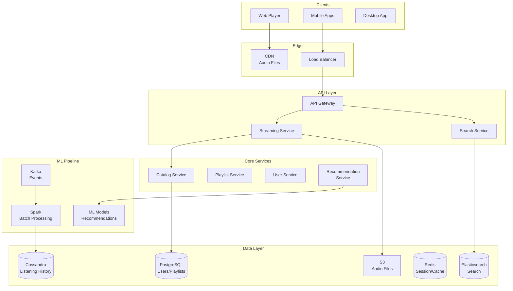

# 🎵 Spotify - System Design Interview

> **Interview Duration**: 45 minutes  
> **Difficulty**: Hard  
> **Type**: Music Streaming Platform

---

## 1️⃣ Requirements & Estimation (5 min)

### Functional Requirements
1. **Music Streaming**: Stream songs with minimal buffering
2. **Search & Discovery**: Find songs, artists, playlists
3. **Personalized Playlists**: Discover Weekly, Daily Mix, Wrapped

### Non-Functional Requirements
- **Latency**: < 200ms to start playback
- **Availability**: 99.99% (entertainment but high expectations)
- **Consistency**: Eventual for playlists, strong for payments

### Back-of-Envelope Estimation

```
Assumptions:
- 500M users, 200M DAU
- 100M songs in catalog
- Average song: 4 minutes, 10MB (320kbps)
- Average user: 2 hours/day streaming

Traffic:
- Concurrent listeners (peak): 50M
- Stream requests/sec: 50M / 240s (avg song) ≈ 200K QPS
- Search queries: 50M × 10/day = 500M/day ≈ 6K QPS

Storage:
- Music files: 100M × 10MB = 1PB
- Multiple bitrates (5): 5PB total
- User data: 500M × 10KB = 5TB
- Listening history: 500M × 10K events × 100B = 500TB

Bandwidth:
- Peak: 50M × 320kbps = 16 Tbps
- Daily: 200M × 2hr × 320kbps = 46 PB/day
```

---

## 2️⃣ High-Level Architecture (10 min)



### Technology Choices

| Component | Technology | Justification |
|-----------|------------|---------------|
| Audio Storage | S3 + CDN | Global distribution, cost-effective |
| User Data | PostgreSQL | ACID for subscriptions |
| Listening History | Cassandra | Time-series, write-heavy |
| Search | Elasticsearch | Full-text, fuzzy matching |
| Events | Kafka | High throughput streaming |
| Recommendations | Spark + TensorFlow | Batch + real-time ML |

---

## 3️⃣ API & Data Model (10 min)

### API Design

**Stream Song**
```http
GET /api/v1/tracks/{track_id}/stream?quality=high
Authorization: Bearer {token}

Response 200:
{
    "track_id": "track_abc123",
    "stream_url": "https://cdn.spotify.com/audio/abc123.ogg",
    "format": "ogg_vorbis",
    "bitrate": 320,
    "duration_ms": 213000,
    "expires_at": "2024-01-28T16:00:00Z",
    "cdn_token": "signed_token_xyz"
}
```

**Search**
```http
GET /api/v1/search?q=taylor+swift&type=track,artist&limit=20

Response 200:
{
    "tracks": {
        "items": [
            {
                "id": "track_123",
                "name": "Anti-Hero",
                "artists": [{"id": "artist_ts", "name": "Taylor Swift"}],
                "album": {"id": "album_mid", "name": "Midnights"},
                "duration_ms": 200000,
                "popularity": 95
            }
        ]
    },
    "artists": {...}
}
```

**Get Personalized Playlist**
```http
GET /api/v1/playlists/discover-weekly
Authorization: Bearer {token}

Response 200:
{
    "id": "playlist_dw_user123",
    "name": "Discover Weekly",
    "description": "Your weekly mixtape of fresh music",
    "tracks": [...],
    "generated_at": "2024-01-22T00:00:00Z",
    "expires_at": "2024-01-29T00:00:00Z"
}
```

### Data Model

**Core Entities (PostgreSQL)**
```sql
CREATE TABLE users (
    user_id         UUID PRIMARY KEY,
    email           VARCHAR(255) UNIQUE NOT NULL,
    display_name    VARCHAR(100),
    subscription    VARCHAR(20) DEFAULT 'free',  -- free, premium, family
    country         VARCHAR(2),
    created_at      TIMESTAMP DEFAULT NOW()
);

CREATE TABLE tracks (
    track_id        UUID PRIMARY KEY,
    title           VARCHAR(500) NOT NULL,
    duration_ms     INT NOT NULL,
    isrc            VARCHAR(12),  -- International Standard Recording Code
    explicit        BOOLEAN DEFAULT FALSE,
    popularity      INT DEFAULT 0,
    audio_url       VARCHAR(1000),  -- S3 path
    preview_url     VARCHAR(1000)
);

CREATE TABLE artists (
    artist_id       UUID PRIMARY KEY,
    name            VARCHAR(500) NOT NULL,
    genres          TEXT[],
    popularity      INT DEFAULT 0,
    image_url       VARCHAR(1000)
);

CREATE TABLE albums (
    album_id        UUID PRIMARY KEY,
    title           VARCHAR(500) NOT NULL,
    artist_id       UUID REFERENCES artists(artist_id),
    release_date    DATE,
    total_tracks    INT,
    album_type      VARCHAR(20)  -- album, single, compilation
);

CREATE TABLE playlists (
    playlist_id     UUID PRIMARY KEY,
    owner_id        UUID REFERENCES users(user_id),
    name            VARCHAR(200) NOT NULL,
    description     TEXT,
    is_public       BOOLEAN DEFAULT TRUE,
    is_collaborative BOOLEAN DEFAULT FALSE,
    follower_count  INT DEFAULT 0
);

CREATE TABLE playlist_tracks (
    playlist_id     UUID REFERENCES playlists(playlist_id),
    track_id        UUID REFERENCES tracks(track_id),
    added_at        TIMESTAMP DEFAULT NOW(),
    added_by        UUID REFERENCES users(user_id),
    position        INT,
    PRIMARY KEY (playlist_id, track_id)
);
```

**Listening History (Cassandra)**
```cql
CREATE TABLE listening_history (
    user_id         UUID,
    listened_at     TIMESTAMP,
    track_id        UUID,
    context_type    TEXT,  -- playlist, album, artist, search
    context_id      UUID,
    duration_played INT,   -- milliseconds
    completed       BOOLEAN,
    PRIMARY KEY ((user_id), listened_at, track_id)
) WITH CLUSTERING ORDER BY (listened_at DESC);

-- For analytics: what's playing now
CREATE TABLE now_playing (
    user_id         UUID PRIMARY KEY,
    track_id        UUID,
    started_at      TIMESTAMP,
    progress_ms     INT,
    device_id       UUID
) WITH default_time_to_live = 3600;
```

**Search Index (Elasticsearch)**
```json
{
    "mappings": {
        "properties": {
            "track_id": {"type": "keyword"},
            "title": {
                "type": "text",
                "analyzer": "spotify_analyzer",
                "fields": {
                    "exact": {"type": "keyword"},
                    "suggest": {"type": "completion"}
                }
            },
            "artist_name": {"type": "text"},
            "album_name": {"type": "text"},
            "genres": {"type": "keyword"},
            "popularity": {"type": "integer"},
            "release_date": {"type": "date"}
        }
    }
}
```

---

## 4️⃣ Component Deep Dive: Audio Streaming & CDN (15 min)

### Audio Delivery Architecture

```
┌─────────────────────────────────────────────────────────────────┐
│                  AUDIO STREAMING FLOW                           │
├─────────────────────────────────────────────────────────────────┤
│                                                                  │
│  1. CLIENT REQUESTS TRACK                                       │
│     └──▶ API returns signed CDN URL (expires in 1 hour)         │
│                                                                  │
│  2. CLIENT FETCHES FROM CDN                                     │
│     ┌────────────────────────────────────────────┐              │
│     │  CDN Edge (closest to user)                │              │
│     │  ├── Cache HIT: Serve immediately          │              │
│     │  └── Cache MISS: Fetch from origin         │              │
│     └────────────────────────────────────────────┘              │
│                                                                  │
│  3. AUDIO FORMAT & BITRATE                                      │
│     ┌────────────────────────────────────────────┐              │
│     │  Quality    │ Bitrate  │ Format            │              │
│     │  ──────────────────────────────────────    │              │
│     │  Low        │ 24 kbps  │ OGG Vorbis        │              │
│     │  Normal     │ 96 kbps  │ OGG Vorbis        │              │
│     │  High       │ 160 kbps │ OGG Vorbis        │              │
│     │  Very High  │ 320 kbps │ OGG Vorbis        │              │
│     │  Lossless   │ 1411kbps │ FLAC (Premium)    │              │
│     └────────────────────────────────────────────┘              │
│                                                                  │
│  4. ADAPTIVE STREAMING                                          │
│     └──▶ Client monitors bandwidth, switches quality            │
│                                                                  │
└─────────────────────────────────────────────────────────────────┘
```

### Pseudocode: Streaming Service

```python
import hashlib
import time
from dataclasses import dataclass
from typing import Optional
import jwt


@dataclass
class StreamToken:
    track_id: str
    user_id: str
    quality: str
    expires_at: int
    cdn_url: str


class StreamingService:
    """Handle audio streaming requests"""
    
    CDN_ORIGINS = {
        "us": "https://cdn-us.spotify.com",
        "eu": "https://cdn-eu.spotify.com",
        "asia": "https://cdn-asia.spotify.com"
    }
    
    QUALITY_BITRATES = {
        "low": 24,
        "normal": 96,
        "high": 160,
        "very_high": 320,
        "lossless": 1411
    }
    
    def __init__(self, catalog_service, user_service, cdn_secret):
        self.catalog = catalog_service
        self.users = user_service
        self.cdn_secret = cdn_secret
    
    async def get_stream_url(self, user_id: str, track_id: str,
                              quality: str, region: str) -> StreamToken:
        """Generate signed streaming URL"""
        
        # Verify user has access
        user = await self.users.get_user(user_id)
        if not await self._can_stream(user, quality):
            raise PermissionError("Premium required for this quality")
        
        # Get track metadata
        track = await self.catalog.get_track(track_id)
        if not track:
            raise NotFoundError(f"Track {track_id} not found")
        
        # Check licensing for user's region
        if not await self._is_available(track_id, user.country):
            raise GeoBlockedError("Track not available in your region")
        
        # Generate CDN URL
        cdn_origin = self._select_cdn(region)
        audio_path = self._get_audio_path(track_id, quality)
        
        # Sign URL with expiration
        expires_at = int(time.time()) + 3600  # 1 hour
        signature = self._sign_url(audio_path, expires_at)
        
        cdn_url = f"{cdn_origin}/{audio_path}?sig={signature}&exp={expires_at}"
        
        # Log stream start for analytics
        await self._log_stream_start(user_id, track_id, quality)
        
        return StreamToken(
            track_id=track_id,
            user_id=user_id,
            quality=quality,
            expires_at=expires_at,
            cdn_url=cdn_url
        )
    
    def _get_audio_path(self, track_id: str, quality: str) -> str:
        """Get S3/CDN path for audio file"""
        
        # Audio files stored with quality variants
        # e.g., audio/ab/cd/abcd1234/320.ogg
        prefix = track_id[:2]
        subprefix = track_id[2:4]
        
        bitrate = self.QUALITY_BITRATES.get(quality, 160)
        extension = "flac" if quality == "lossless" else "ogg"
        
        return f"audio/{prefix}/{subprefix}/{track_id}/{bitrate}.{extension}"
    
    def _sign_url(self, path: str, expires_at: int) -> str:
        """Generate HMAC signature for CDN URL"""
        
        message = f"{path}:{expires_at}"
        signature = hmac.new(
            self.cdn_secret.encode(),
            message.encode(),
            hashlib.sha256
        ).hexdigest()
        
        return signature
    
    async def _can_stream(self, user, quality: str) -> bool:
        """Check if user can stream at requested quality"""
        
        premium_qualities = {"very_high", "lossless"}
        
        if quality in premium_qualities:
            return user.subscription in ("premium", "family", "duo")
        
        return True
    
    def _select_cdn(self, region: str) -> str:
        """Select nearest CDN origin"""
        
        region_mapping = {
            "NA": "us", "SA": "us",
            "EU": "eu", "AF": "eu",
            "AS": "asia", "OC": "asia"
        }
        
        cdn_region = region_mapping.get(region, "us")
        return self.CDN_ORIGINS[cdn_region]


class PreCacheService:
    """Pre-cache popular content at CDN edges"""
    
    def __init__(self, catalog, analytics, cdn_client):
        self.catalog = catalog
        self.analytics = analytics
        self.cdn = cdn_client
    
    async def warm_cache_for_region(self, region: str):
        """Pre-cache top tracks in a region"""
        
        # Get top 10,000 tracks for region
        top_tracks = await self.analytics.get_top_tracks(
            region=region,
            time_range="7d",
            limit=10000
        )
        
        # For each quality level
        for quality in ["normal", "high", "very_high"]:
            for track in top_tracks:
                audio_path = self._get_audio_path(track.id, quality)
                
                # Trigger CDN to fetch and cache
                await self.cdn.prefetch(
                    path=audio_path,
                    regions=[region],
                    priority="high" if track.rank < 1000 else "normal"
                )
    
    async def warm_for_playlist(self, playlist_id: str, regions: list):
        """Pre-cache tracks for a popular playlist"""
        
        # For Discover Weekly, RapCaviar, etc.
        tracks = await self.catalog.get_playlist_tracks(playlist_id)
        
        for track in tracks[:50]:  # Top 50 tracks
            for quality in ["high", "very_high"]:
                for region in regions:
                    await self.cdn.prefetch(
                        path=self._get_audio_path(track.id, quality),
                        regions=[region]
                    )
```

### Discover Weekly Pipeline

```python
class DiscoverWeeklyPipeline:
    """Generate personalized weekly playlists"""
    
    def __init__(self, spark, user_vectors, track_vectors, cf_model):
        self.spark = spark
        self.user_vectors = user_vectors
        self.track_vectors = track_vectors
        self.cf_model = cf_model
    
    async def generate_for_all_users(self):
        """Weekly batch job to generate Discover Weekly"""
        
        # Run on Spark cluster
        users_df = self.spark.read.parquet("s3://spotify/users/active/")
        
        # For each user, generate recommendations
        recommendations = users_df.rdd.mapPartitions(
            lambda partition: self._generate_batch(partition)
        )
        
        # Write to playlist service
        recommendations.foreachPartition(
            lambda recs: self._save_playlists(recs)
        )
    
    def _generate_for_user(self, user_id: str) -> list:
        """Generate 30 tracks for user's Discover Weekly"""
        
        # Get user's taste profile (embedding vector)
        user_vector = self.user_vectors.get(user_id)
        
        # Get recently played (to exclude)
        recent = self._get_recent_tracks(user_id, days=90)
        
        # Get saved tracks (to exclude)
        saved = self._get_saved_tracks(user_id)
        
        exclude_set = recent | saved
        
        # Find similar tracks using ANN
        candidates = self.track_vectors.search(
            vector=user_vector,
            top_k=1000,
            exclude=exclude_set
        )
        
        # Collaborative filtering boost
        cf_scores = self.cf_model.predict(user_id, candidates)
        
        # Combine scores and diversify
        final_tracks = self._diversify(
            candidates=candidates,
            cf_scores=cf_scores,
            target_count=30
        )
        
        return final_tracks
    
    def _diversify(self, candidates, cf_scores, target_count):
        """Ensure genre/artist diversity in playlist"""
        
        selected = []
        artist_count = {}
        genre_count = {}
        
        # Sort by combined score
        scored = sorted(
            zip(candidates, cf_scores),
            key=lambda x: x[1],
            reverse=True
        )
        
        for track, score in scored:
            # Limit same artist
            if artist_count.get(track.artist_id, 0) >= 2:
                continue
            
            # Limit same genre
            primary_genre = track.genres[0] if track.genres else "other"
            if genre_count.get(primary_genre, 0) >= 5:
                continue
            
            selected.append(track)
            artist_count[track.artist_id] = artist_count.get(track.artist_id, 0) + 1
            genre_count[primary_genre] = genre_count.get(primary_genre, 0) + 1
            
            if len(selected) >= target_count:
                break
        
        return selected
```

---

## 5️⃣ Bottlenecks & Trade-offs (5 min)

### Single Points of Failure & Mitigations

| SPOF | Impact | Mitigation |
|------|--------|------------|
| CDN Edge | Regional streaming failure | Multi-CDN (Fastly + CloudFront) |
| Catalog DB | Can't discover music | Read replicas, heavy caching |
| Search (ES) | Search broken | Multiple ES clusters |
| Recommendation | No personalization | Fallback to popularity |

### Real-time vs Batch Trade-off

```
┌─────────────────────────────────────────────────────────────────┐
│            PERSONALIZATION TRADE-OFF                            │
├─────────────────────────────────────────────────────────────────┤
│                                                                  │
│  BATCH (Discover Weekly):                                       │
│  ✅ Deep analysis of listening history                          │
│  ✅ Complex ML models (matrix factorization)                     │
│  ✅ Cost-effective (run once/week)                               │
│  ❌ Not responsive to recent listens                             │
│                                                                  │
│  REAL-TIME (Radio, Home):                                        │
│  ✅ Reflects current mood/context                                │
│  ✅ Responds to skips immediately                                │
│  ❌ Limited model complexity                                     │
│  ❌ Higher infrastructure cost                                   │
│                                                                  │
│  SPOTIFY'S HYBRID:                                               │
│  • Weekly batch: Discover Weekly, Wrapped                        │
│  • Daily batch: Daily Mix, Release Radar                        │
│  • Real-time: Radio, "More Like This"                           │
│                                                                  │
└─────────────────────────────────────────────────────────────────┘
```

### CAP Theorem Trade-off

```
┌─────────────────────────────────────────────────────────────────┐
│                  SPOTIFY CAP CHOICE                             │
├─────────────────────────────────────────────────────────────────┤
│  WE CHOOSE: AP (Availability + Partition Tolerance)             │
│                                                                  │
│  Reasoning:                                                      │
│  • Music must always play (availability critical)               │
│  • Playlist sync can be eventual                                │
│  • Listening history is append-only                             │
│                                                                  │
│  Trade-off Accepted:                                             │
│  • Collaborative playlist may show stale state briefly          │
│  • Play count may lag by minutes                                │
│  • Offline plays sync when online                               │
│                                                                  │
│  Strong Consistency For:                                         │
│  • Payment/subscription changes                                  │
│  • Account security (password, sessions)                        │
│                                                                  │
└─────────────────────────────────────────────────────────────────┘
```

### Interview Pro Tips

1. **Start with CDN**: Audio delivery is the core challenge
2. **Discuss bitrate adaptation**: Quality switching based on network
3. **Explain recommendation pipeline**: Batch + real-time hybrid
4. **Mention offline mode**: Download and sync strategy
