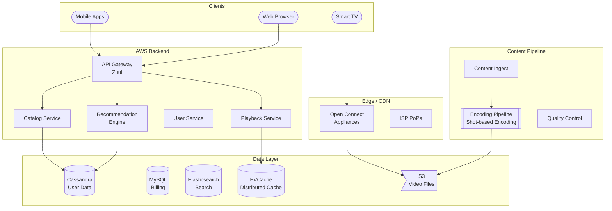

# 🎬 Netflix - System Design Interview

> **Interview Duration**: 45 minutes  
> **Difficulty**: Hard  
> **Type**: Video Streaming Platform

---

## 1️⃣ Requirements & Estimation (5 min)

### Functional Requirements
1. **Video Streaming**: Stream movies/shows with adaptive quality
2. **Content Catalog**: Browse, search, and discover content
3. **Personalization**: Recommendations, continue watching, profiles

### Non-Functional Requirements
- **Latency**: < 2 seconds to start playback
- **Availability**: 99.99% (prime time is critical)
- **Quality**: Adaptive bitrate, 4K HDR support

### Back-of-Envelope Estimation

```
Assumptions:
- 250M subscribers, 100M DAU
- 15,000 titles in catalog
- Average viewing: 2 hours/day
- Video: 5 Mbps average (mix of SD/HD/4K)

Traffic:
- Concurrent viewers (peak): 25M
- Stream bandwidth: 25M × 5 Mbps = 125 Tbps
- API requests: 100M × 50/day = 5B/day ≈ 60K QPS

Storage:
- Per title: 100GB (multiple encodings)
- Total: 15K × 100GB = 1.5 PB
- With replicas across CDN: ~10 PB

Encoding (new content):
- 1000 new titles/year
- Each title: 1000+ encoding variants
- Encoding compute: Massive parallel processing
```

---

## 2️⃣ High-Level Architecture (10 min)



### Netflix Open Connect

```
┌─────────────────────────────────────────────────────────────────┐
│                 NETFLIX OPEN CONNECT (CDN)                      │
├─────────────────────────────────────────────────────────────────┤
│                                                                  │
│  TRADITIONAL CDN:                                               │
│  User → CDN Edge → Origin (costly, less control)               │
│                                                                  │
│  NETFLIX APPROACH:                                               │
│  ┌─────────────────────────────────────────────────────────┐   │
│  │  Open Connect Appliances (OCAs)                          │   │
│  │  • Custom hardware placed in ISP data centers            │   │
│  │  • 100+ TB storage per appliance                         │   │
│  │  • Serves 90%+ of Netflix traffic                        │   │
│  │  • Reduces ISP transit costs                             │   │
│  │  • Netflix provides hardware for FREE to ISPs            │   │
│  └─────────────────────────────────────────────────────────┘   │
│                                                                  │
│  CONTENT DISTRIBUTION:                                          │
│  ┌─────────────────────────────────────────────────────────┐   │
│  │  1. Predict what will be popular (ML models)             │   │
│  │  2. Pre-position content on OCAs during off-peak         │   │
│  │  3. Popular content → More OCAs                          │   │
│  │  4. Niche content → Fewer OCAs (fetch from S3)          │   │
│  └─────────────────────────────────────────────────────────┘   │
│                                                                  │
│  1000+ OCAs in 1000+ ISP locations globally                    │
│                                                                  │
└─────────────────────────────────────────────────────────────────┘
```

### Technology Choices

| Component | Technology | Justification |
|-----------|------------|---------------|
| CDN | Open Connect (custom) | Control, cost, quality |
| API Gateway | Zuul | Dynamic routing, filters |
| User Data | Cassandra | High availability, scale |
| Caching | EVCache (Memcached) | Sub-ms latency |
| Search | Elasticsearch | Full-text, faceted |
| Encoding | Custom (Archer) | Shot-based optimization |

---

## 3️⃣ API & Data Model (10 min)

### API Design

**Get Playback Manifest**
```http
POST /api/v1/playback/manifest
Authorization: Bearer {token}

{
    "video_id": "80100172",
    "profile_id": "profile_123",
    "device": {
        "type": "smart_tv",
        "esn": "NFANDROID-PRV-T-...",
        "drm_capabilities": ["widevine_l1"]
    }
}

Response 200:
{
    "video_id": "80100172",
    "playback_session_id": "session_xyz",
    "manifests": {
        "dash": "https://oca.netflix.com/manifest.mpd",
        "hls": "https://oca.netflix.com/manifest.m3u8"
    },
    "drm": {
        "type": "widevine",
        "license_url": "https://license.netflix.com/widevine"
    },
    "bookmarks": {
        "resume_position_ms": 1823000
    },
    "available_tracks": {
        "video": [
            {"bitrate": 15000, "resolution": "4k", "hdr": "dolby_vision"},
            {"bitrate": 8000, "resolution": "1080p", "hdr": "hdr10"}
        ],
        "audio": [
            {"language": "en", "format": "atmos"},
            {"language": "es", "format": "5.1"}
        ],
        "subtitles": [...]
    }
}
```

**Get Homepage (Personalized)**
```http
GET /api/v1/home?profile_id=profile_123
Authorization: Bearer {token}

Response 200:
{
    "rows": [
        {
            "id": "continue_watching",
            "title": "Continue Watching",
            "videos": [
                {
                    "id": "80100172",
                    "title": "Stranger Things",
                    "artwork": "https://cdn.netflix.com/st_artwork.jpg",
                    "progress_percent": 45,
                    "episode": "S4:E5"
                }
            ]
        },
        {
            "id": "top_10",
            "title": "Top 10 in Your Country",
            "videos": [...]
        },
        {
            "id": "because_you_watched_123",
            "title": "Because You Watched: Wednesday",
            "videos": [...]
        }
    ]
}
```

### Data Model

**User & Profiles (Cassandra)**
```cql
CREATE TABLE users (
    user_id         UUID,
    email           TEXT,
    subscription    TEXT,  -- basic, standard, premium
    country         TEXT,
    created_at      TIMESTAMP,
    PRIMARY KEY (user_id)
);

CREATE TABLE profiles (
    user_id         UUID,
    profile_id      UUID,
    name            TEXT,
    avatar_url      TEXT,
    maturity_level  TEXT,  -- kids, teen, adult
    language        TEXT,
    PRIMARY KEY (user_id, profile_id)
);

CREATE TABLE viewing_history (
    profile_id      UUID,
    watched_at      TIMESTAMP,
    video_id        TEXT,
    episode_id      TEXT,
    progress_ms     BIGINT,
    completed       BOOLEAN,
    PRIMARY KEY ((profile_id), watched_at, video_id)
) WITH CLUSTERING ORDER BY (watched_at DESC);

CREATE TABLE my_list (
    profile_id      UUID,
    video_id        TEXT,
    added_at        TIMESTAMP,
    PRIMARY KEY ((profile_id), added_at, video_id)
) WITH CLUSTERING ORDER BY (added_at DESC);
```

**Content Catalog (Cassandra + ES)**
```cql
CREATE TABLE videos (
    video_id        TEXT PRIMARY KEY,
    title           TEXT,
    type            TEXT,  -- movie, series
    release_year    INT,
    maturity_rating TEXT,
    genres          SET<TEXT>,
    cast            LIST<TEXT>,
    synopsis        TEXT,
    duration_ms     BIGINT,
    artwork         MAP<TEXT, TEXT>  -- thumbnail, billboard, etc.
);

CREATE TABLE episodes (
    series_id       TEXT,
    season_number   INT,
    episode_number  INT,
    episode_id      TEXT,
    title           TEXT,
    synopsis        TEXT,
    duration_ms     BIGINT,
    PRIMARY KEY ((series_id), season_number, episode_number)
);
```

**Encoding Metadata (S3 + DynamoDB)**
```json
{
    "video_id": "80100172",
    "encoding_profile": "per_shot_optimal",
    "variants": [
        {
            "bitrate": 15000,
            "resolution": "3840x2160",
            "codec": "hevc",
            "hdr": "dolby_vision",
            "manifest_url": "s3://netflix-video/80100172/4k_dv/manifest.mpd",
            "segment_duration_ms": 2000
        },
        {
            "bitrate": 560,
            "resolution": "320x240",
            "codec": "h264",
            "manifest_url": "s3://netflix-video/80100172/240p/manifest.mpd"
        }
    ],
    "audio_tracks": [...],
    "subtitle_tracks": [...]
}
```

---

## 4️⃣ Component Deep Dive: Per-Shot Encoding (15 min)

### Traditional vs Netflix Encoding

```
┌─────────────────────────────────────────────────────────────────┐
│           PER-SHOT ENCODING (Netflix Innovation)                │
├─────────────────────────────────────────────────────────────────┤
│                                                                  │
│  TRADITIONAL ENCODING:                                          │
│  • Fixed bitrate ladder for all content                         │
│  • 1080p always at 5800 kbps                                    │
│  • Simple scenes waste bandwidth                                │
│  • Complex scenes look bad                                      │
│                                                                  │
│  NETFLIX PER-SHOT ENCODING:                                     │
│  ┌────────────────────────────────────────────────────────┐    │
│  │  1. Split video into shots (scene changes)             │    │
│  │  2. Analyze complexity of each shot                    │    │
│  │  3. Encode each shot at OPTIMAL bitrate                │    │
│  │  4. Reassemble with variable bitrate                   │    │
│  └────────────────────────────────────────────────────────┘    │
│                                                                  │
│  EXAMPLE:                                                       │
│  ┌──────────┬──────────┬──────────┬──────────┐                 │
│  │ Shot 1   │ Shot 2   │ Shot 3   │ Shot 4   │                 │
│  │ Dark room│ Explosion│ Dialog   │ Action   │                 │
│  │ 800 kbps │ 8000 kbps│ 1500 kbps│ 6000 kbps│                 │
│  └──────────┴──────────┴──────────┴──────────┘                 │
│                                                                  │
│  Result: Same quality at 20% less bandwidth!                    │
│                                                                  │
└─────────────────────────────────────────────────────────────────┘
```

### Pseudocode: Encoding Pipeline

```python
import subprocess
from dataclasses import dataclass
from typing import List, Tuple
from concurrent.futures import ProcessPoolExecutor


@dataclass
class Shot:
    start_frame: int
    end_frame: int
    complexity_score: float
    optimal_bitrates: dict  # resolution -> bitrate


@dataclass
class EncodingJob:
    video_id: str
    source_path: str
    output_bucket: str


class PerShotEncoder:
    """Netflix-style per-shot encoding pipeline"""
    
    RESOLUTIONS = [
        (3840, 2160, "4k"),
        (1920, 1080, "1080p"),
        (1280, 720, "720p"),
        (640, 360, "360p"),
        (320, 240, "240p")
    ]
    
    # Quality target (VMAF score)
    TARGET_VMAF = 93
    
    def __init__(self, workers: int = 100):
        self.workers = workers
        self.executor = ProcessPoolExecutor(max_workers=workers)
    
    async def encode_video(self, job: EncodingJob) -> dict:
        """Main encoding pipeline"""
        
        # Step 1: Detect shots (scene changes)
        shots = await self._detect_shots(job.source_path)
        
        # Step 2: Analyze complexity per shot
        analyzed_shots = await self._analyze_shots(job.source_path, shots)
        
        # Step 3: Determine optimal bitrate per shot per resolution
        optimized_shots = await self._optimize_bitrates(
            job.source_path, analyzed_shots
        )
        
        # Step 4: Encode all shots in parallel
        encoded_segments = await self._encode_all_shots(
            job.source_path, optimized_shots
        )
        
        # Step 5: Package into streaming format (DASH/HLS)
        manifest = await self._package_stream(
            job.video_id, encoded_segments, job.output_bucket
        )
        
        return manifest
    
    async def _detect_shots(self, source: str) -> List[Tuple[int, int]]:
        """Detect scene changes using FFmpeg"""
        
        # Use FFmpeg scene detection filter
        cmd = [
            "ffprobe", "-v", "quiet",
            "-select_streams", "v",
            "-show_frames",
            "-show_entries", "frame=pict_type,pts_time",
            "-of", "csv",
            source
        ]
        
        result = subprocess.run(cmd, capture_output=True, text=True)
        
        # Parse output to find I-frames (potential shot boundaries)
        shots = []
        current_start = 0
        
        for line in result.stdout.split('\n'):
            if 'I' in line:  # I-frame detected
                frame_num = int(line.split(',')[1])
                if frame_num > current_start + 24:  # Minimum shot length
                    shots.append((current_start, frame_num - 1))
                    current_start = frame_num
        
        return shots
    
    async def _analyze_shots(self, source: str, 
                              shots: List[Tuple[int, int]]) -> List[Shot]:
        """Analyze spatial/temporal complexity of each shot"""
        
        analyzed = []
        
        for start, end in shots:
            # Calculate complexity metrics
            # - Spatial: edge density, texture
            # - Temporal: motion vectors, scene change rate
            
            complexity = await self._calculate_complexity(
                source, start, end
            )
            
            analyzed.append(Shot(
                start_frame=start,
                end_frame=end,
                complexity_score=complexity,
                optimal_bitrates={}
            ))
        
        return analyzed
    
    async def _optimize_bitrates(self, source: str,
                                  shots: List[Shot]) -> List[Shot]:
        """Find optimal bitrate per shot using convex hull optimization"""
        
        for shot in shots:
            for width, height, name in self.RESOLUTIONS:
                # Binary search for optimal bitrate
                optimal = await self._find_optimal_bitrate(
                    source=source,
                    start_frame=shot.start_frame,
                    end_frame=shot.end_frame,
                    width=width,
                    height=height,
                    target_vmaf=self.TARGET_VMAF
                )
                
                shot.optimal_bitrates[name] = optimal
        
        return shots
    
    async def _find_optimal_bitrate(self, source: str, 
                                     start_frame: int, end_frame: int,
                                     width: int, height: int,
                                     target_vmaf: float) -> int:
        """Binary search for bitrate that achieves target VMAF"""
        
        low, high = 100, 20000  # kbps range
        
        while high - low > 100:
            mid = (low + high) // 2
            
            # Encode sample at this bitrate
            vmaf = await self._encode_and_measure_vmaf(
                source, start_frame, end_frame,
                width, height, mid
            )
            
            if vmaf < target_vmaf:
                low = mid
            else:
                high = mid
        
        return high  # Use slightly higher to ensure quality
    
    async def _encode_all_shots(self, source: str,
                                 shots: List[Shot]) -> dict:
        """Parallel encode all shots at all resolutions"""
        
        tasks = []
        
        for shot in shots:
            for resolution, bitrate in shot.optimal_bitrates.items():
                task = self.executor.submit(
                    self._encode_shot,
                    source,
                    shot.start_frame,
                    shot.end_frame,
                    resolution,
                    bitrate
                )
                tasks.append((shot, resolution, task))
        
        # Wait for all encodes
        results = {}
        for shot, resolution, task in tasks:
            segment_path = task.result()
            if resolution not in results:
                results[resolution] = []
            results[resolution].append(segment_path)
        
        return results
    
    def _encode_shot(self, source: str, start: int, end: int,
                      resolution: str, bitrate: int) -> str:
        """Encode single shot segment"""
        
        output_path = f"/tmp/{source}_{start}_{end}_{resolution}.mp4"
        
        width, height = self._resolution_to_dims(resolution)
        
        cmd = [
            "ffmpeg", "-y",
            "-i", source,
            "-ss", str(start / 24),  # Assuming 24fps
            "-to", str(end / 24),
            "-c:v", "libx265",
            "-preset", "slow",
            "-b:v", f"{bitrate}k",
            "-vf", f"scale={width}:{height}",
            "-an",  # No audio (handled separately)
            output_path
        ]
        
        subprocess.run(cmd, check=True)
        return output_path


class AdaptiveBitrateSwitcher:
    """Client-side ABR algorithm"""
    
    def __init__(self, buffer_target_seconds: float = 30):
        self.buffer_target = buffer_target_seconds
        self.bandwidth_samples = []
    
    def select_bitrate(self, available_bitrates: List[int],
                       current_buffer_seconds: float,
                       measured_bandwidth_kbps: float) -> int:
        """Select optimal bitrate based on buffer and bandwidth"""
        
        # Update bandwidth estimate (EWMA)
        self.bandwidth_samples.append(measured_bandwidth_kbps)
        if len(self.bandwidth_samples) > 10:
            self.bandwidth_samples.pop(0)
        
        estimated_bandwidth = self._ewma_bandwidth()
        
        # Buffer-based adjustment
        if current_buffer_seconds < 5:
            # Emergency: use lowest bitrate
            return min(available_bitrates)
        elif current_buffer_seconds < 15:
            # Conservative: use 50% of estimated bandwidth
            safe_bitrate = estimated_bandwidth * 0.5
        elif current_buffer_seconds > 40:
            # Aggressive: try higher quality
            safe_bitrate = estimated_bandwidth * 1.2
        else:
            # Normal: use 80% of bandwidth
            safe_bitrate = estimated_bandwidth * 0.8
        
        # Find highest bitrate that fits
        selected = min(available_bitrates)
        for bitrate in sorted(available_bitrates):
            if bitrate <= safe_bitrate:
                selected = bitrate
        
        return selected
    
    def _ewma_bandwidth(self) -> float:
        """Exponentially weighted moving average of bandwidth"""
        if not self.bandwidth_samples:
            return 5000  # Default 5 Mbps
        
        alpha = 0.3
        ewma = self.bandwidth_samples[0]
        for sample in self.bandwidth_samples[1:]:
            ewma = alpha * sample + (1 - alpha) * ewma
        
        return ewma
```

---

## 5️⃣ Bottlenecks & Trade-offs (5 min)

### Single Points of Failure & Mitigations

| SPOF | Impact | Mitigation |
|------|--------|------------|
| Open Connect | Regional streaming failure | Multiple OCAs per ISP, fallback to S3 |
| Control Plane (AWS) | Can't start new streams | Stateless design, multi-region |
| Cassandra | User data unavailable | 3x replication, multi-DC |
| Encoding Pipeline | No new content | Queue-based, retry logic |

### Quality vs Bandwidth Trade-off

```
┌─────────────────────────────────────────────────────────────────┐
│              QUALITY VS BANDWIDTH                               │
├─────────────────────────────────────────────────────────────────┤
│                                                                  │
│  HIGHER QUALITY (More Bandwidth):                               │
│  • 4K Dolby Vision: 15-25 Mbps                                  │
│  • Better visual experience                                     │
│  • Fewer customers can sustain                                  │
│  • Higher CDN costs                                             │
│                                                                  │
│  LOWER BANDWIDTH (Less Quality):                                │
│  • 720p: 3 Mbps                                                 │
│  • More accessible                                              │
│  • Works on mobile networks                                     │
│  • Lower costs                                                  │
│                                                                  │
│  NETFLIX SOLUTION: Per-shot encoding + ABR                      │
│  • Same QUALITY at 20% less bandwidth                           │
│  • Client adapts to network conditions                          │
│  • Best possible experience per connection                      │
│                                                                  │
└─────────────────────────────────────────────────────────────────┘
```

### CAP Theorem Trade-off

```
┌─────────────────────────────────────────────────────────────────┐
│                  NETFLIX CAP CHOICE                             │
├─────────────────────────────────────────────────────────────────┤
│  WE CHOOSE: AP (Availability + Partition Tolerance)             │
│                                                                  │
│  Reasoning:                                                      │
│  • Streaming must always work                                   │
│  • Viewing history can sync later                               │
│  • Recommendations can be stale                                 │
│                                                                  │
│  Trade-off Accepted:                                             │
│  • "Continue Watching" may be slightly behind                   │
│  • Profile changes propagate with delay                         │
│  • Download sync is eventually consistent                       │
│                                                                  │
│  Strong Consistency For:                                         │
│  • Payment processing                                           │
│  • Account access/authentication                                │
│  • Content licensing (geo-restrictions)                         │
│                                                                  │
└─────────────────────────────────────────────────────────────────┘
```

### Interview Pro Tips

1. **Start with CDN**: Open Connect is Netflix's key differentiator
2. **Explain per-shot encoding**: Huge bandwidth savings
3. **Discuss ABR**: Client-side quality adaptation
4. **Mention chaos engineering**: Netflix invented it!
