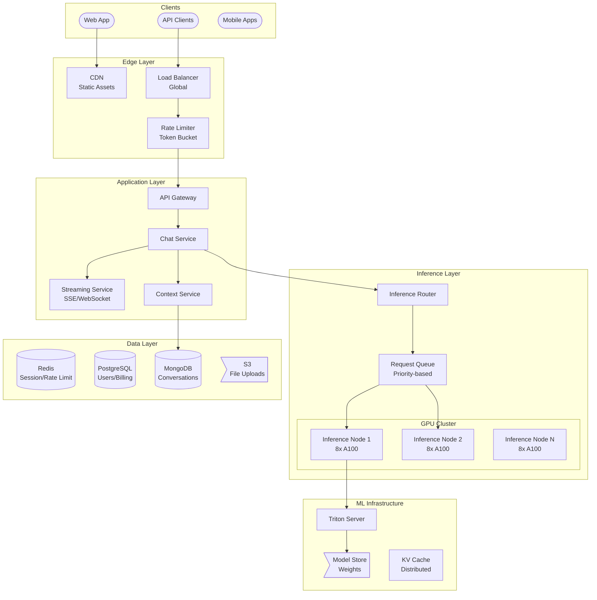

# 🤖 ChatGPT / AI Inference Platform - System Design Interview

> **Interview Duration**: 45 minutes  
> **Difficulty**: Very Hard  
> **Type**: AI Inference at Scale

---

## 1️⃣ Requirements & Estimation (5 min)

### Functional Requirements
1. **Chat Interface**: Real-time conversational AI with streaming responses
2. **Context Management**: Maintain conversation history within token limits
3. **Multi-Modal**: Support text, image, and file inputs

### Non-Functional Requirements
- **Latency**: Time to First Token (TTFT) < 500ms
- **Throughput**: Handle millions of concurrent requests
- **Availability**: 99.9% (users tolerate some degradation)

### Back-of-Envelope Estimation

```
Assumptions:
- 200M weekly users, 50M DAU
- 20 queries/user/day = 1B queries/day
- Average input: 500 tokens, output: 1000 tokens
- GPT-4 class model: 175B+ parameters

Traffic:
- QPS: 1B / 86400 ≈ 12K QPS average
- Peak QPS: 50K QPS
- Tokens/sec: 50K × 1000 = 50M tokens/sec output

Compute (GPU):
- GPT-4 inference: ~1000 tokens/sec per A100 GPU
- Tokens needed: 50M/sec ÷ 1000 = 50K A100 GPUs (theoretical)
- With batching (8x efficiency): ~6K A100 GPUs

Memory:
- GPT-4 model: ~350GB (FP16)
- Per A100 (80GB): Need 5+ GPUs for one model copy
- KV Cache per request: ~2GB for 128K context

Cost:
- A100 GPU: $2/hour
- 6K GPUs × $2 × 24 = $288K/day = $100M/year (just inference!)
```

---

## 2️⃣ High-Level Architecture (10 min)



### Key Architectural Decisions

```
┌─────────────────────────────────────────────────────────────────┐
│              LLM INFERENCE CHALLENGES                           │
├─────────────────────────────────────────────────────────────────┤
│                                                                  │
│  CHALLENGE 1: Model Size                                        │
│  • GPT-4: 1.7T parameters (rumored)                             │
│  • Can't fit on single GPU                                      │
│  → Solution: Tensor Parallelism across GPUs                     │
│                                                                  │
│  CHALLENGE 2: Memory Bandwidth                                  │
│  • Autoregressive = sequential token generation                 │
│  • GPU memory bandwidth is bottleneck                           │
│  → Solution: Continuous Batching                                │
│                                                                  │
│  CHALLENGE 3: Variable Request Sizes                            │
│  • 100 tokens to 128K tokens context                            │
│  • KV cache grows linearly with context                         │
│  → Solution: Paged Attention (vLLM)                             │
│                                                                  │
│  CHALLENGE 4: Cost                                               │
│  • $100M+/year GPU costs                                        │
│  → Solution: Efficient batching, model distillation             │
│                                                                  │
└─────────────────────────────────────────────────────────────────┘
```

### Technology Choices

| Component | Technology | Justification |
|-----------|------------|---------------|
| Inference Server | vLLM / TensorRT-LLM | Continuous batching, paged attention |
| Model Serving | Triton | Multi-model, GPU optimization |
| Streaming | Server-Sent Events | Unidirectional, simpler than WebSocket |
| Queue | Redis Streams | Priority ordering, persistence |
| Conversations | MongoDB | Flexible schema, fast writes |
| GPU Cluster | Kubernetes + NVIDIA | Orchestration, GPU scheduling |

---

## 3️⃣ API & Data Model (10 min)

### API Design

**Chat Completion (Streaming)**
```http
POST /v1/chat/completions
Authorization: Bearer {api_key}
Content-Type: application/json

{
    "model": "gpt-4-turbo",
    "messages": [
        {"role": "system", "content": "You are a helpful assistant."},
        {"role": "user", "content": "Explain quantum computing"}
    ],
    "max_tokens": 2000,
    "temperature": 0.7,
    "stream": true
}

Response (SSE stream):
data: {"id":"chatcmpl-123","choices":[{"delta":{"content":"Quantum"}}]}
data: {"id":"chatcmpl-123","choices":[{"delta":{"content":" computing"}}]}
data: {"id":"chatcmpl-123","choices":[{"delta":{"content":" is"}}]}
...
data: {"id":"chatcmpl-123","choices":[{"finish_reason":"stop"}]}
data: [DONE]
```

**File Upload (for vision/analysis)**
```http
POST /v1/files
Authorization: Bearer {api_key}
Content-Type: multipart/form-data

file: <binary>
purpose: "assistants"

Response 201:
{
    "id": "file-abc123",
    "object": "file",
    "bytes": 140000,
    "created_at": 1706500000,
    "filename": "data.pdf",
    "purpose": "assistants"
}
```

**Get Usage**
```http
GET /v1/usage?date=2024-01-28
Authorization: Bearer {api_key}

Response 200:
{
    "data": [
        {
            "model": "gpt-4-turbo",
            "usage": {
                "prompt_tokens": 1500000,
                "completion_tokens": 2000000,
                "total_tokens": 3500000
            },
            "cost_usd": 105.00
        }
    ]
}
```

### Data Model

**Users & API Keys (PostgreSQL)**
```sql
CREATE TABLE organizations (
    org_id          UUID PRIMARY KEY,
    name            VARCHAR(255) NOT NULL,
    tier            VARCHAR(20) DEFAULT 'free',  -- free, plus, enterprise
    rate_limit_rpm  INT DEFAULT 60,
    monthly_budget  DECIMAL(12,2),
    created_at      TIMESTAMP DEFAULT NOW()
);

CREATE TABLE users (
    user_id         UUID PRIMARY KEY,
    org_id          UUID REFERENCES organizations(org_id),
    email           VARCHAR(255) UNIQUE NOT NULL,
    role            VARCHAR(20) DEFAULT 'member',
    created_at      TIMESTAMP DEFAULT NOW()
);

CREATE TABLE api_keys (
    key_id          UUID PRIMARY KEY,
    org_id          UUID REFERENCES organizations(org_id),
    key_hash        VARCHAR(64) NOT NULL,  -- SHA-256 of key
    key_prefix      VARCHAR(10) NOT NULL,   -- sk-...xxxx
    name            VARCHAR(100),
    permissions     JSONB DEFAULT '["chat"]',
    rate_limit_rpm  INT,
    last_used_at    TIMESTAMP,
    created_at      TIMESTAMP DEFAULT NOW()
);

CREATE TABLE usage_records (
    id              BIGSERIAL PRIMARY KEY,
    org_id          UUID REFERENCES organizations(org_id),
    api_key_id      UUID REFERENCES api_keys(key_id),
    model           VARCHAR(50) NOT NULL,
    prompt_tokens   INT NOT NULL,
    completion_tokens INT NOT NULL,
    request_time_ms INT,
    created_at      TIMESTAMP DEFAULT NOW()
);

CREATE INDEX idx_usage_org_date ON usage_records (org_id, created_at);
```

**Conversations (MongoDB)**
```javascript
// conversations collection
{
    "_id": ObjectId("..."),
    "conversation_id": "conv_abc123",
    "user_id": "user_123",
    "model": "gpt-4-turbo",
    "title": "Quantum Computing Discussion",
    "messages": [
        {
            "role": "system",
            "content": "You are a helpful assistant."
        },
        {
            "role": "user",
            "content": "Explain quantum computing",
            "timestamp": ISODate("2024-01-28T10:00:00Z")
        },
        {
            "role": "assistant",
            "content": "Quantum computing is...",
            "timestamp": ISODate("2024-01-28T10:00:02Z"),
            "tokens": 500,
            "model": "gpt-4-turbo"
        }
    ],
    "metadata": {
        "total_tokens": 1500,
        "message_count": 10,
        "plugins_used": ["code_interpreter"]
    },
    "created_at": ISODate("2024-01-28T10:00:00Z"),
    "updated_at": ISODate("2024-01-28T10:15:00Z")
}
```

---

## 4️⃣ Component Deep Dive: Inference Optimization (15 min)

### Continuous Batching

```
┌─────────────────────────────────────────────────────────────────┐
│              CONTINUOUS BATCHING                                │
├─────────────────────────────────────────────────────────────────┤
│                                                                  │
│  STATIC BATCHING (Naive):                                       │
│  ┌──────────────────────────────────────────────┐              │
│  │ Req 1: ████████████████████████ (long)       │              │
│  │ Req 2: ████████  (short) [IDLE WAITING]      │              │
│  │ Req 3: ██████████████  [IDLE WAITING]        │              │
│  └──────────────────────────────────────────────┘              │
│  Wait for longest request → Poor throughput                     │
│                                                                  │
│  CONTINUOUS BATCHING (vLLM/Orca):                               │
│  ┌──────────────────────────────────────────────┐              │
│  │ Req 1: ████████████████████████              │              │
│  │ Req 2: ████████ → Req 4: ██████████████      │              │
│  │ Req 3: ██████████████ → Req 5: ████████      │              │
│  └──────────────────────────────────────────────┘              │
│  New requests join as old ones finish                           │
│  Result: 2-4x throughput improvement!                           │
│                                                                  │
└─────────────────────────────────────────────────────────────────┘
```

### Paged Attention (vLLM)

```
┌─────────────────────────────────────────────────────────────────┐
│              PAGED ATTENTION                                    │
├─────────────────────────────────────────────────────────────────┤
│                                                                  │
│  PROBLEM: KV Cache Memory Fragmentation                         │
│  • Each token needs KV cache storage                            │
│  • Pre-allocating max context = wasteful                        │
│  • 128K context × batch 32 = 2TB memory!                        │
│                                                                  │
│  SOLUTION: Memory Pages (like OS virtual memory)                │
│                                                                  │
│  ┌─────────────────────────────────────────────────────────┐   │
│  │  Physical GPU Memory                                     │   │
│  │  ┌─────┬─────┬─────┬─────┬─────┬─────┬─────┬─────┐     │   │
│  │  │ P0  │ P1  │ P2  │ P3  │ P4  │ P5  │ P6  │ P7  │     │   │
│  │  └─────┴─────┴─────┴─────┴─────┴─────┴─────┴─────┘     │   │
│  │                                                          │   │
│  │  Req 1 KV Cache: P0 → P2 → P5 (non-contiguous OK!)      │   │
│  │  Req 2 KV Cache: P1 → P3 → P4                           │   │
│  │  Req 3 KV Cache: P6 → P7 → (grows as needed)            │   │
│  └─────────────────────────────────────────────────────────┘   │
│                                                                  │
│  Benefits:                                                      │
│  • Near-zero memory waste                                       │
│  • Dynamic allocation as context grows                          │
│  • 4x more concurrent requests!                                 │
│                                                                  │
└─────────────────────────────────────────────────────────────────┘
```

### Pseudocode: Inference Router

```python
import asyncio
from dataclasses import dataclass, field
from typing import Optional, AsyncIterator
from enum import Enum
import time


class RequestPriority(Enum):
    ENTERPRISE = 0  # Highest
    PLUS = 1
    FREE = 2


@dataclass
class InferenceRequest:
    request_id: str
    user_id: str
    messages: list
    model: str
    max_tokens: int
    temperature: float
    priority: RequestPriority
    created_at: float = field(default_factory=time.time)
    estimated_tokens: int = 0


@dataclass
class InferenceNode:
    node_id: str
    endpoint: str
    gpu_count: int
    current_batch_size: int
    max_batch_size: int
    active_requests: list
    models_loaded: list


class InferenceRouter:
    """Route requests to optimal GPU nodes"""
    
    def __init__(self, redis_client, nodes: list):
        self.redis = redis_client
        self.nodes = {n.node_id: n for n in nodes}
        self.queues = {p: asyncio.PriorityQueue() for p in RequestPriority}
    
    async def submit_request(self, request: InferenceRequest) -> AsyncIterator[str]:
        """Submit request and stream response"""
        
        # Estimate input tokens for routing
        request.estimated_tokens = self._estimate_tokens(request.messages)
        
        # Check rate limits
        if not await self._check_rate_limit(request.user_id):
            raise RateLimitError("Rate limit exceeded")
        
        # Add to priority queue
        await self.queues[request.priority].put(
            (request.created_at, request)
        )
        
        # Wait for processing and stream results
        async for token in self._wait_and_stream(request):
            yield token
    
    async def _route_request(self, request: InferenceRequest) -> InferenceNode:
        """Select best node for request"""
        
        candidates = []
        
        for node in self.nodes.values():
            # Check if model is loaded
            if request.model not in node.models_loaded:
                continue
            
            # Check capacity
            if node.current_batch_size >= node.max_batch_size:
                continue
            
            # Score based on current load
            load_score = node.current_batch_size / node.max_batch_size
            
            # Prefer nodes with similar context lengths (better batching)
            context_score = self._context_affinity(node, request)
            
            score = load_score * 0.7 + context_score * 0.3
            candidates.append((score, node))
        
        if not candidates:
            # All nodes busy, request will queue
            return None
        
        # Return least loaded node
        candidates.sort(key=lambda x: x[0])
        return candidates[0][1]
    
    async def _wait_and_stream(self, request: InferenceRequest) -> AsyncIterator[str]:
        """Wait for request to be scheduled and stream tokens"""
        
        response_channel = f"response:{request.request_id}"
        
        # Subscribe to response channel
        pubsub = self.redis.pubsub()
        await pubsub.subscribe(response_channel)
        
        async for message in pubsub.listen():
            if message['type'] == 'message':
                data = json.loads(message['data'])
                
                if data.get('done'):
                    break
                
                yield data.get('token', '')
    
    def _estimate_tokens(self, messages: list) -> int:
        """Estimate token count (rough: 4 chars = 1 token)"""
        total_chars = sum(len(m.get('content', '')) for m in messages)
        return total_chars // 4


class InferenceWorker:
    """GPU worker running vLLM/TensorRT-LLM"""
    
    def __init__(self, node_id: str, model_path: str, 
                 gpu_count: int, redis_client):
        self.node_id = node_id
        self.redis = redis_client
        self.engine = self._load_model(model_path, gpu_count)
        self.max_batch_size = 32
        self.current_batch = []
    
    def _load_model(self, model_path: str, gpu_count: int):
        """Load model with tensor parallelism"""
        
        from vllm import LLM, SamplingParams
        
        return LLM(
            model=model_path,
            tensor_parallel_size=gpu_count,
            gpu_memory_utilization=0.9,
            max_num_batched_tokens=32768,
            max_num_seqs=self.max_batch_size
        )
    
    async def process_batch(self):
        """Continuous batching inference loop"""
        
        while True:
            # Collect requests (with timeout for continuous batching)
            batch = await self._collect_batch(timeout=0.01)
            
            if not batch:
                await asyncio.sleep(0.001)
                continue
            
            # Prepare prompts
            prompts = [self._format_prompt(r) for r in batch]
            sampling_params = [
                SamplingParams(
                    max_tokens=r.max_tokens,
                    temperature=r.temperature
                ) for r in batch
            ]
            
            # Run inference with streaming
            async for outputs in self.engine.generate_async(
                prompts, sampling_params, stream=True
            ):
                for i, output in enumerate(outputs):
                    request = batch[i]
                    
                    # Get new tokens
                    new_tokens = output.outputs[0].text
                    
                    # Publish to response channel
                    await self.redis.publish(
                        f"response:{request.request_id}",
                        json.dumps({"token": new_tokens})
                    )
                    
                    # Check if done
                    if output.outputs[0].finish_reason:
                        await self.redis.publish(
                            f"response:{request.request_id}",
                            json.dumps({"done": True})
                        )
    
    async def _collect_batch(self, timeout: float) -> list:
        """Collect requests for batching"""
        
        batch = []
        deadline = time.time() + timeout
        
        while len(batch) < self.max_batch_size and time.time() < deadline:
            try:
                request = await asyncio.wait_for(
                    self.request_queue.get(),
                    timeout=deadline - time.time()
                )
                batch.append(request)
            except asyncio.TimeoutError:
                break
        
        return batch


class TokenBudgetManager:
    """Manage token budgets and billing"""
    
    def __init__(self, db, pricing: dict):
        self.db = db
        self.pricing = pricing  # model -> (input_price, output_price) per 1M tokens
    
    async def check_budget(self, org_id: str, estimated_cost: float) -> bool:
        """Check if org has remaining budget"""
        
        org = await self.db.organizations.find_one({"org_id": org_id})
        
        if not org.get("monthly_budget"):
            return True  # No budget limit
        
        current_spend = await self._get_monthly_spend(org_id)
        
        return current_spend + estimated_cost <= org["monthly_budget"]
    
    async def record_usage(self, org_id: str, model: str,
                           prompt_tokens: int, completion_tokens: int):
        """Record token usage for billing"""
        
        input_price, output_price = self.pricing.get(model, (0.03, 0.06))
        
        cost = (
            (prompt_tokens / 1_000_000) * input_price +
            (completion_tokens / 1_000_000) * output_price
        )
        
        await self.db.usage_records.insert_one({
            "org_id": org_id,
            "model": model,
            "prompt_tokens": prompt_tokens,
            "completion_tokens": completion_tokens,
            "cost_usd": cost,
            "created_at": datetime.utcnow()
        })
```

---

## 5️⃣ Bottlenecks & Trade-offs (5 min)

### Single Points of Failure & Mitigations

| SPOF | Impact | Mitigation |
|------|--------|------------|
| GPU Node | Requests fail | Multiple nodes, request re-routing |
| Model Weights | Can't serve model | Replicate across nodes, S3 backup |
| KV Cache | Context lost | Checkpointing, distributed cache |
| Rate Limiter | Can't limit | Redis Cluster, local fallback |

### Latency vs Throughput Trade-off

```
┌─────────────────────────────────────────────────────────────────┐
│            LATENCY VS THROUGHPUT                                │
├─────────────────────────────────────────────────────────────────┤
│                                                                  │
│  OPTIMIZE FOR LATENCY (Single User):                            │
│  • Small batch size (1-4 requests)                              │
│  • Highest priority scheduling                                  │
│  • TTFT < 200ms possible                                        │
│  • Low GPU utilization (20-30%)                                 │
│  • Cost: $0.15 per request                                      │
│                                                                  │
│  OPTIMIZE FOR THROUGHPUT (Batch API):                           │
│  • Large batch size (32-64 requests)                            │
│  • Delayed scheduling OK                                        │
│  • TTFT: 1-5 seconds                                            │
│  • High GPU utilization (80-90%)                                │
│  • Cost: $0.015 per request (10x cheaper!)                      │
│                                                                  │
│  CHATGPT SOLUTION:                                               │
│  • Real-time chat: Latency-optimized                            │
│  • Batch API: Throughput-optimized (50% discount)               │
│  • Priority tiers: Enterprise > Plus > Free                     │
│                                                                  │
└─────────────────────────────────────────────────────────────────┘
```

### Model Size vs Quality Trade-off

```
┌─────────────────────────────────────────────────────────────────┐
│              MODEL SIZE TRADE-OFF                               │
├─────────────────────────────────────────────────────────────────┤
│                                                                  │
│  ┌─────────┬─────────────┬──────────┬──────────┐               │
│  │ Model   │ Parameters  │ Quality  │ Cost/1M  │               │
│  ├─────────┼─────────────┼──────────┼──────────┤               │
│  │ GPT-4   │ 1.7T (MoE)  │ Best     │ $30/$60  │               │
│  │ GPT-4o  │ ~200B       │ Very Good│ $5/$15   │               │
│  │ GPT-3.5 │ 175B        │ Good     │ $0.50/$1 │               │
│  │ GPT-4m  │ ~70B        │ Good     │ $0.15/$0.6│              │
│  └─────────┴─────────────┴──────────┴──────────┘               │
│                                                                  │
│  OPENAI STRATEGY:                                                │
│  • Router picks cheapest model that can handle task             │
│  • Cascade: Try GPT-4-mini first, escalate if needed           │
│  • Distillation: Train smaller models on GPT-4 outputs         │
│                                                                  │
└─────────────────────────────────────────────────────────────────┘
```

### CAP Theorem Trade-off

```
┌─────────────────────────────────────────────────────────────────┐
│                  CHATGPT CAP CHOICE                             │
├─────────────────────────────────────────────────────────────────┤
│  WE CHOOSE: AP (Availability + Partition Tolerance)             │
│                                                                  │
│  Reasoning:                                                      │
│  • Better to respond (even if degraded) than fail               │
│  • Conversation history can sync eventually                     │
│  • Usage tracking is eventually consistent                      │
│                                                                  │
│  Trade-off Accepted:                                             │
│  • May double-charge in rare partition scenarios                │
│  • Conversation history may lag across devices                  │
│  • Rate limits may temporarily exceed                           │
│                                                                  │
│  Strong Consistency For:                                         │
│  • API key validation                                           │
│  • Payment/subscription changes                                 │
│  • Model deployments                                            │
│                                                                  │
└─────────────────────────────────────────────────────────────────┘
```

### Interview Pro Tips

1. **Focus on GPU efficiency**: Continuous batching is the key insight
2. **Explain paged attention**: Shows deep understanding
3. **Discuss cost optimization**: $100M+ GPU costs are real
4. **Mention streaming**: SSE for progressive token delivery
