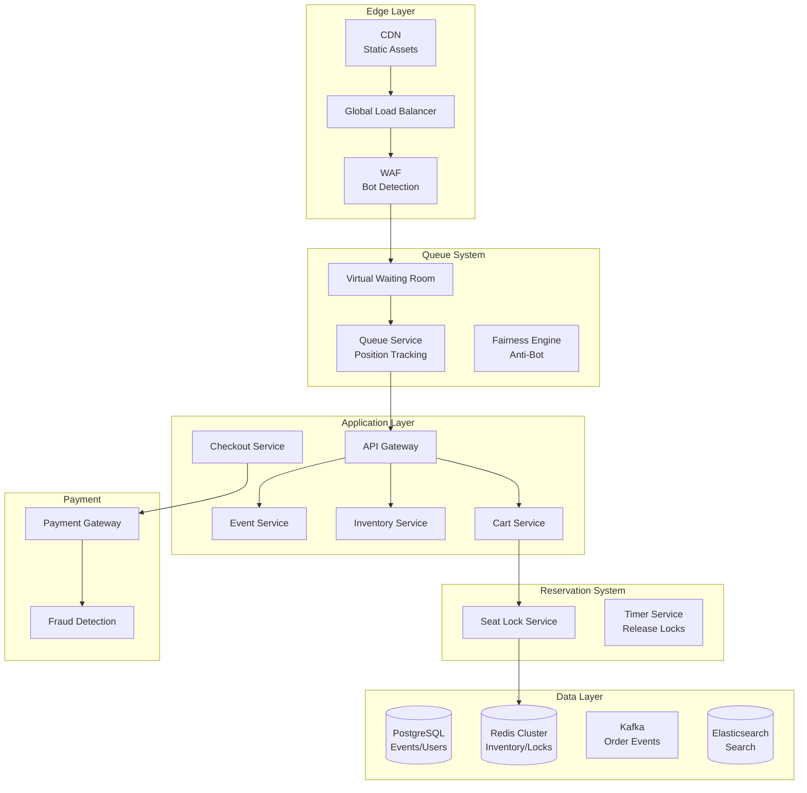

# 🎫 Ticketmaster - System Design Interview

> **Interview Duration**: 45 minutes  
> **Difficulty**: Very Hard  
> **Type**: High-Concurrency Ticketing Platform

---

## 1️⃣ Requirements & Estimation (5 min)

### Functional Requirements
1. **Event Browsing**: Search and discover events
2. **Seat Selection**: Interactive venue maps, real-time availability
3. **Ticket Purchase**: Fair queuing, payment processing

### Non-Functional Requirements
- **Consistency**: Strong (no double-selling seats)
- **Availability**: 99.99% during on-sale events
- **Fairness**: Queue system to prevent bots

### Back-of-Envelope Estimation

```
Assumptions:
- 10M active users
- 500 major events/day
- Hot events: 100K+ tickets, 1M+ demand

Traffic (Normal):
- Browsing: 100K QPS
- Purchases: 1K TPS

Traffic (Hot Event On-Sale):
- Single event: 10M users trying simultaneously
- Peak: 500K QPS (sustained for minutes)
- Cart creation: 50K TPS
- Payment: 10K TPS

Storage:
- Events: 1M × 10KB = 10GB
- Tickets: 100M × 1KB = 100GB
- Users: 100M × 5KB = 500GB
- Transactions: 1B × 500B = 500GB

Challenge: 10M → 100K tickets (99% rejection rate)
```

---

## 2️⃣ High-Level Architecture (10 min)



### Virtual Waiting Room Architecture

```
┌─────────────────────────────────────────────────────────────────┐
│              VIRTUAL WAITING ROOM                               │
├─────────────────────────────────────────────────────────────────┤
│                                                                  │
│  WHY NEEDED:                                                    │
│  • 10M users, 100K tickets                                      │
│  • Can't let all 10M hit checkout                               │
│  • Need fair, controlled flow                                   │
│                                                                  │
│  HOW IT WORKS:                                                  │
│  ┌─────────────────────────────────────────────────────────┐   │
│  │  1. PRE-QUEUE (before on-sale)                          │   │
│  │     • Users join waiting room                           │   │
│  │     • Complete CAPTCHA/verification                     │   │
│  │     • At on-sale time: RANDOM shuffle!                  │   │
│  │                                                          │   │
│  │  2. ACTIVE QUEUE (during on-sale)                       │   │
│  │     • Users get position number                         │   │
│  │     • Metered release: 1000/second to site             │   │
│  │     • Dynamic based on checkout completion rate        │   │
│  │                                                          │   │
│  │  3. SHOPPING SESSION                                     │   │
│  │     • 10-minute window to complete purchase             │   │
│  │     • Seats locked during selection                     │   │
│  │     • Timeout → back to queue                           │   │
│  └─────────────────────────────────────────────────────────┘   │
│                                                                  │
│  FAIR RANDOMIZATION:                                            │
│  • Everyone who joins before on-sale gets RANDOM position      │
│  • Not first-come-first-served (prevents F5 spam)              │
│  • Verified humans prioritized over suspected bots             │
│                                                                  │
└─────────────────────────────────────────────────────────────────┘
```

### Technology Choices

| Component | Technology | Justification |
|-----------|------------|---------------|
| Queue | Custom + Redis | Low latency, atomic ops |
| Inventory | Redis Cluster | In-memory for hot path |
| Seat Locks | Redis + Lua | Atomic lock operations |
| Events DB | PostgreSQL | ACID for transactions |
| Search | Elasticsearch | Full-text, geo-search |
| Bot Detection | Custom + Akamai | Fingerprinting, ML |

---

## 3️⃣ API & Data Model (10 min)

### API Design

**Join Queue**
```http
POST /api/v1/queue/join
Authorization: Bearer {token}

{
    "event_id": "event_taylor_swift_2024",
    "device_fingerprint": "fp_abc123",
    "captcha_token": "hcaptcha_xyz"
}

Response 200:
{
    "queue_token": "qt_xyz789",
    "position": null,  // null until on-sale
    "estimated_wait_minutes": null,
    "status": "pre_queue",
    "on_sale_time": "2024-01-28T10:00:00Z"
}
```

**Check Queue Position**
```http
GET /api/v1/queue/status?token=qt_xyz789

Response 200:
{
    "queue_token": "qt_xyz789",
    "position": 15234,
    "total_ahead": 15233,
    "estimated_wait_minutes": 8,
    "status": "waiting",  // pre_queue, waiting, your_turn, expired
    "shop_token": null
}

// When it's your turn:
{
    "queue_token": "qt_xyz789",
    "position": 0,
    "status": "your_turn",
    "shop_token": "st_abc123",
    "shop_expires_at": "2024-01-28T10:18:00Z"
}
```

**Get Available Seats**
```http
GET /api/v1/events/{event_id}/seats?section=A
Authorization: Shop-Token {shop_token}

Response 200:
{
    "event_id": "event_taylor_swift_2024",
    "section": "A",
    "seats": [
        {
            "seat_id": "A-12",
            "row": "A",
            "number": 12,
            "price": 350.00,
            "status": "available"
        },
        {
            "seat_id": "A-13",
            "row": "A",
            "number": 13,
            "price": 350.00,
            "status": "locked"  // Someone else is buying
        }
    ],
    "as_of": "2024-01-28T10:08:00.123Z"  // Freshness indicator
}
```

**Lock Seats (Add to Cart)**
```http
POST /api/v1/cart/seats
Authorization: Shop-Token {shop_token}

{
    "event_id": "event_taylor_swift_2024",
    "seat_ids": ["A-12", "A-14"]
}

Response 200:
{
    "cart_id": "cart_123",
    "seats": [
        {"seat_id": "A-12", "locked": true, "price": 350.00},
        {"seat_id": "A-14", "locked": true, "price": 350.00}
    ],
    "subtotal": 700.00,
    "fees": 70.00,
    "total": 770.00,
    "lock_expires_at": "2024-01-28T10:13:00Z"
}

Response 409 (Conflict):
{
    "error": "seats_unavailable",
    "unavailable_seats": ["A-14"],
    "message": "Some seats were taken"
}
```

**Checkout**
```http
POST /api/v1/checkout
Authorization: Shop-Token {shop_token}

{
    "cart_id": "cart_123",
    "payment": {
        "method": "credit_card",
        "token": "stripe_tok_xyz"
    }
}

Response 200:
{
    "order_id": "order_abc123",
    "status": "confirmed",
    "tickets": [
        {
            "ticket_id": "tkt_001",
            "seat": "A-12",
            "barcode": "1234567890",
            "qr_code_url": "https://..."
        }
    ],
    "confirmation_email_sent": true
}
```

### Data Model

**Events & Venues (PostgreSQL)**
```sql
CREATE TABLE venues (
    venue_id        UUID PRIMARY KEY,
    name            VARCHAR(200) NOT NULL,
    address         TEXT,
    city            VARCHAR(100),
    country         VARCHAR(2),
    capacity        INT,
    seat_map_url    VARCHAR(500)
);

CREATE TABLE events (
    event_id        UUID PRIMARY KEY,
    venue_id        UUID REFERENCES venues(venue_id),
    artist_name     VARCHAR(200) NOT NULL,
    event_name      VARCHAR(500) NOT NULL,
    event_date      TIMESTAMP NOT NULL,
    on_sale_date    TIMESTAMP NOT NULL,
    status          VARCHAR(20) DEFAULT 'scheduled',
    total_tickets   INT NOT NULL,
    tickets_sold    INT DEFAULT 0
);

CREATE TABLE sections (
    section_id      UUID PRIMARY KEY,
    venue_id        UUID REFERENCES venues(venue_id),
    name            VARCHAR(50) NOT NULL,
    capacity        INT NOT NULL,
    price_tier      VARCHAR(20)
);

CREATE TABLE seats (
    seat_id         VARCHAR(20) PRIMARY KEY,  -- e.g., "A-12"
    section_id      UUID REFERENCES sections(section_id),
    row_name        VARCHAR(10),
    seat_number     INT,
    x_coord         INT,  -- For seat map rendering
    y_coord         INT,
    is_accessible   BOOLEAN DEFAULT FALSE
);
```

**Event Inventory (Redis)**
```
# Seat availability (SET per event)
SADD event:{event_id}:available "A-12" "A-13" "A-14" ...

# Seat locks (with TTL)
SET seat_lock:{event_id}:{seat_id} {user_id} EX 600  # 10 min

# Seat prices (HASH)
HSET event:{event_id}:prices "A-12" "350.00" "A-13" "350.00"

# Inventory counters
HINCRBY event:{event_id}:stats available -1
HINCRBY event:{event_id}:stats locked 1
```

**Orders (PostgreSQL)**
```sql
CREATE TABLE orders (
    order_id        UUID PRIMARY KEY,
    user_id         UUID REFERENCES users(user_id),
    event_id        UUID REFERENCES events(event_id),
    status          VARCHAR(20) DEFAULT 'pending',
    subtotal        DECIMAL(10,2) NOT NULL,
    fees            DECIMAL(10,2) NOT NULL,
    total           DECIMAL(10,2) NOT NULL,
    payment_id      VARCHAR(100),
    created_at      TIMESTAMP DEFAULT NOW(),
    completed_at    TIMESTAMP
);

CREATE TABLE tickets (
    ticket_id       UUID PRIMARY KEY,
    order_id        UUID REFERENCES orders(order_id),
    event_id        UUID REFERENCES events(event_id),
    seat_id         VARCHAR(20),
    barcode         VARCHAR(50) UNIQUE,
    status          VARCHAR(20) DEFAULT 'active',
    price           DECIMAL(10,2) NOT NULL
);
```

---

## 4️⃣ Component Deep Dive: Seat Locking & Inventory (15 min)

### Distributed Seat Locking

```
┌─────────────────────────────────────────────────────────────────┐
│              SEAT LOCKING CHALLENGES                            │
├─────────────────────────────────────────────────────────────────┤
│                                                                  │
│  PROBLEM:                                                       │
│  • 10K users try to lock same seat simultaneously               │
│  • Must prevent double-booking                                  │
│  • Must release locks on timeout                                │
│                                                                  │
│  NAIVE APPROACH (Database):                                     │
│  ```sql                                                         │
│  UPDATE seats SET locked_by = ? WHERE seat_id = ?               │
│  AND locked_by IS NULL  -- RACE CONDITION!                      │
│  ```                                                            │
│  Problems: Slow, lock contention, no auto-expire                │
│                                                                  │
│  REDIS ATOMIC APPROACH:                                         │
│  ```                                                             │
│  SETNX seat_lock:{seat} {user} EX 600                           │
│  ```                                                            │
│  ✅ Atomic operation                                            │
│  ✅ Built-in TTL                                                │
│  ✅ Microsecond latency                                         │
│                                                                  │
└─────────────────────────────────────────────────────────────────┘
```

### Pseudocode: Inventory Service

```python
import asyncio
import time
from dataclasses import dataclass
from typing import List, Optional, Tuple
from enum import Enum


class SeatStatus(Enum):
    AVAILABLE = "available"
    LOCKED = "locked"
    SOLD = "sold"


@dataclass
class SeatLock:
    seat_id: str
    user_id: str
    expires_at: float
    cart_id: str


class InventoryService:
    """Manage real-time seat availability"""
    
    LOCK_DURATION_SECONDS = 600  # 10 minutes
    
    def __init__(self, redis_client, db):
        self.redis = redis_client
        self.db = db
    
    async def get_available_seats(self, event_id: str, 
                                   section: Optional[str] = None) -> list:
        """Get all available seats for event/section"""
        
        # Get from Redis SET (O(N) but fast for reasonable section sizes)
        key = f"event:{event_id}:available"
        if section:
            key = f"event:{event_id}:section:{section}:available"
        
        available = await self.redis.smembers(key)
        
        # Get prices
        prices = await self.redis.hgetall(f"event:{event_id}:prices")
        
        return [
            {
                "seat_id": seat_id,
                "price": float(prices.get(seat_id, 0)),
                "status": "available"
            }
            for seat_id in available
        ]
    
    async def lock_seats(self, event_id: str, seat_ids: List[str],
                          user_id: str, cart_id: str) -> Tuple[List[str], List[str]]:
        """Atomically lock multiple seats"""
        
        locked = []
        failed = []
        
        # Use Redis transaction for atomicity
        pipe = self.redis.pipeline()
        
        for seat_id in seat_ids:
            lock_key = f"seat_lock:{event_id}:{seat_id}"
            
            # Try to acquire lock (NX = only if not exists)
            await pipe.set(
                lock_key,
                f"{user_id}:{cart_id}",
                nx=True,  # Only if not exists
                ex=self.LOCK_DURATION_SECONDS
            )
        
        results = await pipe.execute()
        
        # Process results
        for i, (seat_id, success) in enumerate(zip(seat_ids, results)):
            if success:
                locked.append(seat_id)
                # Remove from available set
                await self.redis.srem(f"event:{event_id}:available", seat_id)
            else:
                failed.append(seat_id)
        
        return locked, failed
    
    async def release_seats(self, event_id: str, seat_ids: List[str],
                             user_id: str, cart_id: str):
        """Release seat locks (cart abandoned/expired)"""
        
        for seat_id in seat_ids:
            lock_key = f"seat_lock:{event_id}:{seat_id}"
            
            # Only release if we own the lock (Lua script for atomicity)
            lua_script = """
            local current = redis.call('GET', KEYS[1])
            if current == ARGV[1] then
                redis.call('DEL', KEYS[1])
                redis.call('SADD', KEYS[2], ARGV[2])
                return 1
            end
            return 0
            """
            
            await self.redis.eval(
                lua_script,
                2,  # Number of keys
                lock_key,
                f"event:{event_id}:available",
                f"{user_id}:{cart_id}",
                seat_id
            )
    
    async def confirm_purchase(self, event_id: str, seat_ids: List[str],
                                user_id: str, order_id: str):
        """Convert locks to confirmed sales"""
        
        pipe = self.redis.pipeline()
        
        for seat_id in seat_ids:
            lock_key = f"seat_lock:{event_id}:{seat_id}"
            sold_key = f"event:{event_id}:sold"
            
            # Delete lock and add to sold set
            await pipe.delete(lock_key)
            await pipe.sadd(sold_key, seat_id)
        
        # Update counters
        await pipe.hincrby(f"event:{event_id}:stats", "sold", len(seat_ids))
        await pipe.hincrby(f"event:{event_id}:stats", "locked", -len(seat_ids))
        
        await pipe.execute()
        
        # Persist to database (async, can be slightly delayed)
        await self._persist_sale(event_id, seat_ids, user_id, order_id)


class QueueService:
    """Virtual waiting room implementation"""
    
    def __init__(self, redis_client):
        self.redis = redis_client
    
    async def join_pre_queue(self, event_id: str, user_id: str,
                              fingerprint: str) -> str:
        """Join pre-sale queue (random position at on-sale)"""
        
        queue_token = generate_token()
        
        # Store in pre-queue set
        await self.redis.sadd(
            f"event:{event_id}:pre_queue",
            f"{queue_token}:{user_id}:{fingerprint}"
        )
        
        return queue_token
    
    async def activate_queue(self, event_id: str):
        """Called at on-sale time - randomize and assign positions"""
        
        # Get all pre-queue entries
        pre_queue = await self.redis.smembers(f"event:{event_id}:pre_queue")
        
        # Shuffle randomly (FAIR!)
        entries = list(pre_queue)
        random.shuffle(entries)
        
        # Assign positions
        pipe = self.redis.pipeline()
        for position, entry in enumerate(entries, 1):
            queue_token = entry.split(":")[0]
            await pipe.zadd(
                f"event:{event_id}:active_queue",
                {queue_token: position}
            )
            await pipe.hset(
                f"queue_token:{queue_token}",
                mapping={
                    "position": position,
                    "event_id": event_id,
                    "status": "waiting"
                }
            )
        
        await pipe.execute()
        
        # Clear pre-queue
        await self.redis.delete(f"event:{event_id}:pre_queue")
        
        # Start releasing users
        asyncio.create_task(self._release_loop(event_id))
    
    async def _release_loop(self, event_id: str):
        """Continuously release users to shopping"""
        
        release_rate = 1000  # Users per second
        
        while True:
            # Get inventory status
            stats = await self.redis.hgetall(f"event:{event_id}:stats")
            available = int(stats.get("available", 0))
            
            if available <= 0:
                # Sold out - notify remaining queue
                await self._notify_sold_out(event_id)
                break
            
            # Get next batch of users
            next_users = await self.redis.zrange(
                f"event:{event_id}:active_queue",
                0, release_rate - 1
            )
            
            if not next_users:
                break  # Queue empty
            
            # Issue shop tokens
            for queue_token in next_users:
                shop_token = generate_token()
                await self.redis.hset(
                    f"queue_token:{queue_token}",
                    mapping={
                        "status": "your_turn",
                        "shop_token": shop_token,
                        "shop_expires": int(time.time()) + 600
                    }
                )
                
                # Remove from queue
                await self.redis.zrem(f"event:{event_id}:active_queue", queue_token)
            
            await asyncio.sleep(1)  # Release every second
    
    async def get_position(self, queue_token: str) -> dict:
        """Get current queue status"""
        
        data = await self.redis.hgetall(f"queue_token:{queue_token}")
        
        if data.get("status") == "your_turn":
            return {
                "status": "your_turn",
                "shop_token": data["shop_token"],
                "shop_expires_at": int(data["shop_expires"])
            }
        
        return {
            "status": "waiting",
            "position": int(data.get("position", 0)),
            "estimated_wait_minutes": int(data.get("position", 0)) // 1000
        }


class BotDetectionService:
    """Detect and filter bot traffic"""
    
    SUSPICIOUS_SIGNALS = [
        "no_mouse_movement",
        "instant_captcha",
        "datacenter_ip",
        "headless_browser",
        "known_bot_fingerprint"
    ]
    
    async def score_user(self, request_data: dict) -> float:
        """Score user from 0 (bot) to 1 (human)"""
        
        score = 1.0
        
        # Check IP reputation
        ip_score = await self._check_ip_reputation(request_data["ip"])
        score *= ip_score
        
        # Check device fingerprint
        fp_score = await self._check_fingerprint(request_data["fingerprint"])
        score *= fp_score
        
        # Check behavior patterns
        behavior_score = self._analyze_behavior(request_data)
        score *= behavior_score
        
        return score
    
    async def _check_ip_reputation(self, ip: str) -> float:
        """Check if IP is datacenter, VPN, or known bad"""
        
        # Check against IP reputation database
        info = await self.ip_db.lookup(ip)
        
        if info.is_datacenter:
            return 0.1
        if info.is_vpn:
            return 0.5
        if info.abuse_score > 0.8:
            return 0.2
        
        return 1.0
    
    def _analyze_behavior(self, data: dict) -> float:
        """Analyze mouse/keyboard patterns"""
        
        # Humans have irregular mouse movements
        if not data.get("mouse_events"):
            return 0.3
        
        # Check timing patterns
        events = data["mouse_events"]
        intervals = [events[i+1]["t"] - events[i]["t"] 
                     for i in range(len(events)-1)]
        
        # Bots often have very regular intervals
        if len(set(intervals)) < 3:  # Too regular
            return 0.2
        
        return 1.0
```

---

## 5️⃣ Bottlenecks & Trade-offs (5 min)

### Single Points of Failure & Mitigations

| SPOF | Impact | Mitigation |
|------|--------|------------|
| Queue Service | Can't join queue | Redis Cluster, pre-position |
| Seat Lock (Redis) | Can't reserve | Multi-master, local fallback |
| Payment Gateway | Can't complete purchase | Multiple providers, retry |
| Bot Detection | Bots get through | Layered defense, ML backup |

### Fairness vs Performance Trade-off

```
┌─────────────────────────────────────────────────────────────────┐
│            FAIRNESS VS PERFORMANCE                              │
├─────────────────────────────────────────────────────────────────┤
│                                                                  │
│  MAXIMUM FAIRNESS (Random Queue):                               │
│  ✅ Everyone has equal chance                                   │
│  ✅ Prevents bot advantage                                      │
│  ❌ User joins early, still might wait                          │
│  ❌ More complex queue management                               │
│                                                                  │
│  MAXIMUM PERFORMANCE (First-Come):                              │
│  ✅ Simple implementation                                       │
│  ✅ Rewards prepared users                                      │
│  ❌ Favors fast connections/bots                                │
│  ❌ F5 spam overloads servers                                   │
│                                                                  │
│  TICKETMASTER'S HYBRID:                                         │
│  • Pre-queue: Random position assignment                        │
│  • Verified Fan: Priority for proven humans                     │
│  • Metered release: Control flow rate                           │
│  • Result: Fair + Scalable                                      │
│                                                                  │
└─────────────────────────────────────────────────────────────────┘
```

### Consistency vs Availability Trade-off

```
┌─────────────────────────────────────────────────────────────────┐
│                  TICKETMASTER CAP CHOICE                        │
├─────────────────────────────────────────────────────────────────┤
│  WE CHOOSE: CP (Consistency + Partition Tolerance)              │
│                                                                  │
│  Reasoning:                                                      │
│  • Double-selling = disaster (refunds, PR nightmare)            │
│  • Better to reject sale than oversell                          │
│  • Users understand "sold out" message                          │
│                                                                  │
│  Trade-off Accepted:                                             │
│  • Some users may see false "unavailable"                       │
│  • Higher latency during network issues                         │
│  • Potential revenue loss from rejected valid sales             │
│                                                                  │
│  Implementation:                                                 │
│  • Redis with synchronous replication                           │
│  • Database transactions for payment                            │
│  • Saga pattern for distributed checkout                        │
│                                                                  │
└─────────────────────────────────────────────────────────────────┘
```

### Interview Pro Tips

1. **Start with queue**: Virtual waiting room is THE key insight
2. **Explain atomic locking**: Redis SETNX + TTL
3. **Discuss bot mitigation**: Real-world challenge
4. **Mention fairness**: Random assignment in pre-queue
