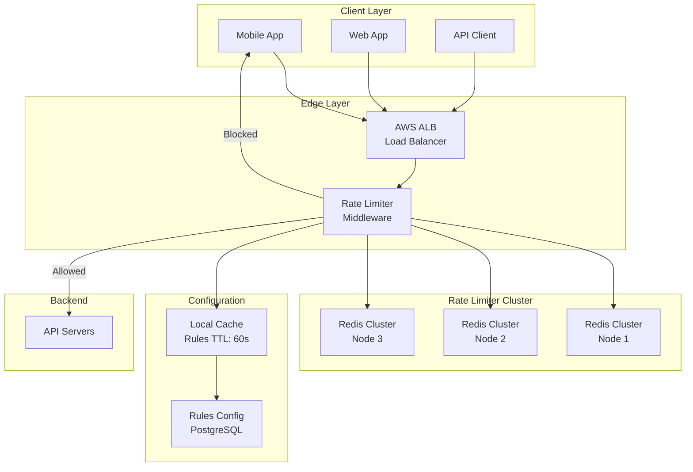

# 🚦 Rate Limiter - System Design Interview

> **Interview Duration**: 45 minutes  
> **Difficulty**: Medium  
> **Type**: Infrastructure Component

---

## 1️⃣ Requirements & Estimation (5 min)

### Functional Requirements
1. **Limit requests** per user/IP/API key within a time window
2. **Multiple rate limiting rules** (per-second, per-minute, per-day)
3. **Return appropriate response** when limit exceeded (429 Too Many Requests)

### Non-Functional Requirements
- **Consistency Model**: Strong consistency for accurate limiting
- **Latency**: < 1ms additional latency per request
- **Availability**: 99.99% (critical infrastructure)

### Back-of-Envelope Estimation

```
Assumptions:
- 100M DAU, each makes 100 requests/day
- Peak traffic: 3x average

Traffic:
- Daily requests: 100M × 100 = 10B requests/day
- QPS: 10B / 86,400 ≈ 115K QPS
- Peak QPS: 115K × 3 = 345K QPS

Storage (per user counter):
- User ID: 8 bytes
- Counter: 4 bytes
- Timestamp: 8 bytes
- Total per user: ~20 bytes
- For 100M users: 100M × 20 = 2GB (fits in Redis)
```

---

## 2️⃣ High-Level Architecture (10 min)



### Technology Choices
| Component | Technology | Justification |
|-----------|------------|---------------|
| Counter Store | Redis Cluster | Sub-ms latency, atomic operations |
| Rules Store | PostgreSQL | ACID for rule management |
| Local Cache | In-memory LRU | Reduce DB calls for rules |
| Rate Limiter | Nginx/Envoy sidecar | Low latency, language-agnostic |

---

## 3️⃣ API & Data Model (10 min)

### API Design

**Check Rate Limit**
```http
POST /ratelimit/check
Content-Type: application/json

{
    "client_id": "user_123",
    "resource": "/api/v1/messages",
    "weight": 1
}

Response 200 (Allowed):
{
    "allowed": true,
    "remaining": 98,
    "reset_at": 1706486400,
    "retry_after": null
}

Response 429 (Rate Limited):
{
    "allowed": false,
    "remaining": 0,
    "reset_at": 1706486400,
    "retry_after": 45
}
```

**Get Client Status**
```http
GET /ratelimit/status/{client_id}

Response 200:
{
    "client_id": "user_123",
    "limits": [
        {
            "rule": "messages_per_minute",
            "limit": 100,
            "remaining": 45,
            "reset_at": 1706486400
        }
    ]
}
```

### Data Model

**Rate Limit Rules (PostgreSQL)**
```sql
CREATE TABLE rate_limit_rules (
    rule_id         UUID PRIMARY KEY,
    name            VARCHAR(100) NOT NULL,
    resource_pattern VARCHAR(255) NOT NULL,  -- e.g., "/api/v1/*"
    limit_value     INT NOT NULL,
    window_seconds  INT NOT NULL,
    client_type     VARCHAR(50),  -- "user", "ip", "api_key"
    created_at      TIMESTAMP DEFAULT NOW(),
    INDEX idx_resource (resource_pattern)
);
```

**Rate Limit Counters (Redis)**
```
Key Format: ratelimit:{client_id}:{rule_id}:{window_start}
Value: counter (integer)
TTL: window_seconds + buffer

Example:
Key: "ratelimit:user_123:msg_per_min:1706486340"
Value: 45
TTL: 120 seconds
```

**Sliding Window Log (Redis Sorted Set)**
```
Key: ratelimit:sliding:{client_id}:{rule_id}
Score: timestamp (Unix epoch ms)
Member: unique request ID

ZADD ratelimit:sliding:user_123:api_limit 1706486345123 "req_abc123"
ZREMRANGEBYSCORE ratelimit:sliding:user_123:api_limit 0 (now - window)
ZCARD ratelimit:sliding:user_123:api_limit
```

---

## 4️⃣ Component Deep Dive: Sliding Window Counter (15 min)

### Algorithm Selection

| Algorithm | Pros | Cons | Use Case |
|-----------|------|------|----------|
| Fixed Window | Simple, O(1) | Burst at edges | Low precision OK |
| Sliding Log | Precise | Memory heavy | Small request volume |
| **Sliding Window Counter** | Balanced | Approximation | **Production choice** |
| Token Bucket | Smooth, burst-friendly | Complex | API gateway |

### Sliding Window Counter Implementation

The sliding window counter combines fixed windows with weighted averaging to approximate a true sliding window with O(1) operations.

```
Window Calculation:
┌─────────────────┬─────────────────┐
│ Previous Window │ Current Window  │
│ (weight: 30%)   │ (weight: 70%)   │
└─────────────────┴─────────────────┘
                  ↑
            Current Time (70% into window)

Effective Count = prev_count × (1 - elapsed%) + curr_count
```

### Pseudocode: Rate Limiter with Redis

```python
class SlidingWindowRateLimiter:
    def __init__(self, redis_client, rule_cache):
        self.redis = redis_client
        self.rule_cache = rule_cache
    
    def is_allowed(self, client_id: str, resource: str) -> RateLimitResult:
        # Get applicable rule (from local cache)
        rule = self.rule_cache.get_rule(resource)
        if not rule:
            return RateLimitResult(allowed=True)  # No rule = allow
        
        window_size = rule.window_seconds
        limit = rule.limit_value
        now = time.time()
        
        # Calculate window boundaries
        current_window = int(now // window_size) * window_size
        previous_window = current_window - window_size
        elapsed_ratio = (now - current_window) / window_size
        
        # Atomic Redis operation using Lua script
        keys = [
            f"ratelimit:{client_id}:{rule.rule_id}:{previous_window}",
            f"ratelimit:{client_id}:{rule.rule_id}:{current_window}"
        ]
        
        result = self.redis.eval(SLIDING_WINDOW_LUA, keys, [limit, elapsed_ratio, window_size * 2])
        
        allowed, current_count, ttl = result
        
        return RateLimitResult(
            allowed=bool(allowed),
            remaining=max(0, limit - current_count),
            reset_at=current_window + window_size,
            retry_after=None if allowed else ttl
        )
```

### Lua Script for Atomic Operations

```lua
-- KEYS[1] = previous window key
-- KEYS[2] = current window key
-- ARGV[1] = limit, ARGV[2] = elapsed_ratio, ARGV[3] = ttl

local prev_count = tonumber(redis.call('GET', KEYS[1]) or 0)
local curr_count = tonumber(redis.call('GET', KEYS[2]) or 0)
local elapsed = tonumber(ARGV[2])

-- Weighted count calculation
local effective_count = prev_count * (1 - elapsed) + curr_count

if effective_count >= tonumber(ARGV[1]) then
    local ttl = redis.call('TTL', KEYS[2])
    return {0, math.ceil(effective_count), ttl}  -- Denied
end

-- Increment current window
redis.call('INCR', KEYS[2])
redis.call('EXPIRE', KEYS[2], tonumber(ARGV[3]))

return {1, math.ceil(effective_count) + 1, 0}  -- Allowed
```

### Distributed Rate Limiting

For global rate limiting across multiple data centers:

```python
class DistributedRateLimiter:
    def __init__(self, local_redis, sync_interval_ms=100):
        self.local = local_redis
        self.sync_interval = sync_interval_ms
        self.pending_increments = defaultdict(int)
    
    def is_allowed_async(self, client_id: str, rule: Rule) -> bool:
        # Use local counter with periodic sync
        local_count = self.local.get(f"local:{client_id}:{rule.id}") or 0
        
        # Apply safety margin for distributed inaccuracy
        effective_limit = rule.limit * 0.9  # 10% buffer
        
        if local_count >= effective_limit:
            return False
        
        # Batch increments for background sync
        self.pending_increments[f"{client_id}:{rule.id}"] += 1
        self.local.incr(f"local:{client_id}:{rule.id}")
        return True
    
    async def sync_to_global(self):
        """Background task: sync local counts to global Redis"""
        while True:
            for key, count in self.pending_increments.items():
                await self.global_redis.incrby(f"global:{key}", count)
            self.pending_increments.clear()
            await asyncio.sleep(self.sync_interval / 1000)
```

---

## 5️⃣ Bottlenecks & Trade-offs (5 min)

### Single Points of Failure & Mitigations

| SPOF | Impact | Mitigation |
|------|--------|------------|
| Redis Cluster | All rate limiting fails | Redis Sentinel, fail-open policy |
| Rate Limiter Middleware | Requests blocked/allowed incorrectly | Run as sidecar, local fallback |
| Rules Config DB | Can't update rules | Cache rules with long TTL |

### Fail-Open vs Fail-Close

```python
def check_rate_limit_with_fallback(client_id, resource):
    try:
        return rate_limiter.is_allowed(client_id, resource)
    except RedisConnectionError:
        # FAIL-OPEN: Allow requests when rate limiter is down
        # Trade-off: Potential abuse during outage
        log.warning(f"Rate limiter unavailable, allowing request")
        return RateLimitResult(allowed=True)
        
        # FAIL-CLOSE alternative: Block all requests
        # Trade-off: Service degradation during outage
        # return RateLimitResult(allowed=False, retry_after=60)
```

### CAP Theorem Trade-off

```
┌─────────────────────────────────────────────────────────────┐
│                    RATE LIMITER CAP CHOICE                  │
├─────────────────────────────────────────────────────────────┤
│  WE CHOOSE: CP (Consistency + Partition Tolerance)          │
│                                                             │
│  Reasoning:                                                 │
│  • Accurate rate limiting requires consistent counters      │
│  • Inaccurate limits = potential abuse or false rejections  │
│  • Brief unavailability (fail-open) is acceptable           │
│                                                             │
│  Trade-off Accepted:                                        │
│  • During network partition, some requests may be allowed   │
│    beyond limit (fail-open) rather than rejecting valid     │
│    requests (fail-close)                                    │
│                                                             │
│  Alternative (AP):                                          │
│  • Use local counters with eventual sync                    │
│  • Accept 10-20% inaccuracy for higher availability         │
│  • Good for soft limits (fair usage) not hard limits (DDoS) │
└─────────────────────────────────────────────────────────────┘
```

### Scaling Considerations

| Scale Challenge | Solution |
|-----------------|----------|
| Hot user (celebrity) | Shard by user ID + dedicated Redis node |
| Global rate limiting | Gossip protocol or central coordinator |
| Rule updates | Event-driven cache invalidation via Kafka |
| Burst traffic | Token bucket with burst capacity |

### Interview Pro Tips

1. **Clarify the use case**: API rate limiting vs DDoS protection have different requirements
2. **Discuss client identification**: IP can be shared (NAT), API keys are more accurate
3. **Mention response headers**: `X-RateLimit-Limit`, `X-RateLimit-Remaining`, `Retry-After`
4. **Consider rate limit by tiers**: Free vs Premium users have different limits
