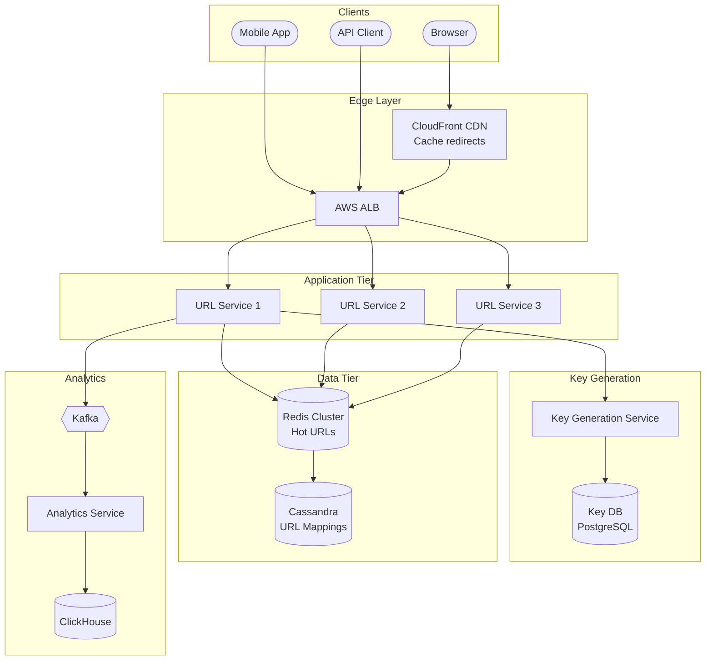

# 🔗 TinyURL (URL Shortener) - System Design Interview

> **Interview Duration**: 45 minutes  
> **Difficulty**: Easy-Medium  
> **Type**: Core System Design

---

## 1️⃣ Requirements & Estimation (5 min)

### Functional Requirements
1. **Shorten URL**: Given a long URL, generate a unique short URL
2. **Redirect**: Given a short URL, redirect to the original URL
3. **Custom alias** (optional): Users can specify custom short codes

### Non-Functional Requirements
- **Consistency Model**: Strong consistency (same short URL → same long URL always)
- **Latency**: < 100ms for redirect (read-heavy)
- **Availability**: 99.99% (links should always work)

### Back-of-Envelope Estimation

```
Assumptions:
- 500M new URLs shortened per month
- Read:Write ratio = 100:1
- URL retention: 5 years

Traffic:
- Write QPS: 500M / (30 × 86,400) ≈ 200 QPS
- Read QPS: 200 × 100 = 20,000 QPS
- Peak Read QPS: 20K × 3 = 60K QPS

Storage:
- Per URL: 
  - Short code: 7 bytes
  - Long URL: 500 bytes (avg)
  - Metadata: 100 bytes
  - Total: ~600 bytes
- 5 years: 500M × 12 × 5 = 30B URLs
- Total storage: 30B × 600 bytes = 18TB

Unique URLs needed:
- 30B URLs over 5 years
- Base62 with 7 chars: 62^7 = 3.5 trillion (sufficient)
```

---

## 2️⃣ High-Level Architecture (10 min)



### Technology Choices

| Component | Technology | Justification |
|-----------|------------|---------------|
| URL Store | Cassandra | High write throughput, linear scaling |
| Cache | Redis Cluster | Sub-ms reads for hot URLs |
| Key DB | PostgreSQL | ACID for key allocation |
| CDN | CloudFront | Cache popular redirects at edge |
| Analytics | ClickHouse | Columnar DB for click analytics |

---

## 3️⃣ API & Data Model (10 min)

### API Design

**Create Short URL**
```http
POST /api/v1/shorten
Content-Type: application/json
Authorization: Bearer {api_key}

{
    "long_url": "https://example.com/very/long/path?query=params",
    "custom_alias": "my-link",        // optional
    "expiration_days": 365            // optional
}

Response 201:
{
    "short_url": "https://tiny.url/abc1234",
    "short_code": "abc1234",
    "long_url": "https://example.com/very/long/path?query=params",
    "created_at": "2026-01-28T10:00:00Z",
    "expires_at": "2027-01-28T10:00:00Z"
}
```

**Redirect (Read)**
```http
GET /{short_code}

Response 301 (Permanent Redirect):
Location: https://example.com/very/long/path?query=params

Response 302 (Temporary Redirect - if tracking needed):
Location: https://example.com/very/long/path?query=params
```

### Data Model

**URL Mappings (Cassandra)**
```sql
CREATE TABLE url_mappings (
    short_code   TEXT,              -- Partition Key
    long_url     TEXT,
    user_id      UUID,
    created_at   TIMESTAMP,
    expires_at   TIMESTAMP,
    click_count  COUNTER,
    PRIMARY KEY (short_code)
) WITH default_time_to_live = 157680000;  -- 5 years

-- Secondary index for user lookups
CREATE TABLE user_urls (
    user_id      UUID,              -- Partition Key
    created_at   TIMESTAMP,         -- Clustering Key (DESC)
    short_code   TEXT,
    long_url     TEXT,
    PRIMARY KEY (user_id, created_at)
) WITH CLUSTERING ORDER BY (created_at DESC);
```

**Pre-generated Keys (PostgreSQL)**
```sql
CREATE TABLE key_pool (
    short_code   VARCHAR(7) PRIMARY KEY,
    is_used      BOOLEAN DEFAULT FALSE,
    allocated_to VARCHAR(50),       -- Service instance ID
    allocated_at TIMESTAMP
);

-- Index for finding unused keys
CREATE INDEX idx_unused_keys ON key_pool(is_used) WHERE is_used = FALSE;
```

**Redis Cache Structure**
```
Key: url:{short_code}
Value: {long_url}
TTL: 24 hours (for hot URLs)

Example:
SET url:abc1234 "https://example.com/long/url" EX 86400
```

---

## 4️⃣ Component Deep Dive: Key Generation Service (15 min)

### Approaches Comparison

| Approach | Pros | Cons |
|----------|------|------|
| Random Generation | Simple | Collision checking needed |
| Hash (MD5/SHA) | Deterministic | Collisions, long output |
| Counter + Base62 | No collisions | Single point, predictable |
| **Pre-generated Keys (KGS)** | No collisions, distributed | Key management overhead |
| Snowflake ID | Distributed, sorted | 64-bit (longer codes) |

### Key Generation Service (KGS) Architecture

```
┌─────────────────────────────────────────────────────────┐
│                  Key Generation Service                  │
├─────────────────────────────────────────────────────────┤
│                                                          │
│  ┌──────────────┐    ┌──────────────┐                   │
│  │  Unused Keys │───▶│  Used Keys   │                   │
│  │    Pool      │    │    Pool      │                   │
│  │  (100M keys) │    │              │                   │
│  └──────────────┘    └──────────────┘                   │
│         │                                                │
│         ▼                                                │
│  ┌──────────────────────────────────────┐               │
│  │     Key Allocation (Batch Mode)       │               │
│  │  • URL Service requests 1000 keys     │               │
│  │  • KGS marks them as allocated        │               │
│  │  • Keys cached in-memory on service   │               │
│  └──────────────────────────────────────┘               │
│                                                          │
└─────────────────────────────────────────────────────────┘
```

### Pseudocode: Key Generation Service

```python
class KeyGenerationService:
    def __init__(self, db_pool, batch_size=1000):
        self.db = db_pool
        self.batch_size = batch_size
        self.local_keys = []  # In-memory buffer
        self.lock = threading.Lock()
    
    def get_key(self) -> str:
        """Get a single pre-generated key"""
        with self.lock:
            if len(self.local_keys) < 100:  # Refill threshold
                self._refill_keys()
            
            if not self.local_keys:
                raise KeyExhaustedException("No keys available")
            
            return self.local_keys.pop()
    
    def _refill_keys(self):
        """Fetch batch of keys from database"""
        instance_id = os.environ['INSTANCE_ID']
        
        # Atomic allocation with row-level locking
        keys = self.db.execute("""
            UPDATE key_pool
            SET is_used = TRUE,
                allocated_to = %s,
                allocated_at = NOW()
            WHERE short_code IN (
                SELECT short_code FROM key_pool
                WHERE is_used = FALSE
                LIMIT %s
                FOR UPDATE SKIP LOCKED
            )
            RETURNING short_code
        """, [instance_id, self.batch_size])
        
        self.local_keys.extend([k['short_code'] for k in keys])
    
    @staticmethod
    def generate_keys_offline(count: int) -> list:
        """Background job to pre-generate keys"""
        keys = set()
        charset = string.ascii_letters + string.digits  # Base62
        
        while len(keys) < count:
            key = ''.join(random.choices(charset, k=7))
            keys.add(key)
        
        return list(keys)


class URLShortenerService:
    def __init__(self, kgs: KeyGenerationService, cache, db):
        self.kgs = kgs
        self.cache = cache
        self.db = db
    
    def create_short_url(self, long_url: str, user_id: str, 
                         custom_alias: str = None) -> ShortURL:
        # Validate URL
        if not self._is_valid_url(long_url):
            raise InvalidURLException("Invalid URL format")
        
        # Handle custom alias
        if custom_alias:
            if self._is_alias_taken(custom_alias):
                raise AliasExistsException(f"Alias '{custom_alias}' is taken")
            short_code = custom_alias
        else:
            short_code = self.kgs.get_key()
        
        # Store mapping
        url_mapping = {
            'short_code': short_code,
            'long_url': long_url,
            'user_id': user_id,
            'created_at': datetime.utcnow(),
            'expires_at': datetime.utcnow() + timedelta(days=365)
        }
        
        self.db.insert('url_mappings', url_mapping)
        
        # Cache for fast reads
        self.cache.setex(
            f"url:{short_code}",
            86400,  # 24 hour TTL
            long_url
        )
        
        return ShortURL(
            short_url=f"https://tiny.url/{short_code}",
            **url_mapping
        )
    
    def redirect(self, short_code: str) -> str:
        # Check cache first
        long_url = self.cache.get(f"url:{short_code}")
        
        if not long_url:
            # Cache miss - fetch from DB
            result = self.db.query(
                "SELECT long_url, expires_at FROM url_mappings WHERE short_code = %s",
                [short_code]
            )
            
            if not result:
                raise URLNotFoundException("Short URL not found")
            
            if result['expires_at'] < datetime.utcnow():
                raise URLExpiredException("Short URL has expired")
            
            long_url = result['long_url']
            
            # Populate cache
            self.cache.setex(f"url:{short_code}", 86400, long_url)
        
        # Async: Record click for analytics
        self._record_click_async(short_code)
        
        return long_url
```

### Base62 Encoding (Alternative Approach)

```python
class Base62Encoder:
    CHARSET = "0123456789ABCDEFGHIJKLMNOPQRSTUVWXYZabcdefghijklmnopqrstuvwxyz"
    BASE = 62
    
    @classmethod
    def encode(cls, num: int) -> str:
        """Convert integer to Base62 string"""
        if num == 0:
            return cls.CHARSET[0]
        
        result = []
        while num > 0:
            result.append(cls.CHARSET[num % cls.BASE])
            num //= cls.BASE
        
        return ''.join(reversed(result))
    
    @classmethod
    def decode(cls, code: str) -> int:
        """Convert Base62 string back to integer"""
        num = 0
        for char in code:
            num = num * cls.BASE + cls.CHARSET.index(char)
        return num

# Usage with distributed counter (Snowflake-like)
class DistributedCounter:
    def __init__(self, machine_id: int):
        self.machine_id = machine_id  # 10 bits
        self.sequence = 0             # 12 bits
        self.last_timestamp = 0
    
    def next_id(self) -> int:
        timestamp = int(time.time() * 1000)  # 41 bits
        
        if timestamp == self.last_timestamp:
            self.sequence = (self.sequence + 1) & 0xFFF
        else:
            self.sequence = 0
            self.last_timestamp = timestamp
        
        # Compose: timestamp | machine_id | sequence
        return (timestamp << 22) | (self.machine_id << 12) | self.sequence
```

---

## 5️⃣ Bottlenecks & Trade-offs (5 min)

### Single Points of Failure & Mitigations

| SPOF | Impact | Mitigation |
|------|--------|------------|
| Key Generation Service | Can't create new URLs | Multiple KGS instances, large local key buffer |
| Cassandra | Can't read/write URLs | Multi-region replication (RF=3) |
| Redis Cache | Higher latency | Redis Cluster, fallback to DB |
| DNS | Service unreachable | Multiple DNS providers |

### 301 vs 302 Redirect Trade-off

```
┌─────────────────────────────────────────────────────────────┐
│               REDIRECT STATUS CODE CHOICE                   │
├─────────────────────────────────────────────────────────────┤
│                                                             │
│  301 (Permanent Redirect):                                  │
│  ✅ Browser caches - faster subsequent redirects            │
│  ✅ Better SEO - passes link juice                          │
│  ❌ Can't track clicks accurately (cached)                  │
│  ❌ Can't update destination URL                            │
│                                                             │
│  302 (Temporary Redirect):                                  │
│  ✅ Every request hits server - accurate analytics          │
│  ✅ Can change destination URL anytime                      │
│  ❌ Slightly slower (extra hop each time)                   │
│  ❌ Worse SEO                                               │
│                                                             │
│  OUR CHOICE: 302 for analytics, 301 for pure shortening    │
└─────────────────────────────────────────────────────────────┘
```

### CAP Theorem Trade-off

```
┌─────────────────────────────────────────────────────────────┐
│                   TINYURL CAP CHOICE                        │
├─────────────────────────────────────────────────────────────┤
│  WE CHOOSE: AP (Availability + Partition Tolerance)         │
│                                                             │
│  Reasoning:                                                 │
│  • Redirects must always work (availability critical)       │
│  • Same short code always maps to same URL (immutable)      │
│  • Eventual consistency is acceptable for new URLs          │
│  • Links going down = poor user experience                  │
│                                                             │
│  Trade-off Accepted:                                        │
│  • New URLs may take seconds to propagate globally          │
│  • Analytics may be slightly delayed                        │
│                                                             │
│  Cassandra Configuration:                                   │
│  • Write: QUORUM (strong writes)                            │
│  • Read: ONE (fast reads, eventual consistency OK)          │
└─────────────────────────────────────────────────────────────┘
```

### Scaling Strategies

| Challenge | Solution |
|-----------|----------|
| Hot URLs (viral) | CDN caching at edge, Redis cluster |
| Global latency | Multi-region Cassandra, GeoDNS |
| Key exhaustion | Monitor key pool, 8-char codes = 218 trillion |
| Spam/abuse | Rate limiting, URL validation, blacklisting |

### Interview Pro Tips

1. **Discuss URL validation**: Check for malicious URLs, validate format
2. **Mention analytics**: Click tracking, geographic data, referrer
3. **Consider expiration**: TTL handling, cleanup jobs
4. **Security**: Private URLs, access control, abuse prevention
