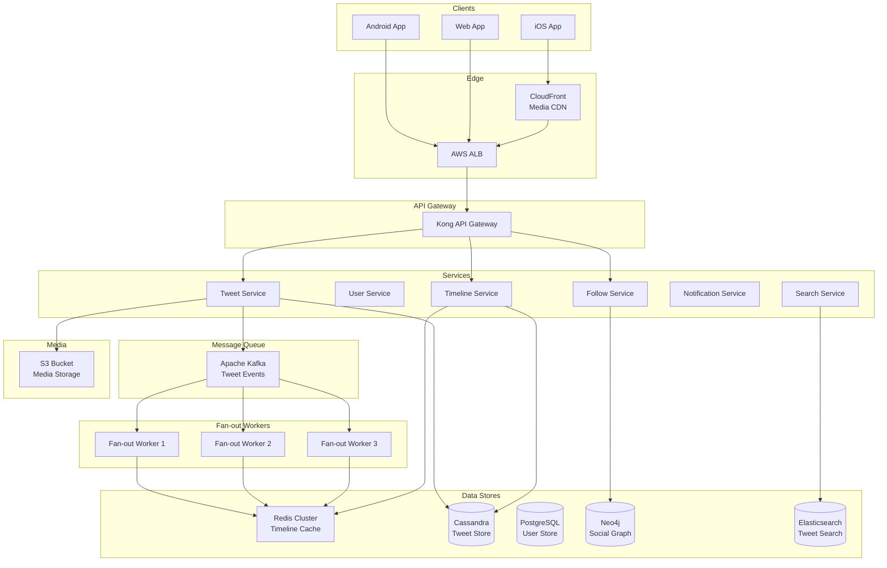

# 🐦 Twitter - System Design Interview

> **Interview Duration**: 45 minutes  
> **Difficulty**: Hard  
> **Type**: Social Media Platform

---

## 1️⃣ Requirements & Estimation (5 min)

### Functional Requirements
1. **Post tweets**: Users can post tweets (280 chars, images, videos)
2. **Follow/Unfollow**: Users can follow other users
3. **Timeline**: View home timeline (feed of tweets from followed users)

### Non-Functional Requirements
- **Consistency Model**: Eventual consistency (timeline can be slightly stale)
- **Latency**: < 200ms for timeline load
- **Availability**: 99.99% (always accessible)

### Back-of-Envelope Estimation

```
Assumptions:
- 500M DAU
- Average user follows 200 users
- Average user views timeline 10 times/day
- 10% users tweet daily, avg 2 tweets

Traffic:
- Timeline reads: 500M × 10 = 5B reads/day
- Read QPS: 5B / 86,400 ≈ 58K QPS
- Peak Read QPS: 58K × 3 = 174K QPS

- Tweets/day: 500M × 0.1 × 2 = 100M tweets/day
- Write QPS: 100M / 86,400 ≈ 1,150 QPS

Storage (per tweet):
- Tweet ID: 8 bytes
- User ID: 8 bytes
- Content: 280 bytes
- Metadata: 100 bytes
- Media URL: 200 bytes
- Total: ~600 bytes

- Daily: 100M × 600 = 60GB/day
- Yearly: 60GB × 365 = 22TB/year

Fan-out calculation:
- Celebrity tweet (10M followers): 10M writes to timelines
- Need to handle hot users differently
```

---

## 2️⃣ High-Level Architecture (10 min)



### Technology Choices

| Component | Technology | Justification |
|-----------|------------|---------------|
| Tweet Store | Cassandra | High write throughput, horizontal scaling |
| Timeline Cache | Redis Cluster | Sub-ms timeline reads |
| Social Graph | Neo4j | Efficient follower/following traversal |
| Search | Elasticsearch | Full-text search, real-time indexing |
| Message Queue | Kafka | High throughput event streaming |
| Media | S3 + CloudFront | Scalable blob storage with CDN |

---

## 3️⃣ API & Data Model (10 min)

### API Design

**Post Tweet**
```http
POST /api/v1/tweets
Authorization: Bearer {token}
Content-Type: application/json

{
    "content": "Hello Twitter!",
    "media_ids": ["media_123", "media_456"],
    "reply_to": null
}

Response 201:
{
    "tweet_id": "1234567890123456789",
    "content": "Hello Twitter!",
    "author": {
        "user_id": "user_123",
        "username": "johndoe",
        "display_name": "John Doe",
        "avatar_url": "https://cdn.twitter.com/avatars/..."
    },
    "media": [...],
    "created_at": "2026-01-28T10:00:00Z",
    "metrics": {
        "likes": 0,
        "retweets": 0,
        "replies": 0
    }
}
```

**Get Home Timeline**
```http
GET /api/v1/timeline?cursor={cursor}&limit=20
Authorization: Bearer {token}

Response 200:
{
    "tweets": [
        {
            "tweet_id": "1234567890123456789",
            "content": "...",
            "author": {...},
            "created_at": "2026-01-28T10:00:00Z"
        }
    ],
    "next_cursor": "eyJ0IjoxNzA2...",
    "has_more": true
}
```

### Data Model

**Tweets (Cassandra)**
```sql
CREATE TABLE tweets (
    tweet_id     BIGINT,          -- Snowflake ID (Partition Key)
    user_id      BIGINT,
    content      TEXT,
    media_urls   LIST<TEXT>,
    reply_to     BIGINT,
    created_at   TIMESTAMP,
    PRIMARY KEY (tweet_id)
);

-- User's tweets (for profile page)
CREATE TABLE user_tweets (
    user_id      BIGINT,          -- Partition Key
    tweet_id     BIGINT,          -- Clustering Key (DESC)
    content      TEXT,
    created_at   TIMESTAMP,
    PRIMARY KEY (user_id, tweet_id)
) WITH CLUSTERING ORDER BY (tweet_id DESC);
```

**Social Graph (Neo4j)**
```cypher
// Nodes
CREATE (:User {user_id: "user_123", username: "johndoe"})

// Relationships
CREATE (a:User)-[:FOLLOWS {since: datetime()}]->(b:User)

// Query: Get all followers
MATCH (user:User {user_id: $user_id})<-[:FOLLOWS]-(follower)
RETURN follower.user_id

// Query: Get all following
MATCH (user:User {user_id: $user_id})-[:FOLLOWS]->(following)
RETURN following.user_id
```

**Timeline Cache (Redis)**
```
Key: timeline:{user_id}
Value: Sorted Set (score = tweet timestamp, member = tweet_id)

ZADD timeline:user_123 1706436000000 "tweet_abc123"
ZREVRANGE timeline:user_123 0 19  -- Get latest 20 tweets
```

---

## 4️⃣ Component Deep Dive: Fan-out Service (15 min)

### Fan-out Strategies

| Strategy | Description | Pros | Cons |
|----------|-------------|------|------|
| **Fan-out on Write** | Push to all followers' timelines | Fast reads | Slow writes, wasteful for inactive users |
| **Fan-out on Read** | Pull from followed users at read time | Fast writes | Slow reads, N queries |
| **Hybrid** | Push for normal users, pull for celebrities | Balanced | Complex |

### Hybrid Fan-out Architecture

```
┌─────────────────────────────────────────────────────────────────┐
│                    HYBRID FAN-OUT STRATEGY                      │
├─────────────────────────────────────────────────────────────────┤
│                                                                  │
│  NORMAL USER TWEET (< 10K followers):                           │
│  ┌─────────┐    ┌─────────┐    ┌─────────────────┐             │
│  │  Tweet  │───▶│  Kafka  │───▶│  Fan-out Workers │             │
│  └─────────┘    └─────────┘    └────────┬────────┘             │
│                                          │                       │
│                            ┌─────────────▼─────────────┐        │
│                            │   Push to all follower    │        │
│                            │   timeline caches (Redis) │        │
│                            └───────────────────────────┘        │
│                                                                  │
│  CELEBRITY TWEET (> 10K followers):                             │
│  ┌─────────┐    ┌─────────────┐                                 │
│  │  Tweet  │───▶│ Tweet Store │  (No immediate fan-out)        │
│  └─────────┘    └─────────────┘                                 │
│                        │                                         │
│                        ▼                                         │
│  ┌────────────────────────────────────────────────────┐         │
│  │  At read time: Merge celebrity tweets with cached  │         │
│  │  timeline using timeline service                   │         │
│  └────────────────────────────────────────────────────┘         │
│                                                                  │
└─────────────────────────────────────────────────────────────────┘
```

### Pseudocode: Fan-out Service

```python
class FanoutService:
    CELEBRITY_THRESHOLD = 10_000
    BATCH_SIZE = 1000
    
    def __init__(self, redis_client, graph_db, tweet_store, kafka_producer):
        self.redis = redis_client
        self.graph = graph_db
        self.tweets = tweet_store
        self.kafka = kafka_producer
    
    def handle_new_tweet(self, tweet: Tweet):
        """Process a new tweet and fan out to followers"""
        follower_count = self.graph.get_follower_count(tweet.user_id)
        
        if follower_count > self.CELEBRITY_THRESHOLD:
            # Celebrity: Skip fan-out, handle at read time
            self._mark_as_celebrity_tweet(tweet)
            return
        
        # Normal user: Fan-out on write
        self._fanout_to_followers(tweet)
    
    def _fanout_to_followers(self, tweet: Tweet):
        """Push tweet to all follower timelines"""
        cursor = None
        
        while True:
            # Batch fetch followers from graph DB
            followers, cursor = self.graph.get_followers(
                tweet.user_id, 
                limit=self.BATCH_SIZE,
                cursor=cursor
            )
            
            if not followers:
                break
            
            # Pipeline Redis writes for efficiency
            pipeline = self.redis.pipeline()
            
            for follower_id in followers:
                timeline_key = f"timeline:{follower_id}"
                
                # Add tweet to sorted set (score = timestamp)
                pipeline.zadd(
                    timeline_key,
                    {tweet.tweet_id: tweet.created_at.timestamp()}
                )
                
                # Trim to keep only latest 800 tweets
                pipeline.zremrangebyrank(timeline_key, 0, -801)
            
            pipeline.execute()
            
            if not cursor:
                break
    
    def _mark_as_celebrity_tweet(self, tweet: Tweet):
        """Store celebrity tweet for pull-based fan-out"""
        # Add to celebrity tweets set (global or per-celebrity)
        self.redis.zadd(
            f"celebrity_tweets:{tweet.user_id}",
            {tweet.tweet_id: tweet.created_at.timestamp()}
        )


class TimelineService:
    def __init__(self, redis_client, tweet_store, graph_db, celebrity_cache):
        self.redis = redis_client
        self.tweets = tweet_store
        self.graph = graph_db
        self.celebrity_cache = celebrity_cache
    
    def get_home_timeline(self, user_id: str, limit: int = 20, 
                          cursor: str = None) -> Timeline:
        """Hybrid approach: cached timeline + celebrity tweets"""
        
        # Step 1: Get cached timeline tweet IDs
        timeline_key = f"timeline:{user_id}"
        
        if cursor:
            max_score = self._decode_cursor(cursor)
            tweet_ids = self.redis.zrevrangebyscore(
                timeline_key, max_score, '-inf', start=0, num=limit
            )
        else:
            tweet_ids = self.redis.zrevrange(timeline_key, 0, limit - 1)
        
        # Step 2: Get celebrity tweets from followed celebrities
        celebrity_tweet_ids = self._get_celebrity_tweets(user_id, limit)
        
        # Step 3: Merge and sort by timestamp
        all_tweet_ids = list(set(tweet_ids) | set(celebrity_tweet_ids))
        
        # Step 4: Fetch full tweet objects
        tweets = self.tweets.multi_get(all_tweet_ids)
        
        # Sort by created_at descending
        tweets.sort(key=lambda t: t.created_at, reverse=True)
        tweets = tweets[:limit]
        
        # Generate cursor for pagination
        next_cursor = None
        if len(tweets) == limit:
            next_cursor = self._encode_cursor(tweets[-1].created_at)
        
        return Timeline(tweets=tweets, next_cursor=next_cursor)
    
    def _get_celebrity_tweets(self, user_id: str, limit: int) -> List[str]:
        """Fetch recent tweets from celebrities user follows"""
        # Get celebrities user follows (cached)
        celebrities = self.celebrity_cache.get_followed_celebrities(user_id)
        
        if not celebrities:
            return []
        
        # Fetch latest tweets from each celebrity
        tweet_ids = []
        for celeb_id in celebrities[:50]:  # Limit celebrity check
            celeb_tweets = self.redis.zrevrange(
                f"celebrity_tweets:{celeb_id}", 0, 10
            )
            tweet_ids.extend(celeb_tweets)
        
        return tweet_ids
```

### Snowflake ID Generation

```python
class SnowflakeIDGenerator:
    """
    64-bit ID: timestamp (41 bits) | datacenter (5) | machine (5) | sequence (12)
    """
    EPOCH = 1288834974657  # Twitter epoch (Nov 4, 2010)
    
    def __init__(self, datacenter_id: int, machine_id: int):
        self.datacenter_id = datacenter_id & 0x1F  # 5 bits
        self.machine_id = machine_id & 0x1F        # 5 bits
        self.sequence = 0
        self.last_timestamp = -1
    
    def next_id(self) -> int:
        timestamp = int(time.time() * 1000) - self.EPOCH
        
        if timestamp == self.last_timestamp:
            self.sequence = (self.sequence + 1) & 0xFFF  # 12 bits
            if self.sequence == 0:
                # Wait for next millisecond
                while timestamp <= self.last_timestamp:
                    timestamp = int(time.time() * 1000) - self.EPOCH
        else:
            self.sequence = 0
        
        self.last_timestamp = timestamp
        
        return (
            (timestamp << 22) |
            (self.datacenter_id << 17) |
            (self.machine_id << 12) |
            self.sequence
        )
```

---

## 5️⃣ Bottlenecks & Trade-offs (5 min)

### Single Points of Failure & Mitigations

| SPOF | Impact | Mitigation |
|------|--------|------------|
| Redis Timeline Cache | Users see empty timeline | Redis Cluster, fallback to DB |
| Kafka | Tweet fanout stops | Kafka multi-broker, replication |
| Neo4j Graph | Can't query followers | Read replicas, cache hot users |
| Celebrity hotspots | Slow fanout for celebrity tweets | Pull-based for celebrities |

### Fan-out Trade-offs

```
┌─────────────────────────────────────────────────────────────┐
│                   FAN-OUT TRADE-OFF                         │
├─────────────────────────────────────────────────────────────┤
│                                                             │
│  FAN-OUT ON WRITE:                                          │
│  ✅ Fast reads (O(1) timeline fetch)                        │
│  ✅ Simple read path                                        │
│  ❌ Slow writes for popular users                           │
│  ❌ Wastes storage for inactive users                       │
│  ❌ Celebrity tweet = millions of writes                    │
│                                                             │
│  FAN-OUT ON READ:                                           │
│  ✅ Fast writes (just store tweet)                          │
│  ✅ No wasted storage                                       │
│  ❌ Slow reads (N queries for N following)                  │
│  ❌ Complex read path with merging                          │
│                                                             │
│  OUR CHOICE: HYBRID                                         │
│  • Fan-out on write for users < 10K followers               │
│  • Fan-out on read for celebrities > 10K followers          │
│  • Best of both worlds                                      │
└─────────────────────────────────────────────────────────────┘
```

### CAP Theorem Trade-off

```
┌─────────────────────────────────────────────────────────────┐
│                    TWITTER CAP CHOICE                       │
├─────────────────────────────────────────────────────────────┤
│  WE CHOOSE: AP (Availability + Partition Tolerance)         │
│                                                             │
│  Reasoning:                                                 │
│  • Timeline can be slightly stale (eventual consistency OK) │
│  • Users expect Twitter to always be accessible             │
│  • Missing a tweet for a few seconds is acceptable          │
│  • Inconsistent like counts are tolerable                   │
│                                                             │
│  Trade-off Accepted:                                        │
│  • New tweets may not appear instantly in all timelines     │
│  • Like/retweet counts may be temporarily inconsistent      │
│  • User may see slightly different timelines on refresh     │
│                                                             │
│  Consistency where it matters:                              │
│  • Tweet storage (Cassandra QUORUM writes)                  │
│  • User authentication (PostgreSQL)                         │
└─────────────────────────────────────────────────────────────┘
```

### Scaling Strategies

| Challenge | Solution |
|-----------|----------|
| Celebrity tweets | Hybrid fan-out, pull for hot users |
| Viral tweets | Rate limit fan-out, async processing |
| Global users | Multi-region deployment, GeoDNS |
| Search spike | Elasticsearch cluster, index sharding |

### Interview Pro Tips

1. **Start with hybrid fan-out**: Shows understanding of trade-offs
2. **Mention Snowflake IDs**: Time-sorted, distributed, no coordination
3. **Discuss cache warming**: Pre-compute timelines for active users
4. **Consider ranking**: Chronological vs algorithmic timeline

---

## 📚 Navigation

← [TinyURL](./07-tinyurl.md) | [Home](./README.md) | [Discord](./09-discord.md) →
