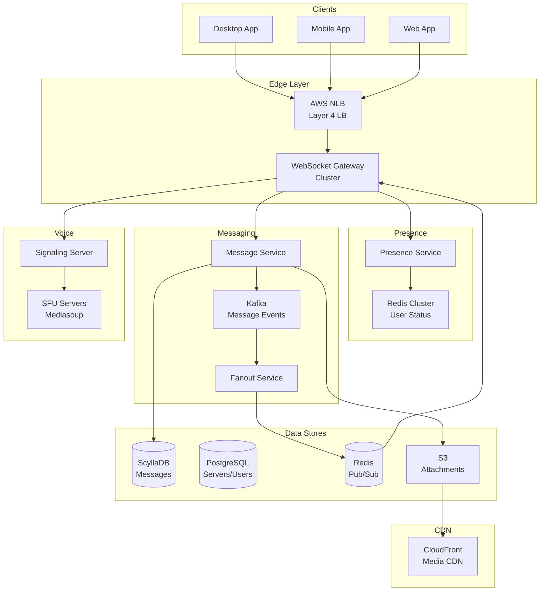

# 💬 Discord - System Design Interview

> **Interview Duration**: 45 minutes  
> **Difficulty**: Hard  
> **Type**: Real-time Communication Platform

---

## 1️⃣ Requirements & Estimation (5 min)

### Functional Requirements
1. **Real-time messaging**: Send/receive messages in channels instantly
2. **Voice/Video channels**: Join voice channels for real-time communication
3. **Servers & Channels**: Create servers with multiple text/voice channels

### Non-Functional Requirements
- **Consistency Model**: Eventual consistency for messages (order matters more than instant sync)
- **Latency**: < 100ms message delivery, < 200ms voice latency
- **Availability**: 99.99% (always connected)

### Back-of-Envelope Estimation

```
Assumptions:
- 150M DAU
- Average user in 5 servers, active in 2
- Average 50 messages sent per active user per day
- 10% users on voice at peak

Traffic:
- Messages/day: 150M × 50 = 7.5B messages/day
- Write QPS: 7.5B / 86,400 ≈ 87K QPS
- Peak QPS: 87K × 3 = 261K QPS

Concurrent connections:
- Peak: 150M × 0.3 = 45M concurrent WebSocket connections
- Voice users at peak: 150M × 0.1 = 15M concurrent voice

Storage (per message):
- Message ID: 8 bytes
- Content: 500 bytes (avg)
- Metadata: 100 bytes
- Total: ~600 bytes

- Daily: 7.5B × 600 = 4.5TB/day
- Yearly: 4.5TB × 365 = 1.6PB/year

WebSocket connections:
- 45M connections / 65K ports per server
- Need ~700 servers minimum (with 1M connections each)
```

---

## 2️⃣ High-Level Architecture (10 min)



### Technology Choices

| Component | Technology | Justification |
|-----------|------------|---------------|
| Message Store | ScyllaDB | Cassandra-compatible, lower latency |
| Real-time Pub/Sub | Redis Cluster | Low-latency message fanout |
| WebSocket Gateway | Elixir/Erlang | 2M+ connections per node |
| Voice Server | Mediasoup (SFU) | WebRTC SFU, horizontal scaling |
| Event Bus | Kafka | Ordered message processing |

---

## 3️⃣ API & Data Model (10 min)

### WebSocket API Design

**Connect & Authenticate**
```json
// Client → Server (IDENTIFY)
{
    "op": 2,
    "d": {
        "token": "user_auth_token",
        "properties": {
            "os": "windows",
            "browser": "discord_client",
            "device": "desktop"
        }
    }
}

// Server → Client (READY)
{
    "op": 0,
    "t": "READY",
    "d": {
        "user": {"id": "123", "username": "john"},
        "guilds": [...],
        "session_id": "abc123"
    }
}
```

**Send Message**
```json
// Client → Server (via HTTP)
POST /api/v9/channels/{channel_id}/messages
{
    "content": "Hello Discord!",
    "nonce": "123456789"
}

// Server → All channel members (via WebSocket)
{
    "op": 0,
    "t": "MESSAGE_CREATE",
    "d": {
        "id": "987654321",
        "channel_id": "456",
        "author": {"id": "123", "username": "john"},
        "content": "Hello Discord!",
        "timestamp": "2026-01-28T10:00:00Z",
        "nonce": "123456789"
    }
}
```

**Voice State Update**
```json
// Client → Server (JOIN VOICE)
{
    "op": 4,
    "d": {
        "guild_id": "guild_123",
        "channel_id": "voice_456",
        "self_mute": false,
        "self_deaf": false
    }
}

// Server → Client (VOICE_SERVER_UPDATE)
{
    "op": 0,
    "t": "VOICE_SERVER_UPDATE",
    "d": {
        "token": "voice_token",
        "guild_id": "guild_123",
        "endpoint": "voice-server-1.discord.gg:443"
    }
}
```

### Data Model

**Messages (ScyllaDB)**
```sql
CREATE TABLE messages (
    channel_id   BIGINT,          -- Partition Key
    bucket       INT,             -- Partition Key (time bucket)
    message_id   BIGINT,          -- Clustering Key (Snowflake ID)
    author_id    BIGINT,
    content      TEXT,
    attachments  LIST<TEXT>,
    edited_at    TIMESTAMP,
    PRIMARY KEY ((channel_id, bucket), message_id)
) WITH CLUSTERING ORDER BY (message_id DESC);

-- Bucket = message_id >> 22 >> 17 (roughly 5-day buckets)
```

**Guilds/Servers (PostgreSQL)**
```sql
CREATE TABLE guilds (
    guild_id        BIGINT PRIMARY KEY,
    name            VARCHAR(100) NOT NULL,
    owner_id        BIGINT NOT NULL REFERENCES users(user_id),
    icon_hash       VARCHAR(100),
    member_count    INT DEFAULT 0,
    created_at      TIMESTAMP DEFAULT NOW()
);

CREATE TABLE channels (
    channel_id      BIGINT PRIMARY KEY,
    guild_id        BIGINT REFERENCES guilds(guild_id),
    name            VARCHAR(100) NOT NULL,
    type            SMALLINT NOT NULL,  -- 0=text, 2=voice
    position        INT,
    INDEX idx_guild_channels (guild_id, position)
);

CREATE TABLE guild_members (
    guild_id        BIGINT,            -- Partition Key
    user_id         BIGINT,
    nickname        VARCHAR(100),
    roles           BIGINT[],
    joined_at       TIMESTAMP,
    PRIMARY KEY (guild_id, user_id)
);
```

**Presence (Redis)**
```
# User presence
HSET presence:user_123 status "online" client "desktop" guild "456"
EXPIRE presence:user_123 120

# Channel subscribers (for fanout)
SADD channel_subscribers:456 "gateway_server_1" "gateway_server_2"

# Gateway session mapping
HSET gateway_sessions:gateway_1 user_123 "session_abc"
```

---

## 4️⃣ Component Deep Dive: WebSocket Gateway (15 min)

### Gateway Architecture

```
┌─────────────────────────────────────────────────────────────────┐
│                    WEBSOCKET GATEWAY CLUSTER                    │
├─────────────────────────────────────────────────────────────────┤
│                                                                  │
│  ┌────────────────┐  ┌────────────────┐  ┌────────────────┐     │
│  │  Gateway #1    │  │  Gateway #2    │  │  Gateway #3    │     │
│  │  1M conns      │  │  1M conns      │  │  1M conns      │     │
│  │  (Elixir)      │  │  (Elixir)      │  │  (Elixir)      │     │
│  └───────┬────────┘  └───────┬────────┘  └───────┬────────┘     │
│          │                   │                   │               │
│          └───────────────────┼───────────────────┘               │
│                              │                                   │
│                    ┌─────────▼─────────┐                        │
│                    │   Redis Pub/Sub   │                        │
│                    │   (Fanout Layer)  │                        │
│                    └───────────────────┘                        │
│                                                                  │
└─────────────────────────────────────────────────────────────────┘
```

### Pseudocode: WebSocket Gateway

```python
class WebSocketGateway:
    def __init__(self, redis_client, message_service, presence_service):
        self.redis = redis_client
        self.messages = message_service
        self.presence = presence_service
        self.sessions = {}  # session_id -> WebSocketSession
        self.user_sessions = defaultdict(set)  # user_id -> {session_ids}
        self.gateway_id = os.environ['GATEWAY_ID']
    
    async def handle_connection(self, websocket):
        """Handle new WebSocket connection"""
        session = WebSocketSession(websocket)
        
        try:
            # Wait for IDENTIFY payload
            identify = await asyncio.wait_for(
                websocket.recv(), timeout=30
            )
            
            user = await self._authenticate(identify)
            if not user:
                await websocket.close(4001, "Authentication failed")
                return
            
            session.user = user
            session.session_id = generate_session_id()
            
            # Register session
            self.sessions[session.session_id] = session
            self.user_sessions[user.id].add(session.session_id)
            
            # Update presence
            await self.presence.set_online(user.id, self.gateway_id)
            
            # Subscribe to user's channels
            await self._subscribe_to_channels(session)
            
            # Send READY payload
            await self._send_ready(session)
            
            # Handle messages
            await self._message_loop(session)
            
        except Exception as e:
            logger.error(f"Connection error: {e}")
        finally:
            await self._cleanup_session(session)
    
    async def _subscribe_to_channels(self, session: WebSocketSession):
        """Subscribe gateway to Redis channels for user's guilds"""
        guilds = await self.messages.get_user_guilds(session.user.id)
        
        for guild in guilds:
            channels = await self.messages.get_guild_channels(guild.id)
            for channel in channels:
                # Track that this gateway has users in this channel
                await self.redis.sadd(
                    f"channel_subscribers:{channel.id}",
                    self.gateway_id
                )
                session.subscribed_channels.add(channel.id)
    
    async def _message_loop(self, session: WebSocketSession):
        """Main message processing loop"""
        while True:
            try:
                message = await session.websocket.recv()
                payload = json.loads(message)
                
                op = payload.get('op')
                data = payload.get('d')
                
                if op == 1:  # HEARTBEAT
                    await self._handle_heartbeat(session)
                elif op == 4:  # VOICE_STATE_UPDATE
                    await self._handle_voice_update(session, data)
                elif op == 8:  # REQUEST_GUILD_MEMBERS
                    await self._handle_member_request(session, data)
                    
            except websockets.ConnectionClosed:
                break
    
    async def broadcast_to_channel(self, channel_id: str, event: dict):
        """Broadcast event to all users in a channel"""
        # Publish to Redis - all subscribed gateways will receive
        await self.redis.publish(
            f"channel:{channel_id}",
            json.dumps(event)
        )
    
    async def handle_redis_message(self, channel: str, message: str):
        """Handle message from Redis pub/sub"""
        channel_id = channel.split(':')[1]
        event = json.loads(message)
        
        # Find all local sessions subscribed to this channel
        for session_id, session in self.sessions.items():
            if channel_id in session.subscribed_channels:
                await session.websocket.send(message)


class MessageService:
    def __init__(self, scylla_client, kafka_producer, redis_client):
        self.db = scylla_client
        self.kafka = kafka_producer
        self.redis = redis_client
    
    async def create_message(self, channel_id: str, author_id: str,
                            content: str, attachments: list = None) -> Message:
        """Create and broadcast a new message"""
        
        # Generate Snowflake ID
        message_id = snowflake.next_id()
        bucket = self._calculate_bucket(message_id)
        
        message = Message(
            id=message_id,
            channel_id=channel_id,
            bucket=bucket,
            author_id=author_id,
            content=content,
            attachments=attachments or [],
            timestamp=datetime.utcnow()
        )
        
        # Store in ScyllaDB
        await self.db.execute("""
            INSERT INTO messages (channel_id, bucket, message_id, 
                                  author_id, content, attachments)
            VALUES (?, ?, ?, ?, ?, ?)
        """, [channel_id, bucket, message_id, author_id, 
              content, attachments])
        
        # Publish event to Kafka (for fanout, search indexing, etc.)
        await self.kafka.send('message_events', {
            'type': 'MESSAGE_CREATE',
            'data': message.to_dict()
        })
        
        # Real-time fanout via Redis
        await self._fanout_message(message)
        
        return message
    
    async def _fanout_message(self, message: Message):
        """Fan out message to all connected clients"""
        event = {
            'op': 0,
            't': 'MESSAGE_CREATE',
            'd': message.to_dict()
        }
        
        # Get all gateways with users in this channel
        gateway_ids = await self.redis.smembers(
            f"channel_subscribers:{message.channel_id}"
        )
        
        # Publish to Redis - gateways will forward to clients
        await self.redis.publish(
            f"channel:{message.channel_id}",
            json.dumps(event)
        )
    
    def _calculate_bucket(self, message_id: int) -> int:
        """Calculate time bucket for partitioning"""
        # Extract timestamp from Snowflake ID
        timestamp = (message_id >> 22) + DISCORD_EPOCH
        # Create ~5 day buckets
        return timestamp // (5 * 24 * 60 * 60 * 1000)
```

### Connection Handling at Scale

```python
class ConnectionManager:
    """Manage millions of WebSocket connections"""
    
    def __init__(self):
        self.HEARTBEAT_INTERVAL = 45  # seconds
        self.MAX_CONNECTIONS_PER_GATEWAY = 1_000_000
    
    async def heartbeat_monitor(self):
        """Monitor connection health"""
        while True:
            now = time.time()
            stale_sessions = []
            
            for session_id, session in self.sessions.items():
                if now - session.last_heartbeat > self.HEARTBEAT_INTERVAL * 2:
                    stale_sessions.append(session_id)
            
            for session_id in stale_sessions:
                await self._cleanup_session(self.sessions[session_id])
            
            await asyncio.sleep(10)
    
    async def handle_reconnect(self, websocket, session_id: str, 
                               sequence: int):
        """Handle client reconnection with session resume"""
        old_session = await self._get_session_from_redis(session_id)
        
        if not old_session or old_session.expired:
            # Full reconnect required
            return await self.handle_connection(websocket)
        
        # Resume session - replay missed events
        missed_events = await self._get_missed_events(
            old_session.user.id,
            sequence
        )
        
        session = WebSocketSession(websocket)
        session.user = old_session.user
        session.session_id = session_id
        
        # Send RESUMED event
        await websocket.send(json.dumps({
            'op': 0,
            't': 'RESUMED',
            'd': {}
        }))
        
        # Replay missed events
        for event in missed_events:
            await websocket.send(json.dumps(event))
```

---

## 5️⃣ Bottlenecks & Trade-offs (5 min)

### Single Points of Failure & Mitigations

| SPOF | Impact | Mitigation |
|------|--------|------------|
| Gateway crash | Users disconnected | Session resume, client reconnect |
| Redis Pub/Sub | No real-time messages | Redis Cluster, fallback to polling |
| ScyllaDB | Can't load message history | Multi-DC replication |
| Large server (1M+ members) | Slow member list, presence | Lazy loading, shard large servers |

### Message Ordering Challenge

```
┌─────────────────────────────────────────────────────────────┐
│                 MESSAGE ORDERING STRATEGY                   │
├─────────────────────────────────────────────────────────────┤
│                                                             │
│  CHALLENGE: Multiple gateways, async fanout                 │
│  - User A sends msg 1, User B sends msg 2                   │
│  - Different gateways may deliver in different order        │
│                                                             │
│  SOLUTION: Snowflake IDs + Client-side Ordering             │
│  1. Each message has globally unique, time-sorted ID        │
│  2. Client maintains local message buffer                   │
│  3. Client sorts by message_id before display               │
│  4. Out-of-order messages are re-sorted client-side         │
│                                                             │
│  ┌─────────┐     ┌─────────┐     ┌─────────┐               │
│  │ Msg 103 │     │ Msg 101 │     │ Msg 102 │   (Received)  │
│  └────┬────┘     └────┬────┘     └────┬────┘               │
│       │               │               │                     │
│       └───────────────┼───────────────┘                     │
│                       ▼                                     │
│              ┌─────────────────┐                            │
│              │ Sort by msg_id  │                            │
│              └────────┬────────┘                            │
│                       ▼                                     │
│       ┌─────────┬─────────┬─────────┐                      │
│       │ Msg 101 │ Msg 102 │ Msg 103 │   (Displayed)        │
│       └─────────┴─────────┴─────────┘                      │
└─────────────────────────────────────────────────────────────┘
```

### CAP Theorem Trade-off

```
┌─────────────────────────────────────────────────────────────┐
│                    DISCORD CAP CHOICE                       │
├─────────────────────────────────────────────────────────────┤
│  WE CHOOSE: AP (Availability + Partition Tolerance)         │
│                                                             │
│  Reasoning:                                                 │
│  • Users expect Discord to always be connected              │
│  • Slightly delayed messages are acceptable                 │
│  • Message history can be eventually consistent             │
│  • Presence can be stale for a few seconds                  │
│                                                             │
│  Trade-off Accepted:                                        │
│  • Messages may arrive slightly out of order                │
│  • Presence status may be delayed during partitions         │
│  • Read-your-writes consistency for sender only             │
│                                                             │
│  Consistency where it matters:                              │
│  • Message persistence (write-ahead to Kafka)               │
│  • Permission checks (PostgreSQL for roles)                 │
└─────────────────────────────────────────────────────────────┘
```

### Scaling Strategies

| Challenge | Solution |
|-----------|----------|
| Millions of connections | Elixir/Erlang gateways (2M+ each) |
| Large servers (1M+ members) | Shard member list, lazy presence |
| Voice at scale | Regional SFU pools, client routing |
| Message history | Time-bucketed partitions in ScyllaDB |

### Interview Pro Tips

1. **Start with WebSocket architecture**: Show understanding of persistent connections
2. **Discuss gateway clustering**: How to route messages across gateways
3. **Mention presence challenges**: Heartbeats, status propagation
4. **Voice is separate**: SFU architecture, WebRTC signaling

---

## 📚 Navigation

← [Twitter](./08-twitter.md) | [Home](./README.md) | [YouTube](./10-youtube.md) →
