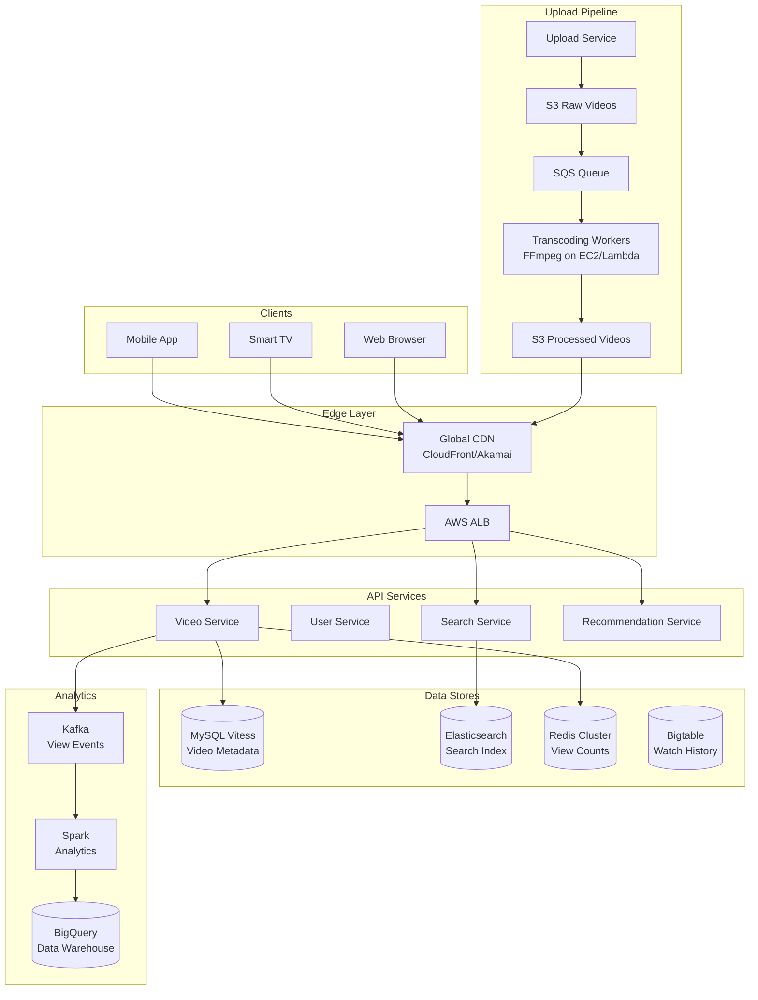

# 📺 YouTube - System Design Interview

> **Interview Duration**: 45 minutes  
> **Difficulty**: Hard  
> **Type**: Video Streaming Platform

---

## 1️⃣ Requirements & Estimation (5 min)

### Functional Requirements
1. **Upload videos**: Users can upload videos of various formats
2. **Stream videos**: Users can watch videos with adaptive bitrate
3. **Search videos**: Find videos by title, description, tags

### Non-Functional Requirements
- **Consistency Model**: Eventual consistency (video processing can be async)
- **Latency**: < 200ms video start time, < 2s for search
- **Availability**: 99.99% for video playback

### Back-of-Envelope Estimation

```
Assumptions:
- 2B DAU
- Average user watches 5 videos/day (10 min each)
- 500K videos uploaded daily
- Average video: 10 min, 500MB original

Traffic:
- Video watches: 2B × 5 = 10B views/day
- Read QPS: 10B / 86,400 ≈ 116K QPS
- Upload QPS: 500K / 86,400 ≈ 6 QPS

Storage:
- Daily uploads: 500K × 500MB = 250TB raw/day
- After transcoding (5 resolutions): 250TB × 3 = 750TB/day
- Yearly: 750TB × 365 = 274PB/year

Bandwidth:
- Watch time: 2B × 5 × 10 min = 100B minutes/day
- Avg bitrate: 5 Mbps
- Daily egress: 100B × 60s × 5Mbps / 8 = 3.75 EB/day
- Peak bandwidth: ~500 Tbps
```

---

## 2️⃣ High-Level Architecture (10 min)



### Technology Choices

| Component | Technology | Justification |
|-----------|------------|---------------|
| Video Storage | S3 + CloudFront | Infinite scale, global CDN |
| Metadata | MySQL Vitess | Sharded MySQL, ACID for metadata |
| Search | Elasticsearch | Full-text search, real-time indexing |
| Transcoding | FFmpeg on Lambda/EC2 | Parallel processing, cost-effective |
| View Counts | Redis | Real-time counters, atomic increments |
| Analytics | Kafka + BigQuery | Stream processing, OLAP queries |

---

## 3️⃣ API & Data Model (10 min)

### API Design

**Upload Video (Multipart)**
```http
POST /api/v1/videos/upload/init
Authorization: Bearer {token}

{
    "title": "My Video",
    "description": "Video description",
    "tags": ["tech", "tutorial"],
    "visibility": "public"
}

Response 200:
{
    "video_id": "dQw4w9WgXcQ",
    "upload_url": "https://upload.youtube.com/v1/...",
    "upload_token": "xyz123"
}

// Client uploads chunks to upload_url
PUT {upload_url}
Content-Range: bytes 0-5242879/104857600
Content-Type: video/mp4

[binary chunk data]
```

**Stream Video (Adaptive Bitrate)**
```http
GET /api/v1/videos/{video_id}/manifest.mpd
Authorization: Bearer {token}

Response 200 (DASH Manifest):
<?xml version="1.0"?>
<MPD xmlns="urn:mpeg:dash:schema:mpd:2011">
    <Period>
        <AdaptationSet>
            <Representation id="1080p" bandwidth="8000000">
                <SegmentTemplate media="$RepresentationID$/$Number$.m4s"/>
            </Representation>
            <Representation id="720p" bandwidth="5000000">
                <SegmentTemplate media="$RepresentationID$/$Number$.m4s"/>
            </Representation>
            <Representation id="480p" bandwidth="2500000">
                <SegmentTemplate media="$RepresentationID$/$Number$.m4s"/>
            </Representation>
        </AdaptationSet>
    </Period>
</MPD>
```

### Data Model

**Videos (MySQL Vitess - Sharded by video_id)**
```sql
CREATE TABLE videos (
    video_id        VARCHAR(11) PRIMARY KEY,  -- Base64 encoded
    channel_id      BIGINT NOT NULL,
    title           VARCHAR(100) NOT NULL,
    description     TEXT,
    duration_sec    INT,
    status          ENUM('processing', 'ready', 'failed', 'deleted'),
    visibility      ENUM('public', 'unlisted', 'private'),
    upload_date     TIMESTAMP,
    view_count      BIGINT DEFAULT 0,         -- Denormalized from Redis
    like_count      BIGINT DEFAULT 0,
    thumbnail_url   VARCHAR(255),
    INDEX idx_channel (channel_id, upload_date DESC),
    INDEX idx_status (status)
);

CREATE TABLE video_files (
    video_id        VARCHAR(11),
    resolution      VARCHAR(10),              -- "1080p", "720p", etc.
    codec           VARCHAR(20),              -- "h264", "vp9", "av1"
    bitrate_kbps    INT,
    file_size_bytes BIGINT,
    s3_path         VARCHAR(255),
    PRIMARY KEY (video_id, resolution, codec)
);
```

**Watch History (Bigtable)**
```
Row Key: user_id#reverse_timestamp
Column Family: watch
  - video_id: "dQw4w9WgXcQ"
  - watch_time_sec: 120
  - completed: false
  - timestamp: 1706436000

Example:
user_123#9999999999999-1706436000 -> {video_id: "xyz", watch_time: 120}
```

**View Counts (Redis)**
```
# Real-time view count
INCR views:video:dQw4w9WgXcQ

# Hourly bucketed for analytics
HINCRBY views:hourly:2026012810 dQw4w9WgXcQ 1

# Periodic sync to MySQL (every 5 min)
```

---

## 4️⃣ Component Deep Dive: Video Transcoding Pipeline (15 min)

### Transcoding Architecture

```
┌─────────────────────────────────────────────────────────────────┐
│                    VIDEO PROCESSING PIPELINE                    │
├─────────────────────────────────────────────────────────────────┤
│                                                                  │
│  ┌─────────┐    ┌─────────┐    ┌──────────────────────┐        │
│  │ Upload  │───▶│ S3 Raw  │───▶│  S3 Event → SQS      │        │
│  │ Service │    │ Bucket  │    │                      │        │
│  └─────────┘    └─────────┘    └──────────┬───────────┘        │
│                                            │                     │
│                              ┌─────────────▼─────────────┐      │
│                              │    Transcoding Workers    │      │
│                              │    (Auto-scaling EC2)     │      │
│                              └─────────────┬─────────────┘      │
│                                            │                     │
│          ┌─────────────────────────────────┼────────────────┐   │
│          ▼                 ▼               ▼                ▼   │
│  ┌───────────────┐ ┌───────────────┐ ┌──────────┐ ┌──────────┐ │
│  │ 1080p h264    │ │ 720p h264     │ │ 480p     │ │ 360p     │ │
│  │ 8 Mbps        │ │ 5 Mbps        │ │ 2.5 Mbps │ │ 1 Mbps   │ │
│  └───────┬───────┘ └───────┬───────┘ └────┬─────┘ └────┬─────┘ │
│          │                 │              │            │        │
│          └─────────────────┴──────────────┴────────────┘        │
│                              │                                   │
│                    ┌─────────▼─────────┐                        │
│                    │  S3 Processed     │                        │
│                    │  + CDN Origin     │                        │
│                    └───────────────────┘                        │
│                                                                  │
└─────────────────────────────────────────────────────────────────┘
```

### Pseudocode: Transcoding Service

```python
class VideoTranscoder:
    RESOLUTIONS = [
        {'name': '1080p', 'width': 1920, 'height': 1080, 'bitrate': 8000},
        {'name': '720p', 'width': 1280, 'height': 720, 'bitrate': 5000},
        {'name': '480p', 'width': 854, 'height': 480, 'bitrate': 2500},
        {'name': '360p', 'width': 640, 'height': 360, 'bitrate': 1000},
    ]
    SEGMENT_DURATION = 4  # seconds
    
    def __init__(self, s3_client, sqs_client, db):
        self.s3 = s3_client
        self.sqs = sqs_client
        self.db = db
    
    async def process_video(self, video_id: str, s3_raw_path: str):
        """Main transcoding pipeline"""
        try:
            # Update status to processing
            await self.db.update_video_status(video_id, 'processing')
            
            # Download raw video
            local_path = await self._download_from_s3(s3_raw_path)
            
            # Extract video metadata
            metadata = await self._probe_video(local_path)
            
            # Generate thumbnail
            thumbnail_url = await self._generate_thumbnail(
                video_id, local_path, metadata.duration / 2
            )
            
            # Transcode to multiple resolutions (parallel)
            tasks = []
            for res in self.RESOLUTIONS:
                if res['height'] <= metadata.height:  # Don't upscale
                    tasks.append(self._transcode_resolution(
                        video_id, local_path, res
                    ))
            
            results = await asyncio.gather(*tasks)
            
            # Update database with file info
            await self._update_video_files(video_id, results)
            
            # Generate DASH/HLS manifests
            await self._generate_manifests(video_id, results)
            
            # Update status to ready
            await self.db.update_video_status(video_id, 'ready')
            await self.db.update_thumbnail(video_id, thumbnail_url)
            
            # Trigger CDN warm-up for popular content
            await self._warm_cdn_cache(video_id)
            
        except Exception as e:
            await self.db.update_video_status(video_id, 'failed')
            raise
        finally:
            await self._cleanup_local_files(local_path)
    
    async def _transcode_resolution(self, video_id: str, 
                                    input_path: str, res: dict) -> dict:
        """Transcode video to specific resolution with segmentation"""
        output_dir = f"/tmp/{video_id}/{res['name']}"
        os.makedirs(output_dir, exist_ok=True)
        
        # FFmpeg command for DASH-compatible output
        cmd = [
            'ffmpeg', '-i', input_path,
            '-vf', f"scale={res['width']}:{res['height']}",
            '-c:v', 'libx264', '-preset', 'medium',
            '-b:v', f"{res['bitrate']}k",
            '-c:a', 'aac', '-b:a', '128k',
            '-f', 'dash',
            '-seg_duration', str(self.SEGMENT_DURATION),
            '-init_seg_name', 'init.m4s',
            '-media_seg_name', '$Number$.m4s',
            f"{output_dir}/manifest.mpd"
        ]
        
        process = await asyncio.create_subprocess_exec(
            *cmd,
            stdout=asyncio.subprocess.PIPE,
            stderr=asyncio.subprocess.PIPE
        )
        
        await process.wait()
        
        if process.returncode != 0:
            raise TranscodingError(f"FFmpeg failed for {res['name']}")
        
        # Upload segments to S3
        s3_base = f"processed/{video_id}/{res['name']}"
        for filename in os.listdir(output_dir):
            await self.s3.upload_file(
                f"{output_dir}/{filename}",
                f"{s3_base}/{filename}"
            )
        
        return {
            'resolution': res['name'],
            'bitrate': res['bitrate'],
            's3_path': s3_base,
            'segment_count': len([f for f in os.listdir(output_dir) 
                                 if f.endswith('.m4s')])
        }
    
    async def _generate_manifests(self, video_id: str, 
                                  transcoded: List[dict]):
        """Generate DASH MPD and HLS M3U8 manifests"""
        
        # DASH MPD
        mpd_content = self._build_mpd(video_id, transcoded)
        await self.s3.put_object(
            f"processed/{video_id}/manifest.mpd",
            mpd_content,
            content_type='application/dash+xml'
        )
        
        # HLS M3U8 (for Safari/iOS)
        m3u8_content = self._build_m3u8(video_id, transcoded)
        await self.s3.put_object(
            f"processed/{video_id}/master.m3u8",
            m3u8_content,
            content_type='application/x-mpegURL'
        )


class VideoStreamService:
    """Handles video playback requests"""
    
    def __init__(self, db, redis, cdn_base_url):
        self.db = db
        self.redis = redis
        self.cdn = cdn_base_url
    
    async def get_video_manifest(self, video_id: str, 
                                 user_id: str = None) -> VideoManifest:
        """Get video manifest URL for playback"""
        
        # Check video exists and is ready
        video = await self.db.get_video(video_id)
        if not video or video.status != 'ready':
            raise VideoNotFoundError()
        
        # Check access permissions
        if video.visibility == 'private':
            if not user_id or video.channel_id != await self._get_channel_id(user_id):
                raise VideoAccessDeniedError()
        
        # Increment view count (async, deduplicated)
        asyncio.create_task(self._record_view(video_id, user_id))
        
        # Return CDN URL for manifest
        manifest_url = f"{self.cdn}/processed/{video_id}/manifest.mpd"
        
        return VideoManifest(
            video_id=video_id,
            title=video.title,
            duration=video.duration_sec,
            manifest_url=manifest_url,
            thumbnail_url=video.thumbnail_url
        )
    
    async def _record_view(self, video_id: str, user_id: str):
        """Record view with deduplication"""
        # Dedupe key: user can only count once per 30 minutes
        dedupe_key = f"view_dedupe:{video_id}:{user_id or 'anon'}"
        
        if await self.redis.set(dedupe_key, 1, nx=True, ex=1800):
            # New view - increment counter
            await self.redis.incr(f"views:video:{video_id}")
            
            # Send to Kafka for analytics
            await self._publish_view_event(video_id, user_id)
```

### Adaptive Bitrate Streaming

```python
class ABRController:
    """Client-side adaptive bitrate selection"""
    
    def __init__(self):
        self.bandwidth_history = []
        self.buffer_level = 0
    
    def select_quality(self, available_qualities: List[dict]) -> dict:
        """Select best quality based on network conditions"""
        
        # Estimate current bandwidth
        estimated_bandwidth = self._estimate_bandwidth()
        
        # Buffer-based adaptation
        if self.buffer_level < 5:  # Less than 5 seconds buffered
            # Conservative: use lower quality
            safety_factor = 0.5
        elif self.buffer_level > 15:
            # Aggressive: can try higher quality
            safety_factor = 0.9
        else:
            safety_factor = 0.7
        
        target_bitrate = estimated_bandwidth * safety_factor
        
        # Select highest quality below target
        selected = available_qualities[0]  # Lowest as default
        for quality in sorted(available_qualities, 
                             key=lambda q: q['bitrate']):
            if quality['bitrate'] <= target_bitrate:
                selected = quality
        
        return selected
    
    def _estimate_bandwidth(self) -> float:
        """Estimate bandwidth using EWMA"""
        if not self.bandwidth_history:
            return 5_000_000  # Default 5 Mbps
        
        # Exponentially weighted moving average
        alpha = 0.3
        ewma = self.bandwidth_history[-1]
        for bw in reversed(self.bandwidth_history[:-1]):
            ewma = alpha * bw + (1 - alpha) * ewma
        
        return ewma
```

---

## 5️⃣ Bottlenecks & Trade-offs (5 min)

### Single Points of Failure & Mitigations

| SPOF | Impact | Mitigation |
|------|--------|------------|
| CDN failure | Video playback fails | Multi-CDN strategy (CloudFront + Akamai) |
| Transcoding queue | Upload backlog | Auto-scaling workers, priority queues |
| MySQL (metadata) | Can't load video info | Vitess sharding, read replicas |
| S3 (video storage) | Video unavailable | Cross-region replication |

### Storage vs Quality Trade-off

```
┌─────────────────────────────────────────────────────────────┐
│              VIDEO ENCODING TRADE-OFFS                      │
├─────────────────────────────────────────────────────────────┤
│                                                             │
│  CODEC CHOICES:                                             │
│  ┌──────────┬────────────┬──────────────┬────────────────┐ │
│  │ Codec    │ Quality    │ CPU Cost     │ Browser Support│ │
│  ├──────────┼────────────┼──────────────┼────────────────┤ │
│  │ H.264    │ Good       │ Low          │ Universal      │ │
│  │ VP9      │ Better     │ High         │ Chrome/FF      │ │
│  │ AV1      │ Best       │ Very High    │ Limited        │ │
│  └──────────┴────────────┴──────────────┴────────────────┘ │
│                                                             │
│  OUR STRATEGY:                                              │
│  • H.264 for all videos (compatibility)                     │
│  • VP9 for popular videos (bandwidth savings)               │
│  • AV1 for top 1% (premium quality, newer devices)          │
│                                                             │
│  STORAGE SAVINGS:                                           │
│  • VP9: 30-40% smaller than H.264 at same quality          │
│  • AV1: 50% smaller than H.264 at same quality             │
└─────────────────────────────────────────────────────────────┘
```

### CAP Theorem Trade-off

```
┌─────────────────────────────────────────────────────────────┐
│                    YOUTUBE CAP CHOICE                       │
├─────────────────────────────────────────────────────────────┤
│  WE CHOOSE: AP (Availability + Partition Tolerance)         │
│                                                             │
│  Reasoning:                                                 │
│  • Video playback must always work                          │
│  • View counts can be eventually consistent                 │
│  • Comments can be slightly delayed                         │
│  • Users expect 24/7 availability                           │
│                                                             │
│  Trade-off Accepted:                                        │
│  • View counts may be slightly stale                        │
│  • New videos may take time to appear in search             │
│  • Recommendations may use slightly old data                │
│                                                             │
│  Consistency where it matters:                              │
│  • Video upload status (user expects accurate feedback)     │
│  • Monetization data (must be accurate for payments)        │
└─────────────────────────────────────────────────────────────┘
```

### Scaling Strategies

| Challenge | Solution |
|-----------|----------|
| Video storage (PB scale) | S3 with intelligent tiering |
| CDN costs | P2P delivery for popular videos |
| Transcoding burst | Lambda for parallel processing |
| Global latency | Multi-region CDN PoPs |

### Interview Pro Tips

1. **Start with upload pipeline**: Show understanding of async processing
2. **Explain adaptive bitrate**: DASH/HLS, quality switching
3. **Discuss CDN architecture**: Edge caching, origin shield
4. **Mention video deduplication**: Content fingerprinting to save storage

---

## 📚 Navigation

← [Discord](./09-discord.md) | [Home](./README.md) | [Google Drive](./11-google-drive.md) →
