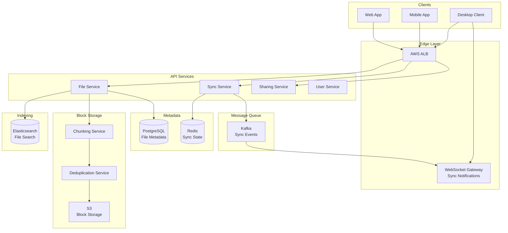

# 📁 Google Drive - System Design Interview

> **Interview Duration**: 45 minutes  
> **Difficulty**: Hard  
> **Type**: Cloud Storage & File Sync

---

## 1️⃣ Requirements & Estimation (5 min)

### Functional Requirements
1. **Upload/Download files**: Store files in the cloud
2. **Sync across devices**: Real-time sync when files change
3. **Share files**: Share with specific users or via link

### Non-Functional Requirements
- **Consistency Model**: Strong consistency for metadata, eventual for file content
- **Latency**: < 1s to start upload/download, real-time sync notification
- **Availability**: 99.99% (files must always be accessible)

### Back-of-Envelope Estimation

```
Assumptions:
- 1B total users, 200M DAU
- Average user has 5GB stored, uploads 2 files/day
- Average file size: 500KB
- Peak: 3x average

Traffic:
- Uploads/day: 200M × 2 = 400M files/day
- Upload QPS: 400M / 86,400 ≈ 4,600 QPS
- Peak Upload QPS: 4,600 × 3 = 13,800 QPS

Storage:
- Total storage: 1B × 5GB = 5EB (exabytes)
- Daily new storage: 400M × 500KB = 200TB/day

Sync notifications:
- Assume 10 file changes per user per day
- Changes: 200M × 10 = 2B events/day
- Event QPS: 2B / 86,400 ≈ 23K QPS
```

---

## 2️⃣ High-Level Architecture (10 min)



### Technology Choices

| Component | Technology | Justification |
|-----------|------------|---------------|
| Block Storage | S3 | Infinite scale, 11 9's durability |
| Metadata | PostgreSQL | ACID for file tree operations |
| Sync Events | Kafka | Ordered, persistent event streaming |
| Real-time Sync | WebSocket | Push notifications to clients |
| Deduplication | Content-addressable storage | SHA-256 hash as block ID |
| Search | Elasticsearch | Full-text search in file content |

---

## 3️⃣ API & Data Model (10 min)

### API Design

**Upload File (Chunked)**
```http
POST /api/v1/files/upload/init
Authorization: Bearer {token}

{
    "name": "document.pdf",
    "parent_id": "folder_123",
    "size": 10485760,
    "checksum": "sha256:abc123..."
}

Response 200:
{
    "upload_id": "upload_xyz",
    "file_id": "file_456",
    "chunk_size": 4194304,
    "chunks": [
        {"index": 0, "upload_url": "https://upload.drive.com/..."},
        {"index": 1, "upload_url": "https://upload.drive.com/..."},
        {"index": 2, "upload_url": "https://upload.drive.com/..."}
    ]
}

// Upload each chunk
PUT {chunk_upload_url}
Content-Type: application/octet-stream

[binary chunk data]

// Complete upload
POST /api/v1/files/upload/{upload_id}/complete
{
    "chunk_checksums": ["sha256:...", "sha256:...", "sha256:..."]
}
```

**Sync Changes**
```http
GET /api/v1/sync/changes?cursor={cursor}
Authorization: Bearer {token}

Response 200:
{
    "changes": [
        {
            "type": "create",
            "file_id": "file_456",
            "name": "document.pdf",
            "parent_id": "folder_123",
            "version": 5,
            "modified_at": "2026-01-28T10:00:00Z"
        },
        {
            "type": "update",
            "file_id": "file_789",
            "version": 12,
            "modified_at": "2026-01-28T10:05:00Z"
        }
    ],
    "cursor": "eyJ2IjoxMjM0NTY3...",
    "has_more": false
}
```

### Data Model

**Files & Folders (PostgreSQL)**
```sql
CREATE TABLE files (
    file_id         UUID PRIMARY KEY,
    owner_id        UUID NOT NULL REFERENCES users(user_id),
    parent_id       UUID REFERENCES files(file_id),
    name            VARCHAR(255) NOT NULL,
    is_folder       BOOLEAN DEFAULT FALSE,
    size_bytes      BIGINT,
    mime_type       VARCHAR(100),
    version         INT DEFAULT 1,
    checksum        VARCHAR(64),           -- SHA-256 of file
    created_at      TIMESTAMP DEFAULT NOW(),
    modified_at     TIMESTAMP DEFAULT NOW(),
    deleted_at      TIMESTAMP,             -- Soft delete for trash
    UNIQUE (parent_id, name, owner_id)     -- No duplicate names in folder
);

CREATE INDEX idx_files_parent ON files(parent_id) WHERE deleted_at IS NULL;
CREATE INDEX idx_files_owner ON files(owner_id);
```

**File Versions (PostgreSQL)**
```sql
CREATE TABLE file_versions (
    version_id      UUID PRIMARY KEY,
    file_id         UUID NOT NULL REFERENCES files(file_id),
    version_number  INT NOT NULL,
    size_bytes      BIGINT,
    checksum        VARCHAR(64),
    block_list      JSONB,                 -- List of block hashes
    created_at      TIMESTAMP DEFAULT NOW(),
    created_by      UUID REFERENCES users(user_id),
    PRIMARY KEY (file_id, version_number)  -- Partition Key: file_id
);
```

**Blocks (Content-Addressable Storage)**
```sql
CREATE TABLE blocks (
    block_hash      VARCHAR(64) PRIMARY KEY,  -- SHA-256
    size_bytes      INT NOT NULL,
    s3_path         VARCHAR(255) NOT NULL,
    ref_count       INT DEFAULT 1,            -- For garbage collection
    created_at      TIMESTAMP DEFAULT NOW()
);

-- Block to file mapping
CREATE TABLE file_blocks (
    file_id         UUID,
    version         INT,
    block_index     INT,
    block_hash      VARCHAR(64) REFERENCES blocks(block_hash),
    PRIMARY KEY (file_id, version, block_index)
);
```

**Sync Cursor (Redis)**
```
# User's sync cursor (last seen change)
SET sync:cursor:{user_id} "1706436000000"

# Pending sync events per user
LPUSH sync:pending:{user_id} '{"type":"update","file_id":"xyz"}'

# Active WebSocket sessions
HSET ws:sessions:{user_id} "session_123" "gateway_1"
```

---

## 4️⃣ Component Deep Dive: Chunking & Deduplication (15 min)

### Chunking Strategy

```
┌─────────────────────────────────────────────────────────────────┐
│                    FILE CHUNKING STRATEGY                       │
├─────────────────────────────────────────────────────────────────┤
│                                                                  │
│  FIXED-SIZE CHUNKING:                                           │
│  ┌──────┬──────┬──────┬──────┐                                 │
│  │ 4MB  │ 4MB  │ 4MB  │ 2MB  │  (Simple but poor dedup)        │
│  └──────┴──────┴──────┴──────┘                                 │
│                                                                  │
│  CONTENT-DEFINED CHUNKING (CDC):                                │
│  ┌────┬──────┬───┬────────┬─────┐                              │
│  │ 3MB│ 5MB  │2MB│  6MB   │ 1MB │  (Boundaries based on content)│
│  └────┴──────┴───┴────────┴─────┘                              │
│                                                                  │
│  CDC Benefits:                                                   │
│  • Inserting data only affects one chunk (not all after it)     │
│  • Better deduplication across similar files                    │
│  • Uses rolling hash (Rabin fingerprint) to find boundaries     │
│                                                                  │
│  Boundary Detection:                                             │
│  • Sliding window calculates hash                               │
│  • When hash matches pattern (e.g., last 13 bits = 0), split    │
│  • Avg chunk size: 4MB, min: 1MB, max: 8MB                      │
└─────────────────────────────────────────────────────────────────┘
```

### Pseudocode: Chunking & Sync Service

```python
class ChunkingService:
    MIN_CHUNK = 1 * 1024 * 1024       # 1 MB
    MAX_CHUNK = 8 * 1024 * 1024       # 8 MB
    TARGET_CHUNK = 4 * 1024 * 1024    # 4 MB target
    WINDOW_SIZE = 48
    BOUNDARY_MASK = (1 << 22) - 1     # ~4MB average chunks
    
    def __init__(self, block_store, dedup_service):
        self.blocks = block_store
        self.dedup = dedup_service
    
    def chunk_file(self, file_stream) -> List[ChunkInfo]:
        """Split file into content-defined chunks"""
        chunks = []
        buffer = bytearray()
        rolling_hash = RabinHash(self.WINDOW_SIZE)
        
        while True:
            byte = file_stream.read(1)
            if not byte:
                break
            
            buffer.append(byte[0])
            rolling_hash.update(byte[0])
            
            # Check for chunk boundary
            is_boundary = (
                len(buffer) >= self.MIN_CHUNK and
                (rolling_hash.digest() & self.BOUNDARY_MASK) == 0
            )
            
            is_max_size = len(buffer) >= self.MAX_CHUNK
            
            if is_boundary or is_max_size:
                chunk = self._finalize_chunk(bytes(buffer))
                chunks.append(chunk)
                buffer.clear()
                rolling_hash.reset()
        
        # Handle remaining bytes
        if buffer:
            chunk = self._finalize_chunk(bytes(buffer))
            chunks.append(chunk)
        
        return chunks
    
    def _finalize_chunk(self, data: bytes) -> ChunkInfo:
        """Hash chunk and check for deduplication"""
        chunk_hash = hashlib.sha256(data).hexdigest()
        
        # Check if block already exists (deduplication)
        existing = self.dedup.lookup(chunk_hash)
        
        if existing:
            # Increment reference count
            self.dedup.increment_ref(chunk_hash)
            return ChunkInfo(
                hash=chunk_hash,
                size=len(data),
                is_duplicate=True
            )
        
        return ChunkInfo(
            hash=chunk_hash,
            size=len(data),
            data=data,
            is_duplicate=False
        )


class FileUploadService:
    def __init__(self, chunker, s3_client, db, kafka):
        self.chunker = chunker
        self.s3 = s3_client
        self.db = db
        self.kafka = kafka
    
    async def upload_file(self, user_id: str, parent_id: str,
                          filename: str, file_stream) -> File:
        """Upload file with chunking and deduplication"""
        
        # Chunk the file
        chunks = self.chunker.chunk_file(file_stream)
        
        # Upload non-duplicate chunks to S3 (parallel)
        upload_tasks = []
        for chunk in chunks:
            if not chunk.is_duplicate:
                upload_tasks.append(
                    self._upload_chunk(chunk)
                )
        
        await asyncio.gather(*upload_tasks)
        
        # Create file metadata
        file_id = uuid.uuid4()
        total_size = sum(c.size for c in chunks)
        file_hash = self._compute_file_hash(chunks)
        
        block_list = [c.hash for c in chunks]
        
        async with self.db.transaction():
            # Insert file record
            await self.db.execute("""
                INSERT INTO files (file_id, owner_id, parent_id, name,
                                   size_bytes, checksum, version)
                VALUES ($1, $2, $3, $4, $5, $6, 1)
            """, [file_id, user_id, parent_id, filename, total_size, file_hash])
            
            # Insert file version
            await self.db.execute("""
                INSERT INTO file_versions (file_id, version_number,
                                           size_bytes, checksum, block_list)
                VALUES ($1, 1, $2, $3, $4)
            """, [file_id, total_size, file_hash, json.dumps(block_list)])
            
            # Insert block references
            for idx, chunk in enumerate(chunks):
                await self.db.execute("""
                    INSERT INTO file_blocks (file_id, version, block_index, block_hash)
                    VALUES ($1, 1, $2, $3)
                """, [file_id, idx, chunk.hash])
        
        # Emit sync event
        await self.kafka.send('file_events', {
            'type': 'file_created',
            'user_id': user_id,
            'file_id': str(file_id),
            'parent_id': parent_id,
            'name': filename
        })
        
        return File(id=file_id, name=filename, size=total_size)
    
    async def _upload_chunk(self, chunk: ChunkInfo):
        """Upload chunk to S3"""
        s3_path = f"blocks/{chunk.hash[:2]}/{chunk.hash}"
        
        await self.s3.put_object(s3_path, chunk.data)
        
        # Register in blocks table
        await self.db.execute("""
            INSERT INTO blocks (block_hash, size_bytes, s3_path)
            VALUES ($1, $2, $3)
            ON CONFLICT (block_hash) DO UPDATE SET ref_count = ref_count + 1
        """, [chunk.hash, chunk.size, s3_path])


class SyncService:
    def __init__(self, db, redis, kafka, ws_gateway):
        self.db = db
        self.redis = redis
        self.kafka = kafka
        self.ws = ws_gateway
    
    async def get_changes(self, user_id: str, cursor: str,
                          limit: int = 100) -> SyncResponse:
        """Get file changes since cursor"""
        
        # Decode cursor (timestamp-based)
        since_timestamp = self._decode_cursor(cursor)
        
        # Get changed files
        changes = await self.db.query("""
            SELECT file_id, name, parent_id, version, is_folder,
                   size_bytes, modified_at,
                   CASE WHEN deleted_at IS NOT NULL THEN 'delete'
                        WHEN version = 1 THEN 'create'
                        ELSE 'update' END as change_type
            FROM files
            WHERE owner_id = $1
              AND modified_at > $2
            ORDER BY modified_at ASC
            LIMIT $3
        """, [user_id, since_timestamp, limit + 1])
        
        has_more = len(changes) > limit
        changes = changes[:limit]
        
        # Generate new cursor
        new_cursor = None
        if changes:
            new_cursor = self._encode_cursor(changes[-1]['modified_at'])
        
        return SyncResponse(
            changes=changes,
            cursor=new_cursor,
            has_more=has_more
        )
    
    async def handle_sync_event(self, event: dict):
        """Process file change event from Kafka"""
        user_id = event['user_id']
        
        # Find all active sessions for user
        sessions = await self.redis.hgetall(f"ws:sessions:{user_id}")
        
        # Notify each connected device
        for session_id, gateway_id in sessions.items():
            await self.ws.send_to_session(gateway_id, session_id, {
                'type': 'sync_update',
                'data': event
            })
```

### Delta Sync (Efficient Updates)

```python
class DeltaSyncService:
    """Sync only changed blocks for file updates"""
    
    def compute_delta(self, old_blocks: List[str], 
                      new_blocks: List[str]) -> Delta:
        """Compute minimal delta between file versions"""
        
        old_set = set(old_blocks)
        new_set = set(new_blocks)
        
        # Blocks to download (new blocks not in old version)
        to_download = new_set - old_set
        
        # Blocks to keep (exist in both)
        to_keep = old_set & new_set
        
        # Compute transfer size
        transfer_size = sum(
            self.get_block_size(h) for h in to_download
        )
        
        return Delta(
            download_blocks=list(to_download),
            keep_blocks=list(to_keep),
            new_block_order=new_blocks,
            transfer_size=transfer_size
        )
    
    async def apply_delta(self, file_id: str, delta: Delta):
        """Apply delta to reconstruct file"""
        # Download only new blocks
        for block_hash in delta.download_blocks:
            await self.download_block(block_hash)
        
        # Reconstruct file using new block order
        output = bytearray()
        for block_hash in delta.new_block_order:
            block_data = await self.get_block(block_hash)
            output.extend(block_data)
        
        return bytes(output)
```

---

## 5️⃣ Bottlenecks & Trade-offs (5 min)

### Single Points of Failure & Mitigations

| SPOF | Impact | Mitigation |
|------|--------|------------|
| PostgreSQL (metadata) | Can't navigate files | Multi-AZ, read replicas |
| S3 (blocks) | Can't read/write files | Cross-region replication |
| Kafka (sync events) | Sync delayed | Multi-broker, replication factor 3 |
| WebSocket Gateway | No real-time sync | Client polling fallback |

### Consistency vs Performance Trade-off

```
┌─────────────────────────────────────────────────────────────┐
│              SYNC CONSISTENCY TRADE-OFFS                    │
├─────────────────────────────────────────────────────────────┤
│                                                             │
│  STRONG CONSISTENCY:                                        │
│  ✅ All devices see same file state                        │
│  ❌ Slow writes (wait for all replicas)                    │
│  ❌ Conflicts block operations                             │
│                                                             │
│  EVENTUAL CONSISTENCY + CONFLICT RESOLUTION:               │
│  ✅ Fast writes (async replication)                        │
│  ✅ Operations never blocked                               │
│  ❌ Conflicting edits create "conflict" files              │
│                                                             │
│  OUR CHOICE: Eventual + Last-Writer-Wins + Conflict Files  │
│                                                             │
│  Conflict Resolution:                                       │
│  1. Compare version vectors on each device                 │
│  2. If concurrent edits detected:                          │
│     - Keep latest version as primary                       │
│     - Create "filename (conflict).ext" with other version  │
│     - Notify user to resolve manually                      │
└─────────────────────────────────────────────────────────────┘
```

### CAP Theorem Trade-off

```
┌─────────────────────────────────────────────────────────────┐
│                  GOOGLE DRIVE CAP CHOICE                    │
├─────────────────────────────────────────────────────────────┤
│  WE CHOOSE: AP (Availability + Partition Tolerance)         │
│                                                             │
│  Reasoning:                                                 │
│  • Users expect to always access their files                │
│  • Offline editing must work (sync later)                   │
│  • Conflicts can be resolved after the fact                 │
│  • Stale file list is better than no file list              │
│                                                             │
│  Trade-off Accepted:                                        │
│  • Concurrent edits create conflict files                   │
│  • File list may be temporarily out of sync                 │
│  • Deleted files may briefly reappear                       │
│                                                             │
│  Consistency where it matters:                              │
│  • Sharing permissions (checked at access time)             │
│  • Storage quota (enforced at upload time)                  │
└─────────────────────────────────────────────────────────────┘
```

### Scaling Strategies

| Challenge | Solution |
|-----------|----------|
| Exabyte storage | S3 with intelligent tiering, cold storage |
| Hot files | CDN edge caching, read replicas |
| Large file uploads | Chunked resumable uploads |
| Millions of small files | Batch operations, directory snapshots |

### Interview Pro Tips

1. **Start with chunking**: Show understanding of efficient storage
2. **Explain deduplication**: Content-addressable storage saves 30-50% space
3. **Discuss conflict resolution**: Version vectors, last-writer-wins
4. **Mention offline support**: Local cache, sync queue
