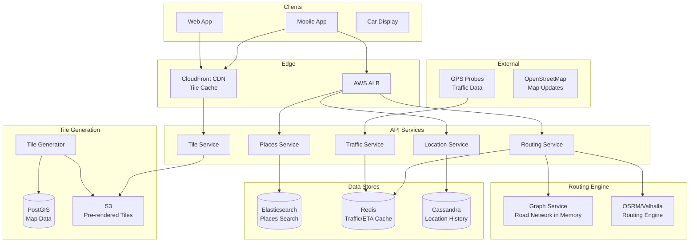

# 🗺️ Google Maps - System Design Interview

> **Interview Duration**: 45 minutes  
> **Difficulty**: Hard  
> **Type**: Location-Based Service

---

## 1️⃣ Requirements & Estimation (5 min)

### Functional Requirements
1. **Display map tiles**: Render map at various zoom levels
2. **Search places**: Find locations by name or address
3. **Navigation**: Calculate routes between points (driving, walking, transit)

### Non-Functional Requirements
- **Consistency Model**: Eventual consistency for map updates, strong for traffic data
- **Latency**: < 100ms for tile loading, < 500ms for route calculation
- **Availability**: 99.99% (critical for navigation)

### Back-of-Envelope Estimation

```
Assumptions:
- 1B DAU
- Average user makes 5 map requests/day
- 10% users request navigation daily

Traffic:
- Map tile requests: 1B × 5 = 5B/day
- Tile QPS: 5B / 86,400 ≈ 58K QPS
- Navigation requests: 1B × 0.1 = 100M/day
- Navigation QPS: 100M / 86,400 ≈ 1,150 QPS

Map Tile Storage:
- Earth surface: 510M km²
- At zoom level 18: ~69B tiles
- Tile size: 10KB average
- Total: 69B × 10KB = 690TB

Road Network:
- ~50M road segments globally
- Per segment: coordinates, speed limits, restrictions
- ~1KB per segment = 50GB (fits in memory!)
```

---

## 2️⃣ High-Level Architecture (10 min)



### Technology Choices

| Component | Technology | Justification |
|-----------|------------|---------------|
| Map Data | PostGIS | Spatial queries, geometry types |
| Tile Storage | S3 + CloudFront | Global CDN, vector tiles |
| Places Search | Elasticsearch | Geo queries, fuzzy matching |
| Routing | OSRM/Valhalla | Open-source, fast graph algorithms |
| Traffic | Redis | Real-time updates, geo-sharding |
| Location History | Cassandra | Time-series, high write throughput |

---

## 3️⃣ API & Data Model (10 min)

### API Design

**Get Map Tiles**
```http
GET /api/v1/tiles/{z}/{x}/{y}.pbf
Accept: application/x-protobuf

Response 200:
[Vector tile binary data - Protocol Buffers]

Headers:
Cache-Control: public, max-age=86400
ETag: "abc123"
```

**Search Places**
```http
GET /api/v1/places/search?query=coffee&lat=37.7749&lng=-122.4194&radius=1000
Authorization: Bearer {token}

Response 200:
{
    "places": [
        {
            "place_id": "place_123",
            "name": "Blue Bottle Coffee",
            "address": "315 Linden St, San Francisco",
            "location": {"lat": 37.7751, "lng": -122.4195},
            "rating": 4.5,
            "types": ["cafe", "food"],
            "distance_m": 150
        }
    ],
    "next_page_token": "xyz..."
}
```

**Get Directions**
```http
POST /api/v1/directions
Authorization: Bearer {token}

{
    "origin": {"lat": 37.7749, "lng": -122.4194},
    "destination": {"lat": 37.8044, "lng": -122.2712},
    "mode": "driving",
    "departure_time": "2026-01-28T10:00:00Z",
    "alternatives": true
}

Response 200:
{
    "routes": [
        {
            "summary": "I-80 E",
            "distance_m": 18500,
            "duration_sec": 1320,
            "duration_in_traffic_sec": 1680,
            "polyline": "encoded_polyline_string",
            "steps": [
                {
                    "instruction": "Head east on Market St",
                    "distance_m": 500,
                    "duration_sec": 60,
                    "maneuver": "straight"
                }
            ],
            "traffic_conditions": "moderate"
        }
    ]
}
```

### Data Model

**Map Data (PostGIS)**
```sql
-- Road segments
CREATE TABLE roads (
    road_id         BIGINT PRIMARY KEY,
    osm_id          BIGINT,
    name            VARCHAR(255),
    road_type       VARCHAR(50),      -- highway, residential, etc.
    speed_limit_kmh INT,
    oneway          BOOLEAN DEFAULT FALSE,
    geometry        GEOMETRY(LineString, 4326),
    from_node       BIGINT,
    to_node         BIGINT
);

CREATE INDEX idx_roads_geom ON roads USING GIST(geometry);

-- Graph nodes (intersections)
CREATE TABLE nodes (
    node_id         BIGINT PRIMARY KEY,
    location        GEOMETRY(Point, 4326),
    is_traffic_signal BOOLEAN DEFAULT FALSE
);

-- Places/POIs
CREATE TABLE places (
    place_id        VARCHAR(50) PRIMARY KEY,
    name            VARCHAR(255) NOT NULL,
    address         TEXT,
    location        GEOMETRY(Point, 4326),
    place_type      VARCHAR(50)[],
    rating          DECIMAL(2,1),
    review_count    INT,
    geohash         VARCHAR(12),      -- For spatial indexing
    INDEX idx_geohash (geohash)
);
```

**Geohash Indexing (Redis)**
```
# Store places by geohash prefix
GEOADD places:geo -122.4194 37.7749 "place_123"
GEOADD places:geo -122.4195 37.7751 "place_456"

# Query nearby places
GEORADIUS places:geo -122.4194 37.7749 1 km WITHDIST

# Traffic data by road segment
HSET traffic:segment:12345 speed 45 congestion 0.3 updated_at 1706436000
EXPIRE traffic:segment:12345 300  # 5 min TTL
```

**Location History (Cassandra)**
```sql
CREATE TABLE location_history (
    user_id         UUID,
    date            DATE,              -- Partition Key (daily buckets)
    timestamp       TIMESTAMP,         -- Clustering Key
    lat             DOUBLE,
    lng             DOUBLE,
    accuracy_m      INT,
    activity        VARCHAR(20),       -- driving, walking, stationary
    PRIMARY KEY ((user_id, date), timestamp)
) WITH CLUSTERING ORDER BY (timestamp DESC);
```

---

## 4️⃣ Component Deep Dive: Routing Service (15 min)

### Geohashing for Spatial Indexing

```
┌─────────────────────────────────────────────────────────────────┐
│                       GEOHASH SYSTEM                            │
├─────────────────────────────────────────────────────────────────┤
│                                                                  │
│  How it works:                                                   │
│  • Divide world into 32 cells, assign character                 │
│  • Recursively subdivide each cell                              │
│  • Longer hash = more precise location                          │
│                                                                  │
│  Example: San Francisco = "9q8yy"                               │
│                                                                  │
│  Precision:                                                      │
│  ┌──────────┬────────────────┐                                  │
│  │ Length   │ Cell Size      │                                  │
│  ├──────────┼────────────────┤                                  │
│  │ 1        │ 5,000 km       │                                  │
│  │ 4        │ 39 km          │                                  │
│  │ 6        │ 610 m          │                                  │
│  │ 8        │ 19 m           │                                  │
│  └──────────┴────────────────┘                                  │
│                                                                  │
│  Nearby search: Query all adjacent geohash cells                │
│  9q8yy + 8 neighbors = 9 queries, merge results                 │
└─────────────────────────────────────────────────────────────────┘
```

### Routing Algorithm Implementation

```python
class RoutingService:
    def __init__(self, graph_db, traffic_service, cache):
        self.graph = graph_db
        self.traffic = traffic_service
        self.cache = cache
    
    def find_route(self, origin: LatLng, destination: LatLng,
                   mode: str, departure_time: datetime) -> List[Route]:
        """Find optimal route using A* with traffic-aware weights"""
        
        # Snap to nearest road nodes
        start_node = self._snap_to_road(origin)
        end_node = self._snap_to_road(destination)
        
        # Check cache for popular routes
        cache_key = f"route:{start_node}:{end_node}:{mode}"
        cached = self.cache.get(cache_key)
        if cached and not self._needs_traffic_update(cached):
            return self._apply_current_traffic(cached, departure_time)
        
        # Run A* search with traffic-aware heuristic
        route = self._a_star_search(
            start_node, end_node, mode, departure_time
        )
        
        # Cache the structural route (without real-time traffic)
        self.cache.setex(cache_key, 3600, route)
        
        return route
    
    def _a_star_search(self, start: int, end: int, 
                       mode: str, departure: datetime) -> Route:
        """A* pathfinding with traffic-weighted edges"""
        
        # Priority queue: (f_score, node, path, cumulative_time)
        heap = [(0, start, [], 0)]
        visited = set()
        g_scores = {start: 0}
        
        while heap:
            f_score, current, path, current_time = heapq.heappop(heap)
            
            if current in visited:
                continue
            visited.add(current)
            
            if current == end:
                return self._build_route(path)
            
            # Get adjacent edges
            edges = self.graph.get_edges(current, mode)
            
            for edge in edges:
                neighbor = edge.to_node
                if neighbor in visited:
                    continue
                
                # Calculate edge cost with traffic
                arrival_time = departure + timedelta(seconds=current_time)
                edge_cost = self._calculate_edge_cost(
                    edge, mode, arrival_time
                )
                
                tentative_g = g_scores[current] + edge_cost
                
                if tentative_g < g_scores.get(neighbor, float('inf')):
                    g_scores[neighbor] = tentative_g
                    
                    # Heuristic: straight-line distance / max speed
                    h_score = self._heuristic(neighbor, end, mode)
                    f_score = tentative_g + h_score
                    
                    new_path = path + [edge]
                    heapq.heappush(heap, (
                        f_score, neighbor, new_path,
                        current_time + edge_cost
                    ))
        
        raise NoRouteFoundError()
    
    def _calculate_edge_cost(self, edge, mode: str, 
                             arrival_time: datetime) -> float:
        """Calculate traversal time considering traffic"""
        
        base_time = edge.length_m / edge.speed_limit_kmh * 3.6
        
        if mode == 'walking':
            return edge.length_m / 5.0  # 5 km/h walking speed
        
        # Get real-time traffic data
        traffic = self.traffic.get_segment_traffic(edge.road_id)
        
        if traffic:
            # Apply congestion factor (0 = free flow, 1 = standstill)
            congestion_factor = 1 + (traffic.congestion * 3)  # Up to 4x slower
            return base_time * congestion_factor
        
        # Use historical traffic pattern
        historical = self.traffic.get_historical(
            edge.road_id, 
            arrival_time.weekday(),
            arrival_time.hour
        )
        
        return base_time * historical.avg_factor
    
    def _heuristic(self, node: int, goal: int, mode: str) -> float:
        """Admissible heuristic for A*"""
        # Haversine distance
        distance = self.graph.get_distance(node, goal)
        
        # Maximum possible speed for mode
        max_speed = {
            'driving': 130,   # km/h (highway)
            'walking': 6,
            'cycling': 25,
            'transit': 80
        }[mode]
        
        return distance / max_speed * 3.6  # Convert to seconds


class TrafficService:
    """Real-time traffic aggregation from GPS probes"""
    
    def __init__(self, redis, kafka_consumer):
        self.redis = redis
        self.kafka = kafka_consumer
    
    async def process_location_update(self, probe: LocationProbe):
        """Process GPS probe from driver device"""
        
        # Snap to road segment
        segment_id = self._map_match(probe.lat, probe.lng, probe.heading)
        
        if not segment_id:
            return
        
        # Calculate instantaneous speed
        speed = probe.speed_mps * 3.6  # to km/h
        
        # Update segment aggregation (sliding window)
        segment_key = f"traffic:raw:{segment_id}"
        
        # Add speed sample with timestamp
        await self.redis.zadd(
            segment_key,
            {f"{probe.device_id}:{probe.timestamp}": speed}
        )
        
        # Remove old samples (> 5 minutes)
        cutoff = time.time() - 300
        await self.redis.zremrangebyscore(segment_key, 0, cutoff)
        
        # Recalculate segment speed (every 30 seconds)
        if await self._should_recalculate(segment_id):
            await self._update_segment_traffic(segment_id)
    
    async def _update_segment_traffic(self, segment_id: str):
        """Aggregate probes into traffic condition"""
        
        segment_key = f"traffic:raw:{segment_id}"
        samples = await self.redis.zrange(segment_key, 0, -1, withscores=True)
        
        if len(samples) < 3:  # Not enough data
            return
        
        speeds = [score for _, score in samples]
        avg_speed = statistics.mean(speeds)
        
        # Get free-flow speed for segment
        free_flow = await self.get_free_flow_speed(segment_id)
        
        # Calculate congestion (0-1)
        congestion = max(0, min(1, 1 - (avg_speed / free_flow)))
        
        # Update traffic cache
        await self.redis.hset(
            f"traffic:segment:{segment_id}",
            mapping={
                'speed': avg_speed,
                'congestion': congestion,
                'sample_count': len(samples),
                'updated_at': int(time.time())
            }
        )
        await self.redis.expire(f"traffic:segment:{segment_id}", 300)
```

### ETA Calculation with Machine Learning

```python
class ETAPredictor:
    """ML-based ETA refinement"""
    
    def predict_eta(self, route: Route, departure: datetime) -> int:
        """Predict actual arrival time using ML model"""
        
        features = self._extract_features(route, departure)
        
        # Base ETA from routing
        base_eta = route.duration_sec
        
        # ML adjustment factor (trained on historical data)
        adjustment = self.model.predict([features])[0]
        
        # adjustment is typically 0.8 - 1.5
        predicted_eta = int(base_eta * adjustment)
        
        return predicted_eta
    
    def _extract_features(self, route: Route, departure: datetime) -> List:
        return [
            departure.hour,
            departure.weekday(),
            departure.month,
            route.distance_m,
            route.num_traffic_signals,
            route.highway_percentage,
            self._get_weather_factor(route),
            self._get_event_factor(route, departure),
        ]
```

---

## 5️⃣ Bottlenecks & Trade-offs (5 min)

### Single Points of Failure & Mitigations

| SPOF | Impact | Mitigation |
|------|--------|------------|
| CDN (tiles) | Maps don't load | Multi-CDN, offline tile packs |
| Routing service | No directions | Pre-computed popular routes |
| Traffic data | Inaccurate ETAs | Fall back to historical patterns |
| GPS signal | Can't navigate | Dead reckoning, WiFi positioning |

### Precomputation vs Real-time Trade-off

```
┌─────────────────────────────────────────────────────────────┐
│           ROUTING PRECOMPUTATION TRADE-OFFS                 │
├─────────────────────────────────────────────────────────────┤
│                                                             │
│  FULL PRECOMPUTATION (Contraction Hierarchies):            │
│  ✅ Sub-millisecond routing queries                        │
│  ✅ Handles continental-scale routing                      │
│  ❌ Hours to rebuild on map change                         │
│  ❌ Can't incorporate real-time traffic                    │
│                                                             │
│  REAL-TIME A* SEARCH:                                       │
│  ✅ Always uses current traffic                            │
│  ✅ Instant map updates                                    │
│  ❌ Slow for long routes (100ms+)                          │
│                                                             │
│  HYBRID APPROACH (Our Choice):                              │
│  • Precompute hierarchical graph structure                  │
│  • Apply real-time traffic as edge weight modifiers         │
│  • Use A* for local routing, CH for long-distance           │
│  • Result: 10-50ms with current traffic                     │
└─────────────────────────────────────────────────────────────┘
```

### CAP Theorem Trade-off

```
┌─────────────────────────────────────────────────────────────┐
│                  GOOGLE MAPS CAP CHOICE                     │
├─────────────────────────────────────────────────────────────┤
│  WE CHOOSE: AP (Availability + Partition Tolerance)         │
│                                                             │
│  Reasoning:                                                 │
│  • Navigation must work even with poor connectivity         │
│  • Stale traffic data is better than no data                │
│  • Map tiles are mostly static (cache heavily)              │
│  • Offline mode is critical for driving                     │
│                                                             │
│  Trade-off Accepted:                                        │
│  • Traffic data may be 1-2 minutes stale                    │
│  • New road closures may take time to propagate             │
│  • Place information may be outdated                        │
│                                                             │
│  Consistency where it matters:                              │
│  • Billing/usage tracking                                   │
│  • User-submitted edits (moderation queue)                  │
└─────────────────────────────────────────────────────────────┘
```

### Scaling Strategies

| Challenge | Solution |
|-----------|----------|
| Global tile serving | CDN with 200+ PoPs |
| Real-time traffic | Geographically partitioned Redis |
| Complex routing | Contraction Hierarchies preprocessing |
| Search at scale | Elasticsearch with geo-sharding |

### Interview Pro Tips

1. **Start with geohashing**: Explain spatial indexing first
2. **Discuss tile pyramid**: Pre-rendering at zoom levels
3. **Mention Contraction Hierarchies**: Key to fast long-distance routing
4. **Traffic aggregation**: How GPS probes become traffic data
