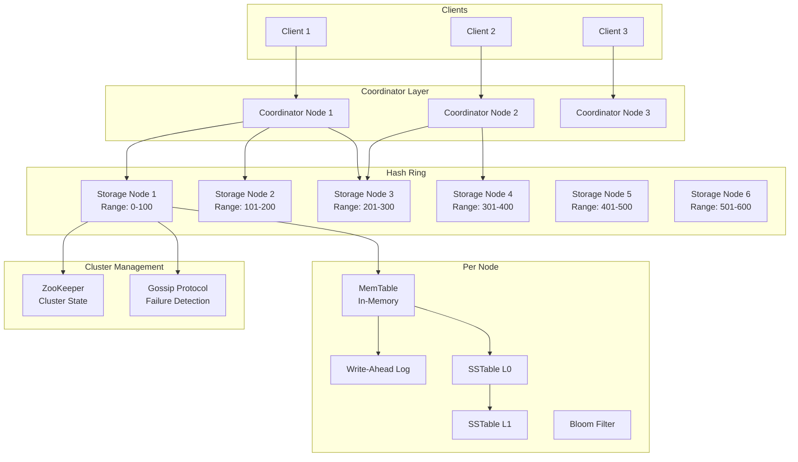

# 🗄️ Key-Value Store - System Design Interview

> **Interview Duration**: 45 minutes  
> **Difficulty**: Hard  
> **Type**: Distributed Database

---

## 1️⃣ Requirements & Estimation (5 min)

### Functional Requirements
1. **put(key, value)**: Store a key-value pair
2. **get(key)**: Retrieve value by key
3. **delete(key)**: Remove a key-value pair

### Non-Functional Requirements
- **Consistency Model**: Tunable (strong or eventual)
- **Latency**: < 10ms for reads, < 50ms for writes
- **Availability**: 99.99% (always writable)

### Back-of-Envelope Estimation

```
Assumptions:
- 100M DAU
- Average user: 100 reads, 10 writes per day
- Key: 100 bytes, Value: 10KB average
- Replication factor: 3

Traffic:
- Reads/day: 100M × 100 = 10B reads/day
- Read QPS: 10B / 86,400 ≈ 116K QPS
- Writes/day: 100M × 10 = 1B writes/day
- Write QPS: 1B / 86,400 ≈ 11.5K QPS

Storage (5 years):
- Daily data: 1B × 10KB = 10TB/day
- With replication: 10TB × 3 = 30TB/day
- Yearly: 30TB × 365 = 11PB/year

Memory (for hot data):
- Assume 20% hot data cached
- 11PB × 0.2 = 2.2PB across cluster
- With 256GB per node: ~8,600 nodes
```

---

## 2️⃣ High-Level Architecture (10 min)



### Technology Choices

| Component | Technology | Justification |
|-----------|------------|---------------|
| Partitioning | Consistent Hashing | Even distribution, minimal reshuffling |
| Storage Engine | LSM Tree | Write-optimized, good compaction |
| Cluster Coordination | ZooKeeper | Leader election, config management |
| Failure Detection | Gossip Protocol | Decentralized, scalable |
| Replication | Quorum-based | Tunable consistency |

---

## 3️⃣ API & Data Model (10 min)

### API Design

**Put Key-Value**
```http
PUT /api/v1/keys/{key}
Content-Type: application/octet-stream
X-Consistency-Level: quorum

{binary value data}

Response 200:
{
    "key": "user:123:profile",
    "version": 1706436000000,
    "replicas": ["node-1", "node-2", "node-3"]
}
```

**Get Key**
```http
GET /api/v1/keys/{key}
X-Consistency-Level: quorum

Response 200:
{
    "key": "user:123:profile",
    "value": "base64_encoded_value",
    "version": 1706436000000,
    "ttl": 3600
}

Response 404:
{
    "error": "KEY_NOT_FOUND",
    "key": "user:123:profile"
}
```

**Delete Key**
```http
DELETE /api/v1/keys/{key}
X-Consistency-Level: quorum

Response 200:
{
    "key": "user:123:profile",
    "deleted": true,
    "tombstone_version": 1706436100000
}
```

### Data Model

**Storage Record (Internal)**
```
┌─────────────────────────────────────────────────────────┐
│                    Key-Value Record                     │
├─────────────┬───────────────────────────────────────────┤
│ Field       │ Size                                      │
├─────────────┼───────────────────────────────────────────┤
│ key_size    │ 4 bytes (uint32)                          │
│ key         │ variable (up to 256 bytes)                │
│ value_size  │ 4 bytes (uint32)                          │
│ value       │ variable (up to 1MB)                      │
│ timestamp   │ 8 bytes (int64, microseconds)             │
│ tombstone   │ 1 byte (boolean)                          │
│ checksum    │ 4 bytes (CRC32)                           │
└─────────────┴───────────────────────────────────────────┘
```

**SSTable Format**
```
┌──────────────────────────────────────────────────────────┐
│                      SSTable File                        │
├──────────────────────────────────────────────────────────┤
│  Data Block 1 (4KB)                                      │
│  ├── Record 1: key1 -> value1                            │
│  ├── Record 2: key2 -> value2                            │
│  └── ...                                                 │
├──────────────────────────────────────────────────────────┤
│  Data Block 2 (4KB)                                      │
│  └── ...                                                 │
├──────────────────────────────────────────────────────────┤
│  Index Block                                             │
│  ├── Block 1 offset: 0, first_key: "aaa"                │
│  ├── Block 2 offset: 4096, first_key: "mno"             │
│  └── ...                                                 │
├──────────────────────────────────────────────────────────┤
│  Bloom Filter (for key existence check)                  │
├──────────────────────────────────────────────────────────┤
│  Footer (metadata, offsets)                              │
└──────────────────────────────────────────────────────────┘
```

**Consistent Hash Ring (Redis/Memory)**
```
# Virtual nodes for each physical node
ZADD hash_ring 0 "node1-vn0"
ZADD hash_ring 100 "node1-vn1"
ZADD hash_ring 200 "node2-vn0"
ZADD hash_ring 300 "node2-vn1"
...

# Find node for key
hash = MD5(key) % RING_SIZE
ZRANGEBYSCORE hash_ring (hash +inf LIMIT 0 1
```

---

## 4️⃣ Component Deep Dive: Consistent Hashing & LSM Tree (15 min)

### Consistent Hashing

```
┌─────────────────────────────────────────────────────────────────┐
│                    CONSISTENT HASH RING                         │
├─────────────────────────────────────────────────────────────────┤
│                                                                  │
│                        0                                         │
│                     ╱─────╲                                     │
│                  N1●       ●N6                                  │
│                ╱             ╲                                  │
│              N2●               ●N5                              │
│                ╲             ╱                                  │
│                  N3●       ●N4                                  │
│                     ╲─────╱                                     │
│                       180                                        │
│                                                                  │
│  Virtual Nodes:                                                  │
│  • Each physical node has 100-200 virtual nodes                 │
│  • Spreads load more evenly                                     │
│  • Handles heterogeneous hardware                               │
│                                                                  │
│  Replication:                                                    │
│  • Key hashes to position P                                     │
│  • Stored on N nodes clockwise from P                           │
│  • Preference list: [N1, N2, N3] for RF=3                       │
└─────────────────────────────────────────────────────────────────┘
```

### Pseudocode: Distributed Key-Value Store

```python
class DistributedKVStore:
    def __init__(self, config):
        self.ring = ConsistentHashRing(virtual_nodes=150)
        self.local_storage = LSMTree()
        self.replication_factor = 3
        self.read_quorum = 2   # R
        self.write_quorum = 2  # W
        # R + W > N ensures strong consistency
    
    def put(self, key: str, value: bytes, 
            consistency: str = 'quorum') -> WriteResult:
        """Write key-value pair with configurable consistency"""
        
        # Find replica nodes
        replicas = self.ring.get_replicas(key, self.replication_factor)
        coordinator = replicas[0]
        
        # Generate version (vector clock or timestamp)
        version = VectorClock.increment(self.node_id)
        
        record = Record(
            key=key,
            value=value,
            version=version,
            timestamp=time.time_ns()
        )
        
        # Determine required acks based on consistency
        required_acks = {
            'one': 1,
            'quorum': self.write_quorum,
            'all': self.replication_factor
        }[consistency]
        
        # Send to all replicas in parallel
        futures = []
        for replica in replicas:
            if replica == self.node_id:
                futures.append(self._local_write(record))
            else:
                futures.append(self._remote_write(replica, record))
        
        # Wait for required acks
        successful = 0
        for future in asyncio.as_completed(futures):
            try:
                await asyncio.wait_for(future, timeout=5.0)
                successful += 1
                if successful >= required_acks:
                    # Ack to client immediately
                    return WriteResult(success=True, version=version)
            except Exception as e:
                # Log failure, continue waiting for others
                logger.warning(f"Replica write failed: {e}")
        
        raise InsufficientReplicasError(f"Only {successful} acks received")
    
    def get(self, key: str, consistency: str = 'quorum') -> GetResult:
        """Read key with configurable consistency"""
        
        replicas = self.ring.get_replicas(key, self.replication_factor)
        
        required_reads = {
            'one': 1,
            'quorum': self.read_quorum,
            'all': self.replication_factor
        }[consistency]
        
        # Read from replicas in parallel
        futures = []
        for replica in replicas:
            if replica == self.node_id:
                futures.append(self._local_read(key))
            else:
                futures.append(self._remote_read(replica, key))
        
        results = []
        for future in asyncio.as_completed(futures):
            try:
                result = await asyncio.wait_for(future, timeout=5.0)
                if result:
                    results.append(result)
                if len(results) >= required_reads:
                    break
            except Exception:
                continue
        
        if not results:
            return GetResult(found=False)
        
        # Resolve conflicts using vector clocks
        latest = self._resolve_conflicts(results)
        
        # Read repair: update stale replicas
        self._async_read_repair(key, latest, results)
        
        return GetResult(found=True, value=latest.value, version=latest.version)
    
    def _resolve_conflicts(self, results: List[Record]) -> Record:
        """Resolve conflicting versions using vector clocks"""
        
        # Find record with highest vector clock
        latest = results[0]
        for record in results[1:]:
            comparison = VectorClock.compare(latest.version, record.version)
            
            if comparison == 'BEFORE':
                latest = record
            elif comparison == 'CONCURRENT':
                # Conflict! Use application-specific resolution
                latest = self._merge_concurrent(latest, record)
        
        return latest


class LSMTree:
    """Log-Structured Merge Tree for storage"""
    
    def __init__(self, data_dir: str, memtable_size_mb: int = 64):
        self.data_dir = data_dir
        self.memtable_size = memtable_size_mb * 1024 * 1024
        self.memtable = SortedDict()  # In-memory sorted map
        self.immutable_memtables = []
        self.sstables = []  # Sorted by level and recency
        self.wal = WriteAheadLog(f"{data_dir}/wal")
        self.bloom_filters = {}
        self.lock = threading.RLock()
    
    def put(self, key: str, value: bytes, timestamp: int):
        """Write to memtable with WAL"""
        
        record = Record(key, value, timestamp, tombstone=False)
        
        with self.lock:
            # Write to WAL first (durability)
            self.wal.append(record)
            
            # Write to memtable
            self.memtable[key] = record
            
            # Check if memtable is full
            if self._memtable_size() >= self.memtable_size:
                self._flush_memtable()
    
    def get(self, key: str) -> Optional[Record]:
        """Read with memtable -> immutable memtables -> SSTables"""
        
        # Check memtable first
        if key in self.memtable:
            record = self.memtable[key]
            if record.tombstone:
                return None
            return record
        
        # Check immutable memtables (most recent first)
        for imm in reversed(self.immutable_memtables):
            if key in imm:
                record = imm[key]
                if record.tombstone:
                    return None
                return record
        
        # Check SSTables (level by level, newest first)
        for sstable in self.sstables:
            # Check bloom filter first (avoid disk read)
            if not self.bloom_filters[sstable.id].might_contain(key):
                continue
            
            record = sstable.get(key)
            if record:
                if record.tombstone:
                    return None
                return record
        
        return None
    
    def _flush_memtable(self):
        """Convert memtable to SSTable"""
        
        # Move current memtable to immutable list
        immutable = self.memtable
        self.immutable_memtables.append(immutable)
        self.memtable = SortedDict()
        
        # Create new SSTable in background
        asyncio.create_task(self._create_sstable(immutable))
    
    async def _create_sstable(self, memtable: SortedDict):
        """Write memtable to disk as SSTable"""
        
        sstable_id = f"sst_{int(time.time() * 1000)}"
        sstable_path = f"{self.data_dir}/l0/{sstable_id}.sst"
        
        # Build bloom filter
        bloom = BloomFilter(expected_items=len(memtable), fp_rate=0.01)
        
        with open(sstable_path, 'wb') as f:
            data_blocks = []
            index_entries = []
            current_block = bytearray()
            block_start_key = None
            
            for key, record in memtable.items():
                bloom.add(key)
                
                if block_start_key is None:
                    block_start_key = key
                
                # Serialize record
                record_bytes = self._serialize_record(record)
                current_block.extend(record_bytes)
                
                # Flush block if full (4KB)
                if len(current_block) >= 4096:
                    offset = f.tell()
                    f.write(current_block)
                    index_entries.append((block_start_key, offset))
                    current_block = bytearray()
                    block_start_key = None
            
            # Write remaining block
            if current_block:
                offset = f.tell()
                f.write(current_block)
                index_entries.append((block_start_key, offset))
            
            # Write index block
            index_offset = f.tell()
            for key, offset in index_entries:
                f.write(struct.pack('!I', len(key)))
                f.write(key.encode())
                f.write(struct.pack('!Q', offset))
            
            # Write bloom filter
            bloom_offset = f.tell()
            f.write(bloom.serialize())
            
            # Write footer
            f.write(struct.pack('!QQ', index_offset, bloom_offset))
        
        # Register SSTable
        sstable = SSTable(sstable_id, sstable_path, level=0)
        self.sstables.insert(0, sstable)
        self.bloom_filters[sstable_id] = bloom
        
        # Remove from immutable list
        self.immutable_memtables.remove(memtable)
        
        # Clear WAL
        self.wal.clear()
        
        # Trigger compaction if needed
        await self._maybe_compact()
```

### Compaction Strategy

```python
class CompactionManager:
    """Merge SSTables to reduce read amplification"""
    
    LEVEL_SIZE_RATIO = 10  # Each level is 10x larger
    
    async def compact(self, sstables_l0: List[SSTable], 
                      sstables_l1: List[SSTable]):
        """Merge L0 SSTables with overlapping L1 SSTables"""
        
        # Find key range of L0 SSTables
        min_key = min(sst.min_key for sst in sstables_l0)
        max_key = max(sst.max_key for sst in sstables_l0)
        
        # Find overlapping L1 SSTables
        overlapping_l1 = [
            sst for sst in sstables_l1
            if sst.overlaps(min_key, max_key)
        ]
        
        # Merge all SSTables using k-way merge
        all_sstables = sstables_l0 + overlapping_l1
        merged = self._k_way_merge(all_sstables)
        
        # Write new L1 SSTables
        new_sstables = await self._write_merged(merged, level=1)
        
        # Atomically swap old SSTables for new
        await self._atomic_swap(
            old=all_sstables,
            new=new_sstables
        )
```

---

## 5️⃣ Bottlenecks & Trade-offs (5 min)

### Single Points of Failure & Mitigations

| SPOF | Impact | Mitigation |
|------|--------|------------|
| Coordinator node | Requests fail | Any node can coordinate |
| Storage node | Data unavailable | Replication factor 3, hinted handoff |
| ZooKeeper | No cluster changes | ZK ensemble (3-5 nodes) |
| Network partition | Split brain | Quorum-based consistency |

### Consistency Trade-offs

```
┌─────────────────────────────────────────────────────────────┐
│              QUORUM CONFIGURATION TRADE-OFFS                │
├─────────────────────────────────────────────────────────────┤
│                                                             │
│  Given N=3 replicas:                                        │
│                                                             │
│  STRONG CONSISTENCY (R=2, W=2):                            │
│  • R + W > N ensures overlap                               │
│  • Read always sees latest write                           │
│  • Higher latency (wait for quorum)                        │
│                                                             │
│  EVENTUAL CONSISTENCY (R=1, W=1):                          │
│  • Fastest reads and writes                                │
│  • May read stale data                                     │
│  • Good for metrics, logs                                  │
│                                                             │
│  READ-HEAVY (R=1, W=3):                                    │
│  • Fast reads (any replica)                                │
│  • Slow writes (all replicas)                              │
│  • Reads always consistent                                 │
│                                                             │
│  WRITE-HEAVY (R=3, W=1):                                   │
│  • Fast writes (one replica)                               │
│  • Slow reads (all replicas)                               │
│  • Good for write-heavy workloads                          │
└─────────────────────────────────────────────────────────────┘
```

### CAP Theorem Trade-off

```
┌─────────────────────────────────────────────────────────────┐
│               KEY-VALUE STORE CAP CHOICE                    │
├─────────────────────────────────────────────────────────────┤
│  DEFAULT: AP (Availability + Partition Tolerance)           │
│  OPTIONAL: CP with QUORUM consistency level                 │
│                                                             │
│  AP Mode (R=1, W=1):                                        │
│  • Always accept writes (sloppy quorum)                     │
│  • Hinted handoff for failed replicas                       │
│  • Eventual consistency with anti-entropy                   │
│                                                             │
│  CP Mode (R=2, W=2, N=3):                                   │
│  • Reject writes if quorum unavailable                      │
│  • Strong consistency guaranteed                            │
│  • May be unavailable during partitions                     │
│                                                             │
│  Our Design: Tunable per-request                            │
│  • Consistency level header chooses mode                    │
│  • Application decides based on use case                    │
└─────────────────────────────────────────────────────────────┘
```

### Scaling Strategies

| Challenge | Solution |
|-----------|----------|
| Adding nodes | Consistent hashing, minimal data movement |
| Hot keys | Client-side caching, read replicas |
| Large values | Chunking, external blob storage |
| Read amplification | Bloom filters, compaction tuning |

### Interview Pro Tips

1. **Start with consistent hashing**: Core to distribution
2. **Explain LSM tree**: Write-optimized storage engine
3. **Discuss vector clocks**: Conflict resolution mechanism
4. **Mention hinted handoff**: Availability during failures
