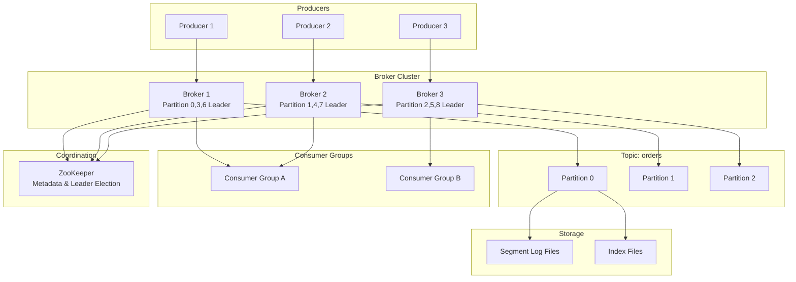

# 📨 Distributed Message Queue - System Design Interview

> **Interview Duration**: 45 minutes  
> **Difficulty**: Hard  
> **Type**: Infrastructure Component

---

## 1️⃣ Requirements & Estimation (5 min)

### Functional Requirements
1. **Produce messages**: Send messages to topics
2. **Consume messages**: Subscribe and receive messages
3. **Message ordering**: Guarantee order within partitions

### Non-Functional Requirements
- **Consistency Model**: Strong ordering per partition, at-least-once delivery
- **Latency**: < 10ms for produce, < 100ms for consume
- **Availability**: 99.99% (critical infrastructure)

### Back-of-Envelope Estimation

```
Assumptions:
- 10K producers, 50K consumers
- 1M messages/second peak
- Average message: 1KB
- Retention: 7 days

Traffic:
- Write throughput: 1M msg/s × 1KB = 1GB/s
- With replication (RF=3): 3GB/s

Storage:
- Daily: 1M × 86,400 × 1KB = 86TB/day
- 7-day retention: 86TB × 7 = 602TB
- With replication: 602TB × 3 = 1.8PB

Partitions:
- Target 10K msg/s per partition
- Total partitions: 1M / 10K = 100 partitions
```

---

## 2️⃣ High-Level Architecture (10 min)



### Technology Choices

| Component | Technology | Justification |
|-----------|------------|---------------|
| Storage | Append-only log | Sequential I/O, high throughput |
| Coordination | ZooKeeper | Leader election, metadata |
| Replication | ISR (In-Sync Replicas) | Durability with performance |
| Index | Sparse offset index | Fast seek without full index |
| Protocol | Binary TCP | Low overhead, batching |

---

## 3️⃣ API & Data Model (10 min)

### API Design

**Produce Message**
```http
POST /api/v1/topics/{topic}/messages
Content-Type: application/octet-stream
X-Partition-Key: order_123

{
    "order_id": "order_123",
    "product": "widget",
    "quantity": 5
}

Response 200:
{
    "topic": "orders",
    "partition": 7,
    "offset": 1234567,
    "timestamp": 1706436000000
}
```

**Consume Messages**
```http
GET /api/v1/topics/{topic}/partitions/{partition}/messages
    ?offset=1234500&limit=100
X-Consumer-Group: order-processor

Response 200:
{
    "messages": [
        {
            "offset": 1234500,
            "key": "order_123",
            "value": "base64_encoded_message",
            "timestamp": 1706436000000,
            "headers": {"trace_id": "abc123"}
        }
    ],
    "next_offset": 1234600
}
```

**Commit Offset**
```http
POST /api/v1/consumer-groups/{group}/offsets
Content-Type: application/json

{
    "topic": "orders",
    "partition": 7,
    "offset": 1234567
}

Response 200:
{
    "committed": true
}
```

### Data Model

**Message Format (On Disk)**
```
┌─────────────────────────────────────────────────────────┐
│                    Message Record                       │
├─────────────┬───────────────────────────────────────────┤
│ offset      │ 8 bytes (int64)                           │
│ message_size│ 4 bytes (int32)                           │
│ crc         │ 4 bytes (CRC32 of payload)                │
│ magic       │ 1 byte (version)                          │
│ attributes  │ 1 byte (compression, timestamp type)      │
│ timestamp   │ 8 bytes (int64)                           │
│ key_size    │ 4 bytes (int32, -1 if null)               │
│ key         │ variable                                  │
│ value_size  │ 4 bytes (int32)                           │
│ value       │ variable                                  │
│ headers     │ variable (array of key-value pairs)       │
└─────────────┴───────────────────────────────────────────┘
```

**Segment Files (On Disk)**
```
Topic: orders, Partition: 0
├── 00000000000000000000.log      # Messages offset 0-999999
├── 00000000000000000000.index    # Sparse offset index
├── 00000000000000000000.timeindex # Time-based index
├── 00000000000001000000.log      # Messages offset 1000000-1999999
├── 00000000000001000000.index
└── 00000000000001000000.timeindex
```

**Metadata (ZooKeeper)**
```
/brokers
  /ids
    /0 -> {"host": "broker-0", "port": 9092}
    /1 -> {"host": "broker-1", "port": 9092}
  /topics
    /orders
      /partitions
        /0
          /state -> {"leader": 0, "isr": [0, 1, 2]}
        /1
          /state -> {"leader": 1, "isr": [1, 2, 0]}

/consumers
  /order-processor
    /offsets
      /orders
        /0 -> 1234567
        /1 -> 987654
```

---

## 4️⃣ Component Deep Dive: Broker & Replication (15 min)

### Partition Assignment

```
┌─────────────────────────────────────────────────────────────────┐
│                    PARTITION DISTRIBUTION                       │
├─────────────────────────────────────────────────────────────────┤
│                                                                  │
│  Topic: orders (6 partitions, RF=3)                             │
│                                                                  │
│  ┌─────────┬─────────────────────────────────────────┐          │
│  │ Broker  │ Partitions (L=Leader, F=Follower)      │          │
│  ├─────────┼─────────────────────────────────────────┤          │
│  │ Broker 0│ P0(L), P1(F), P2(F), P3(L), P4(F), P5(F)│          │
│  │ Broker 1│ P0(F), P1(L), P2(F), P3(F), P4(L), P5(F)│          │
│  │ Broker 2│ P0(F), P1(F), P2(L), P3(F), P4(F), P5(L)│          │
│  └─────────┴─────────────────────────────────────────┘          │
│                                                                  │
│  Rack-Aware Placement:                                           │
│  • Replicas spread across racks/AZs                             │
│  • No single rack failure loses all replicas                    │
└─────────────────────────────────────────────────────────────────┘
```

### Pseudocode: Message Broker

```python
class MessageBroker:
    def __init__(self, broker_id: int, config: BrokerConfig):
        self.broker_id = broker_id
        self.partitions = {}  # partition_id -> PartitionLog
        self.replication_manager = ReplicationManager(self)
        self.zk = ZooKeeperClient(config.zk_servers)
        self.request_handler = RequestHandler(self)
    
    async def handle_produce(self, topic: str, partition: int,
                             messages: List[Message]) -> ProduceResult:
        """Handle produce request for a partition"""
        
        partition_log = self.partitions.get((topic, partition))
        
        if not partition_log:
            raise PartitionNotFoundError()
        
        if not partition_log.is_leader:
            # Redirect to leader
            leader = await self.zk.get_partition_leader(topic, partition)
            raise NotLeaderError(leader)
        
        # Append to local log
        offsets = await partition_log.append(messages)
        
        # Wait for ISR replication based on acks config
        if self.config.acks == 'all':
            await self._wait_for_isr_ack(topic, partition, offsets[-1])
        elif self.config.acks == 1:
            pass  # Leader ack only
        # acks=0 means no ack needed
        
        return ProduceResult(
            partition=partition,
            base_offset=offsets[0],
            log_append_time=time.time_ns()
        )
    
    async def handle_fetch(self, topic: str, partition: int,
                          offset: int, max_bytes: int) -> FetchResult:
        """Handle fetch request from consumer"""
        
        partition_log = self.partitions.get((topic, partition))
        
        if not partition_log:
            raise PartitionNotFoundError()
        
        # Read from log
        messages = await partition_log.read(
            start_offset=offset,
            max_bytes=max_bytes
        )
        
        return FetchResult(
            partition=partition,
            messages=messages,
            high_watermark=partition_log.high_watermark
        )


class PartitionLog:
    """Append-only log for a single partition"""
    
    SEGMENT_SIZE = 1 * 1024 * 1024 * 1024  # 1GB per segment
    INDEX_INTERVAL = 4096  # Index every 4KB
    
    def __init__(self, topic: str, partition: int, log_dir: str):
        self.topic = topic
        self.partition = partition
        self.log_dir = f"{log_dir}/{topic}-{partition}"
        self.segments = []
        self.active_segment = None
        self.next_offset = 0
        self.high_watermark = 0  # Last replicated offset
        self.is_leader = False
        self.lock = asyncio.Lock()
        
        self._load_segments()
    
    async def append(self, messages: List[Message]) -> List[int]:
        """Append messages to the log"""
        
        async with self.lock:
            offsets = []
            
            for message in messages:
                # Assign offset
                message.offset = self.next_offset
                offsets.append(self.next_offset)
                self.next_offset += 1
                
                # Serialize and append
                record_bytes = self._serialize_message(message)
                
                # Roll to new segment if needed
                if self.active_segment.size >= self.SEGMENT_SIZE:
                    await self._roll_segment()
                
                # Append to segment file
                position = await self.active_segment.append(record_bytes)
                
                # Update sparse index periodically
                if position % self.INDEX_INTERVAL < len(record_bytes):
                    await self.active_segment.add_index_entry(
                        message.offset, position
                    )
            
            return offsets
    
    async def read(self, start_offset: int, max_bytes: int) -> List[Message]:
        """Read messages starting from offset"""
        
        # Find segment containing start_offset
        segment = self._find_segment(start_offset)
        
        if not segment:
            raise OffsetOutOfRangeError()
        
        # Use index to find approximate position
        position = segment.lookup_offset(start_offset)
        
        messages = []
        bytes_read = 0
        
        while bytes_read < max_bytes:
            message = await segment.read_message(position)
            
            if message is None:
                # End of segment, try next
                segment = self._get_next_segment(segment)
                if not segment:
                    break
                position = 0
                continue
            
            if message.offset < start_offset:
                # Index pointed before target, scan forward
                position += message.size
                continue
            
            messages.append(message)
            bytes_read += message.size
            position += message.size
        
        return messages
    
    def _find_segment(self, offset: int) -> Optional[Segment]:
        """Binary search for segment containing offset"""
        
        for segment in reversed(self.segments):
            if segment.base_offset <= offset:
                return segment
        return None


class ReplicationManager:
    """Manages leader-follower replication"""
    
    def __init__(self, broker: MessageBroker):
        self.broker = broker
        self.fetch_sessions = {}  # broker_id -> FetchSession
    
    async def start_follower_fetch(self, topic: str, partition: int,
                                   leader_id: int):
        """Start fetching from leader as follower"""
        
        leader_addr = await self.broker.zk.get_broker_address(leader_id)
        
        while True:
            partition_log = self.broker.partitions[(topic, partition)]
            
            try:
                # Fetch from leader
                response = await self._fetch_from_leader(
                    leader_addr,
                    topic,
                    partition,
                    partition_log.next_offset
                )
                
                if response.messages:
                    # Append to local log
                    await partition_log.append(response.messages)
                    
                    # Update high watermark
                    partition_log.high_watermark = min(
                        partition_log.next_offset - 1,
                        response.high_watermark
                    )
                
            except Exception as e:
                logger.error(f"Replication error: {e}")
                await asyncio.sleep(1)
    
    async def handle_replica_fetch(self, follower_id: int, topic: str,
                                   partition: int, offset: int) -> FetchResult:
        """Handle fetch request from follower replica"""
        
        partition_log = self.broker.partitions[(topic, partition)]
        
        messages = await partition_log.read(offset, max_bytes=1024*1024)
        
        # Track follower progress for ISR
        self._update_follower_offset(follower_id, topic, partition, offset)
        
        # Update high watermark if all ISR caught up
        await self._maybe_advance_high_watermark(topic, partition)
        
        return FetchResult(
            partition=partition,
            messages=messages,
            high_watermark=partition_log.high_watermark
        )
    
    async def _maybe_advance_high_watermark(self, topic: str, partition: int):
        """Advance HW if all ISR replicas have caught up"""
        
        partition_log = self.broker.partitions[(topic, partition)]
        isr = await self.broker.zk.get_isr(topic, partition)
        
        # Find minimum offset across all ISR replicas
        min_offset = partition_log.next_offset - 1
        
        for replica_id in isr:
            if replica_id == self.broker.broker_id:
                continue
            replica_offset = self._get_follower_offset(
                replica_id, topic, partition
            )
            min_offset = min(min_offset, replica_offset)
        
        # Advance high watermark
        if min_offset > partition_log.high_watermark:
            partition_log.high_watermark = min_offset
```

### Consumer Group Coordination

```python
class ConsumerGroupCoordinator:
    """Manages consumer group membership and partition assignment"""
    
    def __init__(self, group_id: str, zk_client):
        self.group_id = group_id
        self.zk = zk_client
        self.members = {}
        self.assignments = {}
    
    async def join_group(self, consumer_id: str, 
                         subscriptions: List[str]) -> Assignment:
        """Handle consumer joining the group"""
        
        # Register member
        self.members[consumer_id] = ConsumerMember(
            consumer_id=consumer_id,
            subscriptions=subscriptions,
            last_heartbeat=time.time()
        )
        
        # Trigger rebalance
        await self._rebalance()
        
        return self.assignments[consumer_id]
    
    async def _rebalance(self):
        """Reassign partitions across consumers"""
        
        # Get all partitions for subscribed topics
        all_partitions = []
        for member in self.members.values():
            for topic in member.subscriptions:
                partitions = await self.zk.get_partitions(topic)
                all_partitions.extend([
                    (topic, p) for p in partitions
                ])
        
        all_partitions = list(set(all_partitions))
        all_partitions.sort()
        
        # Range assignment strategy
        members = sorted(self.members.keys())
        partitions_per_consumer = len(all_partitions) // len(members)
        remainder = len(all_partitions) % len(members)
        
        current = 0
        for i, consumer_id in enumerate(members):
            count = partitions_per_consumer + (1 if i < remainder else 0)
            self.assignments[consumer_id] = Assignment(
                partitions=all_partitions[current:current + count]
            )
            current += count
        
        # Notify all consumers of new assignment
        for consumer_id in members:
            await self._notify_assignment(consumer_id)
```

---

## 5️⃣ Bottlenecks & Trade-offs (5 min)

### Single Points of Failure & Mitigations

| SPOF | Impact | Mitigation |
|------|--------|------------|
| Leader broker | Partition unavailable | Fast leader election via ZK |
| ZooKeeper | No metadata updates | ZK ensemble (3-5 nodes) |
| All ISR down | Data loss possible | Min ISR config, unclean leader election |
| Producer | Messages lost | Producer retries, idempotence |

### Delivery Guarantees

```
┌─────────────────────────────────────────────────────────────┐
│                 DELIVERY GUARANTEE TRADE-OFFS               │
├─────────────────────────────────────────────────────────────┤
│                                                             │
│  AT-MOST-ONCE:                                              │
│  • Producer acks=0, consumer auto-commit                    │
│  • Fastest, may lose messages                               │
│  • Use case: Metrics, logs (acceptable loss)                │
│                                                             │
│  AT-LEAST-ONCE (Default):                                   │
│  • Producer acks=all, consumer manual commit after process  │
│  • May have duplicates on retry                             │
│  • Use case: Most applications (handle duplicates)          │
│                                                             │
│  EXACTLY-ONCE:                                              │
│  • Idempotent producer + transactional consumer             │
│  • Highest overhead                                         │
│  • Use case: Financial transactions                         │
│                                                             │
│  OUR DEFAULT: AT-LEAST-ONCE with idempotent writes          │
└─────────────────────────────────────────────────────────────┘
```

### CAP Theorem Trade-off

```
┌─────────────────────────────────────────────────────────────┐
│               MESSAGE QUEUE CAP CHOICE                      │
├─────────────────────────────────────────────────────────────┤
│  WE CHOOSE: CP (Consistency + Partition Tolerance)          │
│                                                             │
│  Reasoning:                                                 │
│  • Message ordering must be guaranteed                      │
│  • No duplicate messages (with idempotent producer)         │
│  • Durability is critical (acks=all)                        │
│  • Brief unavailability during leader election is OK        │
│                                                             │
│  Trade-off Accepted:                                        │
│  • Partition unavailable during leader election (~seconds)  │
│  • Writes rejected if ISR < min.insync.replicas             │
│                                                             │
│  Configuration for CP:                                      │
│  • acks=all (wait for all ISR)                              │
│  • min.insync.replicas=2                                    │
│  • unclean.leader.election=false                            │
└─────────────────────────────────────────────────────────────┘
```

### Scaling Strategies

| Challenge | Solution |
|-----------|----------|
| High throughput | Add partitions, batch messages |
| Consumer lag | Add consumers to group (up to #partitions) |
| Storage growth | Time-based retention, compaction |
| Cross-DC | MirrorMaker for async replication |

### Interview Pro Tips

1. **Explain partition as unit of parallelism**: More partitions = more consumers
2. **Discuss ISR**: How leader tracks in-sync replicas
3. **Mention log compaction**: Keep latest value per key
4. **High watermark**: Consumer only sees committed messages

---

## 📚 Navigation

← [Key-Value Store](./13-key-value-store.md) | [Home](./README.md) | [WhatsApp](./15-whatsapp.md) →
