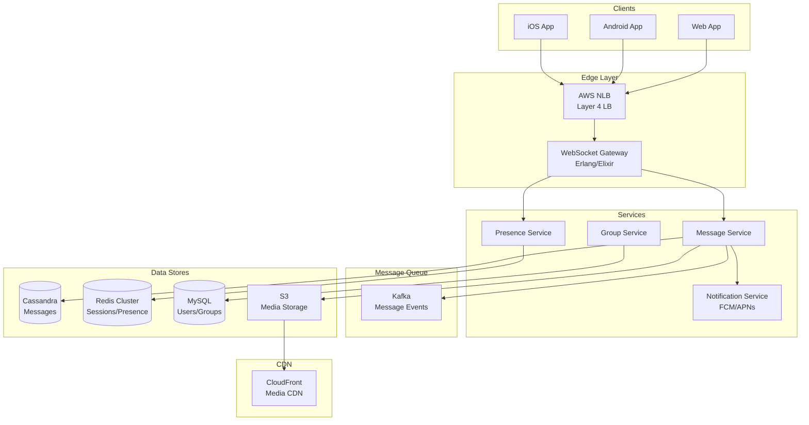

# 💬 WhatsApp - System Design Interview

> **Interview Duration**: 45 minutes  
> **Difficulty**: Hard  
> **Type**: Messaging Platform

---

## 1️⃣ Requirements & Estimation (5 min)

### Functional Requirements
1. **Send/receive messages**: One-on-one and group messaging
2. **Message status**: Sent, delivered, read receipts
3. **Media sharing**: Images, videos, documents

### Non-Functional Requirements
- **Consistency Model**: Strong ordering per conversation
- **Latency**: < 100ms message delivery
- **Availability**: 99.99% (messages must go through)

### Back-of-Envelope Estimation

```
Assumptions:
- 2B users, 500M DAU
- Average user sends 50 messages/day
- 20% messages have media (avg 200KB)
- Messages stored for 30 days

Traffic:
- Messages/day: 500M × 50 = 25B messages/day
- Message QPS: 25B / 86,400 ≈ 290K QPS
- Peak QPS: 290K × 3 = 870K QPS

Storage:
- Text messages/day: 25B × 0.8 × 500B = 10TB/day
- Media/day: 25B × 0.2 × 200KB = 1PB/day
- 30-day retention: 30PB (media dominates)

Connections:
- 500M concurrent WebSocket connections
- ~500 servers (1M connections each)
```

---

## 2️⃣ High-Level Architecture (10 min)



### Technology Choices

| Component | Technology | Justification |
|-----------|------------|---------------|
| Gateway | Erlang/Elixir | 2M+ connections per node |
| Messages | Cassandra | High write throughput, time-series |
| Sessions | Redis Cluster | Fast presence lookup |
| Media | S3 + CloudFront | Scalable blob storage |
| Push | FCM/APNs | Reliable mobile push |

---

## 3️⃣ API & Data Model (10 min)

### WebSocket Protocol

**Send Message**
```json
// Client → Server
{
    "type": "message",
    "id": "msg_uuid_123",
    "to": "user_456",
    "content": {
        "type": "text",
        "text": "Hello!"
    },
    "timestamp": 1706436000000
}

// Server → Client (ACK)
{
    "type": "ack",
    "id": "msg_uuid_123",
    "status": "sent",
    "server_timestamp": 1706436000100
}

// Server → Recipient
{
    "type": "message",
    "id": "msg_uuid_123",
    "from": "user_123",
    "content": {
        "type": "text",
        "text": "Hello!"
    },
    "timestamp": 1706436000100
}
```

**Message Status Updates**
```json
// Delivered receipt
{
    "type": "status",
    "message_id": "msg_uuid_123",
    "status": "delivered",
    "timestamp": 1706436000200
}

// Read receipt
{
    "type": "status",
    "message_id": "msg_uuid_123",
    "status": "read",
    "timestamp": 1706436005000
}
```

### API Design (REST for non-realtime)

**Upload Media**
```http
POST /api/v1/media/upload
Authorization: Bearer {token}
Content-Type: multipart/form-data

Response 200:
{
    "media_id": "media_789",
    "url": "https://cdn.whatsapp.com/media/...",
    "thumbnail_url": "https://cdn.whatsapp.com/thumb/...",
    "encryption_key": "base64_key..."
}
```

### Data Model

**Messages (Cassandra)**
```sql
CREATE TABLE messages (
    conversation_id  TEXT,           -- Partition Key (sorted user IDs)
    message_id       TIMEUUID,       -- Clustering Key
    sender_id        TEXT,
    content_type     TEXT,           -- text, image, video, document
    content          BLOB,           -- Encrypted content
    media_url        TEXT,
    status           TEXT,           -- sent, delivered, read
    created_at       TIMESTAMP,
    PRIMARY KEY (conversation_id, message_id)
) WITH CLUSTERING ORDER BY (message_id DESC);

-- For syncing: get messages after a point
CREATE TABLE message_sync (
    user_id          TEXT,           -- Partition Key
    bucket           INT,            -- Daily bucket for partitioning
    message_id       TIMEUUID,       -- Clustering Key
    conversation_id  TEXT,
    PRIMARY KEY ((user_id, bucket), message_id)
) WITH CLUSTERING ORDER BY (message_id DESC);
```

**Groups (MySQL)**
```sql
CREATE TABLE groups (
    group_id         BIGINT PRIMARY KEY,
    name             VARCHAR(100),
    description      TEXT,
    avatar_url       VARCHAR(255),
    created_by       BIGINT,
    created_at       TIMESTAMP DEFAULT NOW(),
    member_count     INT DEFAULT 0
);

CREATE TABLE group_members (
    group_id         BIGINT,
    user_id          BIGINT,
    role             ENUM('admin', 'member'),
    joined_at        TIMESTAMP,
    PRIMARY KEY (group_id, user_id),
    INDEX idx_user_groups (user_id)
);
```

**User Sessions (Redis)**
```
# User online status
HSET presence:user_123 status "online" last_seen 1706436000 gateway "gw-1"
EXPIRE presence:user_123 120

# User's active gateway connections
SET session:user_123 "gateway_server_5"
EXPIRE session:user_123 86400

# Pending messages for offline user
LPUSH offline:user_456 '{"message_id":"...","encrypted_content":"..."}'
```

---

## 4️⃣ Component Deep Dive: Message Delivery (15 min)

### Message Flow Architecture

```
┌─────────────────────────────────────────────────────────────────┐
│                    MESSAGE DELIVERY FLOW                        │
├─────────────────────────────────────────────────────────────────┤
│                                                                  │
│  SENDER ONLINE, RECEIVER ONLINE:                                │
│  ┌──────┐    ┌─────────┐    ┌─────────┐    ┌──────────┐        │
│  │ User │───▶│Gateway 1│───▶│ Message │───▶│ Gateway 2│        │
│  │  A   │    │         │    │ Service │    │          │        │
│  └──────┘    └─────────┘    └────┬────┘    └────┬─────┘        │
│       ▲                          │              │               │
│       │                          ▼              ▼               │
│    ACK│                    ┌──────────┐   ┌──────┐             │
│       └────────────────────│Cassandra │   │User B│             │
│                            └──────────┘   └──────┘             │
│                                                                  │
│  RECEIVER OFFLINE:                                               │
│  ┌──────┐    ┌─────────┐    ┌─────────┐    ┌──────────┐        │
│  │ User │───▶│Gateway 1│───▶│ Message │───▶│   Push   │        │
│  │  A   │    │         │    │ Service │    │  (FCM)   │        │
│  └──────┘    └─────────┘    └────┬────┘    └──────────┘        │
│                                  │                              │
│                            ┌─────▼──────┐                       │
│                            │ Offline    │                       │
│                            │ Queue      │                       │
│                            └────────────┘                       │
└─────────────────────────────────────────────────────────────────┘
```

### Pseudocode: Message Service

```python
class MessageService:
    def __init__(self, cassandra, redis, kafka, push_service):
        self.db = cassandra
        self.redis = redis
        self.kafka = kafka
        self.push = push_service
    
    async def send_message(self, sender_id: str, recipient_id: str,
                          content: MessageContent) -> SendResult:
        """Process and deliver a message"""
        
        # Generate message ID (TimeUUID for ordering)
        message_id = uuid.uuid1()  # Time-based UUID
        timestamp = time.time_ns() // 1_000_000
        
        # Create conversation ID (canonical ordering)
        conversation_id = self._get_conversation_id(sender_id, recipient_id)
        
        message = Message(
            id=message_id,
            conversation_id=conversation_id,
            sender_id=sender_id,
            content=content,
            status='sent',
            created_at=timestamp
        )
        
        # Store message (write-ahead for durability)
        await self._store_message(message)
        
        # Send ACK to sender immediately
        await self._send_ack(sender_id, message_id, 'sent')
        
        # Deliver to recipient
        await self._deliver_message(recipient_id, message)
        
        return SendResult(message_id=message_id, timestamp=timestamp)
    
    async def _deliver_message(self, recipient_id: str, message: Message):
        """Deliver message to recipient (online or offline)"""
        
        # Check if recipient is online
        session = await self.redis.get(f"session:{recipient_id}")
        
        if session:
            # Online: Send via WebSocket gateway
            gateway_id = session.decode()
            
            try:
                await self._send_to_gateway(gateway_id, recipient_id, message)
                
                # Update status to delivered
                await self._update_message_status(message.id, 'delivered')
                
                # Notify sender of delivery
                await self._send_status_update(
                    message.sender_id, message.id, 'delivered'
                )
                return
                
            except GatewayUnavailableError:
                # Gateway down, treat as offline
                pass
        
        # Offline: Queue message and send push notification
        await self._queue_offline_message(recipient_id, message)
        await self._send_push_notification(recipient_id, message)
    
    async def _queue_offline_message(self, user_id: str, message: Message):
        """Queue message for offline user"""
        
        # Add to Redis list (fast retrieval on reconnect)
        serialized = message.to_json()
        await self.redis.lpush(f"offline:{user_id}", serialized)
        
        # Set expiry (messages older than 30 days are deleted)
        await self.redis.expire(f"offline:{user_id}", 30 * 86400)
    
    async def sync_messages(self, user_id: str, 
                           last_sync: int) -> List[Message]:
        """Sync messages for reconnecting user"""
        
        # Get offline queue first (most recent)
        offline_messages = await self.redis.lrange(
            f"offline:{user_id}", 0, -1
        )
        
        # Clear offline queue
        await self.redis.delete(f"offline:{user_id}")
        
        # Parse and return
        messages = [Message.from_json(m) for m in offline_messages]
        
        # Also fetch from Cassandra for older messages
        db_messages = await self._fetch_messages_since(user_id, last_sync)
        
        # Merge and deduplicate
        all_messages = self._merge_messages(messages, db_messages)
        
        return all_messages


class WebSocketGateway:
    """Handles WebSocket connections for a gateway server"""
    
    def __init__(self, redis, message_service, gateway_id):
        self.redis = redis
        self.messages = message_service
        self.gateway_id = gateway_id
        self.connections = {}  # user_id -> WebSocket
    
    async def handle_connection(self, websocket, user_id: str):
        """Handle new WebSocket connection"""
        
        # Register connection
        self.connections[user_id] = websocket
        
        # Update presence in Redis
        await self.redis.set(f"session:{user_id}", self.gateway_id)
        await self.redis.hset(
            f"presence:{user_id}",
            mapping={'status': 'online', 'gateway': self.gateway_id}
        )
        
        # Sync offline messages
        messages = await self.messages.sync_messages(user_id, 0)
        for msg in messages:
            await self._send_to_client(websocket, msg)
        
        try:
            await self._message_loop(websocket, user_id)
        finally:
            await self._handle_disconnect(user_id)
    
    async def _message_loop(self, websocket, user_id: str):
        """Main message handling loop"""
        
        async for raw_message in websocket:
            message = json.loads(raw_message)
            msg_type = message.get('type')
            
            if msg_type == 'message':
                await self._handle_outgoing_message(user_id, message)
            elif msg_type == 'status':
                await self._handle_status_update(user_id, message)
            elif msg_type == 'typing':
                await self._handle_typing_indicator(user_id, message)
            elif msg_type == 'ping':
                await websocket.send(json.dumps({'type': 'pong'}))
    
    async def deliver_to_user(self, user_id: str, message: Message):
        """Deliver message to locally connected user"""
        
        websocket = self.connections.get(user_id)
        if not websocket:
            raise UserNotConnectedError()
        
        await self._send_to_client(websocket, message)
        
        # Send delivered receipt
        await self._send_delivery_receipt(message)
```

### End-to-End Encryption

```python
class E2EEncryption:
    """Signal Protocol-based E2E encryption"""
    
    def __init__(self, key_store):
        self.keys = key_store
    
    def encrypt_message(self, sender_id: str, recipient_id: str,
                       plaintext: bytes) -> EncryptedMessage:
        """Encrypt message using recipient's public key"""
        
        # Get recipient's public identity key
        identity_key = self.keys.get_identity_key(recipient_id)
        
        # Get/create session
        session = self.keys.get_session(sender_id, recipient_id)
        
        if not session:
            # Perform X3DH key agreement
            session = self._x3dh_key_exchange(sender_id, recipient_id)
        
        # Double Ratchet encryption
        ciphertext, message_key = self._ratchet_encrypt(session, plaintext)
        
        return EncryptedMessage(
            ciphertext=ciphertext,
            sender_key=session.sender_public_key,
            message_key_id=message_key.id
        )
    
    def decrypt_message(self, recipient_id: str, sender_id: str,
                       encrypted: EncryptedMessage) -> bytes:
        """Decrypt message using Double Ratchet"""
        
        session = self.keys.get_session(recipient_id, sender_id)
        
        if not session:
            # Initialize session from sender's public key
            session = self._init_session_from_prekey(
                recipient_id, sender_id, encrypted.sender_key
            )
        
        # Ratchet decrypt
        plaintext = self._ratchet_decrypt(session, encrypted.ciphertext)
        
        return plaintext
```

---

## 5️⃣ Bottlenecks & Trade-offs (5 min)

### Single Points of Failure & Mitigations

| SPOF | Impact | Mitigation |
|------|--------|------------|
| Gateway crash | Users disconnected | Auto-reconnect, session migration |
| Cassandra | Can't store/retrieve messages | Multi-DC replication |
| Redis (sessions) | Can't route messages | Redis Cluster, fallback to broadcast |
| Push service | Offline users don't get notified | Multi-provider (FCM + APNs) |

### Message Ordering Challenge

```
┌─────────────────────────────────────────────────────────────┐
│                 MESSAGE ORDERING STRATEGY                   │
├─────────────────────────────────────────────────────────────┤
│                                                             │
│  CHALLENGE: Messages from different devices, network delays │
│                                                             │
│  SOLUTION: TimeUUID + Client Timestamp                      │
│                                                             │
│  1. Client generates local timestamp                        │
│  2. Server assigns TimeUUID on receipt                      │
│  3. Store both, display by server timestamp                 │
│  4. Client reorders if needed on sync                       │
│                                                             │
│  For Group Messages:                                        │
│  • Single partition per group in Cassandra                  │
│  • Messages ordered by TimeUUID within partition            │
│  • All members see same order                               │
│                                                             │
│  Edge Case: Clock skew between servers                      │
│  • Use NTP for server time sync                             │
│  • TimeUUID includes node ID for uniqueness                 │
└─────────────────────────────────────────────────────────────┘
```

### CAP Theorem Trade-off

```
┌─────────────────────────────────────────────────────────────┐
│                   WHATSAPP CAP CHOICE                       │
├─────────────────────────────────────────────────────────────┤
│  WE CHOOSE: AP (Availability + Partition Tolerance)         │
│                                                             │
│  Reasoning:                                                 │
│  • Messages must always be sendable                         │
│  • Offline messaging is critical feature                    │
│  • Delivery can be delayed but must succeed                 │
│  • User expects to always be able to send                   │
│                                                             │
│  Trade-off Accepted:                                        │
│  • Delivery/read receipts may be delayed                    │
│  • Messages may appear out of order briefly                 │
│  • Group member list may be stale during partition          │
│                                                             │
│  Consistency where it matters:                              │
│  • Message persistence (Cassandra QUORUM writes)            │
│  • E2E key exchange (must be accurate)                      │
└─────────────────────────────────────────────────────────────┘
```

### Scaling Strategies

| Challenge | Solution |
|-----------|----------|
| 500M connections | Erlang/Elixir gateways (2M each) |
| Hot group chats | Partition large groups, shard by group_id |
| Media storage | S3 with lifecycle policies |
| Global latency | Multi-region with message routing |

### Interview Pro Tips

1. **Start with connection management**: WebSocket + presence
2. **Explain E2E encryption at high level**: Signal Protocol
3. **Discuss offline message queue**: Redis list with push fallback
4. **Mention media handling**: Pre-signed S3 URLs, CDN caching

---

## 📚 Navigation

← [Message Queue](./14-message-queue.md) | [Home](./README.md) | [Gmail](./16-gmail.md) →
