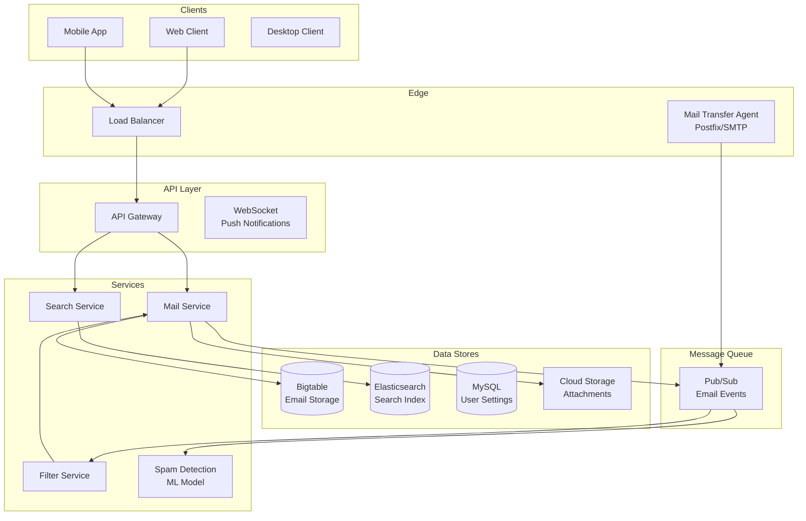

# 📧 Gmail - System Design Interview

> **Interview Duration**: 45 minutes  
> **Difficulty**: Hard  
> **Type**: Email System

---

## 1️⃣ Requirements & Estimation (5 min)

### Functional Requirements
1. **Send/receive emails**: Compose and receive emails with attachments
2. **Search emails**: Full-text search across all emails
3. **Organize emails**: Labels, folders, filters, spam detection

### Non-Functional Requirements
- **Consistency Model**: Strong consistency for inbox operations
- **Latency**: < 200ms for inbox load, < 2s for search
- **Availability**: 99.99% (email is critical communication)

### Back-of-Envelope Estimation

```
Assumptions:
- 1.8B users, 500M DAU
- Average user receives 50 emails/day, sends 10
- Average email: 50KB (with small attachments)
- 10% have large attachments (avg 5MB)

Traffic:
- Emails received/day: 1.8B × 50 = 90B emails/day
- Write QPS: 90B / 86,400 ≈ 1M QPS
- Search queries: 500M × 5 = 2.5B/day ≈ 29K QPS

Storage:
- Text emails/day: 90B × 0.9 × 50KB = 4PB/day
- Attachments/day: 90B × 0.1 × 5MB = 45PB/day
- Total: ~50PB/day, 18EB/year
```

---

## 2️⃣ High-Level Architecture (10 min)



### Technology Choices

| Component | Technology | Justification |
|-----------|------------|---------------|
| Email Storage | Bigtable | Wide-column, scalable, sorted |
| Search | Elasticsearch | Full-text search, inverted index |
| Attachments | Cloud Storage | Blob storage, deduplication |
| MTA | Postfix | Industry standard SMTP |
| Spam Detection | TensorFlow | ML-based classification |

---

## 3️⃣ API & Data Model (10 min)

### API Design

**Get Inbox (with pagination)**
```http
GET /api/v1/messages?labelIds=INBOX&maxResults=50&pageToken={token}
Authorization: Bearer {token}

Response 200:
{
    "messages": [
        {
            "id": "msg_123",
            "threadId": "thread_456",
            "snippet": "Hey, just wanted to follow up...",
            "labelIds": ["INBOX", "UNREAD", "IMPORTANT"],
            "internalDate": "1706436000000"
        }
    ],
    "nextPageToken": "xyz...",
    "resultSizeEstimate": 1250
}
```

**Search Emails**
```http
GET /api/v1/messages?q=from:john@example.com+has:attachment+after:2026/01/01
Authorization: Bearer {token}

Response 200:
{
    "messages": [
        {"id": "msg_789", "threadId": "thread_012", "snippet": "..."}
    ],
    "resultSizeEstimate": 15
}
```

**Send Email**
```http
POST /api/v1/messages/send
Authorization: Bearer {token}
Content-Type: message/rfc822

From: user@gmail.com
To: recipient@example.com
Subject: Hello
Content-Type: multipart/mixed; boundary="boundary123"

--boundary123
Content-Type: text/plain

Email body here.

--boundary123
Content-Type: application/pdf
Content-Disposition: attachment; filename="document.pdf"

[base64 encoded attachment]
--boundary123--

Response 200:
{
    "id": "msg_new_123",
    "threadId": "thread_789",
    "labelIds": ["SENT"]
}
```

### Data Model

**Emails (Bigtable)**
```
Row Key: user_id#reverse_timestamp#message_id

Column Families:
- metadata: subject, from, to, cc, bcc, date, snippet, size
- headers: all RFC822 headers
- labels: INBOX, SENT, SPAM, TRASH, custom labels
- content: body_plain, body_html
- attachments: list of attachment references

Example:
user_123#9999999999999-1706436000#msg_456
  metadata:subject = "Meeting Tomorrow"
  metadata:from = "john@example.com"
  metadata:snippet = "Hey, can we meet at 3pm..."
  labels:INBOX = true
  labels:UNREAD = true
  content:body_plain = "Hey, can we meet at 3pm tomorrow?"
```

**Threads (Bigtable)**
```
Row Key: user_id#thread_id

Column Families:
- metadata: subject, participants, last_message_date
- messages: list of message_ids in order

Example:
user_123#thread_456
  metadata:subject = "Re: Meeting Tomorrow"
  metadata:last_message = 1706436000000
  messages:0 = msg_100
  messages:1 = msg_200
  messages:2 = msg_300
```

**Search Index (Elasticsearch)**
```json
{
    "mappings": {
        "properties": {
            "user_id": {"type": "keyword"},
            "message_id": {"type": "keyword"},
            "thread_id": {"type": "keyword"},
            "from": {"type": "text", "analyzer": "email_analyzer"},
            "to": {"type": "text", "analyzer": "email_analyzer"},
            "subject": {"type": "text"},
            "body": {"type": "text"},
            "labels": {"type": "keyword"},
            "has_attachment": {"type": "boolean"},
            "attachment_names": {"type": "text"},
            "date": {"type": "date"},
            "size": {"type": "long"}
        }
    }
}
```

---

## 4️⃣ Component Deep Dive: Email Ingestion & Search (15 min)

### Email Ingestion Pipeline

```
┌─────────────────────────────────────────────────────────────────┐
│                    EMAIL INGESTION FLOW                         │
├─────────────────────────────────────────────────────────────────┤
│                                                                  │
│  ┌──────────┐    ┌───────────┐    ┌────────────────┐           │
│  │   SMTP   │───▶│    MTA    │───▶│  Spam Filter   │           │
│  │ Incoming │    │ (Postfix) │    │  (ML Model)    │           │
│  └──────────┘    └───────────┘    └───────┬────────┘           │
│                                           │                      │
│                           ┌───────────────▼───────────────┐     │
│                           │        Message Queue          │     │
│                           │         (Pub/Sub)             │     │
│                           └───────────────┬───────────────┘     │
│                                           │                      │
│           ┌───────────────┬───────────────┼───────────────┐     │
│           ▼               ▼               ▼               ▼     │
│  ┌─────────────┐ ┌─────────────┐ ┌─────────────┐ ┌──────────┐  │
│  │   Store     │ │   Index     │ │   Apply     │ │  Push    │  │
│  │ (Bigtable)  │ │ (ES)        │ │  Filters    │ │  Notify  │  │
│  └─────────────┘ └─────────────┘ └─────────────┘ └──────────┘  │
│                                                                  │
└─────────────────────────────────────────────────────────────────┘
```

### Pseudocode: Email Service

```python
class EmailService:
    def __init__(self, bigtable, elasticsearch, gcs, pubsub):
        self.db = bigtable
        self.search = elasticsearch
        self.storage = gcs
        self.pubsub = pubsub
    
    async def receive_email(self, raw_email: bytes) -> Email:
        """Process incoming email"""
        
        # Parse RFC822 email
        parsed = self._parse_email(raw_email)
        
        # Run spam detection
        spam_score = await self.spam_detector.classify(parsed)
        
        if spam_score > 0.9:
            labels = ['SPAM']
        else:
            labels = ['INBOX', 'UNREAD']
            if spam_score > 0.5:
                labels.append('CATEGORY_PROMOTIONS')
        
        # Extract and store attachments
        attachment_refs = []
        for attachment in parsed.attachments:
            ref = await self._store_attachment(attachment)
            attachment_refs.append(ref)
        
        # Create email record
        email = Email(
            id=self._generate_id(),
            thread_id=self._get_or_create_thread(parsed),
            user_id=parsed.to_user_id,
            from_addr=parsed.from_addr,
            to_addrs=parsed.to_addrs,
            subject=parsed.subject,
            body_plain=parsed.body_plain,
            body_html=parsed.body_html,
            labels=labels,
            attachments=attachment_refs,
            received_at=time.time_ns() // 1_000_000
        )
        
        # Store in Bigtable
        await self._store_email(email)
        
        # Index for search (async)
        await self.pubsub.publish('email-index', email.to_dict())
        
        # Notify user (if online)
        await self.pubsub.publish('email-notify', {
            'user_id': email.user_id,
            'email_id': email.id
        })
        
        return email
    
    async def _store_email(self, email: Email):
        """Store email in Bigtable"""
        
        # Row key: user_id#reverse_timestamp#message_id
        # Reverse timestamp for descending order (newest first)
        reverse_ts = 9999999999999 - email.received_at
        row_key = f"{email.user_id}#{reverse_ts}#{email.id}"
        
        row = self.db.direct_row(row_key)
        
        # Metadata
        row.set_cell('metadata', 'subject', email.subject)
        row.set_cell('metadata', 'from', email.from_addr)
        row.set_cell('metadata', 'to', ','.join(email.to_addrs))
        row.set_cell('metadata', 'date', str(email.received_at))
        row.set_cell('metadata', 'snippet', email.body_plain[:100])
        
        # Labels
        for label in email.labels:
            row.set_cell('labels', label, 'true')
        
        # Content
        row.set_cell('content', 'body_plain', email.body_plain)
        row.set_cell('content', 'body_html', email.body_html)
        
        # Attachments
        for i, att in enumerate(email.attachments):
            row.set_cell('attachments', str(i), json.dumps(att))
        
        await row.commit()
        
        # Update thread
        await self._update_thread(email)
    
    async def search_emails(self, user_id: str, query: str,
                           limit: int = 50) -> SearchResult:
        """Search user's emails"""
        
        # Parse query into Elasticsearch DSL
        es_query = self._parse_search_query(query)
        
        # Add user filter
        es_query = {
            'bool': {
                'must': [
                    {'term': {'user_id': user_id}},
                    es_query
                ]
            }
        }
        
        # Execute search
        result = await self.search.search(
            index='emails',
            body={
                'query': es_query,
                'size': limit,
                'sort': [{'date': 'desc'}],
                '_source': ['message_id', 'thread_id', 'snippet']
            }
        )
        
        return SearchResult(
            messages=[hit['_source'] for hit in result['hits']['hits']],
            total=result['hits']['total']['value']
        )
    
    def _parse_search_query(self, query: str) -> dict:
        """Parse Gmail-style search query to Elasticsearch"""
        
        # Examples:
        # from:john@example.com -> {"match": {"from": "john@example.com"}}
        # has:attachment -> {"term": {"has_attachment": true}}
        # after:2026/01/01 -> {"range": {"date": {"gte": "2026-01-01"}}}
        
        clauses = []
        
        # Parse operators
        operators = re.findall(r'(\w+):(\S+)', query)
        
        for op, value in operators:
            if op == 'from':
                clauses.append({'match': {'from': value}})
            elif op == 'to':
                clauses.append({'match': {'to': value}})
            elif op == 'subject':
                clauses.append({'match': {'subject': value}})
            elif op == 'has' and value == 'attachment':
                clauses.append({'term': {'has_attachment': True}})
            elif op == 'after':
                clauses.append({'range': {'date': {'gte': value}}})
            elif op == 'before':
                clauses.append({'range': {'date': {'lte': value}}})
            elif op == 'label':
                clauses.append({'term': {'labels': value}})
        
        # Remaining text is full-text search
        remaining = re.sub(r'\w+:\S+', '', query).strip()
        if remaining:
            clauses.append({
                'multi_match': {
                    'query': remaining,
                    'fields': ['subject^2', 'body', 'from', 'to']
                }
            })
        
        if len(clauses) == 1:
            return clauses[0]
        return {'bool': {'must': clauses}}


class ThreadService:
    """Manages email threads/conversations"""
    
    def __init__(self, bigtable):
        self.db = bigtable
    
    def get_or_create_thread(self, email: Email) -> str:
        """Find existing thread or create new one"""
        
        # Use References and In-Reply-To headers
        if email.in_reply_to:
            # Find thread by message-id reference
            thread = self._find_thread_by_message_id(
                email.user_id, email.in_reply_to
            )
            if thread:
                return thread.id
        
        # Fallback: match by normalized subject
        normalized_subject = self._normalize_subject(email.subject)
        thread = self._find_thread_by_subject(
            email.user_id,
            normalized_subject,
            email.from_addr
        )
        
        if thread:
            return thread.id
        
        # Create new thread
        return self._create_thread(email)
    
    def _normalize_subject(self, subject: str) -> str:
        """Remove Re:, Fwd:, etc."""
        return re.sub(r'^(re|fwd|fw):\s*', '', subject, flags=re.I).strip()
```

### Spam Detection Pipeline

```python
class SpamDetector:
    """ML-based spam classification"""
    
    def __init__(self, model_path: str):
        self.model = tf.saved_model.load(model_path)
        self.tokenizer = BertTokenizer.from_pretrained('bert-base-uncased')
    
    async def classify(self, email: ParsedEmail) -> float:
        """Return spam probability (0-1)"""
        
        # Feature extraction
        features = self._extract_features(email)
        
        # Text classification
        text_score = await self._classify_text(email.subject, email.body_plain)
        
        # Header analysis
        header_score = self._analyze_headers(email.headers)
        
        # Sender reputation
        reputation_score = await self._get_sender_reputation(email.from_addr)
        
        # Combine scores
        spam_probability = (
            text_score * 0.5 +
            header_score * 0.3 +
            (1 - reputation_score) * 0.2
        )
        
        return spam_probability
    
    async def _classify_text(self, subject: str, body: str) -> float:
        """BERT-based text classification"""
        
        text = f"{subject} {body[:500]}"
        inputs = self.tokenizer(
            text, 
            return_tensors='tf',
            max_length=512,
            truncation=True
        )
        
        outputs = self.model(inputs)
        return float(tf.nn.softmax(outputs.logits)[0][1])
```

---

## 5️⃣ Bottlenecks & Trade-offs (5 min)

### Single Points of Failure & Mitigations

| SPOF | Impact | Mitigation |
|------|--------|------------|
| Bigtable | Email storage fails | Multi-region replication |
| Elasticsearch | Search unavailable | ES cluster with replicas |
| MTA | Can't receive emails | Multiple MX records |
| Spam filter | Spam gets through or false positives | Fallback rules, user feedback |

### Storage vs Search Trade-off

```
┌─────────────────────────────────────────────────────────────┐
│              EMAIL STORAGE TRADE-OFFS                       │
├─────────────────────────────────────────────────────────────┤
│                                                             │
│  OPTION 1: Store everything in Elasticsearch               │
│  ✅ Single source of truth                                 │
│  ✅ Fast full-text search                                  │
│  ❌ Expensive at petabyte scale                            │
│  ❌ Not optimized for sequential reads                     │
│                                                             │
│  OPTION 2: Bigtable + Elasticsearch (Our Choice)           │
│  ✅ Cost-effective storage in Bigtable                     │
│  ✅ Fast search in Elasticsearch                           │
│  ✅ Each optimized for its workload                        │
│  ❌ Dual-write complexity                                  │
│  ❌ Eventual consistency between stores                    │
│                                                             │
│  OPTION 3: Bigtable + Offline Search Index                 │
│  ✅ Cheapest storage                                       │
│  ❌ Slow search (batch indexing)                           │
└─────────────────────────────────────────────────────────────┘
```

### CAP Theorem Trade-off

```
┌─────────────────────────────────────────────────────────────┐
│                     GMAIL CAP CHOICE                        │
├─────────────────────────────────────────────────────────────┤
│  WE CHOOSE: CP for inbox, AP for search                     │
│                                                             │
│  Inbox Operations (CP):                                     │
│  • Email delivery must be consistent                        │
│  • Labels/read status must be accurate                      │
│  • Can tolerate brief unavailability                        │
│                                                             │
│  Search Operations (AP):                                    │
│  • Search can be slightly stale                             │
│  • Always return results (even if incomplete)               │
│  • Eventually consistent with inbox                         │
│                                                             │
│  Trade-off Accepted:                                        │
│  • New emails may not be searchable for seconds             │
│  • Label changes may not reflect in search immediately      │
│  • Different replicas may show slightly different results   │
└─────────────────────────────────────────────────────────────┘
```

### Scaling Strategies

| Challenge | Solution |
|-----------|----------|
| Petabytes of storage | Bigtable sharding by user |
| Search at scale | Elasticsearch per-user sharding |
| Spam detection | ML inference with GPU clusters |
| Attachment storage | Deduplication, compression |

### Interview Pro Tips

1. **Start with email flow**: SMTP → MTA → Processing → Storage
2. **Explain threading**: Reference/In-Reply-To headers
3. **Discuss search trade-offs**: Real-time vs batch indexing
4. **Mention attachment handling**: Dedup, virus scanning

---

## 📚 Navigation

← [WhatsApp](./15-whatsapp.md) | [Home](./README.md) | [Tinder](./17-tinder.md) →
