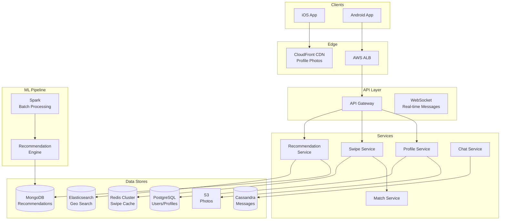

# 💕 Tinder - System Design Interview

> **Interview Duration**: 45 minutes  
> **Difficulty**: Medium-Hard  
> **Type**: Dating/Matching Platform

---

## 1️⃣ Requirements & Estimation (5 min)

### Functional Requirements
1. **Profile & Discovery**: View potential matches based on preferences
2. **Swipe**: Like/pass on profiles, mutual likes create matches
3. **Messaging**: Chat with matched users

### Non-Functional Requirements
- **Consistency Model**: Eventual consistency for recommendations
- **Latency**: < 100ms for swipe, < 200ms for profile load
- **Availability**: 99.9% (entertainment app)

### Back-of-Envelope Estimation

```
Assumptions:
- 75M MAU, 15M DAU
- Average user swipes 100 times/day
- 10% swipes are likes, 5% of likes are mutual (matches)

Traffic:
- Swipes/day: 15M × 100 = 1.5B swipes/day
- Swipe QPS: 1.5B / 86,400 ≈ 17K QPS
- Peak QPS: 17K × 3 = 51K QPS

Matches:
- Likes/day: 1.5B × 0.1 = 150M likes/day
- Matches/day: 150M × 0.05 = 7.5M matches/day

Storage:
- User profiles: 75M × 5KB = 375GB
- Photos: 75M × 5 photos × 500KB = 187TB
- Swipe history: 1.5B × 20 bytes = 30GB/day
```

---

## 2️⃣ High-Level Architecture (10 min)



### Technology Choices

| Component | Technology | Justification |
|-----------|------------|---------------|
| User Store | PostgreSQL | ACID for user data |
| Geo Search | Elasticsearch | Geo-distance queries |
| Swipe Cache | Redis | Fast swipe dedup |
| Recommendations | MongoDB | Pre-computed batches |
| Chat | Cassandra | Time-series messages |
| Photos | S3 + CloudFront | CDN for global delivery |

---

## 3️⃣ API & Data Model (10 min)

### API Design

**Get Recommendations**
```http
GET /api/v1/recommendations?limit=20
Authorization: Bearer {token}

Response 200:
{
    "profiles": [
        {
            "user_id": "user_123",
            "name": "Sarah",
            "age": 28,
            "bio": "Coffee enthusiast ☕",
            "photos": [
                "https://cdn.tinder.com/photos/abc123.jpg"
            ],
            "distance_km": 5,
            "common_interests": ["hiking", "photography"]
        }
    ],
    "remaining": 150
}
```

**Swipe (Like/Pass)**
```http
POST /api/v1/swipes
Authorization: Bearer {token}

{
    "target_user_id": "user_456",
    "action": "like"  // or "pass", "super_like"
}

Response 200 (No Match):
{
    "matched": false
}

Response 200 (Match!):
{
    "matched": true,
    "match_id": "match_789",
    "matched_user": {
        "user_id": "user_456",
        "name": "Sarah",
        "photo": "https://cdn.tinder.com/..."
    }
}
```

### Data Model

**Users & Profiles (PostgreSQL)**
```sql
CREATE TABLE users (
    user_id         UUID PRIMARY KEY,
    phone_hash      VARCHAR(64) UNIQUE,
    email           VARCHAR(255),
    created_at      TIMESTAMP DEFAULT NOW(),
    last_active     TIMESTAMP,
    is_premium      BOOLEAN DEFAULT FALSE
);

CREATE TABLE profiles (
    user_id         UUID PRIMARY KEY REFERENCES users(user_id),
    name            VARCHAR(50) NOT NULL,
    birth_date      DATE NOT NULL,
    gender          VARCHAR(20),
    bio             TEXT,
    job_title       VARCHAR(100),
    company         VARCHAR(100),
    school          VARCHAR(100),
    interests       TEXT[],
    photos          TEXT[],  -- S3 URLs
    location        GEOGRAPHY(Point, 4326),
    location_updated TIMESTAMP,
    INDEX idx_location USING GIST(location)
);

CREATE TABLE preferences (
    user_id         UUID PRIMARY KEY REFERENCES users(user_id),
    gender_pref     VARCHAR(20)[],
    age_min         INT DEFAULT 18,
    age_max         INT DEFAULT 100,
    distance_max_km INT DEFAULT 100
);
```

**Swipes (Redis + PostgreSQL)**
```
# Redis: Recent swipes for fast lookup (24h TTL)
SET swipe:user_123:user_456 "like" EX 86400
SET swipe:user_123:user_789 "pass" EX 86400

# PostgreSQL: Permanent swipe history
CREATE TABLE swipes (
    swiper_id       UUID,
    target_id       UUID,
    action          VARCHAR(20),  -- like, pass, super_like
    created_at      TIMESTAMP DEFAULT NOW(),
    PRIMARY KEY (swiper_id, target_id)
);

CREATE INDEX idx_swipes_target ON swipes(target_id, action);
```

**Matches (PostgreSQL)**
```sql
CREATE TABLE matches (
    match_id        UUID PRIMARY KEY,
    user1_id        UUID NOT NULL,
    user2_id        UUID NOT NULL,
    created_at      TIMESTAMP DEFAULT NOW(),
    last_message_at TIMESTAMP,
    is_active       BOOLEAN DEFAULT TRUE,
    UNIQUE (user1_id, user2_id)
);

CREATE INDEX idx_matches_user ON matches(user1_id);
CREATE INDEX idx_matches_user2 ON matches(user2_id);
```

**Recommendations Cache (MongoDB)**
```json
{
    "_id": "user_123",
    "recommendations": [
        {
            "user_id": "user_456",
            "score": 0.85,
            "distance_km": 5,
            "common_interests": ["hiking"]
        },
        {
            "user_id": "user_789",
            "score": 0.72,
            "distance_km": 12
        }
    ],
    "generated_at": "2026-01-28T10:00:00Z",
    "expires_at": "2026-01-28T22:00:00Z"
}
```

---

## 4️⃣ Component Deep Dive: Recommendation Engine (15 min)

### Geolocation-Based Discovery

```
┌─────────────────────────────────────────────────────────────────┐
│                   RECOMMENDATION PIPELINE                       │
├─────────────────────────────────────────────────────────────────┤
│                                                                  │
│  1. CANDIDATE GENERATION (Broad Filter)                         │
│  ┌────────────────────────────────────────────┐                 │
│  │  Elasticsearch Geo Query                   │                 │
│  │  - Within max_distance                     │                 │
│  │  - Gender matches preference               │                 │
│  │  - Age within range                        │                 │
│  │  - Not already swiped                      │                 │
│  │  → Returns ~10K candidates                 │                 │
│  └────────────────────────────────────────────┘                 │
│                          │                                       │
│                          ▼                                       │
│  2. SCORING (ML Ranking)                                        │
│  ┌────────────────────────────────────────────┐                 │
│  │  For each candidate:                       │                 │
│  │  - Profile similarity score                │                 │
│  │  - Activity/engagement score               │                 │
│  │  - ELO-like desirability score            │                 │
│  │  - Boost for mutual friends/interests      │                 │
│  │  → Ranked list                             │                 │
│  └────────────────────────────────────────────┘                 │
│                          │                                       │
│                          ▼                                       │
│  3. BATCH CACHING (Pre-compute)                                 │
│  ┌────────────────────────────────────────────┐                 │
│  │  Top 500 candidates stored in MongoDB      │                 │
│  │  Refreshed every 12 hours                  │                 │
│  │  Real-time filter for recent swipes        │                 │
│  └────────────────────────────────────────────┘                 │
│                                                                  │
└─────────────────────────────────────────────────────────────────┘
```

### Pseudocode: Recommendation & Matching

```python
class RecommendationService:
    def __init__(self, es_client, mongo_client, redis_client, ml_model):
        self.es = es_client
        self.mongo = mongo_client
        self.redis = redis_client
        self.model = ml_model
    
    async def get_recommendations(self, user_id: str, 
                                   limit: int = 20) -> List[Profile]:
        """Get next batch of recommendations"""
        
        # Check cached recommendations
        cached = await self.mongo.recommendations.find_one(
            {'_id': user_id, 'expires_at': {'$gt': datetime.utcnow()}}
        )
        
        if not cached or len(cached['recommendations']) < limit:
            # Regenerate recommendations
            await self._generate_recommendations(user_id)
            cached = await self.mongo.recommendations.find_one({'_id': user_id})
        
        # Filter out recently swiped users (real-time)
        candidates = cached['recommendations'][:limit * 2]
        
        result = []
        for candidate in candidates:
            # Check if already swiped (Redis first, then DB)
            if await self._has_swiped(user_id, candidate['user_id']):
                continue
            
            result.append(candidate)
            if len(result) >= limit:
                break
        
        return result
    
    async def _generate_recommendations(self, user_id: str):
        """Generate and cache recommendations (batch job)"""
        
        user = await self._get_user_profile(user_id)
        prefs = await self._get_preferences(user_id)
        
        # Step 1: Geo query for candidates
        candidates = await self._geo_search(user, prefs)
        
        # Step 2: Filter already swiped
        swiped = await self._get_swiped_users(user_id)
        candidates = [c for c in candidates if c['user_id'] not in swiped]
        
        # Step 3: ML scoring
        scored = await self._score_candidates(user, candidates)
        
        # Step 4: Sort and cache top 500
        scored.sort(key=lambda x: x['score'], reverse=True)
        top_500 = scored[:500]
        
        await self.mongo.recommendations.update_one(
            {'_id': user_id},
            {
                '$set': {
                    'recommendations': top_500,
                    'generated_at': datetime.utcnow(),
                    'expires_at': datetime.utcnow() + timedelta(hours=12)
                }
            },
            upsert=True
        )
    
    async def _geo_search(self, user: Profile, 
                          prefs: Preferences) -> List[dict]:
        """Elasticsearch geo query for candidates"""
        
        query = {
            'bool': {
                'must': [
                    {
                        'geo_distance': {
                            'distance': f"{prefs.distance_max_km}km",
                            'location': {
                                'lat': user.location.lat,
                                'lon': user.location.lng
                            }
                        }
                    },
                    {'terms': {'gender': prefs.gender_pref}},
                    {
                        'range': {
                            'age': {
                                'gte': prefs.age_min,
                                'lte': prefs.age_max
                            }
                        }
                    },
                    {
                        'range': {
                            'last_active': {
                                'gte': 'now-7d'  # Active in last week
                            }
                        }
                    }
                ],
                'must_not': [
                    {'term': {'user_id': user.user_id}}
                ]
            }
        }
        
        result = await self.es.search(
            index='profiles',
            body={'query': query, 'size': 10000}
        )
        
        return [hit['_source'] for hit in result['hits']['hits']]
    
    async def _score_candidates(self, user: Profile,
                                candidates: List[dict]) -> List[dict]:
        """ML-based ranking of candidates"""
        
        scored = []
        for candidate in candidates:
            features = self._extract_features(user, candidate)
            
            # ML model prediction (probability of match)
            score = await self.model.predict(features)
            
            # Boost factors
            if set(user.interests) & set(candidate.get('interests', [])):
                score *= 1.2  # Common interests boost
            
            # Distance decay
            distance = candidate.get('distance_km', 50)
            score *= (1 - distance / 200)  # Closer is better
            
            # Activity boost (recently active users)
            if candidate.get('last_active'):
                hours_since = (datetime.utcnow() - candidate['last_active']).hours
                score *= max(0.5, 1 - hours_since / 168)  # Decay over week
            
            scored.append({
                **candidate,
                'score': min(1.0, score)
            })
        
        return scored


class SwipeService:
    def __init__(self, redis_client, db, match_service, notification_service):
        self.redis = redis_client
        self.db = db
        self.matches = match_service
        self.notifications = notification_service
    
    async def swipe(self, user_id: str, target_id: str, 
                    action: str) -> SwipeResult:
        """Process a swipe action"""
        
        # Validate not already swiped
        existing = await self.redis.get(f"swipe:{user_id}:{target_id}")
        if existing:
            raise AlreadySwipedException()
        
        # Record swipe in Redis (fast lookup)
        await self.redis.setex(
            f"swipe:{user_id}:{target_id}",
            86400,  # 24h TTL
            action
        )
        
        # Persist to database (async)
        asyncio.create_task(self._persist_swipe(user_id, target_id, action))
        
        # Check for match if it's a like
        if action in ('like', 'super_like'):
            return await self._check_for_match(user_id, target_id, action)
        
        return SwipeResult(matched=False)
    
    async def _check_for_match(self, user_id: str, target_id: str,
                               action: str) -> SwipeResult:
        """Check if target has already liked user (mutual match)"""
        
        # Check Redis first
        target_swipe = await self.redis.get(f"swipe:{target_id}:{user_id}")
        
        if not target_swipe:
            # Check database
            target_swipe = await self.db.swipes.find_one(
                swiper_id=target_id,
                target_id=user_id,
                action=['like', 'super_like']
            )
        
        if target_swipe and target_swipe in ('like', 'super_like', True):
            # It's a match!
            match = await self.matches.create_match(user_id, target_id)
            
            # Notify both users
            await self.notifications.send_match_notification(
                user_id, target_id, match.id
            )
            await self.notifications.send_match_notification(
                target_id, user_id, match.id
            )
            
            target_profile = await self._get_profile(target_id)
            
            return SwipeResult(
                matched=True,
                match_id=match.id,
                matched_user=target_profile
            )
        
        return SwipeResult(matched=False)
```

### ELO-Like Ranking System

```python
class DesirabilityScore:
    """Track user's attractiveness based on swipe patterns"""
    
    K_FACTOR = 32  # Score adjustment factor
    
    async def update_scores(self, swiper_id: str, target_id: str,
                           action: str):
        """Update ELO-like scores based on swipe"""
        
        swiper_score = await self._get_score(swiper_id)
        target_score = await self._get_score(target_id)
        
        # Expected outcome based on score difference
        expected = 1 / (1 + 10 ** ((target_score - swiper_score) / 400))
        
        # Actual outcome
        actual = 1 if action == 'like' else 0
        
        # Update target's score
        # If high-score user likes them, big boost
        # If low-score user passes, small decrease
        new_target_score = target_score + self.K_FACTOR * (actual - expected)
        
        await self._update_score(target_id, new_target_score)
```

---

## 5️⃣ Bottlenecks & Trade-offs (5 min)

### Single Points of Failure & Mitigations

| SPOF | Impact | Mitigation |
|------|--------|------------|
| Elasticsearch | No recommendations | Pre-cached in MongoDB |
| Redis (swipes) | Duplicate swipes | Idempotent with DB check |
| ML Model | Poor recommendations | Fallback to distance-based |
| CDN | Photos don't load | Multi-CDN, S3 direct fallback |

### Real-time vs Batch Trade-off

```
┌─────────────────────────────────────────────────────────────┐
│           RECOMMENDATION FRESHNESS TRADE-OFF               │
├─────────────────────────────────────────────────────────────┤
│                                                             │
│  REAL-TIME RECOMMENDATIONS:                                 │
│  ✅ Always fresh, includes newest users                     │
│  ✅ Immediately reflects preference changes                 │
│  ❌ High latency (geo query + ML scoring)                   │
│  ❌ Expensive at scale                                      │
│                                                             │
│  BATCH + REAL-TIME FILTER (Our Choice):                    │
│  ✅ Pre-computed top 500 candidates                         │
│  ✅ Real-time filter for recent swipes                      │
│  ✅ Low latency reads from cache                            │
│  ❌ Up to 12h delay for new users to appear                 │
│  ❌ Preference changes require regeneration                 │
│                                                             │
│  HYBRID APPROACH:                                           │
│  • Batch generate top 500 every 12 hours                    │
│  • Real-time boost for newly active users                   │
│  • Trigger regeneration on preference change                │
└─────────────────────────────────────────────────────────────┘
```

### CAP Theorem Trade-off

```
┌─────────────────────────────────────────────────────────────┐
│                    TINDER CAP CHOICE                        │
├─────────────────────────────────────────────────────────────┤
│  WE CHOOSE: AP (Availability + Partition Tolerance)         │
│                                                             │
│  Reasoning:                                                 │
│  • Recommendations can be slightly stale                    │
│  • Swipe dedup is best-effort (rare duplicates OK)          │
│  • Match notification can be delayed                        │
│  • App must always show profiles                            │
│                                                             │
│  Trade-off Accepted:                                        │
│  • User may see someone they already swiped (edge case)     │
│  • Match notification may arrive late                       │
│  • Recommendations may not include newest users             │
│                                                             │
│  Consistency where it matters:                              │
│  • Match creation (PostgreSQL transaction)                  │
│  • Premium subscription status                              │
└─────────────────────────────────────────────────────────────┘
```

### Scaling Strategies

| Challenge | Solution |
|-----------|----------|
| Global users | Geo-sharded Elasticsearch clusters |
| Hot locations | Pre-compute popular areas |
| Photo delivery | CDN with aggressive caching |
| Match checking | Redis bloom filter for fast lookup |

### Interview Pro Tips

1. **Start with geo-indexing**: Foundation for location-based matching
2. **Explain two-phase matching**: Both must like for match
3. **Discuss recommendation caching**: Batch + real-time filter
4. **Mention fairness**: Show all users, not just popular ones
