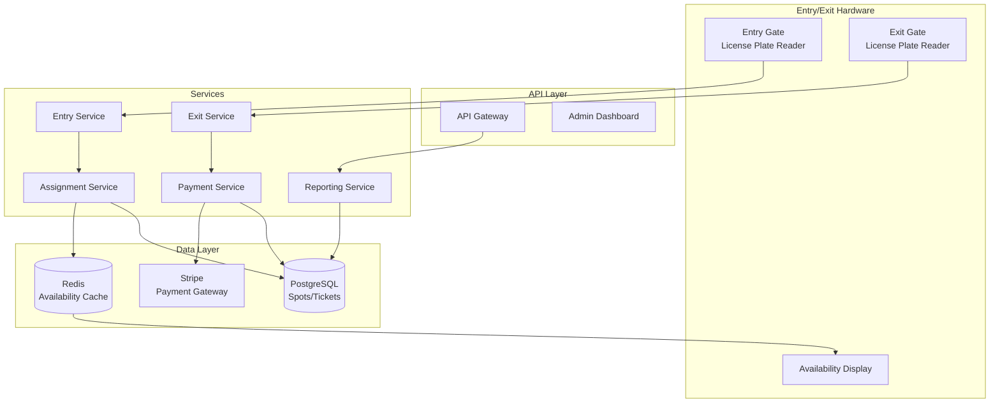

# 🅿️ Parking Lot - System Design Interview

> **Interview Duration**: 45 minutes  
> **Difficulty**: Medium (OOP/LLD Focus)  
> **Type**: Object-Oriented Design + System Design

---

## 1️⃣ Requirements & Estimation (5 min)

### Functional Requirements
1. **Vehicle Entry/Exit**: Track vehicles entering and exiting
2. **Spot Assignment**: Assign appropriate spots based on vehicle type
3. **Payment Processing**: Calculate fees based on duration
4. **Display Availability**: Show available spots per level/type

### Non-Functional Requirements
- **Consistency**: Strong consistency for spot assignments (no double booking)
- **Latency**: < 500ms for entry/exit processing
- **Availability**: 99.9% (critical for 24/7 operation)

### Back-of-Envelope Estimation

```
Assumptions:
- 1 parking lot with 5 levels
- 100 spots per level = 500 total spots
- Average stay: 3 hours
- Operating 16 hours/day (6 AM - 10 PM)

Traffic:
- Max vehicles/day: 500 × (16/3) ≈ 2,600 vehicles/day
- Peak entries/hour: 500 / 3 ≈ 170 vehicles/hour
- Peak QPS: 170 / 3600 ≈ 0.05 QPS (very low)

Storage (per lot):
- Spot records: 500 × 100 bytes = 50KB
- Transaction history: 2,600 × 500 bytes = 1.3MB/day
- 1 year: 1.3MB × 365 = 475MB

For Multi-Lot SaaS:
- 10,000 parking lots
- 5B transactions/year = 2.5TB/year
```

---

## 2️⃣ High-Level Architecture (10 min)



### Component Responsibilities

| Component | Responsibility |
|-----------|----------------|
| Entry Service | Validate vehicle, trigger spot assignment |
| Assignment Service | Find & reserve optimal spot |
| Exit Service | Process exit, trigger payment |
| Payment Service | Calculate fees, process payment |
| Redis Cache | Real-time availability counts |
| PostgreSQL | Persistent spot & ticket data |

---

## 3️⃣ API & Data Model (10 min)

### API Design

**Vehicle Entry**
```http
POST /api/v1/entry
{
    "license_plate": "ABC-1234",
    "vehicle_type": "car"  // car, motorcycle, truck
}

Response 200:
{
    "ticket_id": "TKT-2024012815001234",
    "entry_time": "2024-01-28T15:00:00Z",
    "assigned_spot": {
        "spot_id": "L2-A15",
        "level": 2,
        "section": "A",
        "spot_number": 15,
        "type": "compact"
    },
    "directions": "Enter, go to Level 2, Section A"
}

Response 404 (Lot Full):
{
    "error": "NO_SPOTS_AVAILABLE",
    "message": "No spots available for vehicle type: car"
}
```

**Vehicle Exit**
```http
POST /api/v1/exit
{
    "ticket_id": "TKT-2024012815001234",
    "license_plate": "ABC-1234"
}

Response 200:
{
    "ticket_id": "TKT-2024012815001234",
    "entry_time": "2024-01-28T15:00:00Z",
    "exit_time": "2024-01-28T18:30:00Z",
    "duration_minutes": 210,
    "payment": {
        "amount_cents": 1050,
        "currency": "USD",
        "breakdown": [
            {"description": "First hour", "amount": 500},
            {"description": "Additional hours (2.5)", "amount": 550}
        ]
    }
}
```

**Get Availability**
```http
GET /api/v1/availability

Response 200:
{
    "lot_id": "LOT-001",
    "total_spots": 500,
    "available": 127,
    "by_level": [
        {"level": 1, "available": 20, "total": 100},
        {"level": 2, "available": 35, "total": 100}
    ],
    "by_type": {
        "compact": {"available": 50, "total": 200},
        "regular": {"available": 60, "total": 200},
        "large": {"available": 10, "total": 50},
        "motorcycle": {"available": 7, "total": 50}
    }
}
```

### Data Model

**Core Tables (PostgreSQL)**
```sql
-- Parking Lot Configuration
CREATE TABLE parking_lots (
    lot_id          UUID PRIMARY KEY,
    name            VARCHAR(100) NOT NULL,
    address         TEXT,
    total_levels    INT NOT NULL,
    total_spots     INT NOT NULL,
    operating_hours JSONB,  -- {"open": "06:00", "close": "22:00"}
    created_at      TIMESTAMP DEFAULT NOW()
);

-- Levels within a lot
CREATE TABLE levels (
    level_id        UUID PRIMARY KEY,
    lot_id          UUID REFERENCES parking_lots(lot_id),
    level_number    INT NOT NULL,
    floor_name      VARCHAR(10),  -- "B1", "L1", "L2"
    UNIQUE (lot_id, level_number)
);

-- Individual parking spots
CREATE TABLE spots (
    spot_id         UUID PRIMARY KEY,
    level_id        UUID REFERENCES levels(level_id),
    spot_number     VARCHAR(10) NOT NULL,  -- "A15"
    spot_type       VARCHAR(20) NOT NULL,  -- compact, regular, large, motorcycle, handicap
    status          VARCHAR(20) DEFAULT 'available',  -- available, occupied, reserved, maintenance
    row_number      INT,
    distance_to_entry INT,  -- For optimal assignment
    UNIQUE (level_id, spot_number)
);

CREATE INDEX idx_spots_available ON spots(level_id, spot_type, status)
    WHERE status = 'available';

-- Parking tickets (active & historical)
CREATE TABLE tickets (
    ticket_id       VARCHAR(30) PRIMARY KEY,  -- TKT-YYYYMMDDHHMMSSNN
    lot_id          UUID REFERENCES parking_lots(lot_id),
    spot_id         UUID REFERENCES spots(spot_id),
    license_plate   VARCHAR(20) NOT NULL,
    vehicle_type    VARCHAR(20) NOT NULL,
    entry_time      TIMESTAMP NOT NULL,
    exit_time       TIMESTAMP,
    status          VARCHAR(20) DEFAULT 'active',  -- active, completed, cancelled
    payment_status  VARCHAR(20) DEFAULT 'pending'  -- pending, paid, waived
);

CREATE INDEX idx_tickets_active ON tickets(lot_id, status)
    WHERE status = 'active';
CREATE INDEX idx_tickets_plate ON tickets(license_plate, entry_time DESC);

-- Payment records
CREATE TABLE payments (
    payment_id      UUID PRIMARY KEY,
    ticket_id       VARCHAR(30) REFERENCES tickets(ticket_id),
    amount_cents    INT NOT NULL,
    currency        VARCHAR(3) DEFAULT 'USD',
    payment_method  VARCHAR(20),  -- card, cash, mobile
    processed_at    TIMESTAMP DEFAULT NOW(),
    stripe_charge_id VARCHAR(100)
);

-- Rate configuration
CREATE TABLE rates (
    rate_id         UUID PRIMARY KEY,
    lot_id          UUID REFERENCES parking_lots(lot_id),
    vehicle_type    VARCHAR(20) NOT NULL,
    first_hour_cents INT NOT NULL,
    additional_hour_cents INT NOT NULL,
    daily_max_cents INT,
    effective_from  TIMESTAMP NOT NULL,
    effective_to    TIMESTAMP,
    UNIQUE (lot_id, vehicle_type, effective_from)
);
```

---

## 4️⃣ Component Deep Dive: OOP Design (15 min)

### Class Diagram

```
┌───────────────────────────────────────────────────────────────┐
│                        CLASS HIERARCHY                        │
├───────────────────────────────────────────────────────────────┤
│                                                               │
│  ┌─────────────────┐         ┌─────────────────┐             │
│  │   ParkingLot    │────────▶│     Level       │             │
│  ├─────────────────┤  1:N    ├─────────────────┤             │
│  │ - lot_id        │         │ - level_id      │             │
│  │ - levels[]      │         │ - spots[]       │             │
│  │ - entry_gates[] │         │ - available_count│            │
│  │ - exit_gates[]  │         │                 │             │
│  │ + get_available │         │ + assign_spot() │             │
│  │ + process_entry │         │ + release_spot()│             │
│  └─────────────────┘         └────────┬────────┘             │
│                                       │                       │
│                                       │ 1:N                   │
│                                       ▼                       │
│  ┌─────────────────┐         ┌─────────────────┐             │
│  │  <<abstract>>   │         │   ParkingSpot   │             │
│  │    Vehicle      │         ├─────────────────┤             │
│  ├─────────────────┤         │ - spot_id       │             │
│  │ - license_plate │         │ - spot_type     │             │
│  │ - type          │         │ - status        │             │
│  └────────┬────────┘         │ + can_fit()     │             │
│           │                  │ + occupy()      │             │
│  ┌────────┴────────┐         │ + release()     │             │
│  │        │        │         └─────────────────┘             │
│  ▼        ▼        ▼                                          │
│ Car   Motorcycle  Truck                                       │
│                                                               │
│  ┌─────────────────┐         ┌─────────────────┐             │
│  │     Ticket      │────────▶│    Payment      │             │
│  ├─────────────────┤  1:1    ├─────────────────┤             │
│  │ - ticket_id     │         │ - amount        │             │
│  │ - entry_time    │         │ - method        │             │
│  │ - exit_time     │         │                 │             │
│  │ + get_duration()│         │ + process()     │             │
│  └─────────────────┘         └─────────────────┘             │
│                                                               │
└───────────────────────────────────────────────────────────────┘
```

### Pseudocode: Core Classes

```python
from abc import ABC, abstractmethod
from enum import Enum
from datetime import datetime
from typing import Optional, List
import uuid


class VehicleType(Enum):
    MOTORCYCLE = 1
    COMPACT = 2
    REGULAR = 3
    LARGE = 4


class SpotType(Enum):
    MOTORCYCLE = 1  # Fits: motorcycle
    COMPACT = 2     # Fits: motorcycle, compact
    REGULAR = 3     # Fits: motorcycle, compact, regular
    LARGE = 4       # Fits: all


class SpotStatus(Enum):
    AVAILABLE = "available"
    OCCUPIED = "occupied"
    RESERVED = "reserved"
    MAINTENANCE = "maintenance"


class Vehicle(ABC):
    def __init__(self, license_plate: str):
        self.license_plate = license_plate
    
    @property
    @abstractmethod
    def vehicle_type(self) -> VehicleType:
        pass
    
    @property
    @abstractmethod
    def spots_needed(self) -> int:
        pass


class Motorcycle(Vehicle):
    @property
    def vehicle_type(self) -> VehicleType:
        return VehicleType.MOTORCYCLE
    
    @property
    def spots_needed(self) -> int:
        return 1


class Car(Vehicle):
    def __init__(self, license_plate: str, is_compact: bool = False):
        super().__init__(license_plate)
        self.is_compact = is_compact
    
    @property
    def vehicle_type(self) -> VehicleType:
        return VehicleType.COMPACT if self.is_compact else VehicleType.REGULAR
    
    @property
    def spots_needed(self) -> int:
        return 1


class Truck(Vehicle):
    @property
    def vehicle_type(self) -> VehicleType:
        return VehicleType.LARGE
    
    @property
    def spots_needed(self) -> int:
        return 2  # Trucks may need multiple spots


class ParkingSpot:
    """Represents a single parking spot"""
    
    # Define which vehicle types fit in each spot type
    SPOT_CAPACITY = {
        SpotType.MOTORCYCLE: [VehicleType.MOTORCYCLE],
        SpotType.COMPACT: [VehicleType.MOTORCYCLE, VehicleType.COMPACT],
        SpotType.REGULAR: [VehicleType.MOTORCYCLE, VehicleType.COMPACT, 
                          VehicleType.REGULAR],
        SpotType.LARGE: [VehicleType.MOTORCYCLE, VehicleType.COMPACT, 
                        VehicleType.REGULAR, VehicleType.LARGE],
    }
    
    def __init__(self, spot_id: str, spot_type: SpotType, 
                 level: 'Level', spot_number: str):
        self.spot_id = spot_id
        self.spot_type = spot_type
        self.level = level
        self.spot_number = spot_number
        self.status = SpotStatus.AVAILABLE
        self.current_vehicle: Optional[Vehicle] = None
    
    def can_fit(self, vehicle: Vehicle) -> bool:
        """Check if vehicle type can fit in this spot"""
        if self.status != SpotStatus.AVAILABLE:
            return False
        return vehicle.vehicle_type in self.SPOT_CAPACITY[self.spot_type]
    
    def occupy(self, vehicle: Vehicle) -> bool:
        """Park a vehicle in this spot"""
        if not self.can_fit(vehicle):
            return False
        
        self.current_vehicle = vehicle
        self.status = SpotStatus.OCCUPIED
        return True
    
    def release(self) -> Optional[Vehicle]:
        """Remove vehicle from spot"""
        vehicle = self.current_vehicle
        self.current_vehicle = None
        self.status = SpotStatus.AVAILABLE
        return vehicle
    
    def __str__(self) -> str:
        return f"{self.level.floor_name}-{self.spot_number}"


class Level:
    """Represents a floor/level in the parking lot"""
    
    def __init__(self, level_id: str, level_number: int, 
                 floor_name: str, lot: 'ParkingLot'):
        self.level_id = level_id
        self.level_number = level_number
        self.floor_name = floor_name
        self.lot = lot
        self.spots: List[ParkingSpot] = []
        self._available_count: dict = {}  # spot_type -> count
    
    def add_spot(self, spot: ParkingSpot):
        self.spots.append(spot)
        self._update_availability()
    
    def _update_availability(self):
        """Recalculate available spots by type"""
        self._available_count = {}
        for spot in self.spots:
            if spot.status == SpotStatus.AVAILABLE:
                spot_type = spot.spot_type
                self._available_count[spot_type] = \
                    self._available_count.get(spot_type, 0) + 1
    
    def get_available_count(self, spot_type: SpotType = None) -> int:
        if spot_type:
            return self._available_count.get(spot_type, 0)
        return sum(self._available_count.values())
    
    def find_available_spot(self, vehicle: Vehicle) -> Optional[ParkingSpot]:
        """Find first available spot for vehicle (closest to entry)"""
        for spot in self.spots:
            if spot.can_fit(vehicle):
                return spot
        return None
    
    def assign_spot(self, vehicle: Vehicle) -> Optional[ParkingSpot]:
        """Assign and occupy a spot for the vehicle"""
        spot = self.find_available_spot(vehicle)
        if spot and spot.occupy(vehicle):
            self._update_availability()
            return spot
        return None
    
    def release_spot(self, spot_id: str) -> bool:
        """Release a spot by ID"""
        for spot in self.spots:
            if spot.spot_id == spot_id:
                spot.release()
                self._update_availability()
                return True
        return False


class Ticket:
    """Parking ticket issued at entry"""
    
    def __init__(self, vehicle: Vehicle, spot: ParkingSpot):
        self.ticket_id = self._generate_ticket_id()
        self.vehicle = vehicle
        self.spot = spot
        self.entry_time = datetime.utcnow()
        self.exit_time: Optional[datetime] = None
        self.payment: Optional['Payment'] = None
    
    def _generate_ticket_id(self) -> str:
        now = datetime.utcnow()
        random_suffix = str(uuid.uuid4())[:4].upper()
        return f"TKT-{now.strftime('%Y%m%d%H%M%S')}{random_suffix}"
    
    def get_duration_minutes(self) -> int:
        """Calculate parking duration in minutes"""
        end_time = self.exit_time or datetime.utcnow()
        delta = end_time - self.entry_time
        return int(delta.total_seconds() / 60)
    
    def close(self) -> 'Ticket':
        """Mark ticket as closed"""
        self.exit_time = datetime.utcnow()
        return self


class RateCalculator:
    """Calculate parking fees based on rate configuration"""
    
    def __init__(self, first_hour_cents: int, 
                 additional_hour_cents: int,
                 daily_max_cents: int = None):
        self.first_hour_cents = first_hour_cents
        self.additional_hour_cents = additional_hour_cents
        self.daily_max_cents = daily_max_cents
    
    def calculate(self, duration_minutes: int) -> int:
        """Calculate total fee in cents"""
        if duration_minutes <= 0:
            return 0
        
        # First hour (or part thereof)
        total = self.first_hour_cents
        
        # Additional hours
        if duration_minutes > 60:
            additional_minutes = duration_minutes - 60
            additional_hours = (additional_minutes + 59) // 60  # Ceiling
            total += additional_hours * self.additional_hour_cents
        
        # Apply daily max if configured
        if self.daily_max_cents:
            total = min(total, self.daily_max_cents)
        
        return total


class ParkingLot:
    """Main parking lot manager"""
    
    def __init__(self, lot_id: str, name: str):
        self.lot_id = lot_id
        self.name = name
        self.levels: List[Level] = []
        self.active_tickets: dict = {}  # ticket_id -> Ticket
        self.rate_calculator: Optional[RateCalculator] = None
    
    def add_level(self, level: Level):
        self.levels.append(level)
    
    def get_total_available(self) -> int:
        return sum(level.get_available_count() for level in self.levels)
    
    def is_full(self) -> bool:
        return self.get_total_available() == 0
    
    def process_entry(self, vehicle: Vehicle) -> Optional[Ticket]:
        """Process vehicle entry - find spot and issue ticket"""
        
        # Try each level to find available spot
        for level in self.levels:
            spot = level.assign_spot(vehicle)
            if spot:
                # Create and store ticket
                ticket = Ticket(vehicle, spot)
                self.active_tickets[ticket.ticket_id] = ticket
                return ticket
        
        # No spots available
        return None
    
    def process_exit(self, ticket_id: str) -> Optional[Ticket]:
        """Process vehicle exit - calculate payment and release spot"""
        
        ticket = self.active_tickets.get(ticket_id)
        if not ticket:
            return None
        
        # Close ticket
        ticket.close()
        
        # Calculate payment
        if self.rate_calculator:
            amount = self.rate_calculator.calculate(
                ticket.get_duration_minutes()
            )
            ticket.payment = Payment(amount)
        
        # Release spot
        ticket.spot.level.release_spot(ticket.spot.spot_id)
        
        # Remove from active tickets
        del self.active_tickets[ticket_id]
        
        return ticket


class Payment:
    """Payment record"""
    
    def __init__(self, amount_cents: int):
        self.payment_id = str(uuid.uuid4())
        self.amount_cents = amount_cents
        self.paid = False
        self.payment_method: Optional[str] = None
    
    def process(self, method: str) -> bool:
        """Process the payment"""
        self.payment_method = method
        # In real system, integrate with payment gateway
        self.paid = True
        return True
```

### State Machine for Spot

```
┌─────────────────────────────────────────────────────────────┐
│                 PARKING SPOT STATE MACHINE                  │
├─────────────────────────────────────────────────────────────┤
│                                                             │
│                    ┌──────────────┐                         │
│          ┌────────►│  AVAILABLE   │◄────────┐               │
│          │         └──────┬───────┘         │               │
│          │                │                 │               │
│          │                │ assign()        │ release()     │
│          │                ▼                 │               │
│          │         ┌──────────────┐         │               │
│  complete│         │   OCCUPIED   │─────────┘               │
│   repair │         └──────────────┘                         │
│          │                                                  │
│          │         ┌──────────────┐                         │
│          └─────────│ MAINTENANCE  │◄──── mark_maintenance() │
│                    └──────────────┘                         │
│                                                             │
│  Valid Transitions:                                         │
│  • AVAILABLE → OCCUPIED: Vehicle assigned                   │
│  • OCCUPIED → AVAILABLE: Vehicle exits                      │
│  • AVAILABLE → MAINTENANCE: Needs repair                    │
│  • MAINTENANCE → AVAILABLE: Repair complete                 │
│                                                             │
└─────────────────────────────────────────────────────────────┘
```

---

## 5️⃣ Bottlenecks & Trade-offs (5 min)

### Single Points of Failure & Mitigations

| SPOF | Impact | Mitigation |
|------|--------|------------|
| Database down | No entry/exit processing | Local cache + queue |
| Gate hardware | Vehicles blocked | Manual override |
| Payment gateway | Can't collect fees | Allow exit, bill later |
| Network failure | Offline operations | Local edge computing |

### Consistency Trade-off

```
┌─────────────────────────────────────────────────────────────┐
│           SPOT ASSIGNMENT CONSISTENCY                       │
├─────────────────────────────────────────────────────────────┤
│                                                             │
│  STRONG CONSISTENCY (Our Choice for Spot Assignment):       │
│  ✅ No double booking of spots                              │
│  ✅ Accurate availability display                           │
│  ❌ Slightly higher latency                                 │
│  ❌ Reduced throughput under contention                     │
│                                                             │
│  IMPLEMENTATION:                                            │
│  • PostgreSQL row-level locks during assignment             │
│  • SELECT ... FOR UPDATE SKIP LOCKED                        │
│  • Redis for read-only availability display                 │
│                                                             │
│  OPTIMISTIC LOCKING:                                        │
│  ```sql                                                     │
│  UPDATE spots                                               │
│  SET status = 'occupied', version = version + 1             │
│  WHERE spot_id = ? AND status = 'available'                 │
│    AND version = ?                                          │
│  ```                                                        │
│                                                             │
└─────────────────────────────────────────────────────────────┘
```

### CAP Theorem Trade-off

```
┌─────────────────────────────────────────────────────────────┐
│                PARKING LOT CAP CHOICE                       │
├─────────────────────────────────────────────────────────────┤
│  WE CHOOSE: CP (Consistency + Partition Tolerance)          │
│                                                             │
│  Reasoning:                                                 │
│  • Cannot double-book parking spots                         │
│  • Must accurately track occupied/available                 │
│  • Financial transactions require consistency               │
│                                                             │
│  Trade-off Accepted:                                        │
│  • System may be briefly unavailable during partitions      │
│  • Fallback: Manual ticket with reconciliation              │
│                                                             │
│  Local Fallback Mode:                                       │
│  • Edge devices store local transactions                    │
│  • Sync when network restored                               │
│  • Conflict resolution: FIFO by entry timestamp             │
└─────────────────────────────────────────────────────────────┘
```

### Scaling for Multi-Lot SaaS

| Challenge | Solution |
|-----------|----------|
| Multi-tenant | Lot-based data sharding |
| Global lots | Regional DB replicas |
| Peak hours | Auto-scaling API servers |
| Real-time display | WebSocket push updates |

### Interview Pro Tips

1. **Start with OOP classes**: Show clean abstractions
2. **Discuss vehicle-spot fitting logic**: Compact car in large spot
3. **Handle edge cases**: What if payment fails? Power outage?
4. **Consider multi-lot scaling**: SaaS model for many lots

---

## 📚 Navigation

← [Tinder](./17-tinder.md) | [Home](./README.md) | [Hotstar](./19-hotstar.md) →
