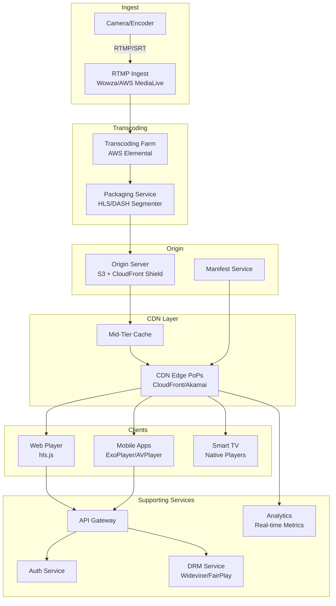

# 📺 Hotstar (Live Streaming) - System Design Interview

> **Interview Duration**: 45 minutes  
> **Difficulty**: Hard  
> **Type**: Live Video Streaming Platform

---

## 1️⃣ Requirements & Estimation (5 min)

### Functional Requirements
1. **Live Streaming**: Broadcast live events (sports, concerts) to millions
2. **Low Latency**: < 10 seconds delay from real-time
3. **Adaptive Streaming**: Quality adjusts to network conditions

### Non-Functional Requirements
- **Latency**: < 10s for live, < 5s for premium sports
- **Availability**: 99.99% during live events
- **Scalability**: Handle 25M+ concurrent viewers

### Back-of-Envelope Estimation

```
Assumptions:
- IPL Cricket Match: 25M concurrent viewers
- 4 quality levels: 240p, 480p, 720p, 1080p
- Average bitrate: 4 Mbps
- Segment duration: 4 seconds

Bandwidth:
- Peak bandwidth: 25M × 4 Mbps = 100 Pbps
- CDN required (not feasible from origin)

Segments Generated:
- 4 qualities × 1 segment/4s = 1 segment/second/quality
- Per stream: 4 segments/second × 3600s = 14,400 segments/hour
- 10 concurrent live streams = 144,000 segments/hour

Storage (Live Buffer - last 2 hours):
- Per segment: 4s × 4 Mbps = 2MB
- 2 hours: 14,400 × 2MB = 29GB per stream per quality
- 10 streams × 4 qualities = 1.16TB live buffer

Origin Bandwidth:
- CDN PoPs: 200 globally
- Each PoP fetches: 4 qualities × 4 Mbps = 16 Mbps per stream
- 10 streams: 160 Mbps per PoP
- Total origin: 200 × 160 Mbps = 32 Gbps
```

---

## 2️⃣ High-Level Architecture (10 min)



### Live Streaming Flow

```
┌─────────────────────────────────────────────────────────────────┐
│                    LIVE STREAMING PIPELINE                      │
├─────────────────────────────────────────────────────────────────┤
│                                                                  │
│  CAMERA → RTMP INGEST → TRANSCODING → PACKAGING → ORIGIN → CDN │
│                                                                  │
│  Timeline for 4-second segment:                                  │
│  ┌──────────────────────────────────────────────────────────┐   │
│  │ T=0s    Camera captures frames                           │   │
│  │ T=4s    Segment complete, sent to transcoder             │   │
│  │ T=5s    Transcoding to 4 qualities complete              │   │
│  │ T=5.5s  Packaging (HLS/DASH) complete                    │   │
│  │ T=6s    Segment available at origin                      │   │
│  │ T=7s    CDN edge has segment                             │   │
│  │ T=8s    Client buffer fills, playback starts             │   │
│  └──────────────────────────────────────────────────────────┘   │
│                                                                  │
│  Glass-to-Glass Latency: ~8 seconds                             │
│                                                                  │
└─────────────────────────────────────────────────────────────────┘
```

### Technology Choices

| Component | Technology | Justification |
|-----------|------------|---------------|
| Ingest | RTMP/SRT | Standard broadcast protocols |
| Transcoding | AWS Elemental | GPU-accelerated, auto-scaling |
| Packaging | HLS + DASH | Universal player support |
| Origin | S3 + CloudFront Shield | Scalable, protected origin |
| CDN | CloudFront + Akamai | Global reach, live optimized |
| DRM | Widevine + FairPlay | Cross-platform protection |

---

## 3️⃣ API & Data Model (10 min)

### API Design

**Get Live Stream**
```http
GET /api/v1/live/streams/{stream_id}
Authorization: Bearer {token}

Response 200:
{
    "stream_id": "ipl-2024-mi-vs-csk",
    "title": "MI vs CSK - IPL 2024",
    "status": "live",
    "started_at": "2024-04-15T19:30:00Z",
    "playback_url": "https://cdn.hotstar.com/live/ipl-2024/master.m3u8",
    "drm": {
        "type": "widevine",
        "license_url": "https://drm.hotstar.com/license"
    },
    "qualities": [
        {"resolution": "1080p", "bitrate": 8000},
        {"resolution": "720p", "bitrate": 4000},
        {"resolution": "480p", "bitrate": 2000},
        {"resolution": "240p", "bitrate": 500}
    ],
    "features": {
        "dvr_enabled": true,
        "dvr_window_seconds": 7200
    }
}
```

**Get Manifest (HLS Master Playlist)**
```http
GET /live/ipl-2024/master.m3u8

Response (m3u8):
#EXTM3U
#EXT-X-VERSION:4
#EXT-X-STREAM-INF:BANDWIDTH=8000000,RESOLUTION=1920x1080
1080p/playlist.m3u8
#EXT-X-STREAM-INF:BANDWIDTH=4000000,RESOLUTION=1280x720
720p/playlist.m3u8
#EXT-X-STREAM-INF:BANDWIDTH=2000000,RESOLUTION=854x480
480p/playlist.m3u8
#EXT-X-STREAM-INF:BANDWIDTH=500000,RESOLUTION=426x240
240p/playlist.m3u8
```

**Media Playlist (720p)**
```http
GET /live/ipl-2024/720p/playlist.m3u8

Response (m3u8):
#EXTM3U
#EXT-X-VERSION:4
#EXT-X-TARGETDURATION:4
#EXT-X-MEDIA-SEQUENCE:12345
#EXTINF:4.000,
segment_12345.ts
#EXTINF:4.000,
segment_12346.ts
#EXTINF:4.000,
segment_12347.ts
```

### Data Model

**Stream Metadata (PostgreSQL)**
```sql
CREATE TABLE streams (
    stream_id       VARCHAR(100) PRIMARY KEY,
    title           VARCHAR(255) NOT NULL,
    description     TEXT,
    category        VARCHAR(50),  -- sports, entertainment, news
    status          VARCHAR(20) DEFAULT 'scheduled',  -- scheduled, live, ended
    scheduled_start TIMESTAMP,
    actual_start    TIMESTAMP,
    ended_at        TIMESTAMP,
    is_premium      BOOLEAN DEFAULT FALSE,
    drm_required    BOOLEAN DEFAULT TRUE
);

CREATE TABLE stream_qualities (
    stream_id       VARCHAR(100) REFERENCES streams(stream_id),
    quality_id      VARCHAR(20),  -- 1080p, 720p, 480p, 240p
    bitrate_kbps    INT NOT NULL,
    resolution      VARCHAR(20),
    codec           VARCHAR(20) DEFAULT 'h264',
    playlist_path   VARCHAR(500),
    PRIMARY KEY (stream_id, quality_id)
);

-- Ingest endpoint configuration
CREATE TABLE ingest_endpoints (
    endpoint_id     UUID PRIMARY KEY,
    stream_id       VARCHAR(100) REFERENCES streams(stream_id),
    rtmp_url        VARCHAR(500),
    stream_key      VARCHAR(100),
    region          VARCHAR(20),
    is_primary      BOOLEAN DEFAULT TRUE
);
```

**Segment Tracking (Redis)**
```
# Track latest segment per stream/quality
HSET stream:ipl-2024:segments 1080p 12347 720p 12347 480p 12347 240p 12347

# Segment availability (for DVR)
ZADD stream:ipl-2024:1080p:segments 1713210000 "segment_12345.ts"
ZADD stream:ipl-2024:1080p:segments 1713210004 "segment_12346.ts"

# TTL for live buffer (2 hours)
EXPIRE stream:ipl-2024:1080p:segments 7200
```

**Real-time Analytics (ClickHouse)**
```sql
CREATE TABLE stream_analytics (
    event_time      DateTime,
    stream_id       String,
    user_id         String,
    device_type     String,
    quality         String,
    buffer_events   UInt32,
    bytes_downloaded UInt64,
    cdn_pop         String,
    latency_ms      UInt32
) ENGINE = MergeTree()
PARTITION BY toYYYYMMDD(event_time)
ORDER BY (stream_id, event_time);
```

---

## 4️⃣ Component Deep Dive: Live Transcoding & Delivery (15 min)

### Transcoding Pipeline Architecture

```
┌─────────────────────────────────────────────────────────────────┐
│              LIVE TRANSCODING PIPELINE                          │
├─────────────────────────────────────────────────────────────────┤
│                                                                  │
│  ┌──────────┐    ┌──────────┐    ┌──────────┐    ┌──────────┐  │
│  │  INGEST  │───▶│ TRANSCODE│───▶│ PACKAGE  │───▶│  ORIGIN  │  │
│  └──────────┘    └──────────┘    └──────────┘    └──────────┘  │
│       │               │               │               │         │
│       ▼               ▼               ▼               ▼         │
│  RTMP/SRT        GPU Farm         HLS/DASH           S3        │
│  Redundant       Auto-scale       Encryption        CDN        │
│  Ingest          H.264/H.265      SCTE-35          Shield      │
│                                   (Ads)                         │
│                                                                  │
│  REDUNDANCY:                                                    │
│  ┌──────────────────────────────────────────────┐               │
│  │  Primary Ingest ──┐                          │               │
│  │                   ├──▶ Transcoder Pool ──▶ Origin           │
│  │  Backup Ingest  ──┘    (Hot standby)                        │
│  └──────────────────────────────────────────────┘               │
│                                                                  │
└─────────────────────────────────────────────────────────────────┘
```

### Pseudocode: Live Transcoding Service

```python
import asyncio
from dataclasses import dataclass
from typing import List, Optional
import subprocess
import boto3


@dataclass
class TranscodeProfile:
    name: str
    resolution: str
    bitrate_kbps: int
    fps: int = 30
    codec: str = "h264"
    
    def to_ffmpeg_args(self) -> List[str]:
        width, height = self.resolution.split("x")
        return [
            "-vf", f"scale={width}:{height}",
            "-b:v", f"{self.bitrate_kbps}k",
            "-r", str(self.fps),
            "-c:v", "libx264" if self.codec == "h264" else "libx265",
            "-preset", "ultrafast",  # Low latency
            "-tune", "zerolatency",
            "-g", "120",  # GOP size = 4 seconds at 30fps
            "-keyint_min", "120",
            "-sc_threshold", "0",
        ]


PROFILES = [
    TranscodeProfile("1080p", "1920x1080", 8000),
    TranscodeProfile("720p", "1280x720", 4000),
    TranscodeProfile("480p", "854x480", 2000),
    TranscodeProfile("240p", "426x240", 500),
]


class LiveTranscoder:
    """Multi-quality live transcoding with FFmpeg"""
    
    def __init__(self, stream_id: str, s3_bucket: str):
        self.stream_id = stream_id
        self.s3_bucket = s3_bucket
        self.s3 = boto3.client('s3')
        self.segment_duration = 4  # seconds
        self.processes: dict = {}
    
    async def start_transcoding(self, rtmp_input: str):
        """Start parallel transcoding to all quality levels"""
        
        tasks = []
        for profile in PROFILES:
            task = asyncio.create_task(
                self._transcode_quality(rtmp_input, profile)
            )
            tasks.append(task)
        
        # Also start manifest generator
        manifest_task = asyncio.create_task(
            self._generate_manifests()
        )
        tasks.append(manifest_task)
        
        await asyncio.gather(*tasks)
    
    async def _transcode_quality(self, rtmp_input: str, 
                                  profile: TranscodeProfile):
        """Transcode to single quality and upload segments"""
        
        output_dir = f"/tmp/{self.stream_id}/{profile.name}"
        os.makedirs(output_dir, exist_ok=True)
        
        # FFmpeg command for HLS output
        cmd = [
            "ffmpeg",
            "-i", rtmp_input,
            "-c:a", "aac",
            "-b:a", "128k",
            *profile.to_ffmpeg_args(),
            "-f", "hls",
            "-hls_time", str(self.segment_duration),
            "-hls_list_size", "5",  # Keep 5 segments in playlist
            "-hls_flags", "delete_segments+append_list",
            "-hls_segment_filename", f"{output_dir}/segment_%05d.ts",
            f"{output_dir}/playlist.m3u8"
        ]
        
        process = await asyncio.create_subprocess_exec(
            *cmd,
            stdout=asyncio.subprocess.PIPE,
            stderr=asyncio.subprocess.PIPE
        )
        
        self.processes[profile.name] = process
        
        # Monitor for new segments and upload
        await self._upload_segments(output_dir, profile.name)
    
    async def _upload_segments(self, output_dir: str, quality: str):
        """Watch for new segments and upload to S3"""
        
        uploaded = set()
        
        while True:
            files = os.listdir(output_dir)
            ts_files = [f for f in files if f.endswith('.ts')]
            
            for ts_file in ts_files:
                if ts_file not in uploaded:
                    # Upload segment to S3
                    local_path = os.path.join(output_dir, ts_file)
                    s3_key = f"live/{self.stream_id}/{quality}/{ts_file}"
                    
                    await self._upload_to_s3(local_path, s3_key)
                    uploaded.add(ts_file)
                    
                    # Also upload updated playlist
                    playlist_path = os.path.join(output_dir, "playlist.m3u8")
                    playlist_key = f"live/{self.stream_id}/{quality}/playlist.m3u8"
                    await self._upload_to_s3(
                        playlist_path, 
                        playlist_key,
                        cache_control="max-age=1"  # Short cache for live
                    )
            
            await asyncio.sleep(0.5)  # Check every 500ms
    
    async def _upload_to_s3(self, local_path: str, s3_key: str,
                            cache_control: str = "max-age=31536000"):
        """Upload file to S3 with appropriate headers"""
        
        content_type = "video/mp2t" if s3_key.endswith('.ts') else \
                       "application/vnd.apple.mpegurl"
        
        self.s3.upload_file(
            local_path,
            self.s3_bucket,
            s3_key,
            ExtraArgs={
                'ContentType': content_type,
                'CacheControl': cache_control
            }
        )
    
    async def _generate_manifests(self):
        """Generate and update master manifest"""
        
        master_manifest = """#EXTM3U
#EXT-X-VERSION:4
"""
        for profile in PROFILES:
            master_manifest += f"""#EXT-X-STREAM-INF:BANDWIDTH={profile.bitrate_kbps * 1000},RESOLUTION={profile.resolution}
{profile.name}/playlist.m3u8
"""
        
        # Upload master manifest
        s3_key = f"live/{self.stream_id}/master.m3u8"
        self.s3.put_object(
            Bucket=self.s3_bucket,
            Key=s3_key,
            Body=master_manifest,
            ContentType="application/vnd.apple.mpegurl",
            CacheControl="max-age=2"
        )


class CDNPurgeService:
    """Manage CDN cache for live content"""
    
    def __init__(self, distribution_id: str):
        self.cf = boto3.client('cloudfront')
        self.distribution_id = distribution_id
    
    async def invalidate_manifest(self, stream_id: str, quality: str):
        """Invalidate playlist to force CDN refresh"""
        
        paths = [
            f"/live/{stream_id}/master.m3u8",
            f"/live/{stream_id}/{quality}/playlist.m3u8"
        ]
        
        self.cf.create_invalidation(
            DistributionId=self.distribution_id,
            InvalidationBatch={
                'Paths': {
                    'Quantity': len(paths),
                    'Items': paths
                },
                'CallerReference': f"{stream_id}-{time.time()}"
            }
        )


class AdaptiveBitrateManager:
    """Client-side ABR logic (runs in player)"""
    
    def __init__(self, qualities: List[TranscodeProfile]):
        self.qualities = sorted(qualities, 
                               key=lambda q: q.bitrate_kbps, 
                               reverse=True)
        self.current_quality_idx = len(qualities) // 2  # Start middle
        self.bandwidth_samples: List[float] = []
        self.buffer_level = 0  # seconds
    
    def select_quality(self, measured_bandwidth_kbps: float,
                       buffer_seconds: float) -> TranscodeProfile:
        """Select optimal quality based on bandwidth and buffer"""
        
        self.bandwidth_samples.append(measured_bandwidth_kbps)
        if len(self.bandwidth_samples) > 5:
            self.bandwidth_samples.pop(0)
        
        # Use weighted average (recent samples weighted more)
        weights = [1, 2, 3, 4, 5][-len(self.bandwidth_samples):]
        avg_bandwidth = sum(
            b * w for b, w in zip(self.bandwidth_samples, weights)
        ) / sum(weights)
        
        # Safety margin: only use 80% of measured bandwidth
        safe_bandwidth = avg_bandwidth * 0.8
        
        # Buffer-based adjustment
        if buffer_seconds < 2:
            # Emergency: drop quality immediately
            safe_bandwidth *= 0.5
        elif buffer_seconds < 5:
            # Low buffer: be conservative
            safe_bandwidth *= 0.7
        elif buffer_seconds > 15:
            # Healthy buffer: can try higher quality
            safe_bandwidth *= 1.2
        
        # Find highest quality that fits
        for i, quality in enumerate(self.qualities):
            if quality.bitrate_kbps <= safe_bandwidth:
                return quality
        
        # Fallback to lowest quality
        return self.qualities[-1]
```

### Low-Latency HLS (LL-HLS)

```
┌─────────────────────────────────────────────────────────────────┐
│                   LOW-LATENCY HLS (LL-HLS)                      │
├─────────────────────────────────────────────────────────────────┤
│                                                                  │
│  STANDARD HLS:                                                   │
│  • 6-second segments                                             │
│  • 3-segment buffer = 18 seconds latency                         │
│                                                                  │
│  LOW-LATENCY HLS:                                                │
│  • 2-second segments with partial segments (0.2s each)           │
│  • Client can start with 1 partial = 0.2 second buffer           │
│  • Achieves 2-4 second latency                                   │
│                                                                  │
│  PARTIAL SEGMENTS:                                               │
│  ┌─────────────────────────────────────────┐                    │
│  │ Full Segment (2s)                        │                    │
│  │ ┌────┬────┬────┬────┬────┬────┬────┬────┤                    │
│  │ │P1  │P2  │P3  │P4  │P5  │P6  │P7  │P8  │ ← 8 partials       │
│  │ │.25s│.25s│.25s│.25s│.25s│.25s│.25s│.25s│                    │
│  │ └────┴────┴────┴────┴────┴────┴────┴────┤                    │
│  └─────────────────────────────────────────┘                    │
│                                                                  │
│  PLAYLIST WITH PARTIALS:                                         │
│  #EXT-X-PART:DURATION=0.25,URI="segment_123_part1.ts"           │
│  #EXT-X-PART:DURATION=0.25,URI="segment_123_part2.ts"           │
│  #EXT-X-PART:DURATION=0.25,URI="segment_123_part3.ts"           │
│  #EXT-X-PRELOAD-HINT:TYPE=PART,URI="segment_123_part4.ts"       │
│                                                                  │
└─────────────────────────────────────────────────────────────────┘
```

---

## 5️⃣ Bottlenecks & Trade-offs (5 min)

### Single Points of Failure & Mitigations

| SPOF | Impact | Mitigation |
|------|--------|------------|
| Ingest server | Stream goes offline | Redundant ingest in multiple regions |
| Transcoder | No video output | Hot-standby transcoders, auto-failover |
| Origin S3 | CDN can't fetch | Multi-region S3, CloudFront Origin Shield |
| CDN Edge | Users can't stream | Multi-CDN (CloudFront + Akamai) |

### Latency vs Quality Trade-off

```
┌─────────────────────────────────────────────────────────────────┐
│              LATENCY VS QUALITY TRADE-OFF                       │
├─────────────────────────────────────────────────────────────────┤
│                                                                  │
│  LOWER LATENCY (2-5s):                                          │
│  ✅ Better for live sports, betting                              │
│  ❌ Smaller GOP → Lower compression efficiency                   │
│  ❌ Smaller buffer → More rebuffering risk                       │
│  ❌ Higher CDN cost (more requests)                              │
│                                                                  │
│  HIGHER LATENCY (15-30s):                                        │
│  ✅ Better compression (larger GOP)                              │
│  ✅ Smoother playback (larger buffer)                            │
│  ✅ More efficient CDN caching                                   │
│  ❌ Poor for live interaction, sports                            │
│                                                                  │
│  OUR CHOICE:                                                     │
│  • Sports: LL-HLS with 3-5s latency                             │
│  • Entertainment: Standard HLS with 10s latency                  │
│  • On-demand: Pre-packaged, 15s buffer allowed                   │
│                                                                  │
└─────────────────────────────────────────────────────────────────┘
```

### CAP Theorem Trade-off

```
┌─────────────────────────────────────────────────────────────────┐
│                   HOTSTAR CAP CHOICE                            │
├─────────────────────────────────────────────────────────────────┤
│  WE CHOOSE: AP (Availability + Partition Tolerance)             │
│                                                                  │
│  Reasoning:                                                      │
│  • Live stream must always be available                          │
│  • Stale segment (few seconds old) is acceptable                 │
│  • Viewers don't need to see exact same frame                    │
│  • CDN can serve slightly stale content during origin issues     │
│                                                                  │
│  Trade-off Accepted:                                             │
│  • Some CDN PoPs may be 1-2 segments behind                     │
│  • Analytics may have slight delays                              │
│  • DRM license refresh can be eventually consistent              │
│                                                                  │
│  Consistency Where It Matters:                                   │
│  • User authentication                                           │
│  • Payment/subscription status                                   │
│  • Geo-blocking enforcement                                      │
└─────────────────────────────────────────────────────────────────┘
```

### Thundering Herd Mitigation

| Scenario | Problem | Solution |
|----------|---------|----------|
| Match starts | Millions join in 1 minute | Pre-warm CDN, staggered manifest |
| Quality switch | All switch to 1080p at once | ABR randomization, gradual step-up |
| Origin fetch | All CDN PoPs request same segment | Origin Shield (single fetch) |
| Manifest refresh | All clients poll simultaneously | Jittered refresh intervals |

### Interview Pro Tips

1. **Start with the pipeline**: Ingest → Transcode → Package → Distribute
2. **Explain ABR**: Client selects quality based on bandwidth
3. **Discuss segment size trade-off**: Latency vs efficiency
4. **Mention multi-CDN**: Critical for global scale
