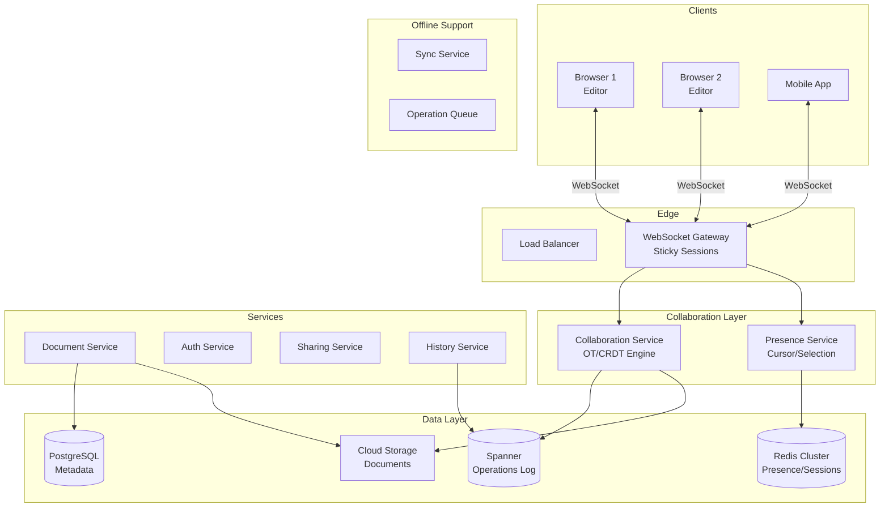

# 📝 Google Docs - System Design Interview

> **Interview Duration**: 45 minutes  
> **Difficulty**: Very Hard  
> **Type**: Collaborative Real-Time Editor

---

## 1️⃣ Requirements & Estimation (5 min)

### Functional Requirements
1. **Real-time Collaboration**: Multiple users edit same document simultaneously
2. **Conflict Resolution**: Handle concurrent edits without data loss
3. **Presence Awareness**: Show who is editing and their cursor positions

### Non-Functional Requirements
- **Latency**: < 100ms for local edits to appear
- **Consistency**: Eventual consistency with convergence guarantee
- **Availability**: 99.99% (critical productivity tool)

### Back-of-Envelope Estimation

```
Assumptions:
- 500M monthly users, 50M DAU
- Average user: 2 hours/day editing
- 5 keystrokes/second while actively typing
- Average document: 50KB

Traffic:
- Active editors at peak: 10M concurrent
- Operations/second: 10M × (5 ops/s × 0.1 active) = 5M ops/sec
- WebSocket connections: 10M concurrent

Storage:
- Documents: 500M users × 100 docs × 50KB = 2.5PB
- Operations (for undo): 5M ops/sec × 100 bytes = 500MB/sec
- Daily operations: 500MB × 86400 = 43TB/day

Bandwidth:
- Broadcast operations to collaborators
- Average 3 collaborators/doc: 5M × 3 = 15M ops/sec outbound
```

---

## 2️⃣ High-Level Architecture (10 min)



### Collaboration Architecture

```
┌─────────────────────────────────────────────────────────────────┐
│              REAL-TIME COLLABORATION FLOW                       │
├─────────────────────────────────────────────────────────────────┤
│                                                                  │
│  Client A                Server              Client B            │
│     │                      │                    │                │
│     │──[1] Edit "Hello"───▶│                    │                │
│     │                      │                    │                │
│     │◀──[2] ACK + Version──│                    │                │
│     │                      │──[3] Broadcast────▶│                │
│     │                      │                    │                │
│     │                      │◀──[4] Edit "Hi"────│                │
│     │                      │                    │                │
│     │◀──[5] Transform+Send─│──[6] ACK──────────▶│                │
│     │                      │                    │                │
│                                                                  │
│  Key Insight:                                                   │
│  • Client applies local edit immediately (optimistic)           │
│  • Server transforms and reorders concurrent operations         │
│  • All clients converge to same document state                  │
│                                                                  │
└─────────────────────────────────────────────────────────────────┘
```

### Technology Choices

| Component | Technology | Justification |
|-----------|------------|---------------|
| Real-time | WebSocket | Bidirectional, low latency |
| Conflict Resolution | OT (Operational Transform) | Battle-tested (Google uses) |
| Operations Log | Spanner | Globally consistent, scalable |
| Document Storage | Cloud Storage + CDN | Cost-effective for large docs |
| Presence | Redis Pub/Sub | Fast ephemeral data |
| Metadata | PostgreSQL | Relational for sharing/permissions |

---

## 3️⃣ API & Data Model (10 min)

### API Design

**Connect to Document (WebSocket)**
```javascript
// WebSocket connection
ws://collab.docs.google.com/doc/{doc_id}

// Client → Server: Join document
{
    "type": "join",
    "doc_id": "abc123",
    "token": "jwt_token",
    "client_id": "client_xyz",
    "revision": 1234  // Last known revision
}

// Server → Client: Document state
{
    "type": "sync",
    "content": "Hello World",
    "revision": 1250,
    "collaborators": [
        {"user_id": "user1", "name": "Alice", "color": "#FF5733"},
        {"user_id": "user2", "name": "Bob", "color": "#33FF57"}
    ]
}
```

**Send Operation**
```javascript
// Client → Server: Insert text
{
    "type": "operation",
    "client_id": "client_xyz",
    "revision": 1250,  // Base revision
    "ops": [
        {"retain": 5},
        {"insert": " beautiful"},
        {"retain": 6}
    ]
}

// Server → Client: ACK
{
    "type": "ack",
    "client_id": "client_xyz",
    "revision": 1251
}

// Server → Other Clients: Broadcast
{
    "type": "operation",
    "user_id": "user1",
    "revision": 1251,
    "ops": [
        {"retain": 5},
        {"insert": " beautiful"},
        {"retain": 6}
    ]
}
```

**Cursor/Selection (Presence)**
```javascript
// Client → Server: Cursor position
{
    "type": "presence",
    "client_id": "client_xyz",
    "cursor": {"index": 42},
    "selection": {"start": 42, "end": 50}
}

// Server → Other Clients: Broadcast presence
{
    "type": "presence",
    "user_id": "user1",
    "name": "Alice",
    "color": "#FF5733",
    "cursor": {"index": 42},
    "selection": {"start": 42, "end": 50}
}
```

### Data Model

**Document Metadata (PostgreSQL)**
```sql
CREATE TABLE documents (
    doc_id          UUID PRIMARY KEY,
    title           VARCHAR(255) DEFAULT 'Untitled',
    owner_id        UUID NOT NULL,
    created_at      TIMESTAMP DEFAULT NOW(),
    updated_at      TIMESTAMP DEFAULT NOW(),
    current_revision BIGINT DEFAULT 0,
    is_deleted      BOOLEAN DEFAULT FALSE
);

CREATE TABLE document_permissions (
    doc_id          UUID REFERENCES documents(doc_id),
    user_id         UUID,
    email           VARCHAR(255),  -- For non-registered invites
    role            VARCHAR(20),   -- owner, editor, commenter, viewer
    granted_at      TIMESTAMP DEFAULT NOW(),
    PRIMARY KEY (doc_id, COALESCE(user_id, email))
);

CREATE INDEX idx_docs_owner ON documents(owner_id);
CREATE INDEX idx_perms_user ON document_permissions(user_id);
```

**Operations Log (Spanner)**
```sql
CREATE TABLE operations (
    doc_id          STRING(36),
    revision        INT64,
    user_id         STRING(36),
    client_id       STRING(50),
    ops             BYTES,  -- Serialized operation array
    timestamp       TIMESTAMP,
    checksum        STRING(64),  -- For integrity verification
) PRIMARY KEY (doc_id, revision);

-- Interleaved for performance
CREATE TABLE operation_batches (
    doc_id          STRING(36),
    batch_start     INT64,
    batch_end       INT64,
    compressed_ops  BYTES,  -- Compressed batch for history
    created_at      TIMESTAMP,
) PRIMARY KEY (doc_id, batch_start);
```

**Document Content (Cloud Storage)**
```
gs://docs-content/{doc_id}/
├── current.json        # Latest snapshot
├── snapshots/
│   ├── rev_1000.json   # Periodic snapshots
│   ├── rev_2000.json
│   └── rev_3000.json
└── assets/
    ├── image_abc.png
    └── image_def.jpg
```

**Session/Presence (Redis)**
```
# Active collaborators in document
SADD doc:abc123:collaborators user1 user2 user3

# User presence data
HSET doc:abc123:presence:user1 cursor 42 selection_start 42 selection_end 50 color "#FF5733"

# WebSocket connection mapping
HSET user:user1:connections client_xyz "ws-server-1:8080"

# TTL for presence (auto-cleanup on disconnect)
EXPIRE doc:abc123:presence:user1 30
```

---

## 4️⃣ Component Deep Dive: Operational Transform (15 min)

### OT (Operational Transform) Explained

```
┌─────────────────────────────────────────────────────────────────┐
│              OPERATIONAL TRANSFORM (OT)                         │
├─────────────────────────────────────────────────────────────────┤
│                                                                  │
│  PROBLEM: Two users edit same document simultaneously           │
│                                                                  │
│  Initial: "Hello"                                                │
│                                                                  │
│  User A: Insert " World" at position 5 → "Hello World"          │
│  User B: Insert " There" at position 5 → "Hello There"          │
│                                                                  │
│  WITHOUT OT:                                                     │
│  User A sees: "Hello World"                                      │
│  User B sees: "Hello There"                                      │
│  → Documents DIVERGE! ❌                                         │
│                                                                  │
│  WITH OT:                                                        │
│  1. Server receives A's op first (revision 1)                    │
│  2. Server receives B's op (based on revision 0)                 │
│  3. Server TRANSFORMS B's op against A's op:                     │
│     - B wanted to insert at position 5                           │
│     - But A inserted 6 chars at position 5                       │
│     - Transform B: insert at position 5 + 6 = 11                 │
│  4. Result: "Hello World There" ✓                               │
│                                                                  │
│  Both clients converge to same state!                            │
│                                                                  │
└─────────────────────────────────────────────────────────────────┘
```

### Pseudocode: OT Engine

```python
from dataclasses import dataclass
from typing import List, Union, Tuple
from enum import Enum
import json


class OpType(Enum):
    INSERT = "insert"
    DELETE = "delete"
    RETAIN = "retain"


@dataclass
class Operation:
    """Single operation component"""
    type: OpType
    value: Union[str, int]  # Text for insert, count for delete/retain
    
    def length(self) -> int:
        if self.type == OpType.INSERT:
            return len(self.value)
        return self.value


class TextOperation:
    """Represents a complete document operation"""
    
    def __init__(self, ops: List[Operation] = None):
        self.ops = ops or []
        self.base_length = 0  # Length of document before applying
        self.target_length = 0  # Length of document after applying
    
    def retain(self, n: int) -> 'TextOperation':
        if n <= 0:
            return self
        self.ops.append(Operation(OpType.RETAIN, n))
        self.base_length += n
        self.target_length += n
        return self
    
    def insert(self, text: str) -> 'TextOperation':
        if not text:
            return self
        self.ops.append(Operation(OpType.INSERT, text))
        self.target_length += len(text)
        return self
    
    def delete(self, n: int) -> 'TextOperation':
        if n <= 0:
            return self
        self.ops.append(Operation(OpType.DELETE, n))
        self.base_length += n
        return self
    
    def apply(self, document: str) -> str:
        """Apply operation to document"""
        if len(document) != self.base_length:
            raise ValueError(
                f"Document length {len(document)} != base_length {self.base_length}"
            )
        
        result = []
        index = 0
        
        for op in self.ops:
            if op.type == OpType.RETAIN:
                result.append(document[index:index + op.value])
                index += op.value
            elif op.type == OpType.INSERT:
                result.append(op.value)
            elif op.type == OpType.DELETE:
                index += op.value
        
        return ''.join(result)


def transform(op_a: TextOperation, op_b: TextOperation) -> Tuple[TextOperation, TextOperation]:
    """
    Transform two concurrent operations.
    Returns (a', b') such that:
    apply(apply(doc, a), b') == apply(apply(doc, b), a')
    """
    
    if op_a.base_length != op_b.base_length:
        raise ValueError("Operations must have same base length")
    
    a_prime = TextOperation()
    b_prime = TextOperation()
    
    a_idx, b_idx = 0, 0
    a_ops, b_ops = op_a.ops.copy(), op_b.ops.copy()
    
    while a_idx < len(a_ops) or b_idx < len(b_ops):
        a_op = a_ops[a_idx] if a_idx < len(a_ops) else None
        b_op = b_ops[b_idx] if b_idx < len(b_ops) else None
        
        # Insert from A goes first
        if a_op and a_op.type == OpType.INSERT:
            a_prime.insert(a_op.value)
            b_prime.retain(len(a_op.value))
            a_idx += 1
            continue
        
        # Insert from B goes first
        if b_op and b_op.type == OpType.INSERT:
            a_prime.retain(len(b_op.value))
            b_prime.insert(b_op.value)
            b_idx += 1
            continue
        
        if not a_op or not b_op:
            break
        
        # Both are retain or delete
        a_len = a_op.value if a_op.type != OpType.INSERT else len(a_op.value)
        b_len = b_op.value if b_op.type != OpType.INSERT else len(b_op.value)
        min_len = min(a_len, b_len)
        
        if a_op.type == OpType.RETAIN and b_op.type == OpType.RETAIN:
            a_prime.retain(min_len)
            b_prime.retain(min_len)
        elif a_op.type == OpType.DELETE and b_op.type == OpType.RETAIN:
            a_prime.delete(min_len)
        elif a_op.type == OpType.RETAIN and b_op.type == OpType.DELETE:
            b_prime.delete(min_len)
        # Both delete same text - no-op
        
        # Update remaining lengths
        if a_len > min_len:
            a_ops[a_idx] = Operation(a_op.type, a_len - min_len)
        else:
            a_idx += 1
        
        if b_len > min_len:
            b_ops[b_idx] = Operation(b_op.type, b_len - min_len)
        else:
            b_idx += 1
    
    return a_prime, b_prime


class CollaborationServer:
    """Server-side OT coordination"""
    
    def __init__(self, doc_id: str, storage, pubsub):
        self.doc_id = doc_id
        self.storage = storage
        self.pubsub = pubsub
        self.current_revision = 0
        self.document = ""
        self.pending_ops: dict = {}  # revision -> operation
    
    async def handle_operation(self, client_id: str, user_id: str,
                               base_revision: int, 
                               operation: TextOperation) -> int:
        """Handle incoming operation from client"""
        
        # Lock for this document (distributed lock)
        async with self.storage.lock(f"doc:{self.doc_id}"):
            # Transform against all operations since base_revision
            transformed_op = operation
            
            for rev in range(base_revision, self.current_revision):
                server_op = await self.storage.get_operation(
                    self.doc_id, rev + 1
                )
                # Transform client op against server op
                _, transformed_op = transform(server_op, transformed_op)
            
            # Apply to document
            self.current_revision += 1
            new_revision = self.current_revision
            
            self.document = transformed_op.apply(self.document)
            
            # Persist operation
            await self.storage.save_operation(
                self.doc_id, new_revision, user_id, transformed_op
            )
            
            # Broadcast to other clients
            await self.pubsub.publish(
                f"doc:{self.doc_id}",
                {
                    "type": "operation",
                    "user_id": user_id,
                    "revision": new_revision,
                    "ops": self._serialize_ops(transformed_op)
                },
                exclude_client=client_id
            )
            
            return new_revision
    
    async def handle_join(self, client_id: str, user_id: str,
                          client_revision: int) -> dict:
        """Handle client joining document"""
        
        # Get current state
        if client_revision < self.current_revision:
            # Client is behind - send missing operations
            missing_ops = []
            for rev in range(client_revision, self.current_revision):
                op = await self.storage.get_operation(
                    self.doc_id, rev + 1
                )
                missing_ops.append({
                    "revision": rev + 1,
                    "ops": self._serialize_ops(op)
                })
            
            return {
                "type": "sync",
                "operations": missing_ops,
                "current_revision": self.current_revision
            }
        
        return {
            "type": "sync",
            "content": self.document,
            "revision": self.current_revision
        }


class PresenceService:
    """Real-time cursor/selection tracking"""
    
    def __init__(self, redis_client, pubsub):
        self.redis = redis_client
        self.pubsub = pubsub
    
    async def update_presence(self, doc_id: str, user_id: str,
                              cursor: int, selection: dict):
        """Update user's cursor position"""
        
        presence_key = f"doc:{doc_id}:presence:{user_id}"
        
        await self.redis.hset(presence_key, mapping={
            "cursor": cursor,
            "selection_start": selection.get("start", cursor),
            "selection_end": selection.get("end", cursor),
            "updated_at": int(time.time() * 1000)
        })
        
        # Expire after 30 seconds of inactivity
        await self.redis.expire(presence_key, 30)
        
        # Broadcast to other users
        await self.pubsub.publish(
            f"doc:{doc_id}:presence",
            {
                "user_id": user_id,
                "cursor": cursor,
                "selection": selection
            }
        )
    
    async def transform_cursor(self, cursor: int, 
                               operation: TextOperation) -> int:
        """Transform cursor position based on operation"""
        
        new_cursor = cursor
        current_pos = 0
        
        for op in operation.ops:
            if op.type == OpType.RETAIN:
                current_pos += op.value
            elif op.type == OpType.INSERT:
                if current_pos <= cursor:
                    new_cursor += len(op.value)
                current_pos += len(op.value)
            elif op.type == OpType.DELETE:
                if current_pos < cursor:
                    deleted = min(op.value, cursor - current_pos)
                    new_cursor -= deleted
        
        return max(0, new_cursor)
```

### CRDT Alternative (Yjs/Automerge)

```
┌─────────────────────────────────────────────────────────────────┐
│                 OT vs CRDT COMPARISON                           │
├─────────────────────────────────────────────────────────────────┤
│                                                                  │
│  OPERATIONAL TRANSFORM (OT):                                    │
│  ✅ Battle-tested (Google Docs, Google Wave)                    │
│  ✅ Smaller operation size                                       │
│  ❌ Requires central server for transformation                  │
│  ❌ Complex transformation functions                            │
│                                                                  │
│  CRDT (Conflict-free Replicated Data Types):                   │
│  ✅ No central server needed (P2P possible)                     │
│  ✅ Simpler mental model (merge always succeeds)                │
│  ✅ Better for offline-first apps                               │
│  ❌ Larger storage (unique IDs per character)                   │
│  ❌ Can produce surprising merge results                        │
│                                                                  │
│  GOOGLE DOCS USES: OT (centralized, proven at scale)            │
│                                                                  │
│  EMERGING TREND: Yjs (CRDT library) gaining popularity          │
│  for smaller apps like Notion, Figma                            │
│                                                                  │
└─────────────────────────────────────────────────────────────────┘
```

---

## 5️⃣ Bottlenecks & Trade-offs (5 min)

### Single Points of Failure & Mitigations

| SPOF | Impact | Mitigation |
|------|--------|------------|
| Collaboration server | No real-time sync | Multiple servers, sticky sessions |
| Operations log | Can't persist edits | Spanner multi-region |
| WebSocket gateway | Disconnects | Auto-reconnect, operation queue |
| Redis presence | No cursors shown | Graceful degradation |

### Consistency Trade-off

```
┌─────────────────────────────────────────────────────────────────┐
│              CONSISTENCY MODEL                                  │
├─────────────────────────────────────────────────────────────────┤
│                                                                  │
│  EVENTUAL CONSISTENCY with Convergence Guarantee                │
│                                                                  │
│  Properties:                                                    │
│  1. INTENTION PRESERVATION                                      │
│     - User's intended edit is preserved                         │
│     - Insert "foo" at position 5 → "foo" appears somewhere      │
│                                                                  │
│  2. CONVERGENCE                                                 │
│     - All clients eventually see same document                  │
│     - No matter the order operations arrive                     │
│                                                                  │
│  3. CAUSALITY                                                   │
│     - Operations applied in causal order                        │
│     - Delete can't happen before insert                         │
│                                                                  │
│  Trade-off:                                                     │
│  • Real-time feel (local apply immediately)                     │
│  • Eventual sync (may see brief inconsistency)                  │
│                                                                  │
└─────────────────────────────────────────────────────────────────┘
```

### CAP Theorem Trade-off

```
┌─────────────────────────────────────────────────────────────────┐
│                  GOOGLE DOCS CAP CHOICE                         │
├─────────────────────────────────────────────────────────────────┤
│  WE CHOOSE: AP (Availability + Partition Tolerance)             │
│                                                                  │
│  Reasoning:                                                      │
│  • Users must always be able to type (local-first)              │
│  • Offline editing must work                                     │
│  • Convergence happens when connection restored                  │
│                                                                  │
│  Trade-off Accepted:                                             │
│  • Brief periods of inconsistency between users                  │
│  • Operations may be reordered during merges                     │
│  • Undo may behave unexpectedly with concurrent edits           │
│                                                                  │
│  Strong Consistency Where Needed:                                │
│  • Permission changes (who can edit)                            │
│  • Document deletion                                             │
│  • Revision history (append-only log)                           │
└─────────────────────────────────────────────────────────────────┘
```

### Scaling Strategies

| Challenge | Solution |
|-----------|----------|
| Hot documents | Dedicated collaboration server per hot doc |
| Global latency | Regional collaboration servers with sync |
| Operations log growth | Compress and archive old operations |
| Large documents | Lazy loading, virtualized rendering |

### Interview Pro Tips

1. **Start with the conflict problem**: Why is OT/CRDT needed?
2. **Explain transform function**: Insert vs insert, insert vs delete
3. **Discuss revision numbering**: How server orders operations
4. **Mention local-first**: Client applies immediately, syncs later
