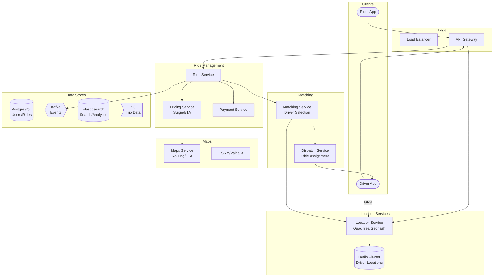

# 🚗 Uber - System Design Interview

> **Interview Duration**: 45 minutes  
> **Difficulty**: Hard  
> **Type**: Ride-Sharing Platform

---

## 1️⃣ Requirements & Estimation (5 min)

### Functional Requirements
1. **Request Ride**: Riders request pickup from current location
2. **Match Driver**: Find and match nearby available drivers
3. **Real-time Tracking**: Track driver location during ride

### Non-Functional Requirements
- **Latency**: < 1 second to show nearby drivers, < 5 seconds for matching
- **Availability**: 99.99% (critical transportation service)
- **Consistency**: Eventual for location, strong for ride assignment

### Back-of-Envelope Estimation

```
Assumptions:
- 20M DAU riders, 5M active drivers
- 15M rides/day
- Driver location update: Every 4 seconds
- Average ride: 15 minutes

Traffic:
- Ride requests/sec: 15M / 86400 ≈ 175 QPS
- Peak (5x): 875 QPS
- Location updates: 1M active drivers × (1/4s) = 250K updates/sec

Matching:
- Need to search drivers within 3km radius
- P50 matching time: < 30 seconds
- 95% of rides matched within 2 minutes

Storage:
- Driver locations: 5M × 100 bytes = 500MB (fits in memory!)
- Ride history: 15M × 1KB = 15GB/day
- 1 year: 5.5TB
```

---

## 2️⃣ High-Level Architecture (10 min)



### Matching Flow

```
┌─────────────────────────────────────────────────────────────────┐
│                    RIDE MATCHING FLOW                           │
├─────────────────────────────────────────────────────────────────┤
│                                                                  │
│  1. RIDER REQUESTS RIDE                                          │
│     └──▶ Validate request, get pickup coordinates               │
│                                                                  │
│  2. FIND NEARBY DRIVERS (Location Service)                      │
│     └──▶ Query drivers within 3km using geohash                 │
│     └──▶ Filter: available, correct vehicle type                │
│                                                                  │
│  3. RANK DRIVERS (Matching Service)                             │
│     └──▶ Score by: distance, ETA, rating, acceptance rate       │
│     └──▶ Select top N candidates (typically 3-5)                │
│                                                                  │
│  4. DISPATCH TO DRIVER (Dispatch Service)                       │
│     └──▶ Send request to #1 driver                              │
│     └──▶ If no response in 15s, try #2, etc.                    │
│                                                                  │
│  5. DRIVER ACCEPTS                                              │
│     └──▶ Lock ride to driver (prevent double assignment)        │
│     └──▶ Notify rider with driver details                       │
│                                                                  │
└─────────────────────────────────────────────────────────────────┘
```

### Technology Choices

| Component | Technology | Justification |
|-----------|------------|---------------|
| Location Index | Redis + Geohash | In-memory, fast geo queries |
| Ride Data | PostgreSQL | ACID for financial data |
| Events | Kafka | Async processing, analytics |
| Routing | OSRM/Valhalla | Open-source routing engine |
| Real-time | WebSocket + Push | Driver notifications |
| Search | Elasticsearch | Location search, analytics |

---

## 3️⃣ API & Data Model (10 min)

### API Design

**Request Ride**
```http
POST /api/v1/rides/request
Authorization: Bearer {token}

{
    "pickup": {
        "lat": 37.7749,
        "lng": -122.4194,
        "address": "123 Market St, SF"
    },
    "dropoff": {
        "lat": 37.7849,
        "lng": -122.4094,
        "address": "456 Mission St, SF"
    },
    "ride_type": "uberx",  // uberx, uberxl, uber_black
    "payment_method_id": "pm_123"
}

Response 200:
{
    "ride_id": "ride_abc123",
    "status": "matching",
    "estimated_fare": {
        "min_cents": 1500,
        "max_cents": 2000,
        "currency": "USD",
        "surge_multiplier": 1.2
    },
    "estimated_pickup_time_seconds": 180,
    "estimated_trip_time_seconds": 600
}
```

**Update Driver Location**
```http
PUT /api/v1/drivers/location
Authorization: Bearer {driver_token}

{
    "lat": 37.7750,
    "lng": -122.4195,
    "heading": 45,
    "speed_mph": 25,
    "timestamp": "2024-01-28T15:30:00Z"
}

Response 204 No Content
```

**Get Nearby Drivers (for rider map)**
```http
GET /api/v1/drivers/nearby?lat=37.7749&lng=-122.4194&radius_km=3

Response 200:
{
    "drivers": [
        {
            "driver_id": "driver_xyz",
            "lat": 37.7755,
            "lng": -122.4180,
            "heading": 90,
            "vehicle_type": "uberx",
            "eta_seconds": 120
        }
    ],
    "count": 15
}
```

**Driver Accept/Decline Ride**
```http
POST /api/v1/rides/{ride_id}/respond
Authorization: Bearer {driver_token}

{
    "action": "accept"  // or "decline"
}

Response 200 (Accept):
{
    "ride_id": "ride_abc123",
    "status": "driver_assigned",
    "pickup": {...},
    "dropoff": {...},
    "rider": {
        "name": "John D.",
        "rating": 4.8,
        "phone_masked": "(xxx) xxx-1234"
    }
}
```

### Data Model

**Users & Drivers (PostgreSQL)**
```sql
CREATE TABLE users (
    user_id         UUID PRIMARY KEY,
    phone           VARCHAR(20) UNIQUE NOT NULL,
    email           VARCHAR(255),
    name            VARCHAR(100),
    rating          DECIMAL(3,2) DEFAULT 5.00,
    created_at      TIMESTAMP DEFAULT NOW()
);

CREATE TABLE drivers (
    driver_id       UUID PRIMARY KEY REFERENCES users(user_id),
    license_number  VARCHAR(50) NOT NULL,
    vehicle_type    VARCHAR(20) NOT NULL,  -- uberx, uberxl, black
    vehicle_make    VARCHAR(50),
    vehicle_model   VARCHAR(50),
    vehicle_plate   VARCHAR(20),
    vehicle_year    INT,
    is_active       BOOLEAN DEFAULT FALSE,
    status          VARCHAR(20) DEFAULT 'offline',  -- offline, available, busy
    rating          DECIMAL(3,2) DEFAULT 5.00,
    acceptance_rate DECIMAL(5,2) DEFAULT 100.00
);

CREATE INDEX idx_drivers_status ON drivers(status) WHERE status = 'available';
```

**Rides (PostgreSQL)**
```sql
CREATE TABLE rides (
    ride_id         UUID PRIMARY KEY,
    rider_id        UUID REFERENCES users(user_id),
    driver_id       UUID REFERENCES drivers(driver_id),
    status          VARCHAR(20) NOT NULL,  -- matching, accepted, arriving, in_progress, completed, cancelled
    ride_type       VARCHAR(20) NOT NULL,
    
    -- Locations
    pickup_lat      DECIMAL(9,6) NOT NULL,
    pickup_lng      DECIMAL(9,6) NOT NULL,
    pickup_address  TEXT,
    dropoff_lat     DECIMAL(9,6) NOT NULL,
    dropoff_lng     DECIMAL(9,6) NOT NULL,
    dropoff_address TEXT,
    
    -- Timestamps
    requested_at    TIMESTAMP DEFAULT NOW(),
    accepted_at     TIMESTAMP,
    pickup_at       TIMESTAMP,
    dropoff_at      TIMESTAMP,
    cancelled_at    TIMESTAMP,
    
    -- Pricing
    fare_cents      INT,
    surge_multiplier DECIMAL(3,2) DEFAULT 1.00,
    distance_miles  DECIMAL(8,2),
    duration_minutes INT,
    
    -- Payment
    payment_method_id VARCHAR(100),
    payment_status  VARCHAR(20) DEFAULT 'pending'
);

CREATE INDEX idx_rides_status ON rides(status) WHERE status IN ('matching', 'accepted', 'arriving', 'in_progress');
CREATE INDEX idx_rides_driver ON rides(driver_id, status);
CREATE INDEX idx_rides_rider ON rides(rider_id, requested_at DESC);
```

**Driver Locations (Redis)**
```
# Geospatial index for nearby queries
GEOADD drivers:locations -122.4194 37.7749 driver_xyz
GEOADD drivers:locations -122.4180 37.7755 driver_abc

# Query nearby (within 3km)
GEORADIUS drivers:locations -122.4194 37.7749 3 km WITHDIST WITHCOORD

# Driver metadata (status, vehicle type)
HSET driver:driver_xyz status available vehicle_type uberx heading 45 speed 25 updated_at 1706452200
```

**Location History (Kafka → S3/BigQuery)**
```json
{
    "driver_id": "driver_xyz",
    "lat": 37.7750,
    "lng": -122.4195,
    "heading": 45,
    "speed_mph": 25,
    "timestamp": "2024-01-28T15:30:00Z",
    "ride_id": "ride_abc123",  // null if not on ride
    "accuracy_meters": 5
}
```

---

## 4️⃣ Component Deep Dive: Geospatial Matching (15 min)

### Location Indexing with Geohash

```
┌─────────────────────────────────────────────────────────────────┐
│                    GEOHASH EXPLAINED                            │
├─────────────────────────────────────────────────────────────────┤
│                                                                  │
│  GEOHASH: Encode lat/lng into string, nearby = similar prefix   │
│                                                                  │
│  Example: San Francisco (37.7749, -122.4194)                    │
│           Geohash: "9q8yy"                                      │
│                                                                  │
│  Precision:                                                     │
│  ┌───────────┬──────────────┐                                   │
│  │ Length    │ Grid Size    │                                   │
│  ├───────────┼──────────────┤                                   │
│  │ 4 chars   │ ~39km x 19km │                                   │
│  │ 5 chars   │ ~5km x 5km   │ ← Good for city matching         │
│  │ 6 chars   │ ~1.2km x 0.6km│ ← Good for nearby drivers       │
│  │ 7 chars   │ ~150m x 150m │                                   │
│  └───────────┴──────────────┘                                   │
│                                                                  │
│  QUERYING NEARBY:                                                │
│  1. Calculate geohash of pickup location                        │
│  2. Get 8 neighboring geohash cells                             │
│  3. Query all drivers in these 9 cells                          │
│  4. Filter by exact distance                                    │
│                                                                  │
└─────────────────────────────────────────────────────────────────┘
```

### Pseudocode: Location & Matching Service

```python
import asyncio
import math
from dataclasses import dataclass
from typing import List, Optional, Tuple
import redis.asyncio as redis
import geohash2 as geohash


@dataclass
class Location:
    lat: float
    lng: float
    
    def distance_km(self, other: 'Location') -> float:
        """Haversine formula for great-circle distance"""
        R = 6371  # Earth's radius in km
        
        lat1, lat2 = math.radians(self.lat), math.radians(other.lat)
        dlat = math.radians(other.lat - self.lat)
        dlng = math.radians(other.lng - self.lng)
        
        a = math.sin(dlat/2)**2 + \
            math.cos(lat1) * math.cos(lat2) * math.sin(dlng/2)**2
        c = 2 * math.atan2(math.sqrt(a), math.sqrt(1-a))
        
        return R * c


@dataclass
class DriverLocation:
    driver_id: str
    location: Location
    heading: int
    speed_mph: float
    vehicle_type: str
    status: str
    updated_at: int


class LocationService:
    """Manage driver locations with geospatial indexing"""
    
    GEOHASH_PRECISION = 6  # ~1.2km cells
    LOCATION_TTL = 60  # Expire stale locations after 60s
    
    def __init__(self, redis_client: redis.Redis):
        self.redis = redis_client
    
    async def update_driver_location(self, driver_id: str, 
                                      lat: float, lng: float,
                                      heading: int, speed: float,
                                      vehicle_type: str):
        """Update driver's current location"""
        
        location = Location(lat, lng)
        gh = geohash.encode(lat, lng, precision=self.GEOHASH_PRECISION)
        timestamp = int(time.time())
        
        pipe = self.redis.pipeline()
        
        # Update geospatial index (Redis GEOADD)
        pipe.geoadd("drivers:geo", (lng, lat, driver_id))
        
        # Update geohash bucket for fast prefix queries
        pipe.sadd(f"drivers:geohash:{gh}", driver_id)
        pipe.expire(f"drivers:geohash:{gh}", self.LOCATION_TTL)
        
        # Store driver metadata
        pipe.hset(f"driver:{driver_id}", mapping={
            "lat": lat,
            "lng": lng,
            "heading": heading,
            "speed": speed,
            "vehicle_type": vehicle_type,
            "status": "available",
            "geohash": gh,
            "updated_at": timestamp
        })
        pipe.expire(f"driver:{driver_id}", self.LOCATION_TTL)
        
        await pipe.execute()
    
    async def find_nearby_drivers(self, lat: float, lng: float,
                                   radius_km: float = 3.0,
                                   vehicle_type: str = None,
                                   limit: int = 20) -> List[DriverLocation]:
        """Find available drivers within radius"""
        
        # Use Redis GEORADIUS for efficient spatial query
        results = await self.redis.georadius(
            "drivers:geo",
            lng, lat,
            radius_km,
            unit="km",
            withdist=True,
            withcoord=True,
            count=limit * 2,  # Fetch extra for filtering
            sort="ASC"  # Closest first
        )
        
        drivers = []
        for driver_id, dist, (driver_lng, driver_lat) in results:
            driver_id = driver_id.decode() if isinstance(driver_id, bytes) else driver_id
            
            # Get driver metadata
            data = await self.redis.hgetall(f"driver:{driver_id}")
            if not data:
                continue
            
            # Filter by status and vehicle type
            if data.get(b"status", b"").decode() != "available":
                continue
            
            if vehicle_type and data.get(b"vehicle_type", b"").decode() != vehicle_type:
                continue
            
            drivers.append(DriverLocation(
                driver_id=driver_id,
                location=Location(float(driver_lat), float(driver_lng)),
                heading=int(data.get(b"heading", 0)),
                speed_mph=float(data.get(b"speed", 0)),
                vehicle_type=data.get(b"vehicle_type", b"").decode(),
                status="available",
                updated_at=int(data.get(b"updated_at", 0))
            ))
            
            if len(drivers) >= limit:
                break
        
        return drivers
    
    async def set_driver_busy(self, driver_id: str):
        """Mark driver as busy (on a ride)"""
        await self.redis.hset(f"driver:{driver_id}", "status", "busy")
    
    async def set_driver_available(self, driver_id: str):
        """Mark driver as available"""
        await self.redis.hset(f"driver:{driver_id}", "status", "available")


class MatchingService:
    """Match riders with optimal drivers"""
    
    def __init__(self, location_service: LocationService,
                 routing_service, dispatch_service, db):
        self.location = location_service
        self.routing = routing_service
        self.dispatch = dispatch_service
        self.db = db
    
    async def match_ride(self, ride_id: str, pickup: Location,
                         dropoff: Location, vehicle_type: str) -> dict:
        """Find and assign best driver for ride"""
        
        # Step 1: Find nearby available drivers
        nearby_drivers = await self.location.find_nearby_drivers(
            pickup.lat, pickup.lng,
            radius_km=3.0,
            vehicle_type=vehicle_type,
            limit=10
        )
        
        if not nearby_drivers:
            # Expand search radius
            nearby_drivers = await self.location.find_nearby_drivers(
                pickup.lat, pickup.lng,
                radius_km=8.0,
                vehicle_type=vehicle_type,
                limit=10
            )
        
        if not nearby_drivers:
            return {"status": "no_drivers", "ride_id": ride_id}
        
        # Step 2: Score and rank drivers
        scored_drivers = await self._score_drivers(
            nearby_drivers, pickup
        )
        
        # Step 3: Dispatch to drivers in order
        for driver, score in scored_drivers:
            result = await self._dispatch_to_driver(
                ride_id, driver, pickup, dropoff
            )
            
            if result["accepted"]:
                return {
                    "status": "matched",
                    "ride_id": ride_id,
                    "driver_id": driver.driver_id,
                    "eta_seconds": result["eta_seconds"]
                }
        
        return {"status": "no_acceptance", "ride_id": ride_id}
    
    async def _score_drivers(self, drivers: List[DriverLocation],
                              pickup: Location) -> List[Tuple[DriverLocation, float]]:
        """Score drivers based on multiple factors"""
        
        scored = []
        
        for driver in drivers:
            # Get ETA from routing service
            eta = await self.routing.get_eta(
                driver.location, pickup
            )
            
            # Get driver stats from DB
            stats = await self.db.get_driver_stats(driver.driver_id)
            
            # Calculate score (lower is better)
            score = (
                eta.seconds * 1.0 +  # ETA weight
                (5.0 - stats.rating) * 60 +  # Rating penalty
                (100 - stats.acceptance_rate) * 2  # Acceptance rate
            )
            
            scored.append((driver, score))
        
        # Sort by score (ascending)
        scored.sort(key=lambda x: x[1])
        
        return scored
    
    async def _dispatch_to_driver(self, ride_id: str,
                                   driver: DriverLocation,
                                   pickup: Location,
                                   dropoff: Location) -> dict:
        """Send ride request to driver and wait for response"""
        
        # Lock driver to prevent double dispatch
        lock_key = f"driver:dispatch:{driver.driver_id}"
        acquired = await self.location.redis.set(
            lock_key, ride_id, nx=True, ex=30
        )
        
        if not acquired:
            return {"accepted": False, "reason": "driver_busy"}
        
        try:
            # Mark driver as being dispatched
            await self.location.set_driver_busy(driver.driver_id)
            
            # Send push notification to driver
            eta = await self.routing.get_eta(driver.location, pickup)
            
            response = await self.dispatch.send_ride_request(
                driver_id=driver.driver_id,
                ride_id=ride_id,
                pickup=pickup,
                dropoff=dropoff,
                timeout_seconds=15
            )
            
            if response.accepted:
                # Confirm assignment in database
                await self.db.assign_driver(ride_id, driver.driver_id)
                return {
                    "accepted": True,
                    "eta_seconds": eta.seconds
                }
            else:
                # Driver declined or timed out
                await self.location.set_driver_available(driver.driver_id)
                return {"accepted": False, "reason": response.reason}
        
        finally:
            await self.location.redis.delete(lock_key)


class SurgePricingService:
    """Dynamic pricing based on supply/demand"""
    
    DEMAND_THRESHOLD = 1.5  # Demand/supply ratio to trigger surge
    MAX_SURGE = 3.0
    
    def __init__(self, location_service: LocationService):
        self.location = location_service
    
    async def get_surge_multiplier(self, lat: float, lng: float,
                                    radius_km: float = 2.0) -> float:
        """Calculate surge multiplier for area"""
        
        # Count available drivers
        drivers = await self.location.find_nearby_drivers(
            lat, lng, radius_km, limit=100
        )
        supply = len(drivers)
        
        # Get recent ride requests (from Redis counter)
        gh = geohash.encode(lat, lng, precision=5)
        demand = await self.location.redis.get(f"demand:{gh}:5min")
        demand = int(demand) if demand else 0
        
        if supply == 0:
            return self.MAX_SURGE
        
        ratio = demand / supply
        
        if ratio <= self.DEMAND_THRESHOLD:
            return 1.0
        
        # Linear surge between threshold and max
        surge = 1.0 + (ratio - self.DEMAND_THRESHOLD) * 0.5
        return min(surge, self.MAX_SURGE)
```

### Supply Positioning (Driver Heat Maps)

```
┌─────────────────────────────────────────────────────────────────┐
│                SUPPLY POSITIONING STRATEGY                      │
├─────────────────────────────────────────────────────────────────┤
│                                                                  │
│  PROBLEM: Drivers cluster in same areas, leaving gaps           │
│                                                                  │
│  SOLUTION: Predict demand and incentivize positioning           │
│                                                                  │
│  1. DEMAND PREDICTION (ML Model)                                │
│     - Historical patterns (time, day, events)                   │
│     - Real-time signals (concerts, weather)                     │
│     - Predict demand per geohash cell for next 30 min           │
│                                                                  │
│  2. HEAT MAP GENERATION                                          │
│     ┌────┬────┬────┬────┐                                       │
│     │ $3 │ $2 │ $1 │ $0 │  ← Bonus per pickup                  │
│     ├────┼────┼────┼────┤                                       │
│     │ $2 │ $5 │ $3 │ $1 │  High demand, low supply = $$$       │
│     ├────┼────┼────┼────┤                                       │
│     │ $1 │ $3 │ $2 │ $0 │                                       │
│     └────┴────┴────┴────┘                                       │
│                                                                  │
│  3. DRIVER INCENTIVES                                            │
│     - Show drivers where demand will be high                    │
│     - Offer bonus for positioning in underserved areas          │
│                                                                  │
└─────────────────────────────────────────────────────────────────┘
```

---

## 5️⃣ Bottlenecks & Trade-offs (5 min)

### Single Points of Failure & Mitigations

| SPOF | Impact | Mitigation |
|------|--------|------------|
| Redis cluster | Can't find drivers | Multi-region Redis, fallback to DB |
| Matching service | No ride assignments | Multiple instances, circuit breaker |
| Driver app disconnect | Driver appears available | Heartbeat timeout (60s) |
| Routing service | No ETA calculation | Cache routes, fallback to straight-line |

### Consistency Trade-off

```
┌─────────────────────────────────────────────────────────────────┐
│              DRIVER ASSIGNMENT CONSISTENCY                      │
├─────────────────────────────────────────────────────────────────┤
│                                                                  │
│  PROBLEM: Two riders request same driver simultaneously         │
│                                                                  │
│  SOLUTION: Distributed lock with Redis                          │
│                                                                  │
│  Rider A                    Server                    Rider B   │
│     │                         │                          │      │
│     │──[Request]─────────────▶│◀─────────[Request]───────│      │
│     │                         │                          │      │
│     │               [Try lock driver_123]                │      │
│     │                   SETNX success                    │      │
│     │◀──[Driver assigned]─────│                          │      │
│     │                         │                          │      │
│     │               [Try lock driver_123]                │      │
│     │                   SETNX fails!                     │      │
│     │                         │──[Try next driver]──────▶│      │
│     │                         │                          │      │
│                                                                  │
│  Lock TTL: 30 seconds (auto-release if dispatch fails)          │
│                                                                  │
└─────────────────────────────────────────────────────────────────┘
```

### CAP Theorem Trade-off

```
┌─────────────────────────────────────────────────────────────────┐
│                     UBER CAP CHOICE                             │
├─────────────────────────────────────────────────────────────────┤
│  WE CHOOSE: AP (Availability + Partition Tolerance)             │
│            with Strong Consistency for Assignment               │
│                                                                  │
│  Location Data (AP):                                             │
│  • Driver positions can be slightly stale                        │
│  • Eventually consistent across regions                          │
│  • Always available for reads                                    │
│                                                                  │
│  Ride Assignment (CP):                                           │
│  • One driver per ride (strong consistency)                      │
│  • Uses distributed locks                                        │
│  • May fail briefly during partitions                            │
│                                                                  │
│  Trade-off Accepted:                                             │
│  • Rider may see driver who just got assigned                    │
│  • Driver count may be slightly off                              │
│  • ETA may be stale by a few seconds                             │
└─────────────────────────────────────────────────────────────────┘
```

### Scaling Strategies

| Challenge | Solution |
|-----------|----------|
| Location updates (250K/sec) | Sharded Redis by geohash prefix |
| Global expansion | Regional deployment, data locality |
| Peak demand | Pre-computed driver pools, queue requests |
| Large cities | City-level sharding of matching service |

### Interview Pro Tips

1. **Start with geospatial indexing**: Explain geohash or quadtree
2. **Discuss matching algorithm**: Not just closest, consider rating/ETA
3. **Handle driver concurrency**: Two riders can't get same driver
4. **Mention surge pricing**: Supply/demand balancing
