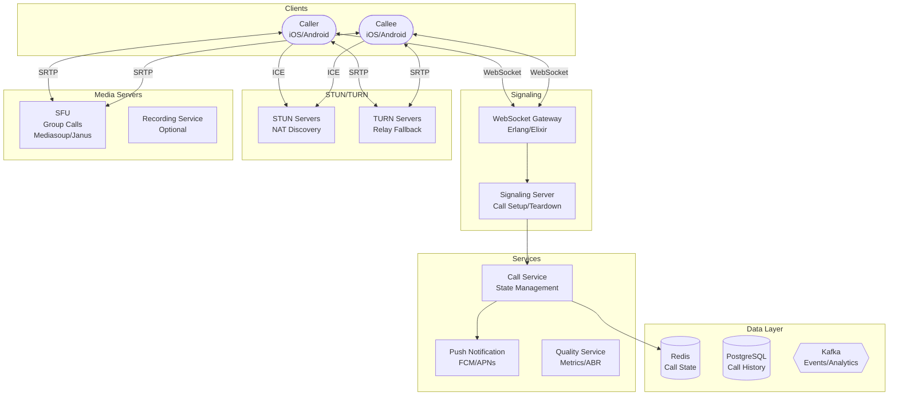

# 📞 WhatsApp Calling - System Design Interview

> **Interview Duration**: 45 minutes  
> **Difficulty**: Hard  
> **Type**: VoIP/Real-time Communication

---

## 1️⃣ Requirements & Estimation (5 min)

### Functional Requirements
1. **Voice Calls**: 1-to-1 and group voice calls
2. **Video Calls**: 1-to-1 and group video calls
3. **Call Quality**: Adaptive quality based on network conditions

### Non-Functional Requirements
- **Latency**: < 150ms one-way for voice, < 300ms for video
- **Availability**: 99.99% (critical communication)
- **Quality**: HD voice (Opus), HD video (VP8/H.264)

### Back-of-Envelope Estimation

```
Assumptions:
- 2B monthly users, 500M DAU
- 10% make calls daily = 50M callers/day
- Average call: 5 minutes
- 80% voice, 20% video

Traffic:
- Calls/day: 50M users × 2 calls = 100M calls/day
- Calls/second: 100M / 86400 ≈ 1,150 calls/sec
- Concurrent calls (peak): 10M simultaneous

Bandwidth per call:
- Voice (Opus): 32 kbps per direction = 64 kbps/call
- Video (720p): 1.5 Mbps per direction = 3 Mbps/call
- Group (4 people video): 4 × 1.5 Mbps = 6 Mbps receive

Total Bandwidth:
- Voice: 8M × 64 kbps = 512 Gbps
- Video: 2M × 3 Mbps = 6 Tbps
- Total peak: ~6.5 Tbps global
```

---

## 2️⃣ High-Level Architecture (10 min)



### Call Flow (P2P with Fallback)

```
┌─────────────────────────────────────────────────────────────────┐
│                    WEBRTC CALL FLOW                             │
├─────────────────────────────────────────────────────────────────┤
│                                                                  │
│  1. SIGNALING (WebSocket)                                       │
│     Caller                  Server                  Callee      │
│        │                      │                        │        │
│        │──[CALL_INVITE]──────▶│                        │        │
│        │                      │──[PUSH_NOTIFICATION]──▶│        │
│        │                      │                        │        │
│        │                      │◀──[CALL_ACCEPT]────────│        │
│        │◀──[CALLEE_ACCEPTED]──│                        │        │
│                                                                  │
│  2. ICE CANDIDATE EXCHANGE                                      │
│        │──[SDP_OFFER]────────▶│──[SDP_OFFER]──────────▶│        │
│        │◀──[SDP_ANSWER]───────│◀──[SDP_ANSWER]─────────│        │
│        │◀──[ICE_CANDIDATE]───▶│◀──[ICE_CANDIDATE]─────▶│        │
│                                                                  │
│  3. MEDIA FLOW (Direct P2P or via TURN)                         │
│        │◀══════════════════════════════════════════════│        │
│        │         SRTP (Encrypted Audio/Video)          │        │
│        │══════════════════════════════════════════════▶│        │
│                                                                  │
│  Connection Priority:                                            │
│  1. Direct P2P (best latency)                                   │
│  2. STUN-assisted P2P (NAT traversal)                           │
│  3. TURN relay (firewall/symmetric NAT)                         │
│                                                                  │
└─────────────────────────────────────────────────────────────────┘
```

### Technology Choices

| Component | Technology | Justification |
|-----------|------------|---------------|
| Signaling | WebSocket (Erlang) | Low latency, persistent |
| Media Protocol | WebRTC (SRTP) | E2E encryption, standard |
| Audio Codec | Opus | Adaptive bitrate, low latency |
| Video Codec | VP8/H.264 | Hardware acceleration |
| NAT Traversal | STUN/TURN (coturn) | ICE framework |
| Group Calls | SFU (Mediasoup) | Scalable forwarding |
| State | Redis | Fast call state lookup |

---

## 3️⃣ API & Data Model (10 min)

### Signaling Protocol (WebSocket)

**Initiate Call**
```json
// Caller → Server
{
    "type": "call_invite",
    "call_id": "call_abc123",
    "caller_id": "user_123",
    "callee_id": "user_456",
    "call_type": "video",  // voice, video
    "sdp_offer": {
        "type": "offer",
        "sdp": "v=0\r\no=- 12345..."
    }
}

// Server → Callee (via Push + WebSocket)
{
    "type": "incoming_call",
    "call_id": "call_abc123",
    "caller": {
        "user_id": "user_123",
        "name": "John Doe",
        "avatar": "https://..."
    },
    "call_type": "video"
}
```

**Accept Call**
```json
// Callee → Server
{
    "type": "call_accept",
    "call_id": "call_abc123",
    "sdp_answer": {
        "type": "answer",
        "sdp": "v=0\r\no=- 67890..."
    }
}

// Server → Caller
{
    "type": "call_accepted",
    "call_id": "call_abc123",
    "sdp_answer": {...}
}
```

**ICE Candidate Exchange**
```json
// Client → Server (forwarded to peer)
{
    "type": "ice_candidate",
    "call_id": "call_abc123",
    "candidate": {
        "candidate": "candidate:0 1 UDP 2122252543...",
        "sdpMid": "audio",
        "sdpMLineIndex": 0
    }
}
```

**Call State Updates**
```json
// Server → Clients
{
    "type": "call_state",
    "call_id": "call_abc123",
    "state": "connected",  // ringing, connected, ended
    "duration_seconds": 120,
    "quality": {
        "audio_bitrate": 32000,
        "video_bitrate": 1500000,
        "packet_loss": 0.01
    }
}
```

### Data Model

**Call Records (PostgreSQL)**
```sql
CREATE TABLE calls (
    call_id         UUID PRIMARY KEY,
    call_type       VARCHAR(20) NOT NULL,  -- voice, video
    caller_id       UUID NOT NULL,
    callee_id       UUID,  -- NULL for group calls
    group_id        UUID,  -- For group calls
    
    status          VARCHAR(20) NOT NULL,  -- initiated, ringing, connected, ended, missed
    end_reason      VARCHAR(20),  -- completed, declined, no_answer, failed
    
    initiated_at    TIMESTAMP DEFAULT NOW(),
    answered_at     TIMESTAMP,
    ended_at        TIMESTAMP,
    duration_seconds INT,
    
    caller_device   VARCHAR(50),
    callee_device   VARCHAR(50),
    
    quality_score   DECIMAL(3,2)  -- 1.0-5.0 MOS score
);

CREATE INDEX idx_calls_caller ON calls(caller_id, initiated_at DESC);
CREATE INDEX idx_calls_callee ON calls(callee_id, initiated_at DESC);
CREATE INDEX idx_calls_group ON calls(group_id, initiated_at DESC);

-- Group call participants
CREATE TABLE call_participants (
    call_id         UUID REFERENCES calls(call_id),
    user_id         UUID NOT NULL,
    joined_at       TIMESTAMP DEFAULT NOW(),
    left_at         TIMESTAMP,
    is_video_on     BOOLEAN DEFAULT TRUE,
    is_audio_on     BOOLEAN DEFAULT TRUE,
    PRIMARY KEY (call_id, user_id)
);
```

**Active Call State (Redis)**
```
# Call state
HSET call:call_abc123 
    status connected 
    caller_id user_123 
    callee_id user_456 
    type video 
    started_at 1706452200
    turn_server turn.whatsapp.com:3478

# User's active call (for dedup/busy detection)
SET user:user_123:active_call call_abc123 EX 3600
SET user:user_456:active_call call_abc123 EX 3600

# ICE candidates (temporary)
LPUSH call:call_abc123:ice:user_123 "candidate:0 1 UDP..."
EXPIRE call:call_abc123:ice:user_123 60
```

**TURN Server Allocation (Redis)**
```
# Available TURN servers by region
ZADD turn:us-west available_bandwidth_gbps turn-us-west-1.whatsapp.com
ZADD turn:us-east available_bandwidth_gbps turn-us-east-1.whatsapp.com

# Session allocation
HINCRBY turn:turn-us-west-1.whatsapp.com active_sessions 1
```

---

## 4️⃣ Component Deep Dive: WebRTC & NAT Traversal (15 min)

### NAT Traversal with ICE

```
┌─────────────────────────────────────────────────────────────────┐
│                 ICE (Interactive Connectivity Establishment)    │
├─────────────────────────────────────────────────────────────────┤
│                                                                  │
│  PROBLEM: Most devices are behind NAT (private IP)              │
│                                                                  │
│  Caller (192.168.1.5)          Callee (10.0.0.15)               │
│       │                              │                           │
│       │    NAT A                NAT B    │                      │
│       │    (Port 50000)         (Port 60000)                    │
│       │                              │                           │
│       │         INTERNET             │                           │
│                                                                  │
│  SOLUTION: ICE Framework                                        │
│                                                                  │
│  1. GATHER CANDIDATES                                           │
│     - Host: 192.168.1.5:12345 (local)                          │
│     - STUN: 203.0.113.5:50000 (public, reflexive)              │
│     - TURN: 198.51.100.1:3478 (relay)                          │
│                                                                  │
│  2. EXCHANGE CANDIDATES (via signaling)                         │
│     - Both peers share all their candidates                     │
│                                                                  │
│  3. CONNECTIVITY CHECKS                                         │
│     - Try each pair (host-host, host-stun, stun-stun, turn)    │
│     - Use first working pair                                    │
│                                                                  │
│  4. RESULT                                                       │
│     - 70% P2P direct (via STUN)                                 │
│     - 30% via TURN relay (symmetric NAT/firewall)               │
│                                                                  │
└─────────────────────────────────────────────────────────────────┘
```

### Pseudocode: Call Service & TURN Allocation

```python
import asyncio
from dataclasses import dataclass
from typing import List, Optional
from enum import Enum
import json


class CallState(Enum):
    INITIATED = "initiated"
    RINGING = "ringing"
    CONNECTED = "connected"
    ENDED = "ended"


class CallType(Enum):
    VOICE = "voice"
    VIDEO = "video"


@dataclass
class IceCandidate:
    candidate: str
    sdp_mid: str
    sdp_m_line_index: int


@dataclass
class SessionDescription:
    type: str  # offer, answer
    sdp: str


class CallService:
    """Manage call signaling and state"""
    
    RING_TIMEOUT = 30  # seconds
    CALL_TIMEOUT = 3600  # 1 hour max call
    
    def __init__(self, redis, db, push_service, turn_allocator):
        self.redis = redis
        self.db = db
        self.push = push_service
        self.turn = turn_allocator
        self.ws_connections: dict = {}  # user_id -> websocket
    
    async def initiate_call(self, caller_id: str, callee_id: str,
                            call_type: CallType, 
                            sdp_offer: SessionDescription) -> dict:
        """Handle call initiation from caller"""
        
        # Check if callee is online
        callee_online = callee_id in self.ws_connections
        
        # Check if callee is busy
        active_call = await self.redis.get(f"user:{callee_id}:active_call")
        if active_call:
            return {"status": "busy", "message": "User is on another call"}
        
        # Allocate TURN server for the call
        turn_server = await self.turn.allocate_server(caller_id, callee_id)
        
        # Create call record
        call_id = str(uuid.uuid4())
        
        await self.redis.hset(f"call:{call_id}", mapping={
            "status": CallState.INITIATED.value,
            "caller_id": caller_id,
            "callee_id": callee_id,
            "type": call_type.value,
            "turn_server": turn_server.url,
            "initiated_at": int(time.time())
        })
        
        # Mark users as in-call
        await self.redis.setex(
            f"user:{caller_id}:active_call", self.CALL_TIMEOUT, call_id
        )
        
        # Store SDP offer for callee
        await self.redis.setex(
            f"call:{call_id}:offer", 60, json.dumps(sdp_offer.__dict__)
        )
        
        # Notify callee
        if callee_online:
            await self._send_to_user(callee_id, {
                "type": "incoming_call",
                "call_id": call_id,
                "caller_id": caller_id,
                "call_type": call_type.value,
                "turn_servers": [turn_server.to_dict()]
            })
        
        # Always send push (app might be in background)
        await self.push.send_voip_push(
            user_id=callee_id,
            payload={
                "call_id": call_id,
                "caller_id": caller_id,
                "call_type": call_type.value
            }
        )
        
        # Update state to ringing
        await self.redis.hset(f"call:{call_id}", "status", CallState.RINGING.value)
        
        # Start ring timeout
        asyncio.create_task(self._ring_timeout(call_id))
        
        return {
            "status": "ringing",
            "call_id": call_id,
            "turn_servers": [turn_server.to_dict()]
        }
    
    async def accept_call(self, call_id: str, callee_id: str,
                          sdp_answer: SessionDescription) -> dict:
        """Handle call acceptance from callee"""
        
        # Verify call exists and is for this callee
        call = await self.redis.hgetall(f"call:{call_id}")
        if not call or call.get(b"callee_id", b"").decode() != callee_id:
            return {"status": "error", "message": "Invalid call"}
        
        if call.get(b"status", b"").decode() != CallState.RINGING.value:
            return {"status": "error", "message": "Call not in ringing state"}
        
        # Mark callee as in-call
        await self.redis.setex(
            f"user:{callee_id}:active_call", self.CALL_TIMEOUT, call_id
        )
        
        # Update call state
        await self.redis.hset(f"call:{call_id}", mapping={
            "status": CallState.CONNECTED.value,
            "answered_at": int(time.time())
        })
        
        # Forward SDP answer to caller
        caller_id = call.get(b"caller_id", b"").decode()
        await self._send_to_user(caller_id, {
            "type": "call_accepted",
            "call_id": call_id,
            "sdp_answer": sdp_answer.__dict__
        })
        
        return {"status": "connected", "call_id": call_id}
    
    async def exchange_ice_candidate(self, call_id: str, 
                                      from_user: str,
                                      candidate: IceCandidate):
        """Forward ICE candidate to peer"""
        
        call = await self.redis.hgetall(f"call:{call_id}")
        if not call:
            return
        
        caller_id = call.get(b"caller_id", b"").decode()
        callee_id = call.get(b"callee_id", b"").decode()
        
        # Determine recipient
        to_user = callee_id if from_user == caller_id else caller_id
        
        await self._send_to_user(to_user, {
            "type": "ice_candidate",
            "call_id": call_id,
            "candidate": candidate.__dict__
        })
    
    async def end_call(self, call_id: str, user_id: str,
                       reason: str = "completed"):
        """Handle call termination"""
        
        call = await self.redis.hgetall(f"call:{call_id}")
        if not call:
            return
        
        caller_id = call.get(b"caller_id", b"").decode()
        callee_id = call.get(b"callee_id", b"").decode()
        
        # Calculate duration
        started = int(call.get(b"answered_at", 0) or call.get(b"initiated_at", 0))
        duration = int(time.time()) - started if started else 0
        
        # Update state
        await self.redis.hset(f"call:{call_id}", mapping={
            "status": CallState.ENDED.value,
            "ended_at": int(time.time()),
            "duration": duration,
            "end_reason": reason
        })
        
        # Clean up active call markers
        await self.redis.delete(f"user:{caller_id}:active_call")
        await self.redis.delete(f"user:{callee_id}:active_call")
        
        # Notify other party
        other_user = callee_id if user_id == caller_id else caller_id
        await self._send_to_user(other_user, {
            "type": "call_ended",
            "call_id": call_id,
            "reason": reason,
            "duration_seconds": duration
        })
        
        # Persist to database (async)
        asyncio.create_task(self._persist_call_record(call_id))
        
        # Release TURN allocation
        await self.turn.release_server(call_id)
    
    async def _ring_timeout(self, call_id: str):
        """Handle ring timeout (no answer)"""
        
        await asyncio.sleep(self.RING_TIMEOUT)
        
        call = await self.redis.hgetall(f"call:{call_id}")
        if call and call.get(b"status", b"").decode() == CallState.RINGING.value:
            await self.end_call(call_id, "system", reason="no_answer")


class TURNAllocator:
    """Manage TURN server allocation"""
    
    def __init__(self, redis, regions: List[str]):
        self.redis = redis
        self.regions = regions
    
    async def allocate_server(self, caller_id: str, 
                              callee_id: str) -> 'TURNServer':
        """Allocate optimal TURN server for a call"""
        
        # Get user regions (from their last known location)
        caller_region = await self._get_user_region(caller_id)
        callee_region = await self._get_user_region(callee_id)
        
        # Find optimal TURN server
        # Prefer server between both users
        optimal_region = self._find_optimal_region(caller_region, callee_region)
        
        # Get least loaded server in region
        servers = await self.redis.zrange(
            f"turn:{optimal_region}", 0, 0, withscores=True
        )
        
        if not servers:
            # Fallback to any available server
            for region in self.regions:
                servers = await self.redis.zrange(
                    f"turn:{region}", 0, 0, withscores=True
                )
                if servers:
                    break
        
        server_host = servers[0][0].decode()
        
        # Increment session count
        await self.redis.hincrby(f"turn:{server_host}", "active_sessions", 1)
        
        # Generate credentials
        username, credential = self._generate_credentials(server_host)
        
        return TURNServer(
            url=f"turn:{server_host}:3478",
            username=username,
            credential=credential
        )
    
    def _generate_credentials(self, server_host: str) -> tuple:
        """Generate time-limited TURN credentials"""
        
        timestamp = int(time.time()) + 86400  # 24 hour validity
        username = f"{timestamp}:random_user_id"
        
        # HMAC-SHA1 of username with shared secret
        import hmac
        import hashlib
        import base64
        
        secret = os.environ.get("TURN_SECRET", "secret")
        credential = base64.b64encode(
            hmac.new(
                secret.encode(),
                username.encode(),
                hashlib.sha1
            ).digest()
        ).decode()
        
        return username, credential


@dataclass
class TURNServer:
    url: str
    username: str
    credential: str
    
    def to_dict(self) -> dict:
        return {
            "urls": [self.url, self.url.replace("turn:", "turns:") + "?transport=tcp"],
            "username": self.username,
            "credential": self.credential
        }


class QualityMonitor:
    """Monitor and adapt call quality"""
    
    def __init__(self, redis):
        self.redis = redis
    
    async def report_stats(self, call_id: str, user_id: str, stats: dict):
        """Receive WebRTC stats from client"""
        
        # Extract key metrics
        rtt = stats.get("currentRoundTripTime", 0) * 1000  # ms
        packet_loss = stats.get("packetsLost", 0) / max(stats.get("packetsReceived", 1), 1)
        jitter = stats.get("jitter", 0) * 1000  # ms
        bitrate = stats.get("bytesReceived", 0) * 8 / 1000  # kbps
        
        # Calculate MOS (Mean Opinion Score)
        mos = self._calculate_mos(rtt, packet_loss, jitter)
        
        # Store for analytics
        await self.redis.hset(f"call:{call_id}:quality:{user_id}", mapping={
            "rtt": rtt,
            "packet_loss": packet_loss,
            "jitter": jitter,
            "bitrate": bitrate,
            "mos": mos,
            "timestamp": int(time.time())
        })
        
        # If quality is poor, suggest bitrate reduction
        if mos < 3.0:
            return {
                "action": "reduce_bitrate",
                "suggested_video_bitrate": max(500000, bitrate * 0.7),
                "suggested_audio_bitrate": 24000
            }
        
        return {"action": "maintain"}
    
    def _calculate_mos(self, rtt: float, packet_loss: float, 
                       jitter: float) -> float:
        """Simplified MOS calculation"""
        
        # R-factor calculation (simplified)
        r = 93.2 - (rtt / 2) - (packet_loss * 2.5) - (jitter / 2)
        
        # Convert R to MOS
        if r < 0:
            return 1.0
        elif r > 100:
            return 4.5
        else:
            return 1 + 0.035 * r + r * (r - 60) * (100 - r) * 0.000007
```

### Group Calls with SFU

```
┌─────────────────────────────────────────────────────────────────┐
│                 SFU vs MCU ARCHITECTURE                         │
├─────────────────────────────────────────────────────────────────┤
│                                                                  │
│  MCU (Multipoint Control Unit):                                 │
│  ┌─────┐  ┌─────┐                                               │
│  │  A  │──│     │──┌─────┐                                      │
│  └─────┘  │     │  │  B  │                                      │
│  ┌─────┐──│ MCU │──└─────┘                                      │
│  │  C  │  │     │──┌─────┐                                      │
│  └─────┘  │     │  │  D  │                                      │
│           └─────┘  └─────┘                                      │
│  ❌ High CPU (decode + encode)                                  │
│  ✅ Low client bandwidth                                        │
│                                                                  │
│  SFU (Selective Forwarding Unit) - OUR CHOICE:                 │
│  ┌─────┐        ┌─────┐                                         │
│  │  A  │───────▶│     │───────▶┌─────┐                         │
│  └─────┘        │     │        │  B  │                         │
│  ┌─────┐───────▶│ SFU │───────▶└─────┘                         │
│  │  C  │        │     │───────▶┌─────┐                         │
│  └─────┘        │     │        │  D  │                         │
│                 └─────┘        └─────┘                          │
│  ✅ Low CPU (just forward, no transcode)                        │
│  ✅ Simulcast (multiple quality layers)                         │
│  ❌ Higher client bandwidth (N-1 streams)                       │
│                                                                  │
│  WhatsApp Uses: SFU with Simulcast                              │
│  - Each sender transmits 3 quality layers                       │
│  - SFU selects best layer per receiver                          │
│                                                                  │
└─────────────────────────────────────────────────────────────────┘
```

---

## 5️⃣ Bottlenecks & Trade-offs (5 min)

### Single Points of Failure & Mitigations

| SPOF | Impact | Mitigation |
|------|--------|------------|
| Signaling server | Can't establish calls | Multiple servers, Redis pub/sub |
| TURN server | 30% calls fail | Multiple TURN servers, auto-failover |
| SFU (group calls) | Group call drops | SFU cluster, session migration |
| Push notification | Missed calls | Voip push + regular push fallback |

### Latency vs Quality Trade-off

```
┌─────────────────────────────────────────────────────────────────┐
│              LATENCY VS QUALITY TRADE-OFF                       │
├─────────────────────────────────────────────────────────────────┤
│                                                                  │
│  LOW LATENCY (Voice-optimized):                                 │
│  • Small packet size (20ms audio frames)                        │
│  • No FEC (Forward Error Correction)                            │
│  • UDP only (no TCP fallback)                                   │
│  → Latency: 100-150ms, but drops on packet loss                 │
│                                                                  │
│  HIGH QUALITY (Reliability-optimized):                          │
│  • Larger buffer (40-60ms)                                      │
│  • FEC enabled (25% overhead)                                   │
│  • Retransmission for video                                     │
│  → Latency: 200-300ms, but handles 5% packet loss               │
│                                                                  │
│  OUR CHOICE: Adaptive                                            │
│  • Start with low-latency settings                              │
│  • Increase buffer if packet loss detected                      │
│  • Enable FEC on poor networks                                  │
│  • Reduce video bitrate before audio                            │
│                                                                  │
└─────────────────────────────────────────────────────────────────┘
```

### CAP Theorem Trade-off

```
┌─────────────────────────────────────────────────────────────────┐
│               WHATSAPP CALLING CAP CHOICE                       │
├─────────────────────────────────────────────────────────────────┤
│  WE CHOOSE: AP (Availability + Partition Tolerance)             │
│                                                                  │
│  Signaling (AP):                                                 │
│  • Call must always be reachable                                 │
│  • Duplicate ring is OK (callee ignores)                        │
│  • Call state eventually consistent                              │
│                                                                  │
│  Media (P2P - no central state):                                │
│  • Direct peer-to-peer after connection                          │
│  • No central bottleneck                                         │
│  • Partition doesn't affect ongoing calls                        │
│                                                                  │
│  Trade-off Accepted:                                             │
│  • Caller might see "ringing" when callee declined              │
│  • Call history may have slight delay                            │
│  • Missed call notification may be delayed                       │
│                                                                  │
└─────────────────────────────────────────────────────────────────┘
```

### Scaling Strategies

| Challenge | Solution |
|-----------|----------|
| TURN bandwidth | Geo-distributed TURN, P2P when possible |
| Signaling connections | Erlang (millions of connections per node) |
| Group calls | SFU sharding by call_id |
| Global latency | Regional media servers |

### Interview Pro Tips

1. **Start with WebRTC basics**: Signaling vs media path
2. **Explain ICE/STUN/TURN**: NAT traversal is key
3. **Discuss P2P vs relay**: 70% P2P, 30% TURN
4. **Mention E2E encryption**: SRTP with DTLS key exchange
