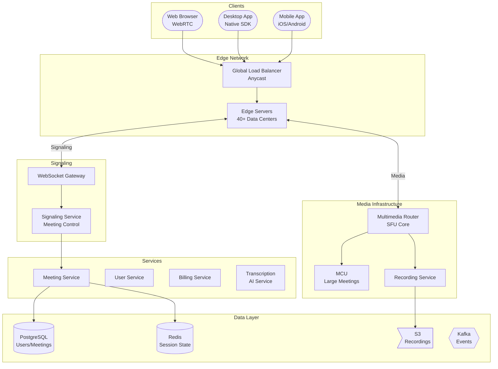

# 🎥 Zoom - System Design Interview

> **Interview Duration**: 45 minutes  
> **Difficulty**: Very Hard  
> **Type**: Video Conferencing Platform

---

## 1️⃣ Requirements & Estimation (5 min)

### Functional Requirements
1. **Video Meetings**: Host meetings with 100+ participants
2. **Screen Sharing**: Share screen with audio
3. **Gallery View**: See multiple participants simultaneously

### Non-Functional Requirements
- **Latency**: < 150ms for real-time interaction
- **Availability**: 99.99% (critical business tool)
- **Scale**: Support 1000+ participant webinars

### Back-of-Envelope Estimation

```
Assumptions:
- 300M daily meeting participants
- Average meeting: 45 minutes, 5 participants
- Peak: 30M concurrent participants
- Video: 720p at 1.5 Mbps, Audio: 64 kbps

Traffic:
- Meetings/day: 300M / 5 = 60M meetings
- Concurrent meetings (peak): 5M meetings
- Peak participants: 30M concurrent

Bandwidth (per participant):
- Sending: 1.5 Mbps video + 64 kbps audio = 1.56 Mbps
- Receiving (5 person call): 4 × 1.5 Mbps = 6 Mbps
- Receiving (gallery view 25): 25 × 0.2 Mbps = 5 Mbps (thumbnails)

Total Bandwidth:
- Upload: 30M × 1.56 Mbps = 47 Pbps
- Download: 30M × 5 Mbps = 150 Pbps
- This is why Zoom uses their own data centers!

Server Resources:
- SFU servers needed: 1 SFU handles ~500 participants
- Peak: 30M / 500 = 60,000 SFU instances
```

---

## 2️⃣ High-Level Architecture (10 min)



### Media Flow Architecture

```
┌─────────────────────────────────────────────────────────────────┐
│                    ZOOM MEDIA ARCHITECTURE                      │
├─────────────────────────────────────────────────────────────────┤
│                                                                  │
│  SMALL MEETINGS (2-25 participants): SFU Mode                   │
│                                                                  │
│  ┌─────┐                                                        │
│  │User1│─┬──▶┌─────┐──▶│User2│                                 │
│  └─────┘ │   │     │   │User3│                                 │
│  ┌─────┐─┤   │ SFU │──▶│User4│                                 │
│  │User2│ │   │     │                                           │
│  └─────┘ │   └─────┘                                           │
│          │      │                                               │
│  Each user sends ONE stream, SFU forwards to all               │
│                                                                  │
│  LARGE MEETINGS (100-1000): Hierarchical SFU                    │
│                                                                  │
│  ┌─────────────────────────────────────────┐                    │
│  │           Root SFU (Primary)            │                    │
│  └───────────────┬─────────────────────────┘                    │
│          ┌───────┼───────┐                                      │
│          ▼       ▼       ▼                                      │
│      ┌─────┐ ┌─────┐ ┌─────┐                                   │
│      │Edge │ │Edge │ │Edge │                                   │
│      │ SFU │ │ SFU │ │ SFU │                                   │
│      └──┬──┘ └──┬──┘ └──┬──┘                                   │
│         │       │       │                                       │
│      Region A  Region B  Region C                               │
│      (100 users) (200 users) (150 users)                       │
│                                                                  │
│  WEBINARS (1000+): MCU Mode (Composite)                         │
│                                                                  │
│  Panelists ──▶ MCU ──▶ Single composed stream ──▶ Attendees   │
│                                                                  │
└─────────────────────────────────────────────────────────────────┘
```

### Technology Choices

| Component | Technology | Justification |
|-----------|------------|---------------|
| Media Transport | Custom RTP/SRTP | Optimized for their protocol |
| Video Codec | H.264/AVC, VP8, AV1 | Hardware acceleration |
| Audio Codec | Opus | Adaptive, low latency |
| Signaling | WebSocket | Persistent, bidirectional |
| SFU | Custom (MMR) | Zoom's Multimedia Router |
| Edge Network | Own data centers | Control over routing |

---

## 3️⃣ API & Data Model (10 min)

### API Design

**Create Meeting**
```http
POST /api/v2/users/{userId}/meetings
Authorization: Bearer {token}

{
    "topic": "Engineering Standup",
    "type": 2,  // 1=instant, 2=scheduled, 3=recurring
    "start_time": "2024-01-28T09:00:00Z",
    "duration": 30,
    "timezone": "America/Los_Angeles",
    "settings": {
        "host_video": true,
        "participant_video": true,
        "join_before_host": false,
        "mute_upon_entry": true,
        "waiting_room": true,
        "breakout_room": {
            "enable": true,
            "rooms": [
                {"name": "Team A", "participants": ["user1@...", "user2@..."]},
                {"name": "Team B", "participants": ["user3@..."]}
            ]
        }
    }
}

Response 201:
{
    "id": 123456789,
    "uuid": "abc123-def456",
    "topic": "Engineering Standup",
    "join_url": "https://zoom.us/j/123456789?pwd=xxxxx",
    "password": "abc123",
    "start_url": "https://zoom.us/s/123456789?zak=xxxxx",
    "settings": {...}
}
```

**Join Meeting (Signaling)**
```json
// WebSocket: Client → Server
{
    "type": "join",
    "meeting_id": "123456789",
    "password": "abc123",
    "display_name": "John Doe",
    "audio_only": false,
    "sdp_offer": {...}
}

// WebSocket: Server → Client
{
    "type": "joined",
    "participant_id": "p_abc123",
    "meeting_info": {
        "topic": "Engineering Standup",
        "host": {"id": "u_host", "name": "Host User"}
    },
    "participants": [
        {"id": "p_1", "name": "Alice", "video": true, "audio": true},
        {"id": "p_2", "name": "Bob", "video": false, "audio": true}
    ],
    "media_server": "mmr-us-west-1.zoom.us",
    "sdp_answer": {...},
    "ice_servers": [...]
}
```

**Media Control**
```json
// Toggle video
{
    "type": "media_control",
    "action": "video_toggle",
    "enabled": false
}

// Screen share
{
    "type": "screen_share",
    "action": "start",
    "source": "screen",  // screen, window, tab
    "with_audio": true
}

// Participant update (Server → All)
{
    "type": "participant_update",
    "participant_id": "p_abc123",
    "changes": {
        "video": false,
        "screen_share": true
    }
}
```

### Data Model

**Meetings (PostgreSQL)**
```sql
CREATE TABLE meetings (
    meeting_id      BIGINT PRIMARY KEY,
    uuid            UUID UNIQUE NOT NULL,
    host_id         UUID NOT NULL,
    topic           VARCHAR(200),
    type            SMALLINT NOT NULL,  -- 1=instant, 2=scheduled, 3=recurring
    
    scheduled_start TIMESTAMP,
    scheduled_duration_min INT,
    timezone        VARCHAR(50),
    
    password_hash   VARCHAR(64),
    join_url        TEXT,
    
    settings        JSONB,  -- All meeting settings
    
    created_at      TIMESTAMP DEFAULT NOW(),
    started_at      TIMESTAMP,
    ended_at        TIMESTAMP,
    
    status          VARCHAR(20) DEFAULT 'scheduled'  -- scheduled, started, ended
);

CREATE INDEX idx_meetings_host ON meetings(host_id, scheduled_start DESC);
CREATE INDEX idx_meetings_status ON meetings(status) WHERE status = 'started';

-- Recurring meeting instances
CREATE TABLE meeting_occurrences (
    occurrence_id   UUID PRIMARY KEY,
    meeting_id      BIGINT REFERENCES meetings(meeting_id),
    scheduled_start TIMESTAMP NOT NULL,
    actual_start    TIMESTAMP,
    actual_end      TIMESTAMP,
    status          VARCHAR(20)
);
```

**Participants (Redis - ephemeral)**
```
# Active meeting state
HSET meeting:123456789 
    status started 
    host_id u_host 
    started_at 1706432400 
    mmr_server mmr-us-west-1

# Participants in meeting
HSET meeting:123456789:participants:p_abc123 
    user_id u_123 
    name "John Doe" 
    video true 
    audio true 
    screen_share false 
    joined_at 1706432410

# All participants (for count)
SADD meeting:123456789:participant_ids p_abc123 p_def456 p_ghi789

# Participant's connection
HSET participant:p_abc123:connection 
    websocket_id ws_123 
    mmr_session session_abc 
    client_ip 203.0.113.45
```

**Recordings (PostgreSQL + S3)**
```sql
CREATE TABLE recordings (
    recording_id    UUID PRIMARY KEY,
    meeting_id      BIGINT REFERENCES meetings(meeting_id),
    
    type            VARCHAR(20),  -- cloud, local
    file_type       VARCHAR(20),  -- mp4, m4a, transcript
    
    s3_bucket       VARCHAR(100),
    s3_key          VARCHAR(500),
    
    duration_seconds INT,
    file_size_bytes BIGINT,
    
    status          VARCHAR(20),  -- processing, available, deleted
    download_url    TEXT,
    password_hash   VARCHAR(64),
    
    created_at      TIMESTAMP DEFAULT NOW(),
    expires_at      TIMESTAMP
);
```

---

## 4️⃣ Component Deep Dive: Multimedia Router (SFU) (15 min)

### SFU Architecture

```
┌─────────────────────────────────────────────────────────────────┐
│                 MULTIMEDIA ROUTER (MMR)                         │
├─────────────────────────────────────────────────────────────────┤
│                                                                  │
│  INCOMING                           OUTGOING                    │
│  ┌─────────────────┐               ┌─────────────────┐          │
│  │ Participant 1   │               │ To Participant 2 │         │
│  │ ┌─────┐ ┌─────┐ │               │ ┌─────┐ ┌─────┐ │         │
│  │ │Video│ │Audio│ │               │ │P1 HD│ │P3 HD│ │         │
│  │ │1080p│ │Opus │ │               │ │Video│ │Video│ │         │
│  │ │720p │ │     │ │               │ └─────┘ └─────┘ │         │
│  │ │360p │ │     │ │ ─────────────▶│ ┌─────────────┐ │         │
│  │ └─────┘ └─────┘ │               │ │ P1+P3 Audio │ │         │
│  └─────────────────┘               │ │   (Mixed)   │ │         │
│                                    │ └─────────────┘ │         │
│  SIMULCAST: Sender transmits       └─────────────────┘          │
│  multiple quality layers                                        │
│                                                                  │
│  KEY OPTIMIZATIONS:                                             │
│  1. Selective Forwarding: Only send what receiver needs         │
│  2. Temporal Scaling: Drop frames if bandwidth low              │
│  3. Audio Mixing: Combine top 3 speakers into one stream        │
│  4. Active Speaker: Auto-switch high-res to current speaker     │
│                                                                  │
└─────────────────────────────────────────────────────────────────┘
```

### Pseudocode: MMR (Multimedia Router)

```python
import asyncio
from dataclasses import dataclass, field
from typing import Dict, List, Set, Optional
from enum import Enum
import heapq


class VideoQuality(Enum):
    HIGH = "1080p"
    MEDIUM = "720p"
    LOW = "360p"
    THUMBNAIL = "180p"


@dataclass
class MediaTrack:
    track_id: str
    participant_id: str
    media_type: str  # video, audio, screen_share
    quality: VideoQuality
    bitrate: int
    ssrc: int  # Synchronization Source identifier


@dataclass
class Participant:
    participant_id: str
    session_id: str
    
    # Outgoing tracks (what this participant sends)
    video_tracks: List[MediaTrack] = field(default_factory=list)  # Simulcast layers
    audio_track: Optional[MediaTrack] = None
    screen_track: Optional[MediaTrack] = None
    
    # Subscriptions (what this participant receives)
    subscribed_videos: Dict[str, VideoQuality] = field(default_factory=dict)
    receive_audio_mix: bool = True
    
    # State
    is_speaking: bool = False
    audio_level: float = 0.0
    bandwidth_estimate: int = 5_000_000  # 5 Mbps default


class MultimediaRouter:
    """SFU core - routes media between participants"""
    
    MAX_VIDEO_STREAMS = 25  # Gallery view limit
    TOP_SPEAKERS = 3  # Audio mixing
    SPEAKER_SWITCH_THRESHOLD = 2.0  # seconds
    
    def __init__(self, meeting_id: str):
        self.meeting_id = meeting_id
        self.participants: Dict[str, Participant] = {}
        self.active_speaker: Optional[str] = None
        self.speaker_history: List[tuple] = []  # (timestamp, participant_id)
        
    async def add_participant(self, participant_id: str,
                               session_id: str) -> Participant:
        """Add participant to meeting"""
        
        participant = Participant(
            participant_id=participant_id,
            session_id=session_id
        )
        self.participants[participant_id] = participant
        
        # Notify existing participants
        await self._broadcast_participant_joined(participant_id)
        
        # Set up default subscriptions
        await self._setup_subscriptions(participant)
        
        return participant
    
    async def add_video_track(self, participant_id: str,
                               tracks: List[MediaTrack]):
        """Handle incoming simulcast video from participant"""
        
        participant = self.participants.get(participant_id)
        if not participant:
            return
        
        participant.video_tracks = tracks
        
        # Notify all subscribers about new video
        for other_id, other in self.participants.items():
            if other_id == participant_id:
                continue
            
            # Determine quality based on subscriber's bandwidth and view
            quality = self._select_quality_for_subscriber(
                subscriber=other,
                publisher=participant
            )
            
            await self._forward_video(
                from_participant=participant_id,
                to_participant=other_id,
                quality=quality
            )
    
    async def handle_audio(self, participant_id: str, 
                           audio_data: bytes, level: float):
        """Handle incoming audio - mix top speakers"""
        
        participant = self.participants.get(participant_id)
        if not participant:
            return
        
        participant.audio_level = level
        
        # Detect speaking
        if level > 0.1:  # Threshold
            participant.is_speaking = True
            await self._update_active_speaker(participant_id)
        else:
            participant.is_speaking = False
        
        # Get top N speakers
        speakers = self._get_top_speakers()
        
        # Mix audio and forward
        for recipient_id, recipient in self.participants.items():
            if recipient_id == participant_id:
                continue
            
            # Don't send speaker's own audio back
            speakers_to_send = [s for s in speakers if s != recipient_id]
            
            if participant_id in speakers_to_send:
                await self._forward_audio(
                    audio_data=audio_data,
                    from_participant=participant_id,
                    to_participant=recipient_id
                )
    
    async def _update_active_speaker(self, participant_id: str):
        """Update active speaker with hysteresis"""
        
        now = time.time()
        
        # Clean old history
        self.speaker_history = [
            (ts, pid) for ts, pid in self.speaker_history
            if now - ts < 10  # Last 10 seconds
        ]
        
        self.speaker_history.append((now, participant_id))
        
        # Calculate speaking time per participant
        speaking_time = {}
        for ts, pid in self.speaker_history:
            speaking_time[pid] = speaking_time.get(pid, 0) + 1
        
        # New active speaker if significantly more speaking
        current_time = speaking_time.get(self.active_speaker, 0)
        candidate_time = speaking_time.get(participant_id, 0)
        
        if candidate_time > current_time + self.SPEAKER_SWITCH_THRESHOLD:
            old_speaker = self.active_speaker
            self.active_speaker = participant_id
            
            # Switch high-res video to new speaker
            await self._switch_spotlight(
                from_speaker=old_speaker,
                to_speaker=participant_id
            )
    
    def _get_top_speakers(self) -> List[str]:
        """Get top N speakers by audio level"""
        
        speakers = [
            (p.audio_level, pid) 
            for pid, p in self.participants.items()
            if p.is_speaking
        ]
        
        # Sort by audio level, get top N
        speakers.sort(reverse=True)
        return [pid for _, pid in speakers[:self.TOP_SPEAKERS]]
    
    def _select_quality_for_subscriber(self, subscriber: Participant,
                                        publisher: Participant) -> VideoQuality:
        """Select optimal quality based on subscriber context"""
        
        # Check subscriber bandwidth
        available_bandwidth = subscriber.bandwidth_estimate
        
        # Check how many videos subscriber is receiving
        num_videos = len(subscriber.subscribed_videos)
        per_video_bandwidth = available_bandwidth / max(num_videos, 1)
        
        # Check if publisher is active speaker
        is_active = publisher.participant_id == self.active_speaker
        
        # Check if gallery view (many videos) or speaker view
        if num_videos > 9:
            # Gallery view - use thumbnails except for speaker
            if is_active:
                return VideoQuality.MEDIUM
            return VideoQuality.THUMBNAIL
        elif num_videos > 4:
            # Medium gallery
            if is_active:
                return VideoQuality.HIGH
            return VideoQuality.LOW
        else:
            # Small meeting - everyone gets high quality
            if per_video_bandwidth > 2_000_000:  # 2 Mbps
                return VideoQuality.HIGH
            elif per_video_bandwidth > 1_000_000:
                return VideoQuality.MEDIUM
            else:
                return VideoQuality.LOW
    
    async def _switch_spotlight(self, from_speaker: Optional[str],
                                 to_speaker: str):
        """Switch high-res spotlight to new active speaker"""
        
        for participant_id, participant in self.participants.items():
            if participant_id == to_speaker:
                continue
            
            # Demote old speaker to lower quality
            if from_speaker and from_speaker in participant.subscribed_videos:
                old_quality = self._select_quality_for_subscriber(
                    subscriber=participant,
                    publisher=self.participants[from_speaker]
                )
                participant.subscribed_videos[from_speaker] = old_quality
            
            # Promote new speaker to high quality
            participant.subscribed_videos[to_speaker] = VideoQuality.HIGH
            
            # Request quality switch from publisher
            await self._request_layer_switch(
                subscriber_id=participant_id,
                publisher_id=to_speaker,
                quality=VideoQuality.HIGH
            )
    
    async def handle_bandwidth_estimate(self, participant_id: str,
                                         bandwidth: int):
        """Handle bandwidth update from client"""
        
        participant = self.participants.get(participant_id)
        if not participant:
            return
        
        old_bandwidth = participant.bandwidth_estimate
        participant.bandwidth_estimate = bandwidth
        
        # If bandwidth dropped significantly, reduce quality
        if bandwidth < old_bandwidth * 0.7:
            await self._reduce_subscriptions(participant)
    
    async def _reduce_subscriptions(self, participant: Participant):
        """Reduce video quality when bandwidth constrained"""
        
        for publisher_id, current_quality in participant.subscribed_videos.items():
            publisher = self.participants.get(publisher_id)
            if not publisher:
                continue
            
            new_quality = self._select_quality_for_subscriber(
                subscriber=participant,
                publisher=publisher
            )
            
            if new_quality != current_quality:
                participant.subscribed_videos[publisher_id] = new_quality
                await self._request_layer_switch(
                    subscriber_id=participant.participant_id,
                    publisher_id=publisher_id,
                    quality=new_quality
                )


class ScreenShareRouter:
    """Handle screen sharing with optimizations"""
    
    def __init__(self, meeting_id: str):
        self.meeting_id = meeting_id
        self.active_share: Optional[str] = None
    
    async def start_screen_share(self, participant_id: str,
                                  track: MediaTrack):
        """Start screen sharing"""
        
        if self.active_share:
            return {"error": "Screen share already active"}
        
        self.active_share = participant_id
        
        # Screen share gets priority bandwidth
        # Video codec settings optimized for screen content:
        # - Higher resolution (1080p/4K)
        # - Lower frame rate (5-15 fps)
        # - Content-adaptive encoding
        
        return {"status": "started", "participant_id": participant_id}


class BreakoutRoomManager:
    """Manage breakout rooms within a meeting"""
    
    def __init__(self, main_meeting_id: str):
        self.main_meeting = main_meeting_id
        self.rooms: Dict[str, MultimediaRouter] = {}
        self.assignments: Dict[str, str] = {}  # participant -> room
    
    async def create_rooms(self, room_configs: List[dict]):
        """Create breakout rooms"""
        
        for config in room_configs:
            room_id = f"{self.main_meeting}:room:{config['name']}"
            self.rooms[room_id] = MultimediaRouter(room_id)
        
        return list(self.rooms.keys())
    
    async def move_participant(self, participant_id: str, room_id: str):
        """Move participant to breakout room"""
        
        # Remove from current room
        current_room = self.assignments.get(participant_id)
        if current_room:
            await self.rooms[current_room].remove_participant(participant_id)
        
        # Add to new room
        if room_id in self.rooms:
            await self.rooms[room_id].add_participant(participant_id, "session")
            self.assignments[participant_id] = room_id
```

### Simulcast & SVC

```
┌─────────────────────────────────────────────────────────────────┐
│                 SIMULCAST vs SVC                                │
├─────────────────────────────────────────────────────────────────┤
│                                                                  │
│  SIMULCAST (What Zoom uses):                                    │
│  ┌─────────────────┐                                            │
│  │ Encoder outputs │                                            │
│  │ 3 separate      │                                            │
│  │ streams:        │                                            │
│  │  • 1080p 3Mbps  │                                            │
│  │  • 720p  1.5Mbps│                                            │
│  │  • 360p  0.5Mbps│                                            │
│  └─────────────────┘                                            │
│  ✅ Simple switching between layers                             │
│  ❌ 3x encoding cost                                            │
│                                                                  │
│  SVC (Scalable Video Coding):                                   │
│  ┌─────────────────┐                                            │
│  │ Single stream   │                                            │
│  │ with layers:    │                                            │
│  │  Base ─────────▶│ 360p  (always needed)                     │
│  │  + Layer 1 ────▶│ 720p  (add for better)                    │
│  │  + Layer 2 ────▶│ 1080p (add for best)                      │
│  └─────────────────┘                                            │
│  ✅ Single encode                                               │
│  ✅ Gradual quality adjustment                                  │
│  ❌ More complex, less codec support                            │
│                                                                  │
│  ZOOM USES: Simulcast + custom temporal layering                │
│                                                                  │
└─────────────────────────────────────────────────────────────────┘
```

---

## 5️⃣ Bottlenecks & Trade-offs (5 min)

### Single Points of Failure & Mitigations

| SPOF | Impact | Mitigation |
|------|--------|------------|
| MMR server | Meeting drops | Multiple MMR, session migration |
| Signaling | Can't join/control | Redundant signaling servers |
| Edge server | Regional outage | Multiple PoPs, anycast failover |
| Recording | No recording | Async upload, local fallback |

### Latency vs Quality Trade-off

```
┌─────────────────────────────────────────────────────────────────┐
│              LATENCY VS QUALITY TRADE-OFF                       │
├─────────────────────────────────────────────────────────────────┤
│                                                                  │
│  INTERACTIVE MODE (Default):                                    │
│  • Target latency: < 150ms                                      │
│  • Jitter buffer: 50-100ms                                      │
│  • Prioritize: Audio > Video                                    │
│  • On packet loss: Skip frames, maintain sync                   │
│                                                                  │
│  PRESENTATION MODE:                                              │
│  • Target latency: < 500ms acceptable                           │
│  • Jitter buffer: 200-500ms                                     │
│  • Prioritize: Video quality > latency                          │
│  • On packet loss: Retransmit, FEC enabled                      │
│                                                                  │
│  WEBINAR MODE:                                                   │
│  • One-way communication                                        │
│  • Higher buffer OK (1-2 seconds)                               │
│  • Maximum quality for panelists                                │
│  • CDN-like distribution for attendees                          │
│                                                                  │
└─────────────────────────────────────────────────────────────────┘
```

### CAP Theorem Trade-off

```
┌─────────────────────────────────────────────────────────────────┐
│                     ZOOM CAP CHOICE                             │
├─────────────────────────────────────────────────────────────────┤
│  WE CHOOSE: AP (Availability + Partition Tolerance)             │
│                                                                  │
│  Meeting State (AP):                                             │
│  • Participants may see slightly different participant list     │
│  • Mute status may be briefly inconsistent                      │
│  • Eventually consistent via gossip                             │
│                                                                  │
│  Media Routing (AP):                                             │
│  • SFU continues forwarding during partition                    │
│  • Some participants may be isolated                            │
│  • Reconnect to different server if needed                      │
│                                                                  │
│  Strong Consistency For:                                         │
│  • Meeting creation/scheduling                                   │
│  • Recording start/stop                                          │
│  • Billing (call duration)                                       │
│                                                                  │
└─────────────────────────────────────────────────────────────────┘
```

### Scaling Strategies

| Challenge | Solution |
|-----------|----------|
| Global latency | 40+ data centers, edge routing |
| Large meetings | Hierarchical SFU, MCU for 1000+ |
| Bandwidth | Simulcast, adaptive bitrate |
| Breakout rooms | Logical separation, same MMR |

### Interview Pro Tips

1. **Start with SFU vs MCU**: Explain trade-offs
2. **Discuss simulcast**: Multiple quality layers
3. **Explain active speaker detection**: Audio-based switching
4. **Mention bandwidth adaptation**: Quality reduction strategies
