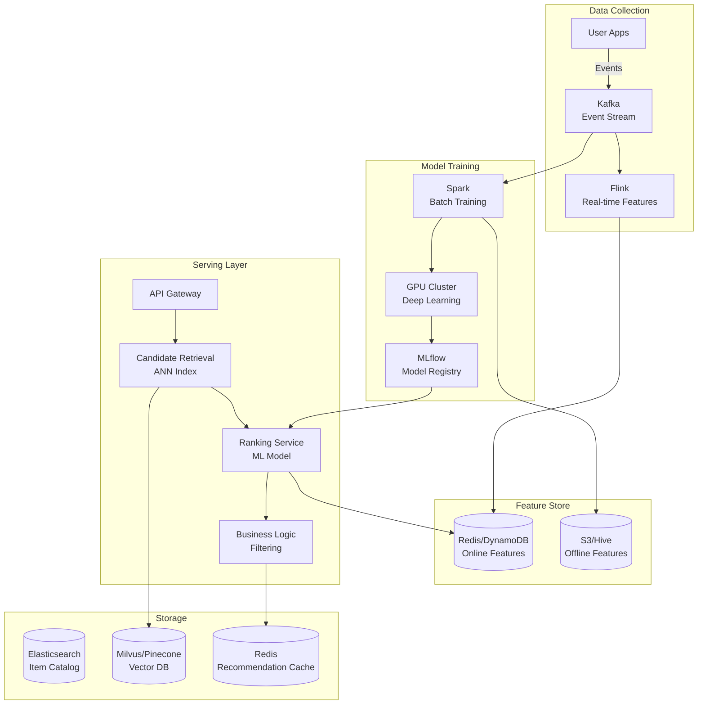

# 🎯 Recommendation Engine - System Design Interview

> **Interview Duration**: 45 minutes  
> **Difficulty**: Hard  
> **Type**: ML/Data Infrastructure Platform

---

## 1️⃣ Requirements & Estimation (5 min)

### Functional Requirements
1. **Personalized Recommendations**: Show relevant items for each user
2. **Real-time Updates**: Reflect user actions immediately
3. **Multi-context**: Home feed, search, "similar items"

### Non-Functional Requirements
- **Latency**: < 100ms p99 for recommendations
- **Freshness**: New items in recommendations within 1 hour
- **Relevance**: CTR improvement > 20% over baseline

### Back-of-Envelope Estimation

```
Assumptions (Netflix-scale):
- 250M users, 50M DAU
- 100K items (movies/shows)
- Average user watches 2 hours/day
- 1B recommendation requests/day

Traffic:
- Requests/sec: 1B / 86400 ≈ 12K QPS
- Peak: 50K QPS (evening prime time)

Model Serving:
- Feature vector per user: 500 dimensions × 4 bytes = 2KB
- Feature vector per item: 500 dimensions × 4 bytes = 2KB
- User embeddings: 250M × 2KB = 500GB
- Item embeddings: 100K × 2KB = 200MB

Storage:
- User interaction history: 250M × 1000 events × 100 bytes = 25TB
- Model checkpoints: 10GB × 100 versions = 1TB
```

---

## 2️⃣ High-Level Architecture (10 min)



### Recommendation Pipeline

```
┌─────────────────────────────────────────────────────────────────┐
│               RECOMMENDATION PIPELINE (3 Stages)                │
├─────────────────────────────────────────────────────────────────┤
│                                                                  │
│  STAGE 1: CANDIDATE GENERATION (Retrieval)                     │
│  ┌────────────────────────────────────────────┐                 │
│  │  Input: User ID                            │                 │
│  │  Output: 1000 candidate items              │                 │
│  │                                            │                 │
│  │  Sources:                                  │                 │
│  │  • Collaborative Filtering (similar users) │                 │
│  │  • Content-Based (similar to watched)      │                 │
│  │  • Popular/Trending                        │                 │
│  │  • New Releases                            │                 │
│  │                                            │                 │
│  │  Tech: ANN (Approximate Nearest Neighbor)  │                 │
│  │  Latency Budget: 20ms                      │                 │
│  └────────────────────────────────────────────┘                 │
│                          │                                       │
│                          ▼                                       │
│  STAGE 2: RANKING (Scoring)                                     │
│  ┌────────────────────────────────────────────┐                 │
│  │  Input: 1000 candidates + user context     │                 │
│  │  Output: Scored & ranked list              │                 │
│  │                                            │                 │
│  │  Model: Deep Neural Network                │                 │
│  │  Features: User, Item, Context, Cross      │                 │
│  │                                            │                 │
│  │  Tech: TensorFlow Serving / ONNX           │                 │
│  │  Latency Budget: 50ms                      │                 │
│  └────────────────────────────────────────────┘                 │
│                          │                                       │
│                          ▼                                       │
│  STAGE 3: FILTERING & RERANKING                                 │
│  ┌────────────────────────────────────────────┐                 │
│  │  Input: Ranked list                        │                 │
│  │  Output: Final recommendations             │                 │
│  │                                            │                 │
│  │  Rules:                                    │                 │
│  │  • Remove already watched                  │                 │
│  │  • Apply parental controls                 │                 │
│  │  • Diversity (not all same genre)          │                 │
│  │  • Business rules (promotions)             │                 │
│  │                                            │                 │
│  │  Latency Budget: 10ms                      │                 │
│  └────────────────────────────────────────────┘                 │
│                                                                  │
└─────────────────────────────────────────────────────────────────┘
```

### Technology Choices

| Component | Technology | Justification |
|-----------|------------|---------------|
| Event Stream | Kafka | High throughput, durability |
| Feature Store | Redis + S3 | Low latency online, cheap offline |
| Vector Search | Milvus/Pinecone | ANN at scale |
| Model Training | PyTorch + Spark | Flexibility + scale |
| Model Serving | TensorFlow Serving | Optimized inference |
| Caching | Redis | Sub-ms recommendations |

---

## 3️⃣ API & Data Model (10 min)

### API Design

**Get Recommendations**
```http
GET /api/v1/recommendations?context=home&limit=20
Authorization: Bearer {token}

Response 200:
{
    "recommendations": [
        {
            "item_id": "movie_123",
            "title": "The Matrix",
            "score": 0.95,
            "reason": "Because you watched Inception",
            "thumbnail": "https://cdn.example.com/matrix.jpg",
            "metadata": {
                "genre": ["Sci-Fi", "Action"],
                "year": 1999,
                "rating": "R"
            }
        }
    ],
    "request_id": "req_abc123",
    "model_version": "v2.3.1"
}
```

**Log User Event (for training)**
```http
POST /api/v1/events
Authorization: Bearer {token}

{
    "event_type": "click",  // click, watch, add_to_list, rate
    "item_id": "movie_123",
    "context": {
        "page": "home",
        "position": 3,
        "recommendation_id": "req_abc123"
    },
    "timestamp": "2024-01-28T15:30:00Z"
}

Response 202 Accepted
```

**Similar Items**
```http
GET /api/v1/items/{item_id}/similar?limit=10

Response 200:
{
    "similar_items": [
        {
            "item_id": "movie_456",
            "title": "Blade Runner",
            "similarity_score": 0.89
        }
    ]
}
```

### Data Model

**User Features (Feature Store)**
```python
# Online features (Redis)
user_features = {
    "user_id": "user_123",
    "embedding": [0.12, -0.34, 0.56, ...],  # 512-dim
    "recent_watches": ["movie_1", "movie_2", "movie_3"],
    "favorite_genres": {"Sci-Fi": 0.8, "Action": 0.6},
    "watch_time_preference": {"evening": 0.7, "weekend": 0.9},
    "avg_session_length_min": 45,
    "subscription_tier": "premium",
    "last_active": "2024-01-28T15:30:00Z"
}

# Stored as:
HSET user:user_123:features embedding <binary> recent_watches [...]
```

**Item Features (Elasticsearch + Vector DB)**
```json
// Elasticsearch (metadata + full-text search)
{
    "item_id": "movie_123",
    "title": "The Matrix",
    "description": "A computer hacker learns...",
    "genres": ["Sci-Fi", "Action"],
    "cast": ["Keanu Reeves", "Laurence Fishburne"],
    "director": "Wachowskis",
    "year": 1999,
    "rating": "R",
    "duration_min": 136,
    "avg_rating": 4.7,
    "watch_count": 1500000,
    "release_date": "1999-03-31"
}

// Milvus (embedding for ANN)
{
    "item_id": "movie_123",
    "embedding": [0.23, 0.45, -0.12, ...]  // 512-dim
}
```

**Interaction Events (Kafka → Data Lake)**
```json
{
    "event_id": "evt_abc123",
    "user_id": "user_123",
    "item_id": "movie_123",
    "event_type": "watch",
    "watch_duration_sec": 7200,
    "completed": true,
    "context": {
        "device": "smart_tv",
        "page": "home",
        "position": 3,
        "model_version": "v2.3.1"
    },
    "timestamp": "2024-01-28T15:30:00Z"
}
```

**Model Metadata (MLflow)**
```sql
CREATE TABLE models (
    model_id        UUID PRIMARY KEY,
    model_name      VARCHAR(100),
    version         VARCHAR(20),
    
    -- Metrics
    offline_ndcg    DECIMAL(5,4),
    offline_recall  DECIMAL(5,4),
    online_ctr      DECIMAL(5,4),
    
    -- Artifacts
    artifact_path   VARCHAR(500),  -- S3 path
    
    -- Deployment
    status          VARCHAR(20),  -- training, validating, deployed, retired
    deployed_at     TIMESTAMP,
    traffic_percent INT DEFAULT 0,  -- For A/B testing
    
    created_at      TIMESTAMP DEFAULT NOW()
);
```

---

## 4️⃣ Component Deep Dive: Two-Tower Model & Retrieval (15 min)

### Two-Tower Architecture

```
┌─────────────────────────────────────────────────────────────────┐
│                   TWO-TOWER MODEL                               │
├─────────────────────────────────────────────────────────────────┤
│                                                                  │
│      USER TOWER                       ITEM TOWER                │
│  ┌─────────────────┐              ┌─────────────────┐           │
│  │  User Features  │              │  Item Features  │           │
│  │  • user_id      │              │  • item_id      │           │
│  │  • age, gender  │              │  • genres       │           │
│  │  • watch history│              │  • cast, crew   │           │
│  │  • preferences  │              │  • year, rating │           │
│  └────────┬────────┘              └────────┬────────┘           │
│           │                                │                     │
│           ▼                                ▼                     │
│  ┌─────────────────┐              ┌─────────────────┐           │
│  │  Embedding Layer│              │  Embedding Layer│           │
│  │  (Lookups +     │              │  (Lookups +     │           │
│  │   Concatenate)  │              │   Concatenate)  │           │
│  └────────┬────────┘              └────────┬────────┘           │
│           │                                │                     │
│           ▼                                ▼                     │
│  ┌─────────────────┐              ┌─────────────────┐           │
│  │  MLP Layers     │              │  MLP Layers     │           │
│  │  Dense(512)     │              │  Dense(512)     │           │
│  │  Dense(256)     │              │  Dense(256)     │           │
│  │  Dense(128)     │              │  Dense(128)     │           │
│  └────────┬────────┘              └────────┬────────┘           │
│           │                                │                     │
│           ▼                                ▼                     │
│  ┌─────────────────┐              ┌─────────────────┐           │
│  │ User Embedding  │              │ Item Embedding  │           │
│  │  [128 dims]     │              │  [128 dims]     │           │
│  └────────┬────────┘              └────────┬────────┘           │
│           │                                │                     │
│           └───────────┬───────────────────┘                     │
│                       │                                         │
│                       ▼                                         │
│              ┌─────────────────┐                                │
│              │  Dot Product    │                                │
│              │  (Similarity)   │                                │
│              └─────────────────┘                                │
│                       │                                         │
│                       ▼                                         │
│              Relevance Score (0-1)                              │
│                                                                  │
│  KEY INSIGHT:                                                   │
│  • Item embeddings computed OFFLINE and indexed                 │
│  • User embedding computed ONLINE at request time               │
│  • ANN search finds top-K similar items in <20ms                │
│                                                                  │
└─────────────────────────────────────────────────────────────────┘
```

### Pseudocode: Recommendation Service

```python
import numpy as np
from dataclasses import dataclass
from typing import List, Dict, Optional
import asyncio


@dataclass
class Recommendation:
    item_id: str
    score: float
    reason: str


@dataclass
class UserFeatures:
    user_id: str
    embedding: np.ndarray  # 128-dim
    recent_watches: List[str]
    favorite_genres: Dict[str, float]
    watch_time_preference: Dict[str, float]


@dataclass
class ItemFeatures:
    item_id: str
    embedding: np.ndarray  # 128-dim
    title: str
    genres: List[str]
    metadata: dict


class RecommendationService:
    """End-to-end recommendation pipeline"""
    
    def __init__(self, feature_store, vector_db, ranker_model,
                 item_catalog, cache):
        self.features = feature_store
        self.vector_db = vector_db
        self.ranker = ranker_model
        self.catalog = item_catalog
        self.cache = cache
    
    async def get_recommendations(self, user_id: str, 
                                   context: str,
                                   limit: int = 20) -> List[Recommendation]:
        """Main recommendation endpoint"""
        
        # Check cache first
        cache_key = f"recs:{user_id}:{context}"
        cached = await self.cache.get(cache_key)
        if cached:
            return cached
        
        # Stage 1: Get user features and compute embedding
        user_features = await self.features.get_user_features(user_id)
        user_embedding = await self._compute_user_embedding(user_features)
        
        # Stage 2: Candidate Generation (Retrieval)
        candidates = await self._retrieve_candidates(
            user_embedding, user_features, limit=1000
        )
        
        # Stage 3: Ranking
        ranked = await self._rank_candidates(
            user_features, candidates, context
        )
        
        # Stage 4: Filtering & Post-processing
        final = await self._filter_and_diversify(
            user_features, ranked, limit
        )
        
        # Cache results (TTL 5 minutes)
        await self.cache.set(cache_key, final, ttl=300)
        
        return final
    
    async def _compute_user_embedding(self, 
                                       user_features: UserFeatures) -> np.ndarray:
        """Compute user tower embedding online"""
        
        # If we have pre-computed embedding, use it
        if user_features.embedding is not None:
            return user_features.embedding
        
        # Otherwise, compute from features
        # (Simplified - real implementation uses the user tower model)
        recent_item_embeddings = await self.vector_db.get_embeddings(
            user_features.recent_watches[-20:]  # Last 20 items
        )
        
        # Weighted average of recent item embeddings
        # (Real implementation: pass through user tower DNN)
        weights = np.array([0.9 ** i for i in range(len(recent_item_embeddings))])
        weights = weights / weights.sum()
        
        user_embedding = np.average(
            recent_item_embeddings, axis=0, weights=weights
        )
        
        return user_embedding
    
    async def _retrieve_candidates(self, user_embedding: np.ndarray,
                                    user_features: UserFeatures,
                                    limit: int) -> List[ItemFeatures]:
        """Candidate generation using multiple sources"""
        
        candidates = []
        
        # Source 1: ANN search (collaborative filtering)
        # Find items with similar embeddings to user
        ann_results = await self.vector_db.search(
            vector=user_embedding,
            top_k=limit // 2,
            filter={"status": "active"}
        )
        candidates.extend(ann_results)
        
        # Source 2: Content-based (similar to recently watched)
        for recent_item in user_features.recent_watches[-5:]:
            item_embedding = await self.vector_db.get_embedding(recent_item)
            similar = await self.vector_db.search(
                vector=item_embedding,
                top_k=50
            )
            candidates.extend(similar)
        
        # Source 3: Popular in user's favorite genres
        for genre, weight in user_features.favorite_genres.items():
            if weight > 0.3:  # Only strong preferences
                popular = await self.catalog.get_popular_by_genre(
                    genre, limit=50
                )
                candidates.extend(popular)
        
        # Source 4: Trending/New releases
        trending = await self.catalog.get_trending(limit=100)
        candidates.extend(trending)
        
        # Deduplicate
        seen = set()
        unique_candidates = []
        for item in candidates:
            if item.item_id not in seen:
                seen.add(item.item_id)
                unique_candidates.append(item)
        
        return unique_candidates[:limit]
    
    async def _rank_candidates(self, user_features: UserFeatures,
                                candidates: List[ItemFeatures],
                                context: str) -> List[tuple]:
        """Rank candidates using deep learning model"""
        
        # Prepare batch input for ranker model
        batch_features = []
        
        for item in candidates:
            features = {
                # User features
                "user_id": user_features.user_id,
                "user_embedding": user_features.embedding,
                "user_genres": user_features.favorite_genres,
                
                # Item features
                "item_id": item.item_id,
                "item_embedding": item.embedding,
                "item_genres": item.genres,
                
                # Cross features
                "genre_match": self._compute_genre_match(
                    user_features.favorite_genres, item.genres
                ),
                
                # Context features
                "context": context,
                "time_of_day": self._get_time_bucket(),
                "day_of_week": self._get_day_bucket()
            }
            batch_features.append(features)
        
        # Score all candidates in one batch (GPU-optimized)
        scores = await self.ranker.predict_batch(batch_features)
        
        # Pair items with scores and sort
        ranked = list(zip(candidates, scores))
        ranked.sort(key=lambda x: x[1], reverse=True)
        
        return ranked
    
    async def _filter_and_diversify(self, user_features: UserFeatures,
                                     ranked: List[tuple],
                                     limit: int) -> List[Recommendation]:
        """Apply business rules and diversification"""
        
        # Get user's watch history for filtering
        watched = set(user_features.recent_watches)
        
        final = []
        genre_counts = {}
        MAX_SAME_GENRE = 3  # Diversity constraint
        
        for item, score in ranked:
            # Skip already watched
            if item.item_id in watched:
                continue
            
            # Diversity: limit same genre
            primary_genre = item.genres[0] if item.genres else "Unknown"
            if genre_counts.get(primary_genre, 0) >= MAX_SAME_GENRE:
                continue
            genre_counts[primary_genre] = genre_counts.get(primary_genre, 0) + 1
            
            # Apply business rules
            # (e.g., parental controls, geo-restrictions)
            if not await self._passes_business_rules(user_features, item):
                continue
            
            # Generate explanation
            reason = self._generate_reason(user_features, item)
            
            final.append(Recommendation(
                item_id=item.item_id,
                score=score,
                reason=reason
            ))
            
            if len(final) >= limit:
                break
        
        return final
    
    def _generate_reason(self, user_features: UserFeatures,
                          item: ItemFeatures) -> str:
        """Generate human-readable recommendation reason"""
        
        # Check for genre match
        user_genres = set(user_features.favorite_genres.keys())
        item_genres = set(item.genres)
        matching = user_genres & item_genres
        
        if matching:
            return f"Because you like {list(matching)[0]}"
        
        # Check for similar to recent
        # (In real system, track which source generated candidate)
        return "Trending now"


class OnlineFeatureStore:
    """Low-latency feature serving"""
    
    def __init__(self, redis_client, feature_config):
        self.redis = redis_client
        self.config = feature_config
    
    async def get_user_features(self, user_id: str) -> UserFeatures:
        """Get user features from online store"""
        
        # Single Redis call with pipelining
        pipe = self.redis.pipeline()
        pipe.hgetall(f"user:{user_id}:features")
        pipe.lrange(f"user:{user_id}:recent_watches", 0, 99)
        pipe.hgetall(f"user:{user_id}:genres")
        
        results = await pipe.execute()
        
        features = results[0]
        recent = results[1]
        genres = results[2]
        
        return UserFeatures(
            user_id=user_id,
            embedding=np.frombuffer(features.get(b"embedding", b""), dtype=np.float32),
            recent_watches=[r.decode() for r in recent],
            favorite_genres={k.decode(): float(v) for k, v in genres.items()},
            watch_time_preference={}
        )
    
    async def update_user_features(self, user_id: str, event: dict):
        """Update features in real-time after user action"""
        
        pipe = self.redis.pipeline()
        
        if event["event_type"] == "watch":
            # Add to recent watches
            pipe.lpush(f"user:{user_id}:recent_watches", event["item_id"])
            pipe.ltrim(f"user:{user_id}:recent_watches", 0, 99)
            
            # Update genre preferences
            item = await self.get_item(event["item_id"])
            for genre in item.genres:
                pipe.hincrbyfloat(f"user:{user_id}:genres", genre, 0.1)
        
        # Invalidate recommendation cache
        pipe.delete(f"recs:{user_id}:*")
        
        await pipe.execute()


class VectorDatabase:
    """ANN search for candidate retrieval"""
    
    def __init__(self, milvus_client, collection_name):
        self.client = milvus_client
        self.collection = collection_name
    
    async def search(self, vector: np.ndarray, top_k: int,
                     filter: dict = None) -> List[ItemFeatures]:
        """Approximate nearest neighbor search"""
        
        # Milvus search with optional filtering
        results = self.client.search(
            collection_name=self.collection,
            data=[vector.tolist()],
            anns_field="embedding",
            param={"metric_type": "IP", "params": {"nprobe": 10}},
            limit=top_k,
            expr=self._build_filter_expr(filter) if filter else None
        )
        
        # Fetch full item data
        item_ids = [hit.id for hit in results[0]]
        items = await self._batch_get_items(item_ids)
        
        return items
    
    async def index_items(self, items: List[ItemFeatures]):
        """Index item embeddings for ANN search"""
        
        entities = [
            {
                "item_id": item.item_id,
                "embedding": item.embedding.tolist(),
                "genres": item.genres,
                "status": "active"
            }
            for item in items
        ]
        
        self.client.insert(
            collection_name=self.collection,
            data=entities
        )
```

### Model Training Pipeline

```
┌─────────────────────────────────────────────────────────────────┐
│                 TRAINING PIPELINE (Daily)                       │
├─────────────────────────────────────────────────────────────────┤
│                                                                  │
│  1. DATA PREPARATION (Spark)                                    │
│  ┌────────────────────────────────────────┐                     │
│  │  • Read events from last 30 days       │                     │
│  │  • Create (user, item, label) pairs    │                     │
│  │  • Positive: watched > 50%             │                     │
│  │  • Negative: sampled from non-watched  │                     │
│  │  • Join with user/item features        │                     │
│  └────────────────────────────────────────┘                     │
│                                                                  │
│  2. MODEL TRAINING (PyTorch on GPU)                             │
│  ┌────────────────────────────────────────┐                     │
│  │  • Two-tower architecture              │                     │
│  │  • Contrastive loss (in-batch negs)    │                     │
│  │  • Train for 10 epochs                 │                     │
│  │  • Learning rate scheduling            │                     │
│  └────────────────────────────────────────┘                     │
│                                                                  │
│  3. EVALUATION (Offline Metrics)                                │
│  ┌────────────────────────────────────────┐                     │
│  │  • Hold-out test set                   │                     │
│  │  • Metrics: Recall@K, NDCG@K, MRR      │                     │
│  │  • Compare vs baseline (current prod)  │                     │
│  └────────────────────────────────────────┘                     │
│                                                                  │
│  4. DEPLOYMENT (A/B Testing)                                    │
│  ┌────────────────────────────────────────┐                     │
│  │  • Register in MLflow                  │                     │
│  │  • Shadow mode (log predictions)       │                     │
│  │  • 5% traffic → 50% → 100%            │                     │
│  │  • Monitor online metrics (CTR, watch) │                     │
│  └────────────────────────────────────────┘                     │
│                                                                  │
└─────────────────────────────────────────────────────────────────┘
```

---

## 5️⃣ Bottlenecks & Trade-offs (5 min)

### Single Points of Failure & Mitigations

| SPOF | Impact | Mitigation |
|------|--------|------------|
| Feature store | No personalization | Cache + fallback to popular |
| Vector DB | No retrieval | Pre-computed candidate lists |
| Ranker model | Degraded quality | Simpler fallback model |
| Training pipeline | Stale model | Keep serving old model |

### Accuracy vs Latency Trade-off

```
┌─────────────────────────────────────────────────────────────────┐
│              ACCURACY VS LATENCY TRADE-OFF                      │
├─────────────────────────────────────────────────────────────────┤
│                                                                  │
│  MORE ACCURATE (High Latency):                                  │
│  • More candidates (5000 instead of 1000)                       │
│  • Deeper ranker model (10 layers)                              │
│  • More features (1000+ features)                               │
│  • Latency: 200-500ms                                           │
│                                                                  │
│  FASTER (Lower Accuracy):                                        │
│  • Fewer candidates (500)                                       │
│  • Lighter ranker (2-layer MLP)                                 │
│  • Key features only (50)                                       │
│  • Latency: 20-50ms                                             │
│                                                                  │
│  OUR CHOICE: Multi-stage with increasing complexity             │
│  • Retrieval: Fast ANN, 1000 candidates, 20ms                   │
│  • Ranking: Medium model, 50ms                                  │
│  • Reranking: Heavy rules, 10ms                                 │
│  • Total: < 100ms                                               │
│                                                                  │
└─────────────────────────────────────────────────────────────────┘
```

### CAP Theorem Trade-off

```
┌─────────────────────────────────────────────────────────────────┐
│             RECOMMENDATION ENGINE CAP CHOICE                    │
├─────────────────────────────────────────────────────────────────┤
│  WE CHOOSE: AP (Availability + Partition Tolerance)             │
│                                                                  │
│  Reasoning:                                                      │
│  • Must always show recommendations                              │
│  • Slightly stale features are acceptable                        │
│  • Diversity matters more than perfection                        │
│                                                                  │
│  Trade-off Accepted:                                             │
│  • User's latest action may not be reflected                     │
│  • Different replicas may give slightly different recs           │
│  • New items may take time to appear                             │
│                                                                  │
│  Fallback Hierarchy:                                             │
│  1. Full personalized recommendations                            │
│  2. Cached recommendations (stale)                               │
│  3. Segment-based recommendations (age, region)                  │
│  4. Global popular items                                         │
│                                                                  │
└─────────────────────────────────────────────────────────────────┘
```

### Scaling Strategies

| Challenge | Solution |
|-----------|----------|
| Model serving latency | GPU batching, model quantization |
| Feature freshness | Stream processing (Flink/Kafka) |
| Cold start (new users) | Content-based + popularity |
| Cold start (new items) | Content embedding, boost in ranking |

### Interview Pro Tips

1. **Start with the pipeline**: Retrieval → Ranking → Filtering
2. **Explain two-tower**: User and item towers for embeddings
3. **Discuss cold start**: New users and new items
4. **Mention A/B testing**: How to safely deploy new models

---

## 📚 Navigation

← [Zoom](./23-zoom.md) | [Home](./README.md)
